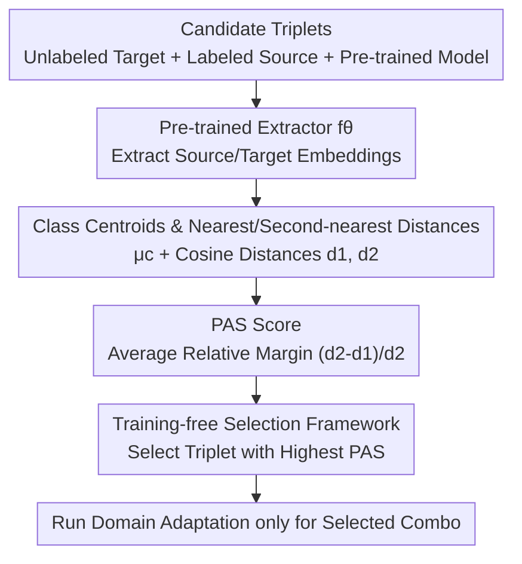

# PAS: Estimating the Target Accuracy Before Domain Adaptation

**Conference**: ICLR 2026  
**OpenReview**: [https://openreview.net/forum?id=0Z2l4XtTdz](https://openreview.net/forum?id=0Z2l4XtTdz)  
**Code**: TBD  
**Area**: Representation Learning / Transfer Learning / Domain Adaptation  
**Keywords**: Transferability Estimation, Unsupervised Domain Adaptation, Pre-trained Features, Source Selection, Silhouette Coefficient

## TL;DR
This paper proposes **PAS (Potential Adaptability Score)**—an asymmetric score computed **before actual domain adaptation training** using only pre-trained model embeddings. It measures the transferability of a source domain and a pre-trained model to an unlabeled target task by evaluating the "relative margin between the nearest and second-nearest distances" from target samples to source class centroids. This allows for selecting the optimal "source domain + pre-trained model" combination that yields the highest post-adaptation target accuracy, avoiding the heavy overhead of exhaustive training.

## Background & Motivation

**Background**: Unsupervised Domain Adaptation (UDA) aims to transfer knowledge from a labeled source domain to an unlabeled target domain. Performance heavily depends on two choices: **which source domain to use** and **which pre-trained feature extractor to select**. Currently, hundreds of public pre-trained models exist with varying architectures and training paradigms, each carrying different inductive biases; furthermore, multiple candidate source domains are often available.

**Limitations of Prior Work**: The target domain **lacks a labeled validation set**, making these choices almost entirely guesswork. Three existing approaches are suboptimal: (1) Classic transferability estimation scores (e.g., H-score, LEEP, LogME) **require target labels**, failing in UDA scenarios; (2) Running domain adaptation for every "source domain × pre-trained model" combination and selecting the best is **computationally prohibitive**; (3) Using distribution distances like MMD, Wasserstein, or CORAL to measure source-target discrepancy results in **symmetric** metrics.

**Key Challenge**: Transferability is inherently **asymmetric**—transferring from a simple domain to a difficult one is harder than the reverse; however, existing distribution distances are symmetric and cannot capture this directionality. Additionally, a valid metric must be computable using only "source labels + unlabeled target samples + pre-trained embeddings" without touching target labels.

**Goal**: To design a **training-free, asymmetric score that requires no target labels** to predict the post-adaptation accuracy of a triplet (target domain, source domain, pre-trained model) before significant computation is spent.

**Key Insight**: The authors assume that a **robust pre-trained model can extract domain-invariant discriminative features**. If so, samples of the same class (even across domains) should cluster together in the embedding space, while different classes should be far apart. Thus, "how close a target sample is to its nearest source centroid versus the second-nearest" serves as a signal for transferability: tighter alignment with the nearest class and larger separation from others indicates that the pre-trained model has already prepared a discriminative structure, making adaptation more likely to succeed.

**Core Idea**: Drawing inspiration from the **Silhouette coefficient** used in clustering evaluation, the authors adapt it into an asymmetric version capable of handling "unlabeled target data + domain shift," using the relative distance margin $(d_2-d_1)/d_2$ to measure target-source alignment, termed PAS.

## Method

### Overall Architecture

The input to PAS is a triplet consisting of "an unlabeled target domain $D_T$, a labeled source domain $D_S$, and a pre-trained feature extractor $f_\theta$." The output is a scalar score in the interval $[0,1]$; **a higher score predicts higher post-adaptation target accuracy**. The entire pipeline circumvents UDA training: first, $f_\theta$ maps source and target samples into the embedding space; a **unit centroid** $\mu_c$ is calculated for each source class; for each unlabeled target sample, the cosine distances to all source centroids are computed to find the **nearest distance $d_1$ and second-nearest distance $d_2$**; the PAS is obtained by averaging the relative margin $(d_2-d_1)/d_2$ across all target samples. Given multiple candidate sources and models, PAS is calculated for each triplet, and the one with the **highest PAS** is selected for actual domain adaptation.

### Key Designs

**1. Centroids and "Nearest/Second-nearest" Distances based on Pre-trained Embeddings: Turning Transferability into Geometric Quantities**

To determine if a target sample "resembles" a source class without target labels, the authors first normalize all samples to unit length. A **unit centroid** is computed for each source class $c$ by maximizing cosine similarity (samples in the same direction reinforce the centroid):

$$\mu_c = \frac{\sum_{x_i^S \in S_c^S} f_\theta(x_i^S)}{\left\|\sum_{x_i^S \in S_c^S} f_\theta(x_i^S)\right\|}.$$

For each target sample $x_i^T$, the cosine distance to each source centroid is computed as $\text{dist}(f_\theta(x_i^T), \mu_c) = 1 - (f_\theta(x_i^T)\cdot \mu_c)$. These distances are sorted to obtain the **nearest $d_{1i}$** and **second-nearest $d_{2i}$**. The intuition is that an ideal target sample should be very close to **exactly one** source class (its true class) and far from all others—resulting in a small $d_1$ and a large $d_2$. Cosine distance is used because it ignores the magnitude of representations (e.g., feature amplitude differences caused by lighting) and focuses on angular differences (true semantic differences), while being more robust to the "curse of dimensionality" in high-dimensional spaces.

**2. PAS Score: Adapting Silhouette into an Asymmetric, Unsupervised Version via Relative Margin**

With $d_1$ and $d_2$ defined, PAS is the average relative margin across all target samples:

$$\text{PAS}(\theta, D_S, D_T) = \frac{1}{|D_T|}\sum_{i=1}^{|D_T|} \frac{d_{2i}-d_{1i}}{d_{2i}}.$$

This is derived from the Silhouette coefficient $(b - a) / \max\{a, b\}$ (where $a$ is intra-cluster distance and $b$ is nearest-neighbor cluster distance). However, the original Silhouette is **fully supervised and designed for IID data**, making it inapplicable to UDA. The critical modification in PAS is treating the "nearest source cluster to the target sample" as its **pseudo-true class**. Consequently, $a$ (here $d_1$) is naturally smaller than $b$ (here $d_2$), constraining the score to $[0, 1]$. This formula converts the geometric quantities from Design 1 into a single transferability signal—the closer a target sample is to one class relative to the next, the closer PAS is to 1, indicating the pre-trained model has captured domain-invariant features. While domain shift typically makes $d_1$ larger than in IID cases (leading to smaller PAS values), its **relative ranking** is the effective criterion for selection.

**3. Training-free Source/Pre-trained Model Selection: Decision-making Before Adaptation**

The value of PAS lies in the "**select then train**" paradigm. Given a target domain and multiple candidate source domains and models, the framework calculates PAS for each triplet once, **selects the one with the highest score**, and then performs a single run of a UDA method. Compared to the brute-force approach of "training every combination," this reduces the cost from "number of combinations × full training time" to "number of combinations × one forward pass + one training run." Furthermore, the computational complexity of PAS is linear with respect to the number of samples. The authors demonstrate that calculating PAS on a **random subset** of source and target samples is sufficient, as PAS values are robust to sample size and the relative ranking between source domains remains consistent.

### Loss & Training

PAS itself **does not involve any training or optimization**—it is a closed-form statistic computed on pre-trained embeddings. The paper also introduces an **Oracle upper bound** to validate the relationship between "inter-cluster distance ↔ target accuracy" by replacing $d_1$ with the distance to the **true class centroid** (unknown in practice) and using $\max\{d_{1i}, d_{2i}\}$ as the denominator:

$$\text{Oracle} = \frac{1}{|D_T|}\sum_{i=1}^{|D_T|} \frac{d_{2i}-d_{1i}}{\max\{d_{1i}, d_{2i}\}}.$$

The Oracle collapses to PAS when the nearest class is the true class; otherwise, it is smaller. It represents the performance ceiling for predicting accuracy via embedding geometry.

## Key Experimental Results

### Main Results

On four classic UDA benchmarks—Office-Home, Office-31, ImageCLEF, and DomainNet—the authors collected target accuracies from numerous published SOTA methods (DANN, MCC, CDAN, etc., using various pre-trained backbones). They computed PAS for each "source-target pair + pre-trained model" and analyzed the correlation between PAS and target accuracy. Compared to symmetric baselines like MMD and A-distance, PAS significantly leads (Pearson / Spearman correlation coefficients):

| Benchmark | MMD | A-distance | **PAS (Ours)** | Oracle* |
| :--- | :--- | :--- | :--- | :--- |
| Office-Home | 0.55 / 0.51 | 0.32 / 0.17 | **0.76 / 0.81** | 0.89 / 0.90 |
| Office-31 | 0.45 / 0.53 | 0.26 / 0.35 | **0.63 / 0.78** | 0.71 / 0.86 |
| ImageCLEF | -0.14 / -0.08 | -0.13 / -0.07 | **0.44 / 0.60** | 0.78 / 0.85 |
| DomainNet | -0.09 / -0.03 | 0.07 / 0.06 | **0.53 / 0.56** | 0.21 / 0.21 |
| **Total** | 0.37 / 0.37 | 0.04 / -0.16 | **0.83 / 0.88** | 0.88 / 0.91 |

The global Spearman rank correlation reached **0.88**, approaching the label-dependent Oracle (0.91), while symmetric baselines even showed negative correlations on ImageCLEF and DomainNet. This confirms that "transferability requires asymmetric measurement." PAS consistently identifies the best option in both "fixed UDA method, varied backbone" and "fixed backbone, varied source domain" settings.

### Ablation Study (Design Choices, Pearson Correlation)

| Configuration | Office-Home | Office-31 | ImageCLEF | DomainNet | Total |
| :--- | :--- | :--- | :--- | :--- | :--- |
| **PAS (Cosine dist to centroid)** | **0.76** | 0.63 | **0.44** | **0.58** | **0.79** |
| Euclidean distance | 0.70 | **0.69** | 0.27 | 0.54 | 0.68 |
| Mean pairwise dist to source samples | 0.66 | 0.52 | 0.12 | 0.48 | 0.66 |

Replacing cosine with Euclidean distance or "distance to centroid" with "mean pairwise distance to source samples" resulted in an overall drop in correlation (0.79 → 0.68 / 0.66). Cosine distance and centroids—capturing the "main alignment direction" within clusters—are key to the high correlation of PAS.

### Key Findings
- **Asymmetry is the winning factor**: Symmetric MMD/A-distance fail on difficult benchmarks (sometimes correlating negatively). PAS naturally introduces directionality via the "nearest vs. second-nearest" relative margin, more than doubling the global correlation.
- **Sub-sampling causes negligible loss**: PAS is robust to sample size. Small subsets preserve the relative ranking of source domains, enabling fast screening on large datasets (linear computational complexity).
- **Failure cases are identifiable**: ImageCLEF (especially the P domain) contains multi-object images. A sample might be very close to a centroid of a class **actually present in the image**, but the true label might refer to another object. This is an inherent blind spot for methods based on "single-class alignment" assumptions.

## Highlights & Insights
- **Adapting "Silhouette" to Unsupervised Domain Adaptation**: By using the "nearest source class as a pseudo-true class," the authors adapt the supervised IID Silhouette coefficient to satisfy $a < b$ automatically, while introducing the necessary asymmetry.
- **Value of the "Select then Train" Paradigm**: PAS addresses the core pain point in UDA (no target labels + massive model selection). One forward pass suffices for decision-making, which is directly applicable to engineering pipelines and claimed to be the **first** transferability score for this specific setting.
- **Generalizability of the Idea**: The "nearest/second-nearest relative margin" as an unsupervised cluster compactness signal can be extended to any selection problem involving "unlabeled data + known class prototypes" (e.g., open-set recognition, pseudo-label quality assessment, retrieval-based classification).

## Limitations & Future Work
- **Validated Only on Image Classification**: The authors acknowledge testing only on visual single-source UDA; effectiveness in cross-modal or other tasks is unknown.
- **Failure in Multi-object/Ambiguous Scenes**: As seen in ImageCLEF, PAS overestimates transferability when multiple objects are present and the nearest centroid is not the primary target label.
- **Limited to Single-source Domain Adaptation**: PAS has not yet been extended to multi-source domain adaptation (selecting combinations of sources), which is a noted direction for future work.
- **Dependency on Pre-trained Quality**: If all candidate models fail the assumption (e.g., clusters are inherently messy in the embedding space), the geometric signal of PAS will be distorted; it measures relative quality and does not guarantee absolute adaptability.

## Related Work & Insights
- **vs. Classic Transferability Estimation (H-score / LEEP / LogME)**: These were designed for transfer learning and **require target labels**, making them unusable for UDA. PAS fills this gap by using only source labels and unlabeled target data.
- **vs. Symmetric Distribution Distances (MMD / Wasserstein / CORAL / A-distance)**: These measure overall discrepancy but fail to capture the directional difficulty of transfer (easy $\to$ hard vs. hard $\to$ easy). PAS's relative margin is naturally asymmetric and yields much higher correlations.
- **vs. Brute-force "Train All then Select"**: The brute-force approach is accurate but extremely slow. PAS provides selection after a single forward pass before any adaptation occurs, making large-scale screening feasible.

## Rating
- Novelty: ⭐⭐⭐⭐ First transferability score dedicated to UDA; the asymmetric modification is clever and effective.
- Experimental Thoroughness: ⭐⭐⭐⭐ Four benchmarks, multiple backbones/methods, design ablations, and honest discussion of failure cases.
- Writing Quality: ⭐⭐⭐⭐ Clear explanation of assumptions, geometric intuition, and the connection to the Silhouette coefficient.
- Value: ⭐⭐⭐⭐ Directly addresses the engineering challenge of model selection in UDA with zero training cost.

<!-- RELATED:START -->

## Related Papers

- [\[CVPR 2026\] Measure The Feature Universe: Topology-based Pseudo Labeling and Gravity Consistency for Source-Free Domain Adaptation](../../CVPR2026/self_supervised/measure_the_feature_universe_topology-based_pseudo_labeling_and_gravity_consiste.md)
- [\[ICML 2026\] Provable Accuracy Collapse in Embedding-Based Representations under Dimensionality Mismatch](../../ICML2026/self_supervised/provable_accuracy_collapse_in_embedding-based_representations_under_dimensionali.md)
- [\[ICML 2026\] Data Augmentation of Contrastive Learning is Estimating Positive-incentive Noise](../../ICML2026/self_supervised/data_augmentation_of_contrastive_learning_is_estimating_positive-incentive_noise.md)
- [\[ICLR 2026\] NEO — No-Optimization Test-Time Adaptation through Latent Re-Centering](neo_no-optimization_test-time_adaptation_through_latent_re-centering.md)
- [\[ICLR 2026\] Architecture-Agnostic Test-Time Adaptation via Backprop-Free Embedding Alignment](architecture-agnostic_test-time_adaptation_via_backprop-free_embedding_alignment.md)

<!-- RELATED:END -->
