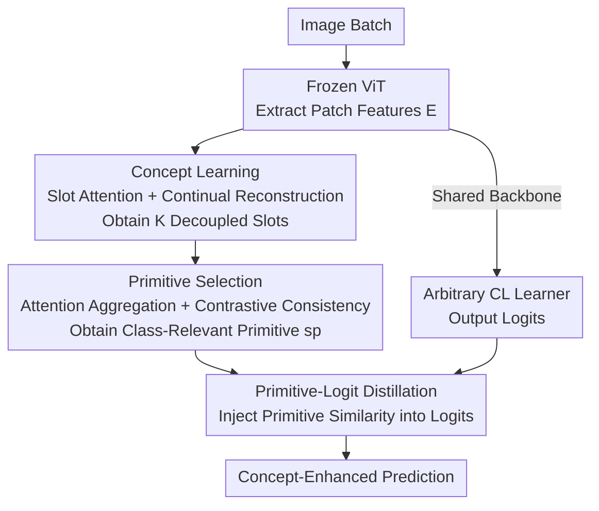

# Plug-and-Play Compositionality for Boosting Continual Learning with Foundation Models

**Conference**: ICLR 2026  
**OpenReview**: [https://openreview.net/forum?id=22hBwIf7OC](https://openreview.net/forum?id=22hBwIf7OC)  
**Code**: https://github.com/liaoweiduo/CompSLOT  
**Area**: Self-Supervised / Continual Learning / Object-Centric Learning  
**Keywords**: Continual Learning, Compositionality, Slot Attention, Concept Learning, Knowledge Distillation

## TL;DR
CompSLOT utilizes Slot Attention to unsupervisedly extract image concept slots from frozen ViT backbones. It then selects class-related "primitives" and distills the pairwise similarities of these primitives into the logits of arbitrary continual learners. This "plug-and-play" mechanism consistently improves performance and alleviates catastrophic forgetting across various foundation-model-based continual learning methods.

## Background & Motivation
**Background**: Currently, Continual Learning (CL) based on Foundation Models (FM) is dominated by three categories: prompt-based (CPrompt, CODA-Prompt), representation-based (ADAM, RanPAC, EASE), and model-merging (CoFiMA, FOSTER, DER, MEMO). These methods rely on an ImageNet-21K pre-trained ViT backbone and identify categories by establishing "class prototypes/boundaries" at high-dimensional feature levels.

**Limitations of Prior Work**: These methods essentially "identify classes through comparison" rather than "understanding classes as combinations of representative concepts." For instance, a Chihuahua image is treated as a monolithic feature to be compared with other classes, rather than being decomposed into a combination of concepts like "dog body + Chihuahua-specific small size and head shape." Consequently, shared concepts across tasks (e.g., different dog breeds) are underutilized, and when current tasks contain only a few classes, the lack of sufficient contrastive samples makes recognition fragile and forgetting more severe.

**Key Challenge**: The fundamental dilemma of continual learning is the stability-plasticity tradeoff. The authors observe that human understanding of the world is inherently compositional, decomposing specific objects into abstract concepts to achieve rapid generalization to new classes via "recomposition of existing concepts." Existing CL methods operate in high-dimensional feature spaces, failing to reuse shared concepts across tasks and struggling to resist forgetting.

**Goal**: To investigate whether compositionality in concept learning can genuinely enhance the performance of "Foundation Model + SOTA Continual Learner." The study addresses three sub-problems: ① How to extract semantic concepts from images given only task labels without concept-level supervision like segmentation masks or text annotations; ② How to select class-relevant parts from these concepts; ③ How to inject concept-level understanding without altering the forward frameworks of diverse CL methods.

**Key Insight**: Slot Attention in object-centric learning can decompose an image into a set of decoupled slots via unsupervised learning, where each slot corresponds to an object or concept. Pre-experiments on COBJ, treating Slot Attention as a continual reconstruction task, reveal that learned slots exhibit minimal forgetting across tasks—cosine similarities for slots of the same concept remain high. This suggests that slots are naturally resistant to forgetting and serve as excellent carriers for concept-level CL.

**Core Idea**: Package "Concept extraction via Slot Attention → Selection of class-relevant primitives → Distillation of primitive similarity into logits" into a method-agnostic, plug-and-play plugin. This plugin can be attached to any CL method with an FM backbone, allowing the model to incorporate low-dimensional concept combinations into its decision-making process.

## Method

### Overall Architecture
CompSLOT is a two-stage plugin consisting of "concept learning" and "concept knowledge distillation." Given an input image batch, patch features $E$ are first extracted using a frozen ViT backbone (the same backbone used by the CL learner) and decoupled into $K$ slots via Slot Attention. A learnable attention mechanism then aggregates these slots into a single "primitive" representation $s^p$ (retaining only class-relevant concepts). Finally, the pairwise similarities between primitives within the batch are contrastively distilled into the logit distribution output by the CL learner. The Slot Attention and primitive selection modules are globally shared and fine-tuned without expansion across tasks. Except for the ViT backbone, all components are trainable.

The training objective is dual-layered: the concept learning side utilizes a continual reconstruction loss $L_{re}$ and a contrastive primitive loss $L_p$ to train the slot and selection modules; the distillation side uses a primitive-logit alignment loss $L_a$ and a cross-entropy loss $L_{ce}$ to train the CL learner. Crucially, the distillation only requires the CL method to possess an FM backbone capable of extracting semantic features, ensuring plug-and-play compatibility.

### Key Designs

**1. Concept Learning: Extracting Anti-forgetting Concept Slots via Slot Attention + Continual Reconstruction**

To extract concepts without concept-level supervision, the authors feed patch features $E = f(x | \theta_f)[1:] \in \mathbb{R}^{N \times D}$ from the ViT into Slot Attention, iteratively aggregating $N$ patches into $K$ slots $S \in \mathbb{R}^{K \times D_s}$. An attention mask $A = \sigma \left( \frac{q(S)k(E)^\top}{\sqrt{D_s}} \right)$ is normalized across the patch dimension, and a GRU aggregates patch information into slots. Supervision comes from "reconstruction"—slots with learnable positional embeddings are mapped back to patch space via an MLP decoder, and the reconstructed features $\tilde{E} = A^\top d(S' | \theta_d)$ are computed via mask-weighted summation. The reconstruction loss is MSE: $L_{re} = \|E - \tilde{E}\|^2$. A lightweight MLP decoder is used to minimize computational overhead. The authors demonstrate that slot representations for the same concept maintain high cosine similarity across tasks, essentially enabling "concept rehearsal."

**2. Primitive Selection: Aggregating Relevant Concepts via Attention + Contrastive Loss**

Since slots may contain class-irrelevant concepts (e.g., background), the authors select class-relevant "primitives." Slots are mapped to a similarity space $\bar{S} = \tanh(\text{Linear}(\text{LN}(S)))$, and weights $w_p = \sigma(\tau_t \bar{S} K_p)$ are calculated using a learnable primitive key $K_p$. The primitive representation is $s_p = w_p^\top \bar{S}$. Temperature $\tau_t$ controls selection sparsity. To ensure consistency, a contrastive primitive loss $L_p = \sum_{x_i, x_j \in B} d^y_{i,j} \log \frac{d^y_{i,j}}{d^s_{i,j}}$ is used, where $d^y$ is normalized label similarity and $d^s$ is primitive softmax similarity, pulling together primitives of the same class.

**3. Primitive-Logit Knowledge Distillation: Injecting Concept Similarities into Arbitrary CL Learners**

To integrate concept-level understanding without altering the learner's architecture, the authors use "pairwise primitive similarity" as self-supervision for the learner's logits. The intuition is that the logit for a Chihuahua image should be higher for other dog classes than for cat classes due to shared concepts. The alignment loss $L_a = \sum_{x_i, x_j \in B} d^s_{i,j} \log \frac{d^s_{i,j}}{d^l_{i,j}}$ minimizes the KL divergence between logit similarity $d^l$ and primitive similarity $d^s$. Here, $d^s$ uses min-max normalized cosine similarity ($sim^+$) to sharpen supervision.

### Loss & Training
The overall objectives are: $L_{slot} = L_{re} + \alpha L_p$ (Concept Learner) and $L_{tr} = L_{ce} + \beta L_a$ (CL Learner). $\alpha$ and $\beta$ balance the terms. Parameters for Slot Attention and primitive selection are shared globally and fine-tuned across tasks without architectural expansion, supporting long task sequences without parameter explosion.

## Key Experimental Results

### Main Results
On CGQA (10-10 tasks), CompSLOT (†) improves all 8 SOTA continual learners, with the largest gain observed on ADAM+adapter (AA absolute gain +7.55%):

| Method | AA(%)↑ | CA(%)↑ | FF(%)↓ | Hn(%)↑ | R↑ |
|------|--------|--------|--------|--------|-----|
| ADAM+adapter | 41.93 | 53.98 | 13.80 | 68.65 | 0.932 |
| ADAM+adapter † | **49.48** | 60.99 | 12.90 | 74.34 | 0.958 |
| RanPAC | 65.81 | 75.50 | 10.52 | 78.87 | 1.016 |
| RanPAC † | **66.75** | 76.58 | 10.22 | 79.82 | 1.032 |
| CoFiMA | 65.11 | 73.23 | 15.25 | 86.71 | 1.011 |
| CoFiMA † | **66.17** | 74.32 | 14.20 | 88.30 | 1.017 |
| FOSTER* | 60.86 | 68.80 | 2.44 | 89.79 | 1.087 |
| FOSTER* † | **66.29** | 71.83 | 6.47 | 89.91 | 1.154 |
| CPrompt | 46.75 | 60.18 | 15.67 | 78.06 | 0.964 |
| CPrompt † | **48.54** | 61.48 | 18.32 | 79.09 | 0.969 |

CompSLOT reduces forgetting (FF) and achieves higher Hn/R (compositional generalization) scores, indicating the gains stem from enhanced compositional generalization.

### Ablation Study
Decomposition of components on RanPAC/CPrompt (CGQA):

| Config | AA(%)↑ | R↑ | Description |
|------|--------|-----|------|
| +param | 65.08 | 1.010 | Capacity expansion only (no La) |
| avg + La | 58.22 | 0.969 | Primitive selection replaced by slot averaging |
| Cosine weight + La | 63.91 | 0.989 | Cosine weighting is inferior to softmax |
| Soft (Full) | **66.75** | **1.032** | Softmax convex combination is most stable |

### Key Findings
- **Primitive selection is critical**: Removing $L_p$ and using slot averaging causes AA to drop significantly (e.g., from 66.75 to 58.22) due to interference from irrelevant concepts like backgrounds.
- **Softmax weighting is optimal**: Softmax provides a convex combination of slots, constraining primitive representations to a stable range.
- **Forgetting resistance via concept rehearsal**: Visual concepts recur across tasks, stabilizing primitive selection weights even as class labels change.
- **Gains not due to capacity**: Comparable results were not achieved by simply increasing the hidden dimensions of RanPAC or CPrompt to match CompSLOT's parameter count.

## Highlights & Insights
- **Offloading anti-forgetting to Slot Attention**: By leveraging the inherent stability of object-centric slots across tasks, the method avoids the difficulty of combating forgetting directly in high-dimensional feature spaces.
- **True Plug-and-Play**: The alignment loss relies only on the presence of an FM backbone, making it compatible with various prompt, representation, and model-merging CL strategies.
- **Concept Rehearsal perspective**: The paper highlights that while class labels change, visual concepts recur, providing a natural mechanism for stabilizing representations without explicit data replay.
- **Min-max normalization for sharper supervision**: Using min-max normalization instead of softmax for primitive similarity during distillation proves effective for sharpening slot-based supervision.

## Limitations & Future Work
- **Dependency on reconstruction and slot count**: Concept extraction depends on reconstruction quality and a fixed $K$; the effectiveness of slot decoupling in complex scenes with lightweight decoders remains a potential bottleneck.
- **Bias toward compositional benchmarks**: Performance gains are most pronounced on datasets designed for compositionality (CGQA, COBJ). Gains on more standard benchmarks like ImageNet-R may be smaller.
- **Batch sensitivity**: Contrastive losses ($L_p, L_a$) rely on pairwise similarities within a batch; effectiveness may diminish with small batch sizes or sparse class overlap within batches.
- **Hyperparameter sensitivity**: Multiple coefficients ($\alpha, \beta, \tau_t, \text{etc.}$) require tuning across different scenarios.

## Related Work & Insights
- **Comparison with Concept Bottleneck Models (CBMs)**: Unlike studies requiring external supervision (ChatGPT/CLIP) or complex bottlenecks, CompSLOT uses unsupervised Slot Attention, making it easier to integrate with existing methods.
- **Comparison with Traditional FM-CL**: Traditional methods ignore shared concepts and focus on class boundaries in high-dimensional space; CompSLOT provides a complementary concept-level decision-making layer.
- **Object-centric improvements**: While other works focus on improving decomposition quality via complex decoders, this work demonstrates that a lightweight design can significantly benefit continual learning.

## Rating
- Novelty: ⭐⭐⭐⭐ Innovative use of object-centric slots as a method-agnostic CL plugin.
- Experimental Thoroughness: ⭐⭐⭐⭐ Coverage of 8 SOTA methods and multiple ablation studies.
- Writing Quality: ⭐⭐⭐⭐ Logical flow with clear definitions and theorems.
- Value: ⭐⭐⭐⭐ Highly practical for the FM-based CL community due to its plug-and-play nature.

<!-- RELATED:START -->

## Related Papers

- [\[CVPR 2025\] OCRT: Boosting Foundation Models in the Open World with Object-Concept-Relation Triad](../../CVPR2025/self_supervised/ocrt_boosting_foundation_models_in_the_open_world_with_object-concept-relation_t.md)
- [\[CVPR 2026\] Exemplar-Free Continual Learning for State Space Models](../../CVPR2026/self_supervised/exemplar-free_continual_learning_for_state_space_models.md)
- [\[ICLR 2026\] Regularized Latent Dynamics Prediction is a Strong Baseline for Behavioral Foundation Models](regularized_latent_dynamics_prediction_is_a_strong_baseline_for_behavioral_found.md)
- [\[ICLR 2026\] Boosting Open Set Recognition Performance through Modulated Representation Learning](boosting_open_set_recognition_performance_through_modulated_representation_learn.md)
- [\[AAAI 2026\] Robust Tabular Foundation Models](../../AAAI2026/self_supervised/robust_tabular_foundation_models.md)

<!-- RELATED:END -->
