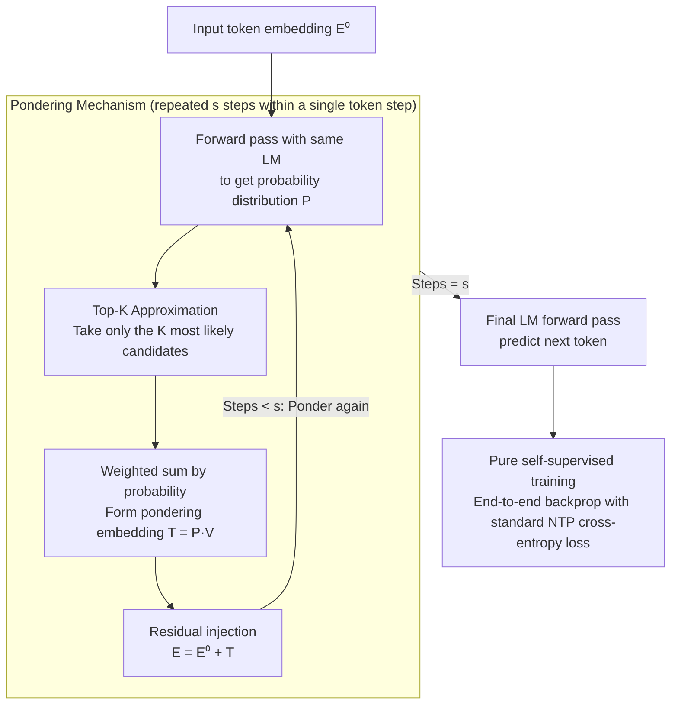

# PonderLM: Pretraining Language Models to Ponder in Continuous Space

**Conference**: ICLR2026  
**arXiv**: [2505.20674](https://arxiv.org/abs/2505.20674)  
**Code**: To be confirmed  
**Area**: Self-supervised learning  
**Keywords**: pondering, language model, continuous space, test-time compute, pretraining

## TL;DR
PonderLM is proposed, which introduces a "pondering" mechanism during the pre-training phase. It transforms predicted probability distributions into continuous embeddings via weighted sums and performs repeated forward passes. Without requiring annotated data or reinforcement learning, a 2.8B model outperforms a 6.9B model across 9 downstream tasks.

## Background & Motivation

**Background**: The mainstream approach to enhancing model capability is scaling up parameters and data. However, this faces bottlenecks such as data exhaustion, scaling saturation, and communication overhead. Inference-time scaling (e.g., CoT) also has limitations: it requires annotated data and reinforcement learning, making it difficult for small models to benefit.

**Limitations of Prior Work**: CoT operates in a discrete linguistic space, constrained by a fixed vocabulary, and its performance upper bound is restricted by the base pre-trained model.

**Key Challenge**: Performance needs to be improved through more computation, but simply increasing parameters is too costly.

**Goal**: To improve performance by performing multiple forward passes within a single token generation step without increasing the number of parameters.

**Key Insight**: Analogous to humans pondering complex problems repeatedly, the model is allowed to "think" in continuous space.

**Core Idea**: A "pondering embedding" is formed by taking the weighted sum of predicted probabilities and word embeddings. This is added residually to the input for subsequent forward passes, repeating for $s$ steps.

## Method

### Overall Architecture
PonderLM decomposes a single token generation into multiple rounds of "pondering": the model first generates a probability distribution for the next token in the standard way. Instead of immediate sampling, this distribution is converted into a continuous "pondering embedding," which is added back to the input as a residual. Another forward pass is then performed. After repeating this for $s$ steps, the final token prediction is made. This process introduces no new parameters; it only involves several additional forward passes using the same weights, effectively allowing the model to refine its output for the current position in continuous space. There are three key designs: the **pondering mechanism** itself (forward $\rightarrow$ probability $\rightarrow$ pondering embedding $\rightarrow$ residual injection); **Top-K approximation** to make the pondering embedding calculation overhead negligible; and **pure self-supervision** to ensure the mechanism is learned solely through standard next-token prediction loss without labels or reinforcement learning.

### Key Designs

**1. Pondering Mechanism: Feeding the "Undecided" Probability Distribution Back into the Model**

A standard LM calculates the softmax probability $\mathbf{P}$ at each position and immediately selects a word. This discrete sampling step discards information from other candidates in the distribution. PonderLM retains this: it uses the probabilities to calculate a weighted sum of the entire word embedding table, obtaining a pondering embedding $\mathbf{t} = \sum_i p_i \mathbf{e}_i$ (in matrix form $\mathbf{T} = \mathbf{P}\mathbf{V}$, where $\mathbf{V}$ is the embedding matrix). This continuous vector carries the relative confidence of all candidate tokens. By adding it back to the input via a residual $\mathbf{E}^1 = \mathbf{E}^0 + \mathbf{T}$, the next forward pass can "see" and correct the preliminary guess from the previous round. Since the entire chain consists of differentiable operations like weighted sums and residuals, there is no discrete sampling to block gradients. Thus, the model can be trained end-to-end using standard language modeling objectives, learning how to utilize these intermediate ponderings to approach the correct answer.

**2. Top-K Approximation: Truncating the Weighted Sum to the Most Likely Candidates**

The cost of performing a weighted sum over the entire vocabulary table is $\mathcal{O}(n|V|d)$. With a vocabulary size $|V|$ often in the tens of thousands, this step could consume most of the gains brought by pondering. PonderLM observes that probability distributions are highly concentrated on a few tokens. Therefore, it only includes the top-$K$ candidates (experimentally set to $K=100$) in the weighted sum, reducing the complexity to $\mathcal{O}(nKd)$. Ablations show that $K=100$ achieves performance close to that of the full vocabulary. Further increasing $K$ yields almost no improvement, indicating that truncated long-tail tokens contribute very little. This step keeps the additional overhead of pondering within an acceptable range with almost no loss in performance.

**3. Pure Self-Supervision: Learning to Ponder via Next-Token Prediction without Labels or RL**

Unlike approaches such as CoT or o1 that require annotated reasoning chains or reinforcement learning signals, PonderLM's pondering capability is developed entirely through the standard next-token-prediction (NTP) loss. By connecting the output after $s$ pondering steps to the NTP target, gradients naturally teach the model how to arrange each round of intermediate embeddings. In experiments, pre-training with a fixed $s=3$ on large-scale corpora is sufficient. This "zero extra supervision" nature allows the method to be seamlessly integrated into existing pre-training pipelines, which is why it consistently works across GPT-2, Pythia, and LLaMA architectures.

## Key Experimental Results

### Main Results

| Model | Parameters | Training Data | 9-Task Average |
|------|-----------|--------------|--------------|
| Pythia-6.9B | 6.9B | 300B tokens | Baseline |
| **PonderPythia-2.8B** | **2.8B** | **300B tokens** | **Exceeds 6.9B** |
| TinyLlama-1.1B | 1.1B | 3T tokens | Baseline |
| **PonderPythia-1B** | **1B** | **300B tokens** | **Matches TinyLlama** |

### Key Findings
- A 2.55B model matches the loss of Pythia-6.9B (63% parameter reduction).
- Increasing pondering steps consistently improves performance.
- Effective across three architectures: GPT-2, Pythia, and LLaMA.

## Ablation Study

| Ablation/Analysis | Finding |
|-------------------|---------|
| Pondering steps $s$ | Performance improves from $s=1\rightarrow 2\rightarrow 3$; increasing steps yields stable gains. |
| Top-K Approximation | $K=100$ is sufficient; further increases yield no significant gain while significantly reducing complexity. |
| Architectural Universality | Validated as effective across GPT-2, Pythia, and LLaMA architectures. |
| Scaling Behavior | Within the 405M to 1.4B range, the pondering model consistently outperforms baselines of the same parameter size. |
| Inference-time Step Adjustment | Pondering steps can be increased during inference (e.g., training with $s=3$, inference with $s=5$) for extra gains, though verification is needed. |
| FLOPs-controlled Comparison | Under the same FLOPs budget, PonderPythia-70M consistently outperforms vanilla Pythia-70M. |

### Key Scaling Curve Findings
- **Parameter Efficiency**: PonderPythia with 2.55B parameters matches the validation loss of Pythia with 6.9B parameters (63% parameter reduction).
- **Data Efficiency**: PonderPythia achieves the same performance as the Pythia baseline using 59% fewer training tokens.
- **FLOPs Efficiency**: PonderPythia is consistently superior under the same computational budget—demonstrating that the computational overhead of extra forward passes is compensated by performance gains.

### Downstream Task Details

| Model | LAMBADA↑ | ARC-E↑ | WinoGrande↑ | PIQA↑ | SciQ↑ | Average↑ |
|------|----------|--------|-------------|-------|-------|-------|
| Pythia-1B (300B) | 48.3 | 58.6 | 52.8 | 71.3 | 91.6 | 50.4 |
| PonderPythia-410M (300B) | 48.9 | 58.7 | 54.0 | 70.5 | 91.0 | **51.4** (+3.8) |
| Pythia-6.9B (300B) | Baseline | Baseline | Baseline | Baseline | Baseline | Baseline |
| **PonderPythia-2.8B** (300B) | **Exceeds** | **Exceeds** | **Exceeds** | **Exceeds** | **Exceeds** | **Exceeds 6.9B** |

## Highlights & Insights
- **The Third Scaling Axis**: Traditional scaling involves parameters and data; PonderLM introduces "pondering scaling"—improving performance for the same parameters through multiple forward passes.
- **Thinking in Continuous Space**: CoT operates in discrete token space and is limited by vocabulary; pondering embeddings are continuous vectors weighted by probabilities of all tokens, providing higher information density.
- **Interpretability Window**: Changes in the probability distribution during intermediate pondering steps provide a visualization of the reasoning process, showing how the model refines an initial guess into the correct answer.
- **Pure Self-Supervision**: No annotated data or RL is required; effective pondering is learned via standard NTP. This makes the method highly applicable.
- **Orthogonality to CoT**: Pondering occurs within a single token generation step, while CoT occurs at the sequence level; the two can be used in combination.

## Limitations & Future Work
- Inference overhead increases linearly with the number of pondering steps ($s$ steps require $s+1$ full forward passes), which is unfavorable for latency-sensitive applications.
- The combined effect with CoT has not been explored—does a pondering model show additional gains after RL/CoT training?
- The number of pondering steps $s$ is fixed during training and inference—adaptive steps (dynamically adjusted based on problem difficulty) might be more efficient.
- Pondering during training increases the computation per step, slowing down the overall training speed—while FLOPs efficiency is higher, wall-clock time has not been discussed in detail.
- Currently only validated on the Pile dataset; validation across more data distributions and modalities would be valuable.

## Related Work & Insights
- **vs CoT/o1/R1**: CoT generates reasoning chains in discrete space, whereas PonderLM iteratively refines in continuous space. The former requires labels or RL, while the latter is purely self-supervised.
- **vs Universal Transformer (Dehghani et al.)**: UT allows for variable-depth computation (different number of layers per token), while PonderLM allows for multiple iterations of the same layers—the concepts are similar, but mechanisms differ.
- **vs PonderNet (Banino et al.)**: PonderNet learns when to stop computation (dynamic halting), whereas PonderLM uses fixed steps but retains more information through continuous embeddings.
- **Insight**: The pondering mechanism could be extended to multi-modal contexts—mixed pondering of visual and text tokens might achieve implicit cross-modal reasoning.

## Rating
- Novelty: ⭐⭐⭐⭐⭐ The continuous space pondering mechanism is a fresh idea that opens a third scaling axis.
- Experimental Thoroughness: ⭐⭐⭐⭐ Rigorous scaling curves across three architectures and 9 downstream tasks.
- Writing Quality: ⭐⭐⭐⭐ Good intuitive explanations and clear pseudocode.
- Value: ⭐⭐⭐⭐⭐ Proposes a new paradigm for computational scaling that is orthogonal to and stackable with existing directions.

<!-- RELATED:START -->

## Related Papers

- [\[CVPR 2026\] Quantized Residuals to Continuous Prompts for Few-Shot Class Incremental Learning in Vision-Language Models](../../CVPR2026/self_supervised/quantized_residuals_to_continuous_prompts_for_few-shot_class_incremental_learning.md)
- [\[CVPR 2026\] Scaling Dense Event-Stream Pretraining from Visual Foundation Models](../../CVPR2026/self_supervised/scaling_dense_event-stream_pretraining_from_visual_foundation_models.md)
- [\[ACL 2026\] LLMSurgeon: Diagnosing Data Mixture of Large Language Models](../../ACL2026/self_supervised/llmsurgeon_diagnosing_data_mixture_of_large_language_models.md)
- [\[CVPR 2026\] Exemplar-Free Continual Learning for State Space Models](../../CVPR2026/self_supervised/exemplar-free_continual_learning_for_state_space_models.md)
- [\[ICLR 2026\] Symmetric Space Learning for Combinatorial Generalization](symmetric_space_learning_for_combinatorial_generalization.md)

<!-- RELATED:END -->
