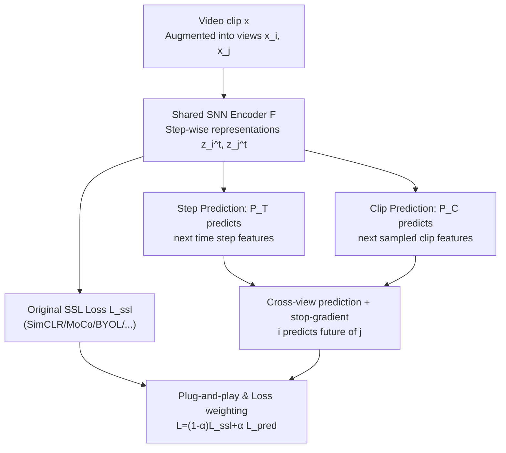

# PredNext: Explicit Cross-View Temporal Prediction for Unsupervised Learning in Spiking Neural Networks

**Conference**: ICLR 2026  
**OpenReview**: [https://openreview.net/forum?id=LjugJFmItY](https://openreview.net/forum?id=LjugJFmItY)  
**Code**: To be confirmed  
**Area**: Self-Supervised Learning / Representation Learning  
**Keywords**: Spiking Neural Networks, Self-supervised Learning, Temporal Prediction, Video Representation, Feature Consistency

## TL;DR
PredNext introduces a plug-and-play "cross-view future prediction" module for self-supervised video learning in Spiking Neural Networks (SNNs). By simultaneously predicting features of the next time step and the next clip within the same video, it enhances temporal feature consistency without imposing rigid constraints. This allows deep SNNs to learn unsupervised representations on large-scale video datasets like UCF101 that approach the performance of ImageNet supervised pre-training.

## Background & Motivation
**Background**: Spiking Neural Networks (SNNs) naturally possess temporal dynamics (LIF neurons accumulate membrane potentials over time steps and fire pulses upon exceeding thresholds), making them ideal candidates for unsupervised representation learning. However, current unsupervised SNN research is mostly limited to shallow networks or local synaptic plasticity rules (e.g., STDP), making it difficult to scale to deep architectures for complex temporal video data.

**Limitations of Prior Work**: The standard "integrate-and-fire" mechanism of LIF is too simplistic to capture long-range temporal dependencies in videos. Unlike ANNs, SNNs typically do not perform temporal downsampling and retain raw temporal resolution. Without proper temporal aggregation, features extracted across time steps tend to "drift," leading to semantic instability. The authors observed on UCF101 that model convergence is strongly correlated with the similarity (temporal consistency) of features across different time steps of the same video (Fig. 1).

**Key Challenge**: Since high consistency matches good features, could one simply add a constraint term to the loss to force similarity between time steps? The authors' experiments provide a counter-intuitive answer: **forcing consistency constraints actually harms downstream performance**. High-quality feature consistency should be a natural emergence of "semantic stability"; hard-coded similarity erases discriminative temporal dynamics, resulting in oversimplified representations with low discriminative power.

**Goal**: Find a mechanism that "improves temporal consistency without forcing it" in the context of deep SNN unsupervised learning on large-scale videos, while establishing a standard benchmark for SNN self-supervised learning (which was previously nearly non-existent).

**Key Insight**: Drawing from Predictive Coding theory, semantically rich features should accurately predict the semantic features of the "next moment," whereas features capturing only low-level dynamics cannot. Thus, "future prediction" is treated as an auxiliary objective, allowing consistency to emerge naturally rather than through hard constraints.

**Core Idea**: Use "cross-view prediction of future features" instead of "forced consistency constraints" to stabilize SNN temporal representations—predicting both the next time step (Step Prediction) and the next sampled clip (Clip Prediction), where one view predicts the future of another.

## Method

### Overall Architecture
PredNext is a **plug-and-play auxiliary module** that does not modify the original self-supervised paradigm but overlays a "temporal prediction" objective. The input is a video clip $x$ augmented into two views $x_i, x_j$. These are fed into a shared SNN feature extractor + MLP projection head (denoted as $F$) to obtain step-wise representations $z_i^t, z_j^t$. These representations are fed into the original self-supervised loss $L_{ssl}$ (e.g., SimCLR, MoCo, BYOL) and two temporal prediction heads: a step prediction head $P_T$ outputting $p_i^t = P_T(z_i^t)$, and a clip prediction head $P_C$ outputting $c_i = P_C(\frac{1}{T}\sum_t z_i^t)$. The prediction target uses a **cross-view** design: the prediction of view $i$ aligns with the future features of view $j$, with a stop-gradient applied to the target features. The final loss weights the two paths by $\alpha$: $L = (1-\alpha)L_{ssl} + \alpha L_{pred}$. Prediction heads are used only during training and removed during inference with zero additional cost.

### Key Designs

**1. Step Prediction: Enabling Mutual Prediction Between Adjacent Time Steps**

To address the drifting of step-wise SNN features, the step prediction head $P_T$ maps current features to a prediction of future step features. The loss is defined as the negative cosine similarity between the prediction and the cross-view future ground truth:

$$Q(p_i^t, z_j^{t+m}) = -\sum_t \frac{p_i^t}{|p_i^t|} \cdot \frac{z_j^{t+m}}{|z_j^{t+m}|}$$

where $m$ is the prediction interval. Ablations show $m=1$ is optimal; when $m>1$, adjacent steps lose the chance for mutual prediction, leading to sparse interactions and decreased performance. Intuitively, this forces each step's representation to be "responsible for the next moment," filtering out irrelevant instantaneous noise.

**2. Clip Prediction: Aligning Semantics Across Longer Time Spans**

Step prediction only covers short intervals. The clip prediction head $P_C$ takes the temporal aggregated features $c_i = P_C(\frac{1}{T}\sum_t z_i^t)$ and predicts the aggregated features $z_j^*$ of a "subsequent sampled clip" from the same video:

$$M(c_i, z_j^*) = -\frac{c_i}{|c_i|} \cdot \frac{z_j^*}{|z_j^*|}$$

Given its longer time horizon, it learns richer temporal representations. Ablations reveal that clip prediction provides significantly higher gains than step prediction alone (+3.59 vs +0.52 on SimSiam), confirming that long-span prediction is more information-dense. Combining both yields further improvements, suggesting they capture complementary temporal structures.

**3. Cross-View Prediction + Stop-Gradient: Forcing Semantic Extraction via Augmentations**

If $p_i^t$ were to predict the future of the **same view** $z_i^{t+m}$, the model could "cheat" by memorizing augmentation-specific noise or suffer from representation collapse. PredNext employs **cross-view** prediction: the prediction of $i$ aligns with the future of $j$, with a stop-gradient on the target. This requires the model to ignore view-specific noise and retain only shared semantic information. Ablations show cross-view outperforms same-view by +1.27 (UCF101). Removing the original SSL objective and keeping only same-view prediction causes performance to collapse to 5.03% (−49.90), underscoring that cross-view prediction is the key to forcing semantics.

**4. Plug-and-Play Compatibility: Adapting to Five SSL Frameworks**

To prove universality, the authors adapted five mainstream SSL methods (SimCLR, MoCo, BarlowTwins, SimSiam, BYOL) to SNNs (SEW ResNet backbone) to establish a benchmark. PredNext is added as an auxiliary term with unified hyperparameters: $L = (1-\alpha)L_{ssl} + \alpha L_{pred}$, where $L_{pred}$ is symmetrically designed. The prediction heads are simple two-layer MLPs with BN (hidden 128), adding negligible parameters only used during training.

### Loss & Training
Total objective is as shown above, with $\alpha$ balancing the components. Backbone: SEW ResNet. Optimizer: AdamW (lr 2e-3, weight decay 1e-4) with cosine annealing. Batch size 256. For UCF101/HMDB51, $128\times128$ cropping, $T=16$ steps with stride 2, trained for 200 epochs.

## Key Experimental Results

### Main Results
Fine-tuned Top-1 Accuracy (UCF101 Pre-training → UCF101 Fine-tuning):

| SSL Method | Baseline Top-1 | +PredNext Top-1 | Gain |
| :--- | :--- | :--- | :--- |
| SimCLR | 57.04 | 59.47 | +2.43 |
| MoCo | 49.70 | 54.98 | +5.28 |
| BYOL | 56.41 | 58.58 | +2.17 |
| BarlowTwins | 56.15 | 59.76 | +3.61 |
| SimSiam | 50.81 | 54.93 | +4.12 |
| SimSiam (ImageNet Init) | 70.32 | 72.24 | +1.92 |

PredNext consistently improves all methods. Notably, **unsupervised training solely on UCF101** approaches ImageNet supervised pre-training weights (Supervised ImageNet init 64.42 vs. PredNext-BarlowTwins 59.76 without labels).

### Ablation Study
Contribution of prediction heads (SimSiam, UCF101 Top-1):

| step pred | clip pred | Top-1 | Note |
| :--- | :--- | :--- | :--- |
| × | × | 50.81 | Baseline |
| ✓ | × | 51.33 | Step pred only, +0.52 |
| × | ✓ | 54.40 | Clip pred only, +3.59 |
| ✓ | ✓ | 54.93 | Full PredNext |

Cross-view vs. same-view (UCF101 Top-1):

| Configuration | Top-1 | Note |
| :--- | :--- | :--- |
| Cross-view | 54.93 | Full design |
| Same-view | 53.66 | −1.27 |
| Cross-view only (No SSL) | 52.37 | −2.56 |
| Same-view only (No SSL) | 5.03 | −49.90, Representation collapse |

### Key Findings
- **Clip Prediction > Step Prediction**: Long-span prediction provides more temporal information, offering a gain (+3.59) far exceeding step prediction (+0.52), though they are complementary.
- **Forced Consistency is Counter-productive**: Straightforward consistency constraints (Table 4) reduce consistency error faster but cause performance to collapse as constraint strength $\beta$ increases (−9.97 at $\beta=0.8$). PredNext reduces consistency error while increasing accuracy.
- **Optimal Step $m=1$**: Predicting the immediate next step is best. Longer sequences and larger sampling strides also improve performance, showing SNNs benefit from scaling like ANNs.

## Highlights & Insights
- **Applying Predictive Coding to SNN SSL**: Using "future semantic predictability" as an implicit regularizer bypasses the "forced consistency harms performance" trap.
- **Cross-view + Stop-gradient as Anti-collapse Mechanism**: Same-view prediction collapses without SSL objectives, proving that cross-view constraints are essential for extracting shared semantics.
- **Plug-and-play with Zero Inference Overhead**: The prediction heads are training-only and minimal in parameters, making them easily integrable across various SSL frameworks.

## Limitations & Future Work
- The study excludes multimodal info (like optical flow), leaving fusion for future work; conclusions are limited to RGB temporal consistency.
- Evaluations are focused on action recognition; scaling to larger datasets like full Kinetics-400 or more complex tasks remains to be verified.
- The choice of hyperparameters like $\alpha$ and $m$ currently relies on empirical tuning rather than adaptive mechanisms.

## Related Work & Insights
- **vs DPC / MemDPC**: These require specialized temporal aggregation networks; PredNext uses a streamlined cross-view MLP head that is more modular.
- **vs CPC-like**: Previous SNN methods focused only on step prediction without clip prediction or cross-view designs; PredNext integrates both for broader temporal coverage.
- **vs Forced Consistency**: Directly minimizing feature distance across steps suppresses discriminative temporal dynamics, whereas PredNext allows consistency to emerge naturally through prediction.

## Rating
- Novelty: ⭐⭐⭐⭐ Innovative application of predictive coding in SNN SSL; cross-view future prediction effectively replaces forced consistency.
- Experimental Thoroughness: ⭐⭐⭐⭐ Extensive benchmarks across 5 SSL frameworks and 3 datasets; covers retrieval and ablation series well.
- Writing Quality: ⭐⭐⭐⭐ Clear chain of logic from motivation to verification.
- Value: ⭐⭐⭐⭐ Provides a reusable plug-and-play module and standard benchmarks for unsupervised video learning in deep SNNs.

<!-- RELATED:START -->

## Related Papers

- [\[CVPR 2026\] Robust Spiking Neural Networks by Temporal Mutual Information](../../CVPR2026/self_supervised/robust_spiking_neural_networks_by_temporal_mutual_information.md)
- [\[CVPR 2026\] On the Role of Temporal Granularity in the Robustness of Spiking Neural Networks](../../CVPR2026/self_supervised/on_the_role_of_temporal_granularity_in_the_robustness_of_spiking_neural_networks.md)
- [\[AAAI 2026\] Spikingformer: A Key Foundation Model for Spiking Neural Networks](../../AAAI2026/self_supervised/spikingformer_a_key_foundation_model_for_spiking_neural_networks.md)
- [\[CVPR 2026\] Reconstructing Spiking Neural Networks Using a Single Neuron with Autapses](../../CVPR2026/self_supervised/reconstructing_spiking_neural_networks_using_a_single_neuron_with_autapses.md)
- [\[ICLR 2026\] Maximizing Asynchronicity in Event-based Neural Networks](maximizing_asynchronicity_in_event-based_neural_networks.md)

<!-- RELATED:END -->
