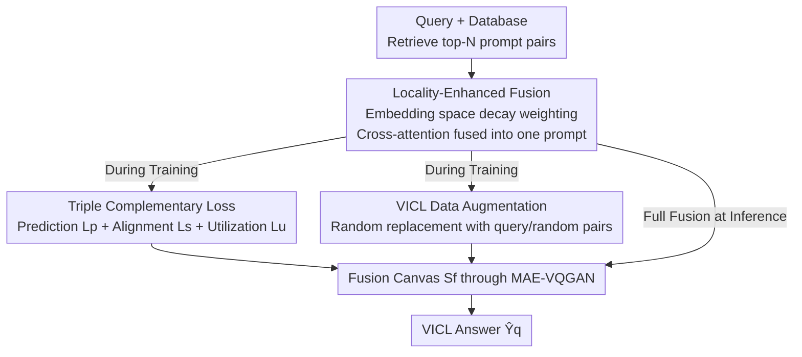

# PromptHub: Enhancing Multi-Prompt Visual In-Context Learning with Locality-Aware Fusion, Concentration and Alignment

**Conference**: ICLR 2026  
**OpenReview**: [https://openreview.net/forum?id=FBbO5I40VZ](https://openreview.net/forum?id=FBbO5I40VZ)  
**Code**: https://github.com/luotc-why/ICLR26-PromptHub  
**Area**: Self-supervised / Visual In-Context Learning  
**Keywords**: Visual In-Context Learning, multi-prompt fusion, locality prior, MAE-VQGAN, cross-attention

## TL;DR
PromptHub upgrades Multi-Prompt Visual In-Context Learning (VICL) fusion from "patch-wise concatenation" to "locality-enhanced fusion in embedding space." Coupled with a triple loss loop (prediction/alignment/utilization) and VICL-specific data augmentation, it ensures the backbone backbone truly trusts and utilizes the fused prompts, consistently outperforming the predecessor CONDENSER in segmentation, detection, and colorization tasks.

## Background & Motivation
**Background**: Visual In-Context Learning (VICL) allows models to perform like ICL in NLP, utilizing a few "input-label" example pairs (prompt pairs) + a query image to complete task results via pixel-level in-painting, typically using MAE-VQGAN as the backbone. Selecting appropriate prompts is crucial, and early work focused on "training better retrievers." NLP experience suggests that **multiple prompts** can reduce bias and provide richer context, making the expansion from single to multi-prompt a natural progression for VICL.

**Limitations of Prior Work**: Backbones like MAE-VQGAN can only process one prompt at a time, making multi-prompt integration difficult. The predecessor CONDENSER first introduced "prompt fusion" by merging multiple examples into a single unified example before feeding it to the backbone. However, it had two major weaknesses: first, **patch-wise fusion** only performs cross-attention at corresponding local positions, wasting valuable cues and leading to insufficient information utilization; second, the **supervisory signals are model-agnostic** (remaining at the input level), failing to guide the backbone to truly utilize the fused prompts.

**Key Challenge**: A **discrepancy** exists between the fused prompt and real query pairs. When the backbone perceives the fused prompt as "unlike" a standard query pair, it distrusts the fused representation and retreats to its own prior capabilities for in-painting—rendering the fusion ineffective. Thus, the problem is not just "insufficient fusion" but also that "the backbone refuses to use it."

**Goal**: Address three sub-problems: (i) extracting precise knowledge from diverse prompts; (ii) narrowing the discrepancy between fused prompts and query pairs to ensure backbone trust; (iii) producing superior VICL predictions.

**Key Insight**: The authors observe that patch-wise fusion discards spatial context, while adjacent patches in an image are naturally correlated. Consequently, a **locality prior** is employed: spatial decay weighting centered on the current patch, which maintains a global receptive field while suppressing boundary noise.

**Core Idea**: Fusion is moved to the embedding space using "locality-enhanced cross-attention." The entire pipeline is strengthened through a "fusion-utilization-prediction" triple loss loop + VICL-specific data augmentation, rather than modifying only the fusion step.

## Method

### Overall Architecture
Given a prompt database $D=\{P_i\}$ (where each prompt is an image-label pair), a pixel-level retriever $R$ fetches the top-$N$ most similar prompt pairs $P=\{(X_n,Y_n)\}_{n=1}^N$ for a query image $X_q$. The PromptHub module fuses these $N$ prompt pairs and the query image within the MAE patch embedding space into **one pair** of fused features $F_{X_f},F_{Y_f}\in\mathbb{R}^{\frac{H}{16}\times\frac{W}{16}\times D}$. These are concatenated with query features $F_{X_q}$ and mask features $F_{[M]}$ to form a canvas $S_f$, which is then processed by MAE-VQGAN (skipping the patch embedding layer) to generate the VICL answer $\hat{Y}_q$.

During training, three auxiliary losses $\mathcal{L}_p,\mathcal{L}_s,\mathcal{L}_u$ and data augmentation (random prompt replacement) are used to constrain the fusion module. During inference, the original top-$N$ retrieved prompts are used. The mechanism consists of four stages: "Retrieval → Locality-Aware Fusion → Triple Loss Constraint → Backbone Completion," where the latter three are the core contributions.

### Key Designs

**1. Locality-Enhanced Fusion: Replacing Patch-wise Concatenation with Spatial Decay Priors**

To address the "wasted information + limited receptive field" of patch-wise fusion, PromptHub moves fusion to the embedding space using **query-adaptive locality-enhanced cross-attention**. First, embedding layers obtain features for the query and prompts, which are aligned to similar patterns via self-attention $\mathrm{SA}(\cdot)$. Then, for each query token $F_{X_q}[h,w]$, a spatially decaying locality matrix $\Psi_{h,w}$ is constructed, where weights decay with distance (Gaussian or Laplacian):

$$\psi(h,w,x,y)=\exp\!\Big(-\tfrac{(x-h)^2+(y-w)^2}{2\sigma^2}\Big)\ \text{(Gaussian)}\quad\text{or}\quad \exp\!\Big(-\tfrac{\sqrt{(x-h)^2+(y-w)^2}}{\sigma}\Big)\ \text{(Laplacian)}$$

The attention scores are **element-wise multiplied** by $\Psi_{h,w}$ before the softmax, yielding locality-enhanced weights $A_{h,w}\in\mathbb{R}^{N\times\frac{H}{16}\times\frac{W}{16}}$. These are used to weight $F_{X_{1:N}},F_{Y_{1:N}}$ (via linear layers $W_{VX},W_{VY}$) to obtain fused image/label features. During inference, since query labels $Y_q$ are unavailable, prompt image features $F_{X_{1:N}}$ are shared as keys, ensuring the fusion weights can be applied to generate labels. $\sigma$ controls the local range (0.65 for Seg., 0.5 for Det., 2.5 for Col.).

**2. Fusion-Utilization-Prediction Triple Loss Loop: Ensuring Backbone Trust**

PromptHub employs three complementary losses:

(i) **Label Prediction Loss $\mathcal{L}_p$** (following CONDENSER/InMeMo): The fused sample $S_f$ is passed through the MAE encoder to obtain continuous tokens, which are aligned with discrete tokens of the query pair $S_q$ obtained via VQGAN. Cross-entropy supervises the masked region $T^c_{[M]}$. This is the **fundamental supervision** for VICL.

(ii) **Semantic Alignment Loss $\mathcal{L}_s$**: The backbone performs best when the prompt and query are from the same distribution. This loss uses cross-entropy to pull the fused prompt pairs $(T^c_{X_f},T^c_{Y_f})$ toward the discrete tokens of the query pair $(T^{d(1)}_{X_q},T^{d(1)}_{Y_q})$, improving fusion quality.

(iii) **Utilization Loss $\mathcal{L}_u$**: Addressing the core "distrust" issue, this loss uses cosine similarity to narrow the difference between fused prompts $(T^c_{X_f},T^c_{Y_f})$ and query pairs $(T^c_{X_q},T^c_{[M]})$, enhancing the backbone's reliance on the fused representation. The total target is $\min_\theta \mathcal{L}_p+\lambda\mathcal{L}_s+\gamma\mathcal{L}_u$ ($\lambda=0.5,\gamma=0.2$).

**3. VICL-Specific Data Augmentation: Strengthening Regularization via Prompt Replacement**

To amplify $\mathcal{L}_s$ and $\mathcal{L}_u$, training involves random replacements of the top-$N$ retrieved prompts. With probability $p_q$, prompts are replaced by the **query pair** $P_q=(X_q,Y_q)$ to create a "pure" target and minimize discrepancy for $\mathcal{L}_u$. With probability $p_r$, they are replaced by **randomly retrieved pairs** $P_r$ to inject controlled noise and enhance robustness for $\mathcal{L}_s$.

### Loss & Training
Total objective: $\mathcal{L}_p+\lambda\mathcal{L}_s+\gamma\mathcal{L}_u$; SGD optimizer, initial learning rate 0.04, cosine annealing warm restarts; Seg./Det. trained for 100 epochs, Col. for 10 epochs; Gaussian prior by default; input $224\times224$; single 80G A100, batch size 16.

## Key Experimental Results

### Main Results
Three tasks (Foreground Segmentation Seg., Single Object Detection Det., Image Colorization Col.), reported for $N=1$ and $N=16$. Colorization uses MSE (lower is better), others use mIoU.

| Task / Setting | Metric | CONDENSER | PromptHub | Gain |
|--------|------|------|----------|------|
| Seg. Mean (N=1) | mIoU↑ | 44.14 | 45.17 | +2.3% |
| Seg. Mean (N=16) | mIoU↑ | 46.63 | 47.81 | +2.5% |
| Det. (N=1) | mIoU↑ | 43.22 | 44.51 | +3.0% |
| Det. (N=16) | mIoU↑ | 44.64 | 45.59 | +2.1% |
| Col. (N=1) | MSE↓ | 0.560 | 0.533 | +5.1% |
| Col. (N=16) | MSE↓ | 0.539 | 0.503 | +7.2% |

Cross-domain transfer (COCO-5i → Pascal-5i): PromptHub$_{N=16}$ reached 42.17 mIoU, ~4.1% higher than CONDENSER$_{N=16}$ (40.52).

### Ablation Study

| Config (N=16, Seg. Mean) | mIoU | Description |
|------|---------|------|
| Full PromptHub | 47.81 | Full Model |
| w/o $\mathcal{L}_u$ | 46.71 | Removing utilization loss, -1.1 |
| w/o $\mathcal{L}_s$ | 45.84 | Removing semantic alignment, -2.0 |
| w/o $\mathcal{L}_p$ | 11.44 | Removing prediction loss, **collapse** |
| w/ Laplacian Prior | 47.72 | Marginal difference from Gaussian |
| Global Fusion | 44.64 | Removing locality, -3.2 |
| Convolution-Based Fusion | 46.95 | Weaker than locality attention |
| w/o Data Augment | 47.07 | -0.7 |

### Key Findings
- $\mathcal{L}_p$ is the foundation: Removing it causes mIoU to collapse from 47.81 to 11.44, proving label prediction is indispensable for parametric VICL.
- Locality is the core contribution: Global Fusion (no locality prior) drops by ~3.2, a larger decrease than removing any single loss; the method is insensitive to the specific form (Gaussian vs. Laplacian).
- Among losses, $\mathcal{L}_s$ is more critical than $\mathcal{L}_u$ (-2.0 vs -1.1).
- Colorization sees the largest gains (+7.2% at N=16), likely because dense regression tasks rely more on spatial context.

## Highlights & Insights
- **Explicitly modeling "backbone distrust"**: Using $\mathcal{L}_u$ cosine similarity to narrow the gap between fused prompts and query pairs is a diagnostic and effective design.
- **Locality prior as a plug-and-play modulation**: $\Psi_{h,w}$ modulates scores without breaking the global receptive field. The importance lies in the "spatial decay" inductive bias rather than the specific mathematical form.
- **Task-specific Data Augmentation**: Replacing prompts with query/random pairs is precisely tied to the loss objectives, making it more effective for VICL than generic augmentations.

## Limitations & Future Work
- Bound to the MAE-VQGAN + in-painting VICL framework; generalizability to autoregressive visual models (e.g., LVM) is unverified.
- The locality range $\sigma$ requires manual task-specific tuning, lacking an adaptive mechanism.
- Evaluations are restricted to three classical tasks; performance on complex or open-domain visual tasks remains unknown.

## Related Work & Insights
- **vs CONDENSER**: Upgrades patch-wise fusion and model-agnostic supervision to embedding-space locality fusion and triple loss constraints.
- **vs InMeMo**: While InMeMo tunes prompt borders with noise, PromptHub focuses on multi-prompt fusion and semantic alignment with the query.
- **Insight**: The "fusion-utilization-prediction" loop decouples "intermediate representation quality" from "downstream adoption," a concept applicable to distillation, RAG, and feature fusion.

## Rating
- Novelty: ⭐⭐⭐⭐ Solving the distrust issue via locality fusion and utilization loss is innovative.
- Experimental Thoroughness: ⭐⭐⭐⭐ Complete evidence across three tasks, transfer learning, and ablations.
- Writing Quality: ⭐⭐⭐⭐ Clear logic from motivation to method.
- Value: ⭐⭐⭐⭐ Establishes a more reliable locality-aware paradigm for prompt fusion in VICL.

<!-- RELATED:START -->

## Related Papers

- [\[ICLR 2026\] Relationship Alignment for View-aware Multi-view Clustering](relationship_alignment_for_view-aware_multi-view_clustering.md)
- [\[ICLR 2026\] In Context Semi-Supervised Learning](in_context_semi-supervised_learning.md)
- [\[ICLR 2026\] Spatially Informed Autoencoders for Interpretable Visual Representation Learning](spatially_informed_autoencoders_for_interpretable_visual_representation_learning.md)
- [\[ICLR 2026\] On the Alignment Between Supervised and Self-Supervised Contrastive Learning](on_the_alignment_between_supervised_and_self-supervised_contrastive_learning.md)
- [\[ICLR 2026\] Bures-Isotropy Alignment: Manifold Learning of Generalized Category Discovery](bures-isotropy_alignment_manifold_learning_of_generalized_category_discovery.md)

<!-- RELATED:END -->
