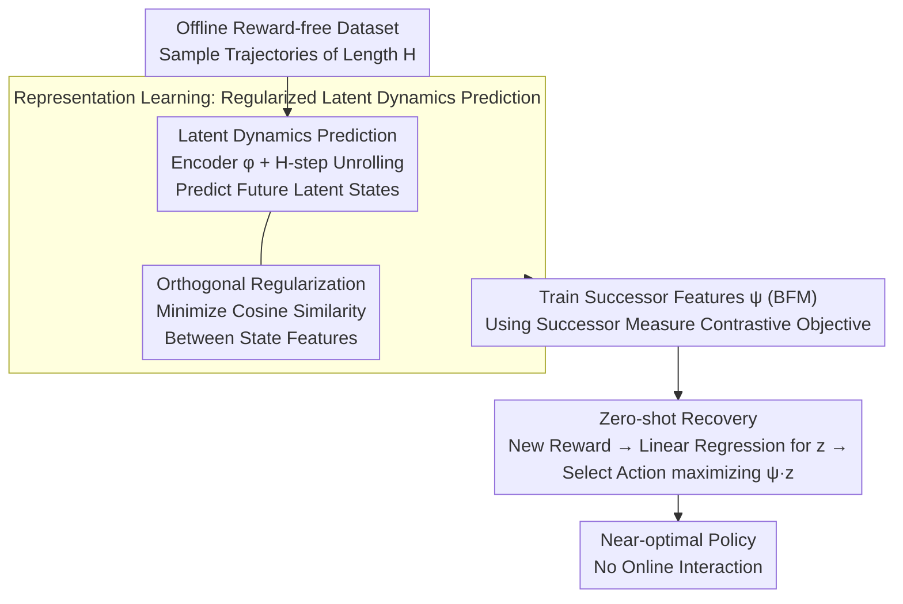

# Regularized Latent Dynamics Prediction is a Strong Baseline for Behavioral Foundation Models

**Conference**: ICLR 2026  
**arXiv**: [2603.15857](https://arxiv.org/abs/2603.15857)  
**Code**: None  
**Area**: Self-Supervised Learning  
**Keywords**: Behavioral Foundation Models, Zero-Shot RL, Latent Dynamics Prediction, Orthogonal Regularization, State Feature Learning

## TL;DR
The paper proposes Regularized Latent Dynamics Prediction (RLDP), which maintains feature diversity by adding simple orthogonal regularization to a self-supervised latent next-state prediction objective. RLDP matches or exceeds complex SOTA representation learning methods in zero-shot RL, demonstrating significant advantages particularly in low-coverage scenarios.

## Background & Motivation
**Behavioral Foundation Models (BFMs)** aim to train agents capable of adapting to arbitrary unknown rewards or tasks. The core idea is to pre-train state feature representations on offline datasets such that near-optimal policies can be recovered in a zero-shot manner for new reward functions at test time—without further environment interaction.

However, existing BFM methods face a fundamental limitation: they can only produce near-optimal policies for reward functions that lie within the **linear span** of certain pre-existing state features. In other words, the choice of state features is critical to the expressivity of a BFM—features must be sufficiently diverse to cover as many reward functions as possible. Consequently, existing methods design various complex representation learning objectives (e.g., diversity objectives in HILP, forward-backward representations in FB), requiring substantial dataset coverage to train useful span features.

This paper poses a key question: **Are these complex representation learning objectives truly necessary for zero-shot RL?** The authors find that simple self-supervised next-state prediction in latent space can learn useful features, but with one issue—this objective tends to make feature vectors increasingly similar during training (increasing feature similarity), thereby reducing the dimension of the span. The solution is surprisingly simple: adding an orthogonal regularization is sufficient.

## Method

### Overall Architecture
RLDP decomposes zero-shot RL into two stages. The first stage is representation learning: a state encoder $\phi$ is trained on an offline reward-free dataset using self-supervised latent dynamics prediction to encode environment dynamics, while an orthogonal regularization term prevents feature collapse and maintains the diversity of the span. The second stage follows standard BFM mechanisms: with the learned $\phi$ fixed, successor features $\psi$ are trained using a successor measure contrastive objective. At test time, for any new reward, a task vector $z$ is first obtained via linear regression, and a near-optimal policy is then composed in one step using $\psi$, with no environment interaction required. Compared to complex BFMs like FB and HILP that jointly optimize forward-backward models and contrastive/diversity objectives, RLDP concentrates core innovation in the first stage with only dynamics prediction and orthogonal regularization.

### Key Designs

**1. Latent Dynamics Prediction: Learning Dynamics-Relevant Features via Self-Supervision**

Many existing BFMs use successor measure estimation to learn features, but this requires Bellman backups and depends on predefined policy classes, often leading to poor generalization due to out-of-distribution actions under low coverage. RLDP takes a policy-agnostic path: sampling a trajectory of length $H$ from offline data, the encoder maps the initial state to the latent space $h_0=\phi(s_0)$, and a latent dynamics model $g$ with weights $w$ unrolls the states step-by-step as $h_{t+1}=g(h_t,a_t)^\top w$. The training objective is to make the unrolled latent states approximate the encoding of the true states:

$$L_d=\mathbb{E}\Big[\textstyle\sum_{t=1}^{H}\lVert h_t-\bar\phi(s_t)\rVert^2\Big]$$

where $\bar\phi$ is a slowly updating target encoder (stop-gradient). This objective forces features to encode dynamics information, but it degenerates when used in isolation—even with BYOL-style "stop-gradient + slow target" tricks to avoid total collapse to constants, the authors observed that the cosine similarity of features for different states continuously increases during training (a "gentle collapse"). Since the feature span defines the reward space a BFM can cover, increased similarity directly shrinks the set of solvable rewards.

**2. Orthogonal Regularization: One Constraint to Prevent Feature Collapse**

To address the aforementioned gentle collapse, RLDP does not redesign the objective but adds an orthogonal regularization term to encourage diversity. First, all state features are projected onto a hypersphere of radius $\sqrt d$, $\mathbb{S}^{d-1}=\{x:\lVert x\rVert_2=\sqrt d\}$, then the inner product (i.e., cosine similarity) between any two state features is minimized:

$$L_r(\phi)=\mathbb{E}_{s,s'\sim\rho}\big[\phi(s)^\top\phi(s')\big]$$

This pushes features of different states toward mutual orthogonality, directly resisting the rise in similarity and maintaining the richness of the span. The final objective is the weighted sum $L_{\text{RLDP}}=L_d+\lambda L_r$. This term precisely treats the degradation of the previous step: dynamics prediction ensures features have "dynamic semantics," while orthogonal regularization ensures features "do not collapse." Both are indispensable. Notably, the regularization coefficient does not require fine-tuning—a small $\lambda\approx0.01$ is sufficient to stop collapse, at the cost of almost one line of code.

**3. Zero-shot Successor Feature Recovery: One-Step Mapping of New Rewards to Policies**

Once the learned $\phi$ is fixed, RLDP reuses the standard BFM mechanism: training successor features $\psi(s,a,z)$ using a successor measure contrastive objective (training only $\psi$ while keeping $\phi$ frozen), which satisfies $Q_z(s,a)=\psi(s,a,z)^\top z$. At test time, given any new reward $r$, it is first approximated as a linear combination of features $r(s)\approx\phi(s)^\top z$. A closed-form linear regression yields the task vector $z=(\phi\phi^\top)^{-1}\phi r$. Then, by selecting actions via $\arg\max_a\psi(s,a,z)^\top z$, a near-optimal policy is recovered zero-shot without any additional training or online interaction. This also explains why the feature span is vital: rewards that can be recovered zero-shot are precisely those that fall within the span of $\phi$—which is why the first stage strives to maintain feature diversity.

## Key Experimental Results

### Main Results
On standard zero-shot RL benchmarks (such as continuous control tasks in the ExORL dataset), the comparison between RLDP and complex SOTA methods is as follows:

| Method | Complexity | Zero-shot Performance | Description |
|------|--------|-----------|------|
| FB (Forward-Backward) | High | SOTA-level | Requires forward and backward models |
| HILP | High | SOTA-level | Requires multi-level objectives |
| ICM (Dynamics prediction only) | Low | Poor | Severe feature collapse |
| **RLDP** | **Lowest** | **Matches/Surpasses SOTA** | Only dynamics prediction + orthogonal regularization |

### Low-Coverage Experiments
The key advantage of RLDP over SOTA methods is more prominent in low data coverage scenarios:

| Coverage | RLDP | FB | HILP |
|--------|------|----|------|
| Sufficient Coverage | Matches SOTA | Good | Good |
| Low Coverage | **Still Successful** | Performance Drop | Performance Drop |

### Ablation Study

| Configuration | Key Metric | Description |
|------|---------|------|
| Dynamics prediction only (No Ortho) | Poor performance | Feature collapse, span shrinkage |
| Orthogonal reg only (No Dynamics) | Poor performance | Features lack dynamics semantics |
| Dynamics + Orthogonal (RLDP) | Optimal | Both components are essential |
| Impact of $\lambda$ | Optimal range exists | Too large inhibits dynamics learning; too small fails to prevent collapse |

### Key Findings
- Simple self-supervised next-state prediction combined with orthogonal regularization can match or even exceed complex SOTA methods.
- The core problem of pure dynamics prediction is the shrinkage of the span caused by increased feature similarity—orthogonal regularization precisely solves this.
- Advantages are particularly evident in low-coverage scenarios: while complex methods rely on data diversity to train features, RLDP's orthogonal constraint provides additional structural safeguards.
- These findings challenge the common assumption that "zero-shot RL requires complex representation learning."

## Highlights & Insights
- **Minimalist yet Effective**: In a field trending toward increasingly complex objective functions, RLDP achieves SOTA with minimal modification (just adding an orthogonal regularization term), demonstrating the value of "strong baseline" research.
- **Deep Diagnostic Insight**: Accurately identifies the degradation mode of latent dynamics prediction (feature similarity increase → span shrinkage) and designs a targeted solution.
- **High Practicality**: The method is simple enough to implement orthogonal regularization in a single line of code ($\|\Phi^T\Phi - I\|$), requiring no additional network architectures or training pipelines.
- **Low-Coverage Robustness**: In practical applications, offline dataset coverage is often limited. RLDP performs well in these more realistic scenarios.

## Limitations & Future Work
- Currently based on a linear successor features framework, which may perform poorly for tasks requiring non-linear reward decoding.
- Orthogonal regularization may introduce overly strong constraints when feature dimensions are very high.
- Validated only in continuous control environments like MuJoCo; does not yet involve visual observations or high-dimensional inputs.
- The choice of $\lambda$ still requires parameter tuning.
- The dynamics model uses simple MLPs; stronger dynamics modeling (e.g., Transformers) might provide further improvements.
- While zero-shot performance is strong, it is not yet optimal; few-shot fine-tuning mechanisms remain to be explored.

## Related Work & Insights
- **Comparison with FB (Forward-Backward)**: FB requires training forward and backward models separately, whereas RLDP only needs dynamics prediction in one direction.
- **Comparison with HILP**: HILP requires hierarchical diversity objectives and intrinsic reward design, while RLDP achieves this via orthogonal regularization.
- **Comparison with ICM/RND**: These classic dynamics-based exploration methods also use next-state prediction but do not address the issue of feature span shrinkage.
- **Insight**: In representation learning, maintaining feature diversity is often more important than the complexity of the learning objective; simple methods with the correct inductive bias can go a long way.

## Rating
- Novelty: ⭐⭐⭐⭐
- Experimental Thoroughness: ⭐⭐⭐⭐
- Writing Quality: ⭐⭐⭐⭐
- Value: ⭐⭐⭐⭐⭐

<!-- RELATED:START -->

## Related Papers

- [\[ICLR 2026\] Midway Network: Learning Representations for Recognition and Motion from Latent Dynamics](midway_network_learning_representations_for_recognition_and_motion_from_latent_d.md)
- [\[ICML 2026\] NumLeak: Public Numeric Benchmarks as Latent Labels in Foundation Models](../../ICML2026/self_supervised/numleak_public_numeric_benchmarks_as_latent_labels_in_foundation_models.md)
- [\[ICML 2026\] FLAG: Foundation Model Representation with Latent Diffusion Alignment via Graph for Spatial Gene Expression Prediction](../../ICML2026/self_supervised/flag_foundation_model_representation_with_latent_diffusion_alignment_via_graph_f.md)
- [\[ICLR 2026\] Self-Predictive Representations for Combinatorial Generalization in Behavioral Cloning](self-predictive_representations_for_combinatorial_generalization_in_behavioral_c.md)
- [\[ICLR 2026\] Plug-and-Play Compositionality for Boosting Continual Learning with Foundation Models](plug-and-play_compositionality_for_boosting_continual_learning_with_foundation_m.md)

<!-- RELATED:END -->
