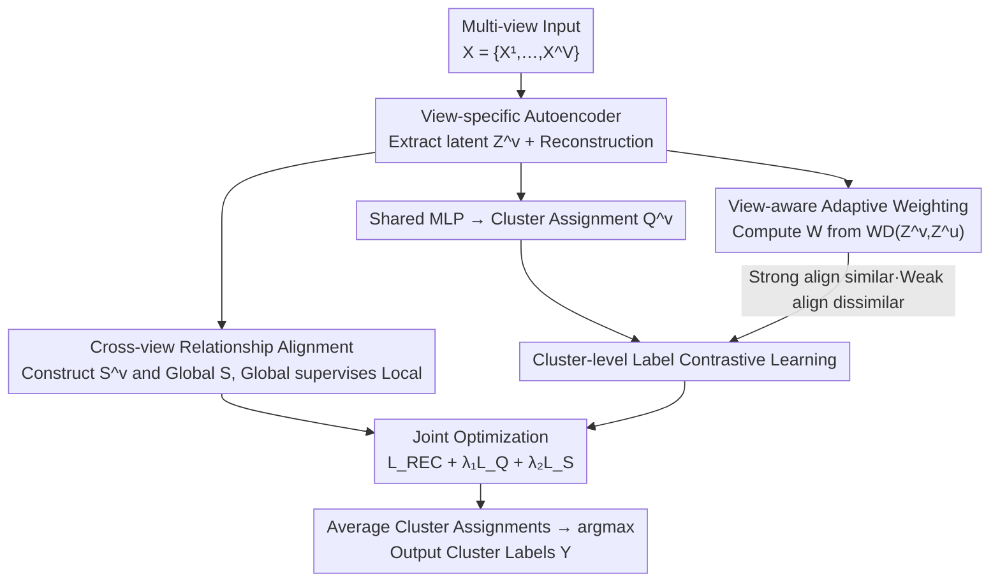

# Relationship Alignment for View-aware Multi-view Clustering

**Conference**: ICLR 2026  
**OpenReview**: [https://openreview.net/forum?id=uRA9cT4MK6](https://openreview.net/forum?id=uRA9cT4MK6)  
**Code**: https://github.com/chenzhe207/RAV  
**Area**: Self-supervised / Multi-view Clustering  
**Keywords**: Multi-view clustering, contrastive learning, relationship alignment, view-aware weighting, Wasserstein distance

## TL;DR
RAV preserves the neighborhood structure of each view through "cross-view sample relationship alignment" and dynamically adjusts the intensity of cluster-level label contrastive learning using "view-aware adaptive weighting" based on Wasserstein distance. This ensures strong alignment for similar views and weak alignment for dissimilar views, overall surpassing existing SOTA on ten multi-view clustering benchmarks.

## Background & Motivation

**Background**: The goal of multi-view clustering (MVC) is to integrate complementary information from multiple views (different modalities/features) of the same set of samples to achieve more accurate cluster partitions than single-view methods. Deep MVC is the current mainstream approach—using view-specific autoencoders for feature extraction, followed by contrastive learning to pull similar samples closer at the "sample level" and align clustering distributions across views at the "cluster level" to pursue cross-view consistency.

**Limitations of Prior Work**: The authors identify two commonly overlooked issues. First, most methods perform alignment only on features or clustering distributions without **explicitly preserving the neighborhood structure of samples**. This leads to inconsistency in "who are neighbors" across views, undermining the stability of sample relationships. Second, the vast majority of contrastive learning methods **force alignment across all views indiscriminately**. When two views are inherently very different, forcing their cluster distributions together can distort the true semantics, leading to representation conflicts and semantic degradation.

**Key Challenge**: Although recent works (such as SEM, SCMVC) have recognized view differences and introduced "feature-level" adaptive weighting, they only adjust weights at the feature fusion level. They **neither ensure consistency in cross-view sample relationship structures nor account for cluster-level semantic consistency**. Consequently, they may still force low-similarity views into consistency learning, causing semantic conflicts. In other words, "structure preservation" and "adaptive alignment by view difference" have not been resolved simultaneously at the correct granularity.

**Goal**: Decomposition into two sub-problems: (1) how to preserve the local neighborhood structure of each view during fusion and ensure consistent cross-view relationships; (2) how to adaptively determine alignment intensity based on true similarity between views during cluster-level contrastive learning to avoid forced alignment of dissimilar views.

**Key Insight**: The observation is that the pairwise relationship between samples (relationship matrix) is a more robust structural signal than point-wise features; a "global relationship matrix" can be used to supervise each "local relationship matrix." Simultaneously, differences between views should be measured using distance at the distribution level (Wasserstein distance), with contrastive losses weighted accordingly.

**Core Idea**: Use "global-supervise-local" relationship alignment to preserve structure and WD-driven view-aware weighting to enable "strong alignment for similar, weak alignment for dissimilar" views, unifying structure preservation and adaptive alignment into a single framework.

## Method

### Overall Architecture

The input to RAV is a multi-view dataset $X = \{X^1, \dots, X^V\}$ with $V$ views, where the $v$-th view $X^v \in \mathbb{R}^{N \times d_v}$ ($N$ samples, dimension $d_v$). The output is a unified clustering label $Y = [y_1, \dots, y_N]$. The pipeline is connected by three core modules: first, **view-specific autoencoders** extract denoised latent features $Z^v$ (constrained by reconstruction loss); then $Z^v$ branches into two collaborative paths—**cross-view relationship alignment**, which constructs sample relationship matrices $S^v$ for each view and aligns them with a global relationship matrix $S$ to preserve neighborhood structure; and **cluster-level label contrastive learning**, where $Z^v$ is projected into a cluster assignment matrix $Q^v$ via a shared MLP. The contrastive intensity of this branch is dynamically adjusted by the **view-aware adaptive weighting** module (calculating weight matrix $W$ based on the Wasserstein distance between $Z^v$). Three losses $\mathcal{L}_{REC} + \lambda_1 \mathcal{L}_Q + \lambda_2 \mathcal{L}_S$ are jointly optimized. After convergence, clustering labels are obtained by averaging $Q^v$ across views and taking the argmax.

### Key Designs

**1. Relationship Alignment: Preserving Local Neighborhood Structure via Global Supervision**

This design addresses the pain point of "losing neighborhood structure and cross-view relationship inconsistency during fusion." Specifically: deep features $Z^v$ are extracted, then a Gaussian kernel is used to calculate pairwise sample similarities $s^v_{ik} = \exp\!\left(-\frac{\lVert z^v_{i,:]} - z^v_{k,:]}\rVert^2}{\sigma}\right)$ to obtain the view-specific relationship matrix $S^v \in \mathbb{R}^{N \times N}$. Simultaneously, deep features from all views are concatenated as $Z = \mathrm{Concat}(Z^1, \dots, Z^V)$ to calculate a **global relationship matrix** $S$ using the same kernel—this represents the "intended relationships between samples" by integrating all information. A global-supervise-local contrastive objective aligns each row of $S^v$ (one sample's relationship to all others) with the corresponding row in $S$:

$$\mathcal{L}_S = -\frac{1}{N} \sum_{v=1}^{V} \sum_{i=1}^{N} \log \frac{e^{d(s^v_{i,:},\, s_{i,:})/\tau_F}}{\sum_{k=1}^{N} e^{d(s^v_{i,:},\, s_{k,:})/\tau_F} - e^{1/\tau_F}}$$

where $d(\cdot,\cdot)$ is cosine similarity and $\tau_F$ is the temperature. This treats "a sample's relationship vector in a specific view" and "that sample's global relationship vector" as a positive pair. The effect: neighbors remain neighbors across views, enhancing feature discriminability and providing a **stable frame of reference** for subsequent alignment.

**2. Cluster-level Label Contrastive Learning: Aligning Semantics on Cluster Assignment Vectors**

To ensure semantic consistency of "clusters" across views, the authors apply contrastive learning at the **cluster assignment** level rather than the sample level. A shared MLP projects $Z^v$ and applies Softmax along the cluster dimension to get $Q^v \in \mathbb{R}^{N \times K}$, where $q^v_{ij}$ is the probability of sample $i$ belonging to cluster $j$ in view $v$. The **column vectors** $q^v_{:,j}$ are used as contrastive units: column vectors from different views with the same cluster index $j$ are positive pairs. The contrastive loss for a view pair $(v,u)$ is:

$$\ell^{(v,u)}_c = -\frac{1}{K} \sum_{j=1}^{K} \log \frac{e^{d(q^v_{:,j},\, q^u_{:,j})/\tau_L}}{\sum_{k=1}^{K} \sum_{m=v,u} e^{d(q^v_{:,j},\, q^m_{:,k})/\tau_L} - e^{1/\tau_L}}$$

A regularization term $\sum_v \sum_j r^v_j \log r^v_j$ (where $r^v_j$ is the average probability of cluster $j$) is added to prevent collapsed solutions. This aligns "clustering distributions," directly serving clustering semantic consistency.

**3. View-aware Adaptive Weighting: Adaptive Alignment based on Wasserstein Distance**

Design 2 treats all view pairs equally, which causes semantic degradation for highly disparate views. The authors measure distribution differences using **Wasserstein Distance (WD)**: $\mathrm{WD}(Z^v, Z^u) = \frac{1}{N^2} \sum_{i=1}^{N} \sum_{k=1}^{N} \lvert z^v_{i,:} - z^u_{k,:} \rvert$. This WD is converted into weights via a negative exponential and softmax:

$$w^{(v,u)} = \frac{e^{-\mathrm{WD}(Z^v, Z^u)}}{\sum_{u=1}^{V} e^{-\mathrm{WD}(Z^v, Z^u)}}$$

Smaller WD (more similar views) results in higher weights. The finalized view-aware contrastive loss is:

$$\mathcal{L}_Q = \frac{1}{2} \sum_{v=1}^{V} \sum_{u \neq v} \frac{1}{2}\big(w^{(v,u)} + w^{(u,v)}\big) \ell^{(v,u)}_c + \sum_{v=1}^{V} \sum_{j=1}^{K} r^v_j \log r^v_j$$

In contrast to "feature-level" weighting in SEM/SCMVC, RAV accurately captures intrinsic view similarities via **deep feature distributions**, leading to better generalization on complex datasets.

### Loss & Training

The total loss is $\mathcal{L}_{total} = \mathcal{L}_{REC} + \lambda_1 \mathcal{L}_Q + \lambda_2 \mathcal{L}_S$, where $\mathcal{L}_{REC}$ is the reconstruction loss. Training involves two steps: first minimizing $\mathcal{L}_{REC}$ to pre-train autoencoders, then updating $S^v/S$, the weight matrix $W$, and all parameters via $\mathcal{L}_{total}$ each epoch. Implementation: PyTorch, RTX 4090, Adam, LR 0.0003, batch 256. Hyperparameters: $\sigma=1.0$, $\tau_F=\tau_L=0.5$, $\lambda_1 \in [10^{-5}, 10^3]$, $\lambda_2 \in [10^{-5}, 1]$. Final labels are derived via $y_i = \arg\max_j (\frac{1}{V}\sum_v q^v_{ij})$.

## Key Experimental Results

Evaluated on **10 benchmarks** including NGs, Digit-Product, ALOI, Cora, NUSWIDE, Caltech-5V, NoisyMNIST, YoutubeVideo, 3Sources, and Fashion. Comparison against 9 SOTA methods (MFLVC, SEM, MVCAN, SCMVC, etc.) using ACC / NMI / PUR.

### Main Results

| Dataset | Metric | RAV (Ours) | Prev. SOTA | Gain |
|--------|------|-----------|--------------|------|
| NGs | ACC | **0.980** | 0.936 (SSLNMVC) | +4.4% |
| YoutubeVideo | ACC | **0.356** | 0.318 (SEM) | +7.8% (NMI/PUR also best) |
| Cora | ACC | **0.592** | 0.567 (MVCAN) | +2.5% |
| NUSWIDE | ACC | **0.647** | 0.637 (SSLNMVC) | +1.0% |
| 3Sources | NMI | **0.599** | 0.584 (SEM) | PUR 0.775 also best |

RAV is overall superior, especially on datasets with large view differences (NGs, YoutubeVideo). It is slightly lower than MVCAN on ALOI and Caltech-5V (attributed to MVCAN's non-standard contrastive learning being less sensitive to view differences). Performance is comparable to MFLVC on simple datasets (Fashion) where adaptive weighting is less critical.

### Ablation Study

| Config ($\mathcal{L}_{REC} / \mathcal{L}_Q / \mathcal{L}_S$) | Caltech-5V ACC | NUSWIDE ACC | ALOI ACC | 3Sources NMI | Description |
|------|------|------|------|------|------|
| ✓ / ✓ / ✗ | 0.899 | 0.644 | 0.780 | 0.464 | Remove relationship alignment $\mathcal{L}_S$ |
| ✓ / ✗ / ✓ | 0.424 | 0.298 | 0.264 | 0.135 | Remove label contrastive $\mathcal{L}_Q$ |
| ✓ / ✓ / ✓ | **0.901** | **0.647** | **0.826** | **0.599** | Full Model |

| Config | NGs ACC | ALOI ACC | Cora ACC | Description |
|------|------|------|------|------|
| ours w/o W | 0.966 | 0.801 | 0.585 | Remove View-aware Weighting |
| ours (full) | **0.980** | **0.826** | **0.592** | +1.4% / +3.6% / +0.7% |

### Key Findings
- **Cluster-level Label Contrastive $\mathcal{L}_Q$ is fundamental**: Performance collapses without it. Relationship alignment $\mathcal{L}_S$ provides stable structural consistency.
- **Benefits of View-aware Weighting $W$ correlate with view diversity**: Significant gains are seen on ALOI (3.6%), while Performance remains identical on low-diversity datasets like Digit-Product.
- **Robustness and Convergence**: Performance is stable across a wide range of $\lambda_1, \lambda_2$. t-SNE shows clusters become increasingly separated and compact.

## Highlights & Insights
- **"Global-supervise-local" Relationship Alignment**: Using a global matrix as an anchor is more efficient and stable than pairwise alignment, providing a unified reference frame.
- **Wasserstein Distance for Distribution-level Similarity**: WD accurately characterizes distribution differences, a concept transferable to any multi-source alignment task.
- **Cluster Column Contrastive Units**: Contrasting cluster assignment distributions directly targets the clustering objective and naturally provides rich supervision from $V(K-1)$ negative pairs.

## Limitations & Future Work
- Authors acknowledge the need for **theoretical exploration** of more robust relationship structures and general similarity metrics.
- $N \times N$ matrices and WD calculations ($O(N^2)$) may pose memory/computational overhead for massive datasets (partially mitigated by mini-batches).
- Assumes complete views and clean data; handles for incomplete or noisy data are left for future work.

## Related Work & Insights
- **vs SEM / SCMVC**: These use feature-level weights but ignore cross-view relationship and cluster-level consistency. RAV's **distribution-level similarity** via WD is significantly more effective.
- **vs GCFAgg**: Both value structural relationships, but RAV explicitly preserves neighborhood structures through a dedicated global-supervise-local loss.
- **vs MVCAN**: MVCAN performs slightly better on specific datasets due to its non-contrastive nature but is outperformed by RAV on more challenging benchmarks.

## Rating
- Novelty: ⭐⭐⭐⭐ Clear combination of global-local alignment and WD-driven weighting, though components build on existing ideas.
- Experimental Thoroughness: ⭐⭐⭐⭐⭐ 10 benchmarks, 9 baselines, 3 metrics, plus extensive sensitivity and visualization analysis.
- Writing Quality: ⭐⭐⭐⭐ Clear structure and math; more detail on the mini-batch approximation of global matrices would be beneficial.
- Value: ⭐⭐⭐⭐ Practical and stable for diverse view scenarios; WD weighting insight is broadly applicable.

<!-- RELATED:START -->

1. **SCMVC**: Self-supervised Contrastive Multi-view Clustering, 2022.
2. **SEM**: Scalable and Efficient Multi-View Clustering, 2023.
3. **MFLVC**: Multi-level Feature Learning for Multi-view Clustering, CVPR 2023.

<!-- RELATED:END -->

## Related Papers

- [\[ICLR 2026\] Incomplete Multi-View Multi-Label Classification via Shared Codebook and Fused-Teacher Self-Distillation](incomplete_multi-view_multi-label_classification_via_shared_codebook_and_fused-t.md)
- [\[ICLR 2026\] PredNext: Explicit Cross-View Temporal Prediction for Unsupervised Learning in Spiking Neural Networks](prednext_explicit_cross-view_temporal_prediction_for_unsupervised_learning_in_sp.md)
- [\[ICLR 2026\] PromptHub: Enhancing Multi-Prompt Visual In-Context Learning with Locality-Aware Fusion, Concentration and Alignment](prompthub_enhancing_multi-prompt_visual_in-context_learning_with_locality-aware_.md)
- [\[CVPR 2026\] GaussianMatch: Semi-Supervised Regression with Pseudo-Label Filtering via Multi-View Gaussian Consistency](../../CVPR2026/self_supervised/gaussianmatch_semi-supervised_regression_with_pseudo-label_filtering_via_multi-v.md)
- [\[ICLR 2026\] On the Alignment Between Supervised and Self-Supervised Contrastive Learning](on_the_alignment_between_supervised_and_self-supervised_contrastive_learning.md)

<!-- RELATED:END -->
