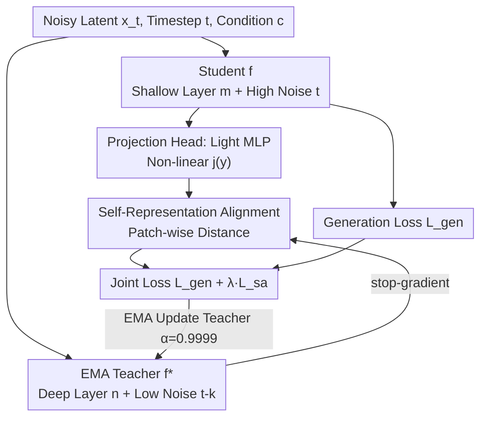

# Representation Alignment for Diffusion Transformers without External Components

**Conference**: ICLR 2026  
**OpenReview**: [https://openreview.net/forum?id=ds5w2xth93](https://openreview.net/forum?id=ds5w2xth93)  
**Code**: https://github.com/vvvvvjdy/SRA  
**Area**: Self-Supervised / Representation Learning / Diffusion Models  
**Keywords**: Representation Alignment, Diffusion Transformer, Self-Representation Alignment, EMA Teacher, Generation Acceleration

## TL;DR
This paper discovers a "bad-to-good" evolution of discriminative representations within Diffusion Transformers. It proposes SRA (Self-Representation Alignment): aligning student representations at "shallower layers + higher noise" with EMA teacher representations at "deeper layers + lower noise." This accelerates DiT/SiT training without any external tasks or pre-trained encoders, significantly outperforming methods depending on external tasks and approaching REPA, which relies on DINOv2.

## Background & Motivation
**Background**: Recent works indicate that injecting "high-quality internal representations" into Diffusion Transformers (DiTs) accelerates convergence and improves generation quality. Implementation generally follows two paths: adding external discriminative tasks (e.g., MaskDiT, SD-DiT, TREAD using MAE/iBOT-style masked reconstruction) or directly aligning intermediate features to a large-scale pre-trained foundation model like DINOv2 or CLIP (e.g., REPA).

**Limitations of Prior Work**: The former requires designing and maintaining extra tasks, increasing training complexity. The latter depends heavily on powerful external pre-trained encoders, which might not exist for specific target domains (e.g., open-domain video). Furthermore, alignment with external models like REPA tends to saturate around 200 epochs as the teacher's signal reaches its limit.

**Key Challenge**: While representation guidance is effective, the "source of guidance" is conventionally tied to external components. This raises the question: do Diffusion Transformers not gradually learn meaningful representations during training? If they do, is external guidance necessary?

**Goal**: Provide representation guidance for intermediate layers to accelerate convergence and improve quality **without external representation components and without modifying the DiT architecture**.

**Key Insight**: An empirical analysis of SiT-XL/2 (PCA visualization + ImageNet linear probing) reveals that latent features of DiTs refine from "bad" to "good" as **layers deepen and noise decreases**. Shallow, high-noise representations are coarse, while deep, low-noise representations are superior (linear probing accuracy peaks around layer 20 before declining as the model shifts to generating high-frequency details). Thus, an internal "bad $\rightarrow$ good" discriminative representation gradient naturally exists.

**Core Idea**: Since "better representations" are hidden within the model's own deeper layers and lower noise levels, the model can serve as its own teacher. By aligning weak representations with strong ones, "Self-Representation Alignment" is achieved without external components.

## Method

### Overall Architecture
SRA expands a standard diffusion forward pass into two branches sharing the same architecture: a Student and an EMA Teacher. The student branch takes noisy latent $x_t$, timestep $t$, and condition $c$ to predict noise/velocity for the generation loss. Simultaneously, the output feature $y=f^m(x_t,t,c)$ from a **shallower layer** $m$ undergoes a non-linear transformation via a lightweight projection head $j_\psi$. The teacher branch is an EMA copy of the student, processing **lower-noise** input ($t-k$, $k\ge0$). Its output $y^*=f^n_*(x_{t-k},t-k,c)$ from a **deeper layer** $n$ ($m\le n$) serves as the alignment target. A patch-wise distance between the two forms the self-alignment loss, optimized jointly with the generation loss. The teacher is updated via EMA and receives no gradients (stop-gradient). The projection head is discarded after training, making SRA zero-intrusive to the original architecture.

### Key Designs

**1. Self-Representation Alignment: Pulling Shallow Weak Representations toward Deep Strong ones**

This step addresses the "source of guidance." Instead of external teachers, SRA utilizes the internal "bad $\rightarrow$ good" representation gradient. The student's output at layer $m$ and noise level $t$ is aligned with the teacher's output at a deeper layer $n$ ($m\le n$) and lower noise level $t-k$ ($k\ge0$). Formally, it minimizes the patch-wise distance:
$$L_{sa}(\zeta_s,\psi)=\mathbb{E}_{x_t,t,c}\Big[\tfrac{1}{N}\sum_{i=1}^N \mathrm{dist}\big(y^{[i]}_*,\,j_\psi(y^{[i]})\big)\Big]$$
where $[i]$ is the patch index and $\mathrm{dist}$ is a predefined distance metric. Shallow layers act as the "foundation" for generation and require semantic guidance, while deeper, low-noise features are of higher quality (proven via linear probing). This acts as a "self-distillation" deep supervision. Ablations show $3\to8$ (student layer 3 to teacher layer 8) is optimal, reducing FID from 33.02 to 29.10, whereas $3\to3$ (same-layer alignment) degrades performance to 37.08, confirming that cross-layer alignment to superior representations is critical.

**2. EMA Teacher: Eliminating External Components using Historical Weights**

Using the current model output as a target can lead to collapse (a known phenomenon in BYOL/SimSiam, replicated by the authors). SRA solves this by constructing the teacher from historical iterations via Exponential Moving Average: $\zeta_t=\alpha\zeta_t+(1-\alpha)\zeta_s$, with a stop-gradient on the teacher. This makes SRA "external-component-free." The teacher improves alongside the student (linear probing rises from 38.1 at 200K steps to 54.2 at 800K steps) and consistently outperforms the student, explaining why SRA does not saturate like REPA. A high momentum $\alpha=0.9999$ is used throughout, and common SSL stability tricks (clustering, BatchNorm, centering) are unnecessary.

**3. Projection Head: Protecting the Generative Field**

Directly aligning raw student features to teacher features yields poor results (FID drops from 29.10 to 34.23 without the head). SRA applies a lightweight trainable MLP $j_\psi$ for a slight non-linear transformation before alignment. Each layer in a diffusion model has a specific role in the generation field; explicit alignment of raw features might interfere with these roles. The projection head provides a dedicated space for alignment-related representations without disrupting the generation process.

**4. Joint Objectives and Placement: Layer/Noise Gaps Determine Strength**

The final objective is $L=L_{gen}+\lambda L_{sa}$, where $\lambda=0.2$ (robust across $[0.1, 0.4]$). Two key hyperparameters are the "layer pair" and "time gap." Layer pairs are set based on model scale (e.g., $8\to20$ for XL). The time gap $k$ (dynamic range $[0, 0.2)$) allows the teacher to see lower noise, providing better representations, though too large a gap might distract the model from its generation task.

### Loss & Training
Training follows standard DiT/SiT configurations: AdamW, constant LR 1e-4, no weight decay, batch size 256, SD-VAE latents, and patch size 2. Total loss $L=L_{gen}+\lambda L_{sa}$ with $\lambda=0.2$ and $\alpha=0.9999$. The only overhead is one additional teacher forward pass. All FID results are reported under "equal training time" for fair comparison.

## Key Experimental Results

### Main Results
ImageNet 256×256, system-level comparison with CFG (Lower FID is better):

| Method | Epochs | Tokenizer | FID↓ | IS↑ | External Components |
|------|--------|-----------|------|-----|------|
| SiT-XL/2 (Baseline) | 1400 | SD-VAE | 2.06 | 270.3 | No |
| MaskDiT | 1600 | SD-VAE | 2.28 | 276.6 | External Task |
| SiT + REPA | 800 | SD-VAE | 1.42 | 305.7 | External Encoder (DINOv2) |
| **SiT + SRA (Ours)** | 400 | SD-VAE | 1.85 | 297.2 | **No** |
| **SiT + SRA (Ours)** | 800 | SD-VAE | 1.58 | 311.4 | **No** |

SRA at 400 epochs outperforms the 1400-epoch baseline. At 800 epochs, FID=1.58, significantly better than MaskDiT and approaching DINOv2-based REPA. On 512×512, SRA surpasses the baseline with 1/3 the iterations and beats REPA in sFID/IS/Rec. Zero-shot transfer to T2I (MMDiT + COCO2014) also shows gains: FID 5.86 $\rightarrow$ 4.85.

### Ablation Study
SiT-B/2, 400K iterations, no CFG (Baseline FID 33.02 / IS 43.71):

| Configuration | FID↓ | IS↑ | Description |
|------|------|-----|------|
| Default $3\to8$, gap $[0,0.2)$, $\lambda=0.2$, w/ head | **29.10** | **50.20** | Full SRA |
| $3\to3$ (Same-layer) | 37.08 | 41.54 | Worse than baseline without cross-layer |
| Time gap $0.0$ (Same noise) | 31.07 | 47.32 | Teacher needs lower noise |
| $\lambda=0.1$ | 30.65 | 48.31 | Lower gain with smaller weight |
| Remove Projection Head | 34.23 | 41.07 | Head is indispensable |

### Key Findings
- **Cross-layer + Low-noise Teacher is Essential**: Same-layer alignment ($3\to3$) is worse than the baseline, proving guidance must come from superior representations.
- **Projection Head is Critical**: Removing it increases FID by ~5 points, indicating that non-linear transformation protects the generative field.
- **Larger Models/Longer Training Gain More**: SRA scales better on XL models and does not saturate because the teacher continuously improves (linear probing 38.1 $\rightarrow$ 54.2).
- **Generation Quality Correlates with Representation**: Changes in teacher alignment layers cause linear probing accuracy and FID to shift in tandem, supporting the core hypothesis.

## Highlights & Insights
- **Perspective Shift: "Teacher Within"**: The most compelling insight is the discovery of internal "bad-to-good" representation gradients, turning what others treated as an external "plug-in" into an endogenous signal.
- **Transferable Paradigm: Cross-layer Self-Distillation + EMA Teacher**. This paradigm of "shallow student to deep EMA teacher" could theoretically apply to any model where representation quality improves with depth or reduced perturbation.
- **Zero Architecture Intrusion**: With the projection head discarded after training, SRA introduces zero structural changes to the original model.
- **No Early Saturation**: Unlike REPA, which saturates as the external encoder's knowledge is exhausted, SRA's teacher improves throughout training, providing a sustained acceleration curve.

## Limitations & Future Work
- **Lack of Large-scale Video Validation**: Due to compute constraints, SRA wasn't tested for T2V pre-training, though its potential is argued for domains lacking high-quality encoders.
- **Empirical Hyperparameters**: Key settings like layer pairs and $\alpha=0.9999$ were selected based on SiT-B/2; different backbones may still require tuning.
- **Absolute Performance vs REPA**: In ImageNet 256, SRA (1.58) remains slightly behind REPA (1.42). Its primary value lies in self-sufficiency and scalability.
- **Future Directions**: Testing if SRA is more scalable than REPA on diverse data where pre-trained distributions differ from target distributions.

## Related Work & Insights
- **vs REPA**: REPA uses DINOv2; it is fast early on but saturates. SRA uses an internal EMA teacher, lacks external dependencies, and does not saturate.
- **vs MaskDiT / SD-DiT / TREAD**: These add external discriminative tasks. SRA adds no extra tasks and achieves significantly better performance (FID 1.58 vs 1400-epoch baseline).
- **vs VA-VAE / MAETok**: These align the tokenizer's latent distribution to foundation models. SRA internalizes the guidance into the diffusion training itself.
- **vs SSL (BYOL/DINO/iBOT)**: SRA adopts the EMA + stop-gradient framework but removes SSL-specific tricks like clustering/BN in favor of "cross-layer + cross-noise" alignment tailored for diffusion.

## Rating
- Novelty: ⭐⭐⭐⭐⭐ Internalizing representation guidance with empirical grounding is highly novel.
- Experimental Thoroughness: ⭐⭐⭐⭐ Extensive DiT/SiT scales and T2I transfer, though video validation is missing.
- Writing Quality: ⭐⭐⭐⭐⭐ Clear chain of observation $\rightarrow$ hypothesis $\rightarrow$ method $\rightarrow$ verification.
- Value: ⭐⭐⭐⭐⭐ High practical and conceptual value due to zero external dependencies and architecture changes.

<!-- RELATED:START -->

## Related Papers

- [\[CVPR 2026\] DiverseDiT: Towards Diverse Representation Learning in Diffusion Transformers](../../CVPR2026/self_supervised/diversedit_towards_diverse_representation_learning_in_diffusion_transformers.md)
- [\[CVPR 2025\] Transformers without Normalization](../../CVPR2025/self_supervised/transformers_without_normalization.md)
- [\[ICLR 2026\] On the Alignment Between Supervised and Self-Supervised Contrastive Learning](on_the_alignment_between_supervised_and_self-supervised_contrastive_learning.md)
- [\[ICML 2026\] FLAG: Foundation Model Representation with Latent Diffusion Alignment via Graph for Spatial Gene Expression Prediction](../../ICML2026/self_supervised/flag_foundation_model_representation_with_latent_diffusion_alignment_via_graph_f.md)
- [\[ICLR 2026\] ZeroSiam: An Efficient Asymmetry for Test-Time Entropy Optimization without Collapse](zerosiam_an_efficient_asymmetry_for_test-time_entropy_optimization_without_colla.md)

<!-- RELATED:END -->
