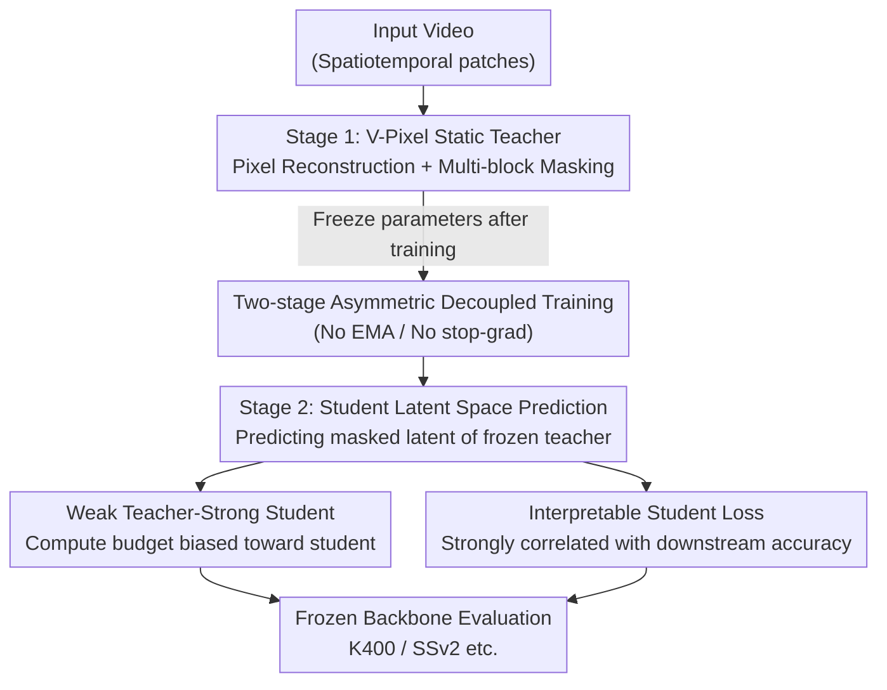

# Rethinking JEPA: Compute-Efficient Video Self-Supervised Learning with Frozen Teachers

**Conference**: ICLR 2026  
**OpenReview**: [https://openreview.net/forum?id=3cB9243E9i](https://openreview.net/forum?id=3cB9243E9i)  
**Code**: TBD  
**Area**: Video Self-Supervised Representation Learning  
**Keywords**: Video Self-Supervised, JEPA, Masked Latent Prediction, Frozen Teacher, Compute Efficiency

## TL;DR
This paper replaces the "online EMA teacher" in V-JEPA with a "static teacher" that is pre-trained via pixel reconstruction and subsequently frozen. This results in SALT, a simplified two-stage framework that requires no anti-collapse regularization. SALT outperforms V-JEPA 2 in frozen backbone evaluations while saving compute, and unexpectedly reveals that a small, "weak" teacher can effectively supervise a very strong student.

## Background & Motivation
**Background**: In video self-supervised representation learning, the JEPA series (I-JEPA / V-JEPA / V-JEPA 2) is a dominant paradigm. It involves a context (student) encoder plus a predictor that predicts the latent representations of masked regions provided by a target (teacher) encoder. To prevent representations from collapsing into trivial solutions, these methods adopt self-distillation techniques from BYOL—applying stop-gradient to the teacher and updating it via an Exponential Moving Average (EMA) of student weights.

**Limitations of Prior Work**: The "online dynamic teacher + EMA" mechanism introduces three specific issues. First, teacher-student representations **co-evolve**, creating a collapse solution where loss approaches zero; this must be avoided using delicate hyperparameters like EMA schedules and stop-gradients. Second, the training loss itself is **uninformative** because the target is dynamic; a low loss does not guarantee better representations, forcing practitioners to rely on proxy metrics like RankMe to select checkpoints. Third, the teacher and student architectures are tied by the EMA update, requiring them to be **isomorphic and identical in size**, preventing the use of small teachers to train larger students.

**Key Challenge**: The root cause is the "dynamic teacher" design—it must provide supervision while being prevented from collapsing with the student, necessitating complex implicit regularization and proxy metrics. The core question is: are high-quality prediction targets truly dependent on an online, co-evolving teacher?

**Goal**: To verify that "dynamic teachers are actually redundant" by replacing them with a **pre-trained and subsequently frozen** static teacher. This removes the need for EMA and stop-gradient, making the training process transparent, scalable, and compute-efficient.

**Key Insight**: Stable and high-quality prediction targets can be provided by a fixed encoder, provided it is trained on a target that is **inherently immune to collapse** (pixel reconstruction). Once the teacher is frozen, the student's latent space prediction simplifies into an **ordinary supervised regression**, which is naturally immune to collapse.

**Core Idea**: Decouple self-distillation into two independent stages, each with a "proper loss" function: first train the teacher using pixel reconstruction, then freeze it and train the student using the JEPA objective. This is termed SALT (Static-teacher Asymmetric Latent Training).

## Method

### Overall Architecture
SALT aims to obtain stable, high-quality targets for student training without EMA or anti-collapse mechanisms. It **decouples the entangled teacher-student training** of V-JEPA into two independent stages: Stage 1 trains the teacher independently via pixel reconstruction, and Stage 2 freezes the teacher's parameters, training only the student and predictor to predict the teacher's latent representations in masked regions. The pipeline consists of two losses that converge independently, without stop-gradients or EMA scheduling.

Overall, input videos are divided into spatiotemporal patches. Stage 1 produces a fixed teacher encoder. Stage 2 trains the student encoder and predictor under its supervision. Finally, the student backbone is frozen, and an attentive classification head is attached for evaluation on video/image benchmarks. SALT’s core contributions—two-stage decoupling, V-Pixel teacher, latent space prediction, and the "weak teacher" compute allocation—are reflected in the nodes above.

### Key Designs

**1. Two-stage Asymmetric Decoupled Training: Decoupling self-distillation into non-collapsing losses**

V-JEPA couples teacher and student training in an online loop, requiring EMA and stop-gradients. SALT splits this into two sequences: Stage 1 optimizes the teacher's pixel reconstruction objective, and Stage 2 freezes the teacher to optimize the student. Crucially, both losses are **structurally incapable of collapse**: pixel reconstruction targets real pixels (external fixed signals), and latent prediction targets a frozen teacher (also an external fixed signal). This eliminates the need for EMA scheduling and momentum hyperparameters, significantly reducing implementation complexity. This "asymmetry" also allows the teacher and student to be **completely decoupled** in terms of architecture, size, and training data.

**2. V-Pixel Static Teacher: Pixel reconstruction with multi-block masking**

The method used for the teacher in Stage 1 is named V-Pixel. The objective is pixel reconstruction (identical to VideoMAE), but the masking strategy is changed to V-JEPA 2's **multi-block masking** (short-range and long-range multi-block occlusion) instead of the random-tube masking used in VideoMAE. This addresses the concern that a frozen teacher might limit the student's potential. Ablations show that multi-block masking yields a teacher accuracy of 72.5%, significantly higher than random-tube (70.7%/69.0%) or causal masking (49.5%). More importantly, students supervised by multi-block teachers also perform best (77.4%). The finding that "VideoMAE-style reconstruction with multi-block masking works best" is a novel empirical discovery.

**3. Student Latent Space Prediction and Interpretable Training Loss**

In Stage 2, the student follows the JEPA latent space prediction objective, but with a frozen teacher $\bar f$. The optimization objective becomes:

$$\min_{\theta,\phi}\ \mathbb{E}_{x,y}\ \big\lVert\, g_\phi(f_\theta(x),\delta_y) - \bar f(y)\,\big\rVert_1$$

where $x,y$ are non-overlapping input regions, $f_\theta$ is the student encoder, $g_\phi$ is the predictor, and $\delta_y$ marks the masked spatiotemporal location. There is no stop-gradient operator as the teacher is already non-trainable. A useful byproduct is that **the student's training loss directly reflects representation quality**. The student loss is nearly linearly correlated with downstream SSv2 accuracy, with an $R^2$ of 0.951. This allows model selection based on the loss itself, moving away from proxy metrics like RankMe.

**4. Weak Teacher-Strong Student Effect and Compute Budget Allocation**

With teacher-student decoupling, a new question arises: how to allocate steps under a fixed total compute budget? Systemic ablation yields a counter-intuitive conclusion: **compute should be overwhelmingly allocated to the student**. Evidence includes: (1) The best ViT-L student (77.4%) came from a ViT-L teacher, outperforming those from larger ViT-H/ViT-G teachers; (2) In fixed-step experiments, the best student from 240k total steps required a teacher trained for only **40k steps**; (3) Teacher-side metrics (loss/RankMe) do **not** predict student performance. This discovery shifts the compute priority entirely to the student.

### Loss & Training
Stage 1 uses a VideoMAE-style $\ell_1$ loss for pixel reconstruction with multi-block masking. Stage 2 uses the latent space $\ell_1$ prediction loss described above. The backbone is a standard ViT (L/H/g/G) with RoPE, trained using AdamW with a batch size of 3072. For fair comparison, the total steps (Stage 1 + Stage 2) for SALT are kept equal to the V-JEPA 2 baseline. Training data is V-3.6M (a 3.6 million video subset of K710 + SSv2 + Panda70M).

## Key Experimental Results

### Main Results
Under frozen backbone evaluation, SALT outperforms all baselines on the motion-heavy SSv2 benchmark and leads V-JEPA 2 on the appearance-focused K400:

| Method | Params | Data | SSv2 | K400 | Total Compute (Rel.) |
|--------|--------|------|------|------|------|
| V-JEPA 2 ViT-L | 300M | V-3.6M | 68.2 | 83.8 | 1.4 |
| V-JEPA 2 ViT-H | 600M | V-3.6M | 73.4 | 84.6 | 2.6 |
| **SALT ViT-L** | 300M | V-3.6M | **74.9** | **85.4** | 1.2 |
| **SALT ViT-H** | 600M | V-3.6M | **75.4** | **86.0** | 1.5 |
| **SALT ViT-g** | 1B | V-3.6M | **76.2** | **86.8** | 1.9 |
| **SALT ViT-G** | 2B | V-3.6M | **76.1** | **87.2** | 2.6 |

Using the same V-3.6M data, 224×224 resolution, and 240k total steps, SALT's ViT-L outperforms V-JEPA 2 by **2.3%** on average across six benchmarks. Its accuracy-FLOPs scaling curves dominate the V-JEPA 2 Pareto front at all compute budgets.

### Ablation Study

| Configuration | Key Metric | Description |
|------|---------|------|
| Teacher Masking: multi-block | Student 77.4% | Best; setting used for V-Pixel |
| Teacher Masking: 2× random tube | Student 76.9% | Slightly worse |
| Teacher Masking: causal mask | Teacher 49.5% | Significant collapse |
| Teacher Size: ViT-L | ViT-L Student 77.4% | Same-size teacher works best |
| Teacher Size: ViT-H/G | ViT-L Student 77.3/77.6% | No extra gain from larger teachers |
| Compute Allocation: 40k T + 200k S | Best at 240k total | Weak teacher + strong student |
| Teacher Data: K710 / SSv2 / V-3.6M | Students ≥ V-JEPA 2 | Robust to teacher domain |

### Key Findings
- **Student loss serves as a model selection signal**: $R^2 = 0.951$ with downstream accuracy, whereas teacher loss and RankMe fail to predict performance.
- **Weak teacher is sufficient**: Small and "suboptimal" teachers can produce SOTA-level students; using the strongest possible pre-trained encoder provides only marginal gains.
- **Compute belongs to the student**: Under a fixed budget, allocating the vast majority of steps to the student while training the teacher briefly is optimal.
- Students almost always outperform teachers of the same or smaller size, demonstrating a clear "bootstrapping" phenomenon.

## Highlights & Insights
- **Turning "anti-collapse" from a mechanism into a structural property**: Instead of using EMA to carefully avoid collapse, SALT decouples training into two sub-problems with fixed targets that are naturally immune to collapse—a more robust solution than hyperparameter tuning.
- **Frozen targets make loss readable again**: A long-standing pain point in JEPA is the uninformative loss. SALT makes the loss strongly correlated with downstream accuracy simply by freezing the teacher, eliminating the need for proxy metrics.
- **The "weak teacher-strong student" effect is counter-intuitive and practical**: It shifts compute priority away from the teacher and suggests a "small model/few steps" budget for teachers, applicable to any distillation-based SSL pipeline.
- Teacher-student decoupling enables "small teachers teaching large students," which is impossible under the isomorphism constraints of EMA.

## Limitations & Future Work
- The paper is primarily empirical; the theoretical explanation for "why a weak teacher suffices" remains light, focusing instead on observed phenomena.
- The teacher must be pre-trained separately (though cheaply), adding a step compared to end-to-end methods; the total compute advantage depends on the empirical conclusion that the teacher can be trained briefly.
- Evaluations focus on frozen backbone + attentive probing; the superiority of static teachers under full fine-tuning and their generalization to non-video modalities require further validation.

## Related Work & Insights
- **vs V-JEPA / V-JEPA 2**: These use online/momentum EMA teachers which require stop-gradients and yield unreadable losses; SALT uses frozen teachers, removes EMA, provides readable losses, allows architecture heterogeneity, and outperforms them on frozen evaluations.
- **vs VideoMAE**: Both use pixel reconstruction for the teacher, but VideoMAE uses random-tube masking, whereas SALT’s V-Pixel uses multi-block masking and finds it superior.
- **vs MVD / UnMasked Teacher / VideoPrism**: These typically assume the need for a very strong pre-trained teacher and often require student fine-tuning for effects to show; SALT reveals the opposite "weak teacher, strong student" effect under fair comparisons.

## Rating
- Novelty: ⭐⭐⭐⭐ Not entirely new components, but the systematic demonstration of "frozen teacher + weak teacher/strong student" overturns common JEPA assumptions.
- Experimental Thoroughness: ⭐⭐⭐⭐⭐ Comprehensive benchmarks, multi-scale models, and full ablations on data/masking/size/compute.
- Writing Quality: ⭐⭐⭐⭐ Clear motivation and actionable conclusions; some figure details reside in the appendix.
- Value: ⭐⭐⭐⭐⭐ Provides a simpler, compute-efficient, and interpretable recipe for video SSL with direct budget allocation advice.

<!-- RELATED:START -->

## Related Papers

- [\[CVPR 2026\] VideoSSR: Video Self-Supervised Reinforcement Learning](../../CVPR2026/self_supervised/videossr_video_self-supervised_reinforcement_learning.md)
- [\[ICLR 2026\] On the Alignment Between Supervised and Self-Supervised Contrastive Learning](on_the_alignment_between_supervised_and_self-supervised_contrastive_learning.md)
- [\[ICLR 2026\] Understanding the Learning Phases in Self-Supervised Learning via Critical Periods](understanding_the_learning_phases_in_self-supervised_learning_via_critical_perio.md)
- [\[ICLR 2026\] Soft Equivariance Regularization for Invariant Self-Supervised Learning](soft_equivariance_regularization_for_invariant_self-supervised_learning.md)
- [\[ICLR 2026\] Equivariant Splitting: Self-supervised learning from incomplete data](equivariant_splitting_self-supervised_learning_from_incomplete_data.md)

<!-- RELATED:END -->
