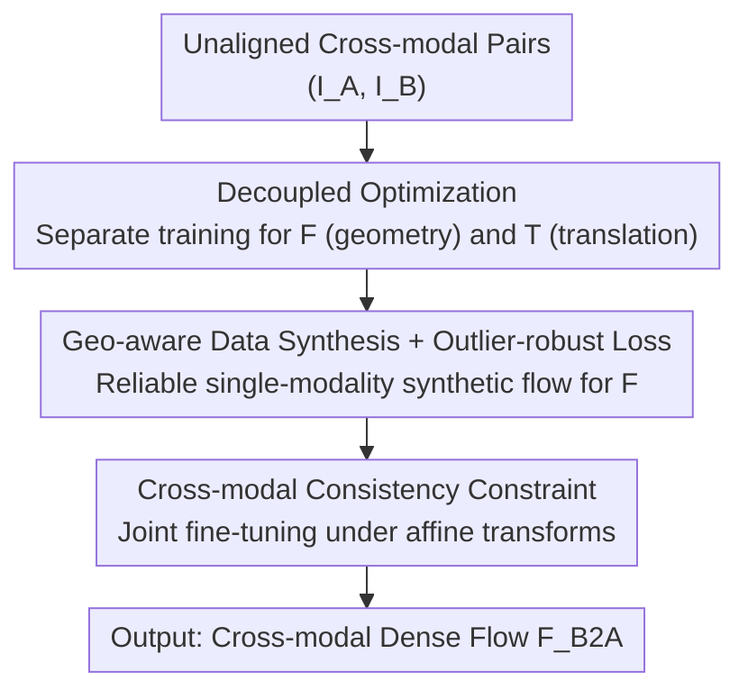

# Rethinking Unsupervised Cross-Modal Flow Estimation: Learning from Decoupled Optimization and Consistency Constraint

**Conference**: ICLR 2026  
**OpenReview**: [https://openreview.net/forum?id=7kZQsiy36f](https://openreview.net/forum?id=7kZQsiy36f)  
**Code**: https://github.com/RM-Zhang/DCFlow  
**Area**: Self-Supervised Learning / Cross-Modal Optical Flow Estimation  
**Keywords**: Cross-modal optical flow, self-supervised, decoupled optimization, data synthesis, consistency constraint

## TL;DR
DCFlow shifts unsupervised cross-modal optical flow estimation from "implicit learning via appearance similarity" to "decoupled optimization + explicit motion supervision." By utilizing geo-aware single-image data synthesis, it generates reliable synthetic flow labels for the flow network, allowing the modality translation and flow networks to train on their respective sub-tasks independently. These are then jointly fine-tuned using cross-modal consistency constraints, significantly reducing EPE across five real-world datasets and achieving state-of-the-art (SOTA) performance among unsupervised methods.

## Background & Motivation
**Background**: Cross-modal optical flow estimation aims to establish pixel-wise correspondence between image pairs from different imaging modalities (e.g., RGB / Near-Infrared NIR / Thermal T). It serves as a fundamental capability for multi-modal fusion, image restoration, and depth estimation. Since ground-truth (GT) flow for real-world cross-modal scenes is nearly impossible to obtain, the mainstream approach is unsupervised, typically using a "Modality Translation Network $\mathcal{T}$ + Flow Network $\mathcal{F}$" structure: translating modality A to the appearance of modality B before estimating flow within the same modality.

**Limitations of Prior Work**: Whether through joint optimization (e.g., NeMAR) or two-stage frameworks (e.g., UMF-CMGR), these methods essentially rely on a photometric loss $L_{ph}$ to minimize the appearance difference between the warped image and the target image. This paradigm of "implicit flow learning based only on appearance alignment" suffers from severe ambiguity in weak-texture or repetitive-structure regions and collapses during large viewpoint changes due to the lack of direct motion supervision—a pure appearance baseline on MS2 (RGB-T) results in an EPE as high as 21.23 and an F1 near 100%.

**Key Challenge**: Cross-modal alignment entangles two distinct challenges: **modality discrepancy** (differing appearances) and **geometric misalignment** (pixel displacement). Optimizing both within a single appearance loss prevents the flow network from receiving direct signals regarding "motion," forcing it to rely on appearance as an indirect proxy.

**Goal**: How to introduce reliable motion supervision for the flow network using only unaligned cross-modal image pairs?

**Key Insight**: The authors noted mature practices in the single-modality domain for "geo-aware motion label synthesis from a single image" (via depth and virtual viewpoint reprojection). By **decoupling** the cross-modal task into "modality translation" and "single-modality flow estimation," the flow network can be trained using synthetic flow supervision from a single modality while still serving the ultimate goal of cross-modal alignment.

**Core Idea**: Replace the "single appearance loss" with "decoupled optimization + explicit synthetic flow supervision + cross-modal consistency constraint" to divide and conquer modality discrepancy and geometric misalignment.

## Method

### Overall Architecture
DCFlow is a self-supervised training framework **agnostic to the specific flow network**. The goal is to train $\mathcal{N}(I_A, I_B) = \mathcal{F}_\theta(\mathcal{T}_\phi(I_A), I_B)$ to predict the dense flow $F_{B2A}$ from $I_B$ to $I_A$, where $\mathcal{T}_\phi$ translates $I_A$ to the appearance of modality B, and $\mathcal{F}_\theta$ estimates flow. The pipeline requires only unaligned cross-modal pairs and no real flow labels.

The training involves three components: first, **geo-aware data synthesis** creates "new-view images + dense synthetic flow" from single images for direct motion supervision; second, a **decoupled optimization strategy** allows $\mathcal{F}_\theta$ (learning geometry via synthetic flow) and $\mathcal{T}_\phi$ (learning translation via perceptual loss) to train on task-specific supervision; finally, **cross-modal consistency constraints** jointly fine-tune the networks by enforcing geometric consistency under affine transformations. All losses are optimized in a single gradient descent step but only affect their respective parameters.

### Key Designs

**1. Decoupled Optimization: Separating Modality Discrepancy and Geometric Misalignment**

To address the entanglement in appearance loss, DCFlow splits the task into modality translation and single-modality flow estimation paths. While training the flow network $\mathcal{F}_\theta$, $\mathcal{T}_\phi$ is frozen, and **dual-branch single-modality synthetic data** is used for supervision. Two training triplets $(I_A, I'_A, F_{A,S})$ and $(I_B, I'_B, F_{B,S})$ are constructed (where $I'$ is a synthetic new view and $F_S$ is synthetic flow). The loss is the L1 distance between predicted and synthetic flow:

$$\arg\min_\theta \big(L_F(F_A, F_{A,S}) + L_F(F_B, F_{B,S})\big)$$

where $F_A = \mathcal{F}_\theta(\mathcal{T}_\phi(I'_A), \mathcal{T}_\phi(I_A))$ and $F_B = \mathcal{F}_\theta(I'_B, I_B)$. Training both domains improves generalization. For $\mathcal{T}_\phi$, $\mathcal{F}_\theta$ is frozen, and the translated image is warped: $I^w_{A,T}=W(I_{A,T}, F_{B2A})$. A **perceptual loss** (weighted L2 of VGG features) aligns $I^w_{A,T}$ with $I_B$. Perceptual loss is preferred over pixel-wise L1 as it captures high-level structure and is more tolerant of spatial misalignment. This step alone reduces EPE on MS2 (RGB-T) from 21.23 to 5.80.

**2. Geo-aware Data Synthesis and Outlier-robust Loss: Generating Reliable Dense Flow Supervision**

To generate reliable supervision from a single image $I$, a pre-trained monocular depth model (e.g., UniDepth) estimates depth $D$. Each 2D pixel $x$ is back-projected to 3D space $X$ using sampled intrinsics $K$, then re-projected to a new viewpoint $x'$ using a sampled camera pose $T\in SE(3)$. The synthetic flow $F_S$ is the displacement between $x$ and $x'$.

To handle synthesis noise, two filters are used: **photometric consistency check** (masking occluded/invisible pixels $M$) and an **outlier-robust loss** that discards the top $\tau\%$ pixels with the largest L1 residuals (typically fine structures or distorted boundaries). The loss is computed only on the valid set $\Omega_\tau$:

$$L_F = \frac{1}{|\Omega_\tau|}\sum_{x\in\Omega_\tau}\|F(x)-F_S(x)\|_1$$

This focuses supervision on pixels with reliable motion and appearance. Synthesis is robust to depth quality; even with added noise, performance remains stable as the warped image and synthetic flow share the same depth values.

**3. Cross-modal Consistency Constraint: Joint Fine-tuning on Cross-modal Tasks**

Decoupled optimization ensures convergence but does not explicitly teach "cross-modal" flow. Given a cross-modal pair $(I_A, I_B)$ and prediction $F_{B2A}$, **random affine transformations** are applied to create $(\tilde I_A, \tilde I_B)$. A theoretical transformed flow $\tilde F^*_{B2A}$ is derived. The networks are jointly optimized to minimize:

$$\arg\min_{\phi,\theta} L_F(\tilde F_{B2A}, \tilde F^*_{B2A})$$

This self-supervised constraint forces the translation and flow networks to adapt to each other for cross-modal correspondence. It further reduces MS2 (RGB-T) EPE from 4.81 to 3.46 and is introduced after 10,000 training steps to ensure initial flow stability.

### Loss & Training
The total training objective is:

$$\arg\min_{\phi,\theta} L_F(F_A, F_{A,S}) + L_F(F_B, F_{B,S}) + \lambda_T L_T(I^w_{A,T}, I_B) + \lambda_C L_F(\tilde F_{B2A}, \tilde F^*_{B2A})$$

Hyperparameters: $\lambda_T=2.0$, $\lambda_C=0.05$, training for 30k steps with batch size 4. $\mathcal{F}_\theta$ defaults to RAFT, and $\mathcal{T}_\phi$ uses a U-Net. The translation direction is selected as "information-rich $\rightarrow$ sparse" (e.g., RGB $\rightarrow$ Thermal).

## Key Experimental Results

### Main Results
On MS2, VTD, and RNS datasets, Ours outperforms all unsupervised and pre-trained methods:

| Dataset | Metric | DCFlow (Ours) | MINIMA (Pre-trained) | NeMAR (Unsupervised) | Gain vs MINIMA |
|--------|------|--------|----------------|---------------|------------------|
| MS2 (RGB-T) | EPE | 3.46 | 5.97 | 19.25 | 42.0% |
| MS2 (NIR-T) | EPE | 4.53 | 7.10 | 28.41 | 36.2% |
| MS2 (RGB-NIR) | EPE | 0.96 | 5.44 | 11.39 | 82.4% |
| VTD (RGB-T) | EPE | 3.65 | 6.34 | 23.43 | 42.4% |
| RNS (RGB-NIR) | EPE | 1.90 | 2.34 | 25.11 | 18.8% |

Ours approaches the performance of supervised methods (e.g., RAFT EPE 1.70 on MS2) without using any cross-modal ground truth.

### Ablation Study
(Results on MS2 RGB-T):

| Configuration | EPE | F1 | Description |
|------|-----|----|------|
| Appearance Baseline | 21.23 | 98.45 | Photometric loss only |
| + Decoupled Opt. | 5.80 | 57.18 | Direct motion supervision |
| + Outlier-robust | 4.81 | 51.39 | Filtering noisy supervision |
| + Consistency Const.| 3.46 | 35.89 | Full model |

Synthesis strategies: 2D transforms (EPE 13.12), 3D Gaussian Splatting (5.11), Geo-aware Synthesis (3.46).

### Key Findings
- **Decoupled optimization is a fundamental breakthrough**: Reducing EPE from 21.23 to 5.80 proves that direct motion signals are significantly more effective than indirect appearance alignment.
- **Consistency constraint provides the highest marginal gain**: Improving EPE from 4.81 to 3.46 by explicitly enforcing cross-modal correspondence.
- **Robustness to depth quality**: Performance remains high even with degraded depth maps, as depth acts only as a self-consistent intermediate variable.
- **Network Agnostic**: Replacing RAFT with GMA or FlowFormer yields similar improvements.

## Highlights & Insights
- **Decoupling treats modality and geometry separately**: Perceptual loss handles modality while synthetic flow handles geometry. This "divide-and-conquer" approach is applicable to any cross-domain task where appearance and geometry are entangled.
- **Self-consistent supervision**: Using the same depth for warping and flow synthesis ensures the labels are internally consistent, making the framework robust to depth estimation bias.
- **Agnostic Framework**: The method provides a general self-supervised recipe for cross-modal tasks without requiring domain-specific ground truth or multi-view data.

## Limitations & Future Work
- **Sparse GT for Evaluation**: Evaluation relies on sparse LiDAR projections, which may not fully reflect dense alignment quality in weak-texture or large-displacement regions.
- **Dependency on Monocular Depth**: While robust, the framework still relies on the generalization of depth models to modalities like Thermal.
- **Manual Modality Direction**: The "information-rich to sparse" translation direction currently requires manual prior knowledge.

## Related Work & Insights
- **vs NeMAR / UMF-CMGR**: Previous unsupervised methods fail in large modal discrepancies because they lack explicit motion signals.
- **vs MINIMA**: Unlike large-scale synthetic pre-training, DCFlow learns directly from reality, reducing the domain gap and improving EPE by up to 82.4%.
- **vs Single-image synthesis**: While single-image motion labeling has been explored in single-modality contexts, DCFlow is the first to systematically apply it to cross-modal scenarios.

## Rating
- Novelty: ⭐⭐⭐⭐⭐ Paradigm shift from implicit to explicit cross-modal supervision.
- Experimental Thoroughness: ⭐⭐⭐⭐⭐ Extensive multi-modal testing and ablations.
- Writing Quality: ⭐⭐⭐⭐ Clear motivation and logical technical derivation.
- Value: ⭐⭐⭐⭐⭐ A general, network-agnostic framework with high practical utility.

<!-- RELATED:START -->

## Related Papers

- [\[ECCV 2024\] SCPNet: Unsupervised Cross-modal Homography Estimation via Intra-modal Self-supervised Learning](../../ECCV2024/self_supervised/scpnet_unsupervised_cross-modal_homography_estimation_via_intra-modal_self-super.md)
- [\[ICLR 2026\] PredNext: Explicit Cross-View Temporal Prediction for Unsupervised Learning in Spiking Neural Networks](prednext_explicit_cross-view_temporal_prediction_for_unsupervised_learning_in_sp.md)
- [\[ICLR 2026\] XIL: Cross-Expanding Incremental Learning](xil_cross-expanding_incremental_learning.md)
- [\[ICLR 2026\] Unsupervised Representation Learning - An Invariant Risk Minimization Perspective](unsupervised_representation_learning_-_an_invariant_risk_minimization_perspectiv.md)
- [\[ICLR 2026\] Rethinking JEPA: Compute-Efficient Video Self-Supervised Learning with Frozen Teachers](rethinking_jepa_computeefficient_video_self-supervised_learning_with_frozen_teac.md)

<!-- RELATED:END -->
