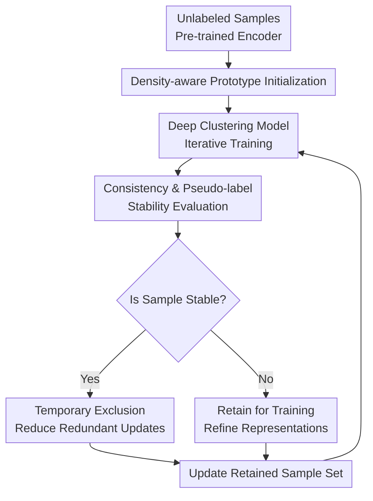

# Samples Are Not Equal: A Sample Selection Approach for Deep Clustering

**Conference**: ICLR2026  
**OpenReview**: [https://openreview.net/forum?id=SpsmpVo349](https://openreview.net/forum?id=SpsmpVo349)  
**Paper**: [OpenReview](https://openreview.net/forum?id=SpsmpVo349)  
**Code**: https://github.com/notoaudrey/Samples-Are-Not-Equal  
**Area**: Self-Supervised Learning / Deep Clustering  
**Keywords**: Deep Clustering, Sample Selection, Density-aware Initialization, Pseudo-label Stability, Training Efficiency

## TL;DR

This paper argues that deep clustering over-learns simple and redundant samples in high-density regions. It proposes a plug-and-play sample selection component: using local density to re-estimate clustering prototypes during initialization, and dynamically removing learned samples during training based on prediction consistency and pseudo-label stability. This approach simultaneously improves clustering accuracy and training efficiency across various deep clustering baselines.

## Background & Motivation

**Background**: Deep clustering typically employs self-supervised pre-trained encoders to obtain high-quality visual representations, then assigns unlabeled samples to semantic clusters via clustering heads, self-training, self-labeling, or contrastive learning. Recent methods like SCAN, CC, TCL, and CDC have achieved high accuracy on CIFAR, STL, and ImageNet subsets. A common consensus is that neighboring samples in the pre-trained feature space share semantics, which can be used to construct unsupervised signals via pseudo-labels, neighbor consistency, or prototypes.

**Limitations of Prior Work**: While these methods design more stable pseudo-labels or better clustering heads, most assume that every sample holds equal training value. This paper observes that the feature space is not uniformly distributed: many samples crowd into high-density regions, representing the most typical, easy, and redundant patterns of a category; low-to-medium density regions contain fewer samples but capture more perspectives, appearances, local details, and long-tail variations. If all samples are used equally, the model is easily driven by redundant patterns in high-density areas.

**Key Challenge**: Deep clustering requires stable pseudo-supervision signals without relying solely on the easiest samples to cluster. High-density samples facilitate rapid convergence but dominate the clustering head initialization and subsequent gradient updates due to their large numbers. Low-density samples better expand category boundaries and representation diversity but are naturally disadvantaged in training resource allocation. The paper characterizes this as overfitting to simple, redundant feature patterns.

**Goal**: The authors aim to solve two sub-problems. First, during clustering head initialization, how to prevent initial prototypes from being biased by the average characteristics of high-density samples. Second, during iterative training, how to identify samples that the model has reliably learned and reallocate training focus to those that remain unstable or under-learned.

**Key Insight**: Starting from the observation that "samples are not equal," sample selection is not treated as selecting hard examples based on loss (as in supervised learning). Instead, metrics are designed based on the unlabeled conditions of deep clustering. Local density in the feature space is used during initialization to reveal redundancy. During training, prediction consistency under weak and strong augmentations, along with pseudo-label stability across epochs, are used as these signals reflect the model's confidence without requiring ground-truth labels.

**Core Idea**: Replace the uniform treatment of samples with "density-aware prototype initialization + learning-state-driven dynamic sample selection." This ensures deep clustering spends fewer resources repeatedly fitting simple, mastered samples and focuses more on complex, diverse, and under-learned ones.

## Method

### Overall Architecture

This paper proposes an enhancement component rather than an entirely new clustering backbone. The process is divided into two phases: before training, all pre-trained features are extracted to obtain initial clusters via K-Means, which are then weighted by local density to re-estimate unbiased prototypes. During training, the model tracks prediction consistency under weak and strong augmentations for each sample, alongside pseudo-label changes over recent rounds, to temporarily exclude stable samples from the gradient update set.

This design decomposes "sample value" into two timescales: static local density corrects the initial prototypes, while dynamic learning states determine the distribution of subsequent training resources.

### Key Designs

**1. Density-aware Prototype Initialization: Giving Low-density Complex Samples a Voice**

Many methods initialize clustering heads randomly or via simple prototype initialization on pre-trained features (like CDC). While the latter is more stable, directly averaging all features in a cluster causes high-density typical samples to dominate the prototype position. Consequently, the prototype represents the "most common" center rather than one covering the cluster's diverse patterns.

The authors estimate local density within each cluster after initial K-Means. For sample $x_i$ with feature $z_i$, the $k$ nearest neighbors $z_i^{(j)}$ within the same cluster are found, and weights are constructed using the average neighbor distance: $w_i=\exp(\alpha \cdot \frac{1}{k}\sum_{j=1}^{k}\|z_i-z_i^{(j)}\|_2)$. Highly dense samples have small distances and lower weights, while low-density samples have larger distances and higher weights. The prototype $c_j$ for cluster $C_j$ is then calculated as a density-weighted average: $c_j=\frac{\sum_{z_i\in C_j}w_i z_i}{\sum_{z_i\in C_j}w_i}$.

**2. Second-order Difference of Prediction Consistency: Using Learning State to Decide Sample Retention**

To avoid the cost of repeated neighbor searches and the risk of deleting informative samples based solely on high-dimensional density, the training phase switches to evaluating the "mastery" of a sample. For each sample $x_i$, the model generates a weak augmentation $x_i^w$ and a strong augmentation $x_i^s$, obtaining prediction distributions $P_i^w$ and $P_i^s$. Consistency is defined as $S_i=\cos(P_i^w,P_i^s)$.

Since high consistency in a single round could be accidental, the paper tracks changes over the last three epochs using the second-order difference $\Delta^2S_i^{(t)}=S_i^{(t)}-2S_i^{(t-1)}+S_i^{(t-2)}$. When $|\Delta^2S_i^{(t)}|<\epsilon$, the consistency curve is no longer fluctuating wildly, indicating the model's judgment has stabilized.

**3. Pseudo-label Stability Constraint: Avoiding Accidental Consistency in Error**

To mitigate the risk of incorrect stable predictions, pseudo-label stability is used as a second necessary condition. A sample is only judged stable if its assigned cluster has remained consistent over the last three epochs while satisfying the consistency acceleration threshold.

The final dynamic sample selection temporarily excludes samples in the stable set $D_s$ from the update set $D_t=D_u-D_s$, reducing redundant updates. Samples with fluctuating consistency or changing pseudo-labels remain in the training queue.

**4. Plug-and-play Integration**

The method is implemented as a plugin that hooks into two interfaces of existing deep clustering methods: initializing clustering head parameters and determining the training set for each epoch. It preserves the underlying encoder, clustering loss, and augmentation protocols, allowing combination with CC, TCL, SCAN, and CDC.

### Loss & Training

Ours does not replace the original clustering losses but acts as an outer training strategy. Training begins by loading a pre-trained encoder $f_\theta(\cdot)$, extracting features for K-Means, and initializing the clustering head $g_\phi(\cdot)$ with density-weighted prototypes. Within each epoch, predictions for weak and strong augmentations are computed to update $S_i$, $\Delta^2S_i$, and pseudo-label history, which then updates the training set $D_t$.

The image tasks use ResNet-34 backbones with MoCo-v2 pre-training. Hyperparameters include density sensitivity $\alpha=2.0$, number of neighbors $k=10$, and stability threshold $\epsilon=0.1$ (or $0.01$ for specific datasets).

## Key Experimental Results

### Main Results

Evaluations were conducted on CIFAR-10, CIFAR-20, STL-10, ImageNet-10, ImageNet-Dogs, and Tiny-ImageNet.

| Method | Avg. Performance | Representative Gain | Note |
|------|----------|------------|------|
| CC | 60.8 | - | Early contrastive baseline |
| CC + Ours | 66.9 | +6.1 | Largest improvement, aiding weaker baselines |
| TCL | 62.7 | - | Twin contrastive learning baseline |
| TCL + Ours | 68.0 | +5.3 | Stable gains across datasets |
| SCAN | 68.7 | - | Self-labeling/neighbor consistency method |
| SCAN + Ours | 71.0 | +2.3 | Best results on ImageNet-10 |
| CDC | 72.7 | - | Strong ICLR 2025 baseline |
| CDC + Ours | 73.8 | +1.1 | Gains even on strong baselines; best on 5 datasets |

Dynamic pruning provides an average training speedup of approximately $1.3\times$.

| Method | CIFAR-10 Pruning % | CIFAR-20 Pruning % | STL-10 Pruning % | Avg. Pruning / Speedup |
|------|----------------------|----------------------|-------------------|----------------------|
| CDC + Ours | 17.4% | 12.1% | 14.3% | 14.6% |
| SCAN + Ours | 37.7% | 52.9% | 29.9% | 40.2% |
| CC + Ours | 44.5% | 30.9% | 28.1% | 34.5% |
| Overall | - | - | - | ~ $1.3\times$ speed up |

### Ablation Study

DACHI denotes density-aware initialization; DSS denotes dynamic sample selection.

| Config | Avg. Metrics | Gain over Baseline | Note |
|------|----------|------------|------|
| CDC | 78.2 | - | Original strong baseline |
| CDC + DACHI | 78.7 | +0.5 | Improvements from initialization |
| CDC + DSS | 78.6 | +0.4 | Improvements from training selection |
| CDC + All | 78.9 | +0.7 | Complementary modules; best performance |
| SCAN | 73.0 | - | Original SCAN |
| SCAN + DACHI | 74.9 | +1.9 | High impact on SCAN initialization |
| SCAN + DSS | 73.9 | +0.9 | Improved training stability |
| SCAN + All | 75.3 | +2.3 | Full method represents best gain |

### Key Findings

- **Improvements Concentrate in Low-density Samples**: Comparisons show the method significantly boosts accuracy in low-density regions (e.g., STL-10 low-density ACC improved from 79.1% to 81.5% compared to CDC), supporting the hypothesis of mitigating redundant pattern overfitting.
- **Sensitivity of $\epsilon$**: A moderate threshold is necessary. At $\epsilon=0.5$ (nearly 50% pruning), performance drops, suggesting over-pruning removes valuable information.
- **DSS vs. Others**: DSS outperforms random pruning and loss-based pruning in unsupervised settings.
- **Parameter Robustness**: Performance is stable across $k \in [10, 50]$ and $\alpha \in [1, 3]$.

## Highlights & Insights

- The core value lies in clarifying the sample imbalance problem: high-density regions are not just more numerous but simpler and more redundant, creating bias in both prototypes and gradients.
- Density-aware initialization is a lightweight yet effective correction that fits naturally into existing clustering head workflows.
- The choice of DSS metrics is deliberate; by avoiding supervised signals (like standard loss), it accurately captures the model's internal confidence via consistency and pseudo-label stability.
- Second-order differences provide a more robust view of training dynamics than single-point consistency, reducing misjudgments from accidental alignment.

## Limitations & Future Work

- **Modality Expansion**: While supplemental experiments on non-image data (CNAE-9, etc.) were conducted, performance on LLM embeddings or multi-modal clusters requires more validation.
- **Re-inclusion Mechanics**: More transparency is needed regarding the history maintenance and sampling queue details during sample re-inclusion.
- **Outlier Risks**: In very noisy data, low density might indicate noise rather than value; despite parametric safeguards, this remains a potential risk.
- **Soft Weighting**: Future work could extend binary "exclude/retain" decisions into soft weighting to continuously distribute resources.

## Related Work & Insights

- **vs SCAN**: SCAN relies on neighbors and self-labeling; Ours improves SCAN's starting point and training set selection without changing its objective.
- **vs CC / TCL**: These methods focus on contrastive objectives; Ours is orthogonal, leading to significant gains on these platforms.
- **vs CDC**: CDC improved calibration via prototypes; Ours further refines this with density correction and dynamic selection.
- **Inspiration**: High-confidence samples in pseudo-label learning aren't always better; the more effective strategy is dynamically maintaining a pool of "learnable" samples rather than just increasing the high-confidence set size.

## Rating

- Novelty: ⭐⭐⭐⭐☆ Re-examines deep clustering through the lens of sample inequality; well-integrated concepts.
- Experimental Thoroughness: ⭐⭐⭐⭐⭐ Comprehensive coverage of benchmarks, baselines, and ablation analyzes.
- Writing Quality: ⭐⭐⭐⭐☆ Clear motivation and analysis, though implementation details of pruning could be more explicit.
- Value: ⭐⭐⭐⭐☆ Highly practical as a plugin for improving pseudo-label-based training tasks.

<!-- RELATED:START -->

[1] Van Gansbeke et al. "SCAN: Learning to Classify Images without Labels." ECCV 2020.  
[2] Li et al. "Contrastive Clustering." AAAI 2021.  
[3] Niu et al. "CDC: Clustering with Density-aware Calibration." ICLR 2025.

<!-- RELATED:END -->

## Related Papers

- [\[ICLR 2026\] Mini-cluster Guided Long-tailed Deep Clustering](mini-cluster_guided_long-tailed_deep_clustering.md)
- [\[ICML 2025\] Deep Learning is Not So Mysterious or Different](../../ICML2025/self_supervised/deep_learning_is_not_so_mysterious_or_different.md)
- [\[ICCV 2025\] To Label or Not to Label: PALM – A Predictive Model for Evaluating Sample Efficiency in Active Learning Models](../../ICCV2025/self_supervised/to_label_or_not_to_label_palm_-_a_predictive_model_for_evaluating_sample_efficie.md)
- [\[ICLR 2026\] Unified and Efficient Multi-view Clustering from Probabilistic Perspective](unified_and_efficient_multi-view_clustering_from_probabilistic_perspective.md)
- [\[ICLR 2026\] Chart Deep Research in LVLMs via Parallel Relative Policy Optimization](chart_deep_research_in_lvlms_via_parallel_relative_policy_optimization.md)

<!-- RELATED:END -->
