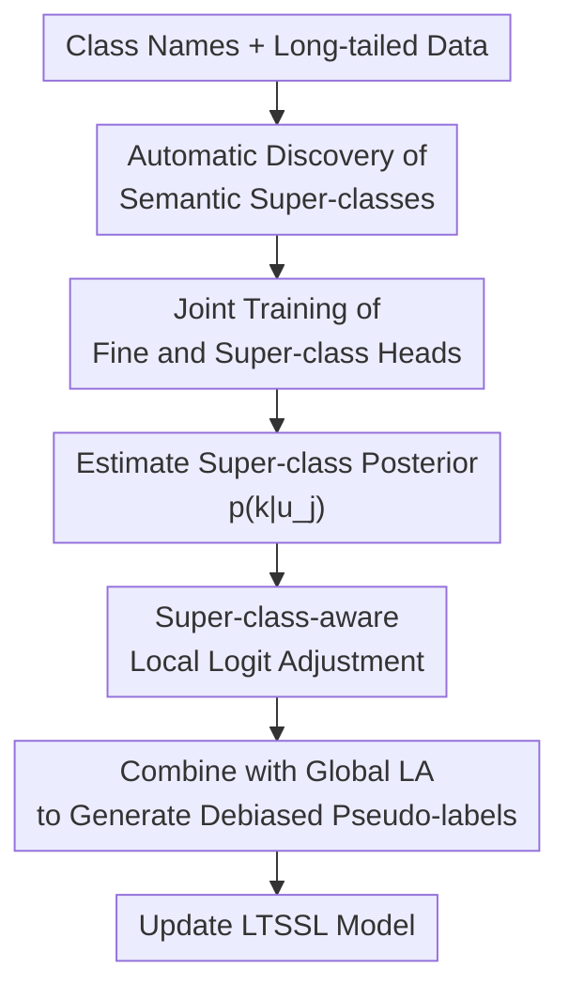

# SCAD: Super-Class-Aware Debiasing for Long-Tailed Semi-Supervised Learning

**Conference**: ICLR 2026  
**OpenReview**: [https://openreview.net/forum?id=aSCtAZEcRa](https://openreview.net/forum?id=aSCtAZEcRa)  
**Code**: https://github.com/aitrics-tom/SCAD  
**Area**: Long-Tailed Semi-Supervised Learning / Self-Supervised and Semi-Supervised Representation Learning  
**Keywords**: Long-Tailed Semi-Supervised Learning, Pseudo-label Debiasing, logit adjustment, super-class, Local Class Imbalance  

## TL;DR
SCAD identifies the issue of "local bias within semantically similar categories" in long-tailed semi-supervised learning. It utilizes automatically discovered super-class contexts to perform instance-level dynamic corrections for logit adjustment. SCAD consistently improves existing LTSSL methods on benchmarks such as CIFAR, STL, ImageNet-127, and Food101-LT.

## Background & Motivation
**Background**: Semi-supervised learning (SSL) typically trains models using a small amount of labeled data and a large volume of unlabeled data. Methods like FixMatch generate high-confidence pseudo-labels on weakly augmented views and enforce consistency on strongly augmented views. While this paradigm is effective for balanced distributions, real-world data is often long-tailed, where a few head classes have many samples while numerous tail classes have very few.

**Limitations of Prior Work**: In long-tailed semi-supervised learning (LTSSL), pseudo-labels themselves become biased. Early in training, the model is more likely to predict tail-class samples as belonging to similar head classes. These incorrect pseudo-labels then reinforce the bias, causing tail-class representations to be increasingly suppressed by their head-class neighbors. The dominant recent remedy is Logit Adjustment (LA), which applies a fixed correction for each category based on global class priors or estimated biases (e.g., ACR, CDMAD).

**Key Challenge**: The authors argue that the problem is not merely "global head classes versus tail classes." A more critical issue is local imbalance within semantically similar "super-classes." For instance, in CIFAR10-LT, both "automobile" and "truck" belong to the "vehicle" super-class and are visually similar; however, "automobile" may have significantly more samples than "truck." Standard LA only considers global frequency and is unaware of the local competitive environment (e.g., within "vehicle"), meaning its compensation for "truck" might not override the local dominance of "automobile."

**Goal**: This paper aims to solve three sub-problems: first, how to obtain usable super-classes without manual hierarchical annotations; second, how to enable the model to determine the super-class of an unlabeled sample during training; third, how to convert this coarse-grained context into dynamic adjustments for fine-grained logits to specifically handle local bias among semantic neighbors.

**Key Insight**: The authors observe that coarse-grained super-class classification is typically more robust than fine-grained classification because it involves fewer categories and the distribution becomes less long-tailed when subclasses are merged. Even if the model cannot yet distinguish between "truck" and "automobile," it is more likely to learn that the sample is a "vehicle" early on. This more reliable coarse signal can inform LA to prioritize handling local competition within the "vehicle" group rather than treating all classes uniformly.

**Core Idea**: SCAD automatically constructs super-classes based on text semantics and trains an auxiliary super-class classifier. For each unlabeled sample, it generates an instance-specific local logit adjustment term based on the super-class posterior. This term is superimposed onto standard LA to specifically suppress dominant head-class competitors within the same super-class.

## Method
SCAD is not a replacement for LTSSL frameworks like FixMatch, DASO, or ACR, but rather a "semantic local debiasing" module. It generates super-class mappings from class names, learns fine-grained and super-class classifiers simultaneously, and integrates global LA with super-class-aware adjustments during the pseudo-labeling stage.

### Overall Architecture
Input includes a long-tailed labeled set $D_l$, an unlabeled set $D_u$, a list of class names, and a plug-and-play LTSSL baseline. SCAD first divides $C$ fine-grained classes into $K$ super-classes using a text encoder and clustering to obtain the mapping $M(c)$. The model shares a feature extractor $f_\theta$ followed by two heads: a fine-grained classifier $g_c$ and a super-class classifier $g_s$. For an unlabeled sample $u_j$, $g_s$ outputs $p(k|u_j)$; this coarse-class probability weights the local adjustment vectors $\Delta_k$ for each super-class, which are combined with the standard LA term $-\log \pi$ to correct the fine-grained logits.

The primary contributions illustrated here are three-fold: automatic acquisition of super-class priors, joint training of a reliable coarse classifier, and local logit adjustment using super-class posteriors. The FixMatch-style weak/strong augmentation, consistency regularization, and threshold filtering serve as the base, while SCAD modifies how pseudo-label logits are calibrated before thresholding and training.

### Key Designs
**1. Automatic Discovery of Semantic Super-classes: Locating Local Competition via Cheap Hierarchical Priors**

Standard LA corrections are derived solely from global class frequencies, ignoring which classes actually compete for the same samples. SCAD passes class names through a pre-trained text encoder (e.g., CLIP text encoder, SBERT, GloVe, or text-embedding-ada-002) and performs agglomerative clustering on these vectors. This results in a deterministic mapping $M: \{1, \dots, C\} \rightarrow \{1, \dots, K\}$, defining the super-class for each fine-grained class.

The value of this step lies in providing a structural prior that is cheap, requires no manual taxonomy, and does not depend on extra visual pre-training. For CIFAR10-LT, "airplane," "automobile," "ship," and "truck" might be clustered into a vehicle-related super-class. This grouping captures "clusters of classes prone to mutual confusion," providing the scope for subsequent dynamic debiasing.

**2. Auxiliary Super-class Learning: Grounding Fine-grained Debiasing in Coarse Context**

SCAD adds a super-class head $g_s$ alongside the main head $g_c$, sharing the feature extractor $f_\theta$. For labeled samples, fine-grained labels $y_i$ are mapped to super-class labels via $M(y_i)$. For unlabeled samples, the super-class head employs consistency training similar to FixMatch, where coarse pseudo-labels from the weak augmentation view constrain the strong augmentation view.

The key design principle is that "coarse classification is easier to stabilize early." While tail-class samples are scarce at the fine-grained level, merging them into super-classes ($K \ll C$) increases the aggregate sample count per group and smooths the distribution. Analysis shows that super-class classification accuracy is more stable in early training stages, allowing $p(k|u_j) = \text{softmax}(\ell^s_j)_k$ to serve as a reliable signal of the sample's current semantic neighborhood.

**3. Super-class-aware Logit Adjustment: From Global Priors to Instance-level Local Correction**

Standard LA modifies logits as $\ell^{LA}_j = \ell^c_j - \log \pi$, where $\pi$ is the global class prior. SCAD retains this but pre-calculates a local adjustment vector $\Delta_k \in \mathbb{R}^C$ for each super-class $k$. Let $C_k = \{c \mid M(c) = k\}$, and estimate the count $n_{k,c}$ of each fine-grained class within that super-class using labeled data and high-confidence pseudo-labels. The dominance score is defined as: $\beta_{k,c} = n_{k,c} / \max_{c' \in C_k} n_{k,c'}$.

For classes within the current super-class, $\Delta_k$ utilizes the corresponding $\beta_{k,c}$; for classes outside the super-class, a maximum penalty is applied. Intuitively, if "automobile" is a local head and "truck" is a local tail within the "vehicle" group, $\Delta_{vehicle}$ imposes a larger penalty on "automobile" and a smaller one on "truck." The final correction is $\ell^{SCAD}_j = \ell^c_j - (\log \pi + \sum_{k=1}^K p(k|u_j) \Delta_k)$. Since $p(k|u_j)$ is the sample's own super-class posterior, the adjustment varies with the sample context.

**4. Plug-and-play Integration: Modifying Pseudo-labeling without Rewriting the Backbone**

SCAD's implementation is minimally invasive. If a base method already uses LA-style debiasing, SCAD expands the static correction into a combination of global and local terms. If the base does not use LA, SCAD can still be added as an auxiliary module. The authors successfully integrate SCAD with multiple methods, including FixMatch, DASO, ACR, SAW, ABC, CoSSL, and CDMAD, proving its versatility.

### Loss & Training
The primary semi-supervised loss follows the FixMatch format. For labeled batches $B_l$, it calculates supervised cross-entropy $L_s$. For unlabeled batches $B_u$, it generates pseudo-labels $\hat{y}_j$ from weakly augmented views; if the confidence exceeds threshold $\tau$, a consistency loss $L_u$ is calculated on strongly augmented views. The main task loss is $L = L_s + L_u$.

The super-class task constructs similar supervised and unsupervised components: labeled samples use $M(y_i)$ as coarse labels, and unlabeled samples use coarse pseudo-labels for consistency, resulting in $L_{super} = L^s_{super} + L^u_{super}$. The final training objective is $L_{total} = L + \lambda L_{super}$. Thresholds are typically set to $\tau = \tau_s = 0.95$ and the number of super-classes is set to $K = \lceil C/4 \rceil$.

## Key Experimental Results

### Main Results
The paper covers CIFAR10-LT, CIFAR100-LT, STL10-LT, ImageNet-127, and Food101-LT across different distribution settings (consistent, uniform, reverse).

| Dataset / Setting | Baseline | With SCAD | Gain | Description |
| :--- | :--- | :--- | :--- | :--- |
| CIFAR100-LT, $\gamma_l=\gamma_u=10$, $N_1=50$ | FixMatch + ACR 51.3 | 52.7 | +1.4 | Consistent LT, low labeled count |
| CIFAR100-LT, $\gamma_u=1$ (Uniform) | FixMatch + ACR 57.2 | 59.1 | +1.9 | Labeled LT, Unlabeled uniform |
| CIFAR100-LT, $\gamma_u=1/10$ (Reverse) | FixMatch + ACR 51.6 | 53.4 | +1.8 | Unlabeled distribution reversed |
| ImageNet-127 32x32 | ACR 57.2 | SCAD+ACR 60.5 | +3.3 | Large-scale 127-class LT |
| ImageNet-127 64x64 | ACR 63.6 | SCAD+ACR 67.0 | +3.4 | Higher resolution effectiveness |

### Ablation Study
Ablations show that gains come from the combination of coarse learning and local logit adjustments, rather than just the auxiliary head.

| Configuration | CIFAR10-LT | STL10-LT | Description |
| :--- | :--- | :--- | :--- |
| FixMatch | 67.8 | 56.1 | No long-tail handling |
| + Super-class learning | 69.2 | 69.0 | Coarse auxiliary task alone improves representations |
| + Logit Adjustment (LA) | 76.9 | 70.4 | Global prior correction significantly reduces bias |
| + SCAD | 78.7 | 71.3 | Adds instance-level local correction on top of LA |

### Key Findings
- **Minority Class Gains**: SCAD significantly improves performance on tail classes. It reduces the average confidence for confusing head classes while increasing it for tail classes within a super-class.
- **Robustness to Mismatch**: SCAD helps even when unlabeled data is uniform or reversed, supplementing methods like ACR/CDMAD that focus on global distribution estimation.
- **Reliable Coarse Signals**: Super-class accuracy is higher and less imbalanced than fine-grained accuracy, supporting the hypothesis of using coarse context to guide fine-grained correction.
- **Low Overhead**: Training time increase is negligible (e.g., from 35s to 36s per epoch for ACR), making it a practical addition.

## Highlights & Insights
- The paper advances the understanding of LTSSL bias from "global prior inaccuracy" to "unfair competition among local semantic neighbors."
- SCAD’s use of super-classes is pragmatic: it treats hierarchy as a functional scope for debiasing rather than seeking a perfect taxonomy.
- The dynamic correction $\sum_k p(k|u_j)\Delta_k$ allows samples to belong "softly" to multiple super-classes, which is more robust than hard-clustering.
- The plug-and-play design is a major strength, as it demonstrates gains across a wide variety of existing LTSSL pipelines.

## Limitations & Future Work
- The validation is currently limited to classification. Applications in more complex tasks like object detection or segmentation, where local imbalance and noise coexist, remain unexplored.
- The quality of super-classes could be a bottleneck in specialized domains (e.g., medical imaging or industrial defects) where class names lack common semantic embeddings.
- The dominance score $n_{k,c}$ depends on periodic estimates from high-confidence pseudo-labels, which might be skewed in extremely noisy scenarios.

## Related Work & Insights
- **vs Logit Adjustment (LA)**: LA is global and static; SCAD introduces instance-level super-class contexts to solve local imbalance.
- **vs ACR / CDMAD**: These methods improve global prior estimation. SCAD is complementary, focusing on the competition structure within super-classes.
- **vs DASO / CReST**: These methods focus on rebalancing or self-training strategies. SCAD serves as a local logit calibration module that fits into these training flows.

## Rating
- Novelty: ⭐⭐⭐⭐☆
- Experimental Thoroughness: ⭐⭐⭐⭐⭐
- Writing Quality: ⭐⭐⭐⭐☆
- Value: ⭐⭐⭐⭐⭐

<!-- RELATED:START -->

## Related Papers

- [\[ICLR 2026\] Learning Dynamics of Logits Debiasing for Long-Tailed Semi-Supervised Learning](learning_dynamics_of_logits_debiasing_for_long-tailed_semi-supervised_learning.md)
- [\[ICLR 2026\] CoLA: Co-Calibrated Logit Adjustment for Long-Tailed Semi-Supervised Learning](cola_co-calibrated_logit_adjustment_for_long-tailed_semi-supervised_learning.md)
- [\[ICLR 2026\] FedOpenMatch: Towards Semi-Supervised Federated Learning in Open-Set Environments](fedopenmatch_towards_semi-supervised_federated_learning_in_open-set_environments.md)
- [\[ICLR 2026\] Mini-cluster Guided Long-tailed Deep Clustering](mini-cluster_guided_long-tailed_deep_clustering.md)
- [\[ICLR 2026\] GUIDE: Gated Uncertainty-Informed Disentangled Experts for Long-tailed Recognition](guide_gated_uncertainty-informed_disentangled_experts_for_long-tailed_recognitio.md)

<!-- RELATED:END -->
