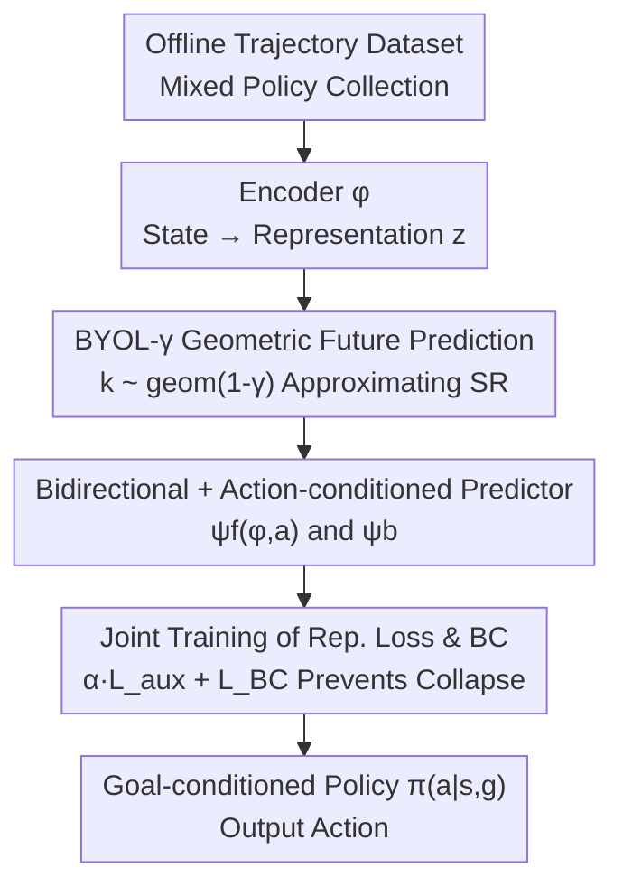

# Self-Predictive Representations for Combinatorial Generalization in Behavioral Cloning

**Conference**: ICLR 2026  
**OpenReview**: [https://openreview.net/forum?id=FkeURAdA0h](https://openreview.net/forum?id=FkeURAdA0h)  
**Paper**: [Project Page](https://self-pred-bc.github.io/)  
**Area**: Self-Supervised Representation Learning / Behavioral Cloning / Reinforcement Learning  
**Keywords**: Successor Representation, Self-Predictive Representation, BYOL, Combinatorial Generalization, Goal-Conditioned Behavioral Cloning  

## TL;DR
Addressing the combinatorial generalization deficit in Goal-Conditioned Behavioral Cloning (GCBC), which fails to "stitch" novel state-goal pairs, this paper proposes BYOL-$\gamma$: a self-predictive representation learning objective that samples future states using a geometric distribution to approximate the successor measure. As an auxiliary loss for BC, it requires neither TD learning nor negative samples, achieving average success rates across OGBench stitching tasks that surpass all baseline methods.

## Background & Motivation

**Background**: In robotics and decision-making, large-scale Behavioral Cloning (BC) has become a dominant paradigm—feeding massive offline demonstration data into supervised models to imitate behavioral data. Goal-Conditioned Behavioral Cloning (GCBC) further extends this by taking "current state + future goal" as input to learn $\pi_\Theta(a\,|\,s, g)$ via maximum likelihood.

**Limitations of Prior Work**: BC-based methods perform well on tasks within the training distribution but struggle with **combinatorial generalization**. This is formalized as the "stitching" capability—the dataset might contain trajectories $s_0 \to s_h$ and $s_b \to s_f$ intersecting at an intermediate point $w$, but no single trajectory covers $s_0 \to s_f$. A policy capable of stitching should be able to connect these sub-trajectories to reach $s_f$, which GCBC fails to do. Since robot data collection is expensive, relying on data scale to cover all combinations is impractical, necessitating algorithmic solutions.

**Key Challenge**: BC, by construction, **does not encode the inductive bias that "data comes from a Markov Decision Process (MDP)"**. In contrast, RL policies trained with Temporal Difference (TD) learning naturally possess stitching capabilities by propagating information through dynamic programming; however, offline TD learning suffers from instability due to bootstrapping and is difficult to scale. Thus, the problem becomes: can the temporal structure of the MDP be "injected" into the policy while maintaining the supervised scalability of BC?

**Key Insight**: The authors observe that the key to combinatorial generalization lies in the **long-range temporal consistency** of state representations. If states that are temporally related are encoded into nearby latent space representations, the out-of-distribution gap for novel state-goal pairs will shrink. Formally, for a goal $s_f \sim M^\beta(s_w, s_f)$ reachable from $s_w$, the desired representation should satisfy $\phi(s_f) \approx \phi(s_w)$. Consequently, a policy conditioned on $\phi(s_f)$ will first move to $s_w$ (in-distribution) before completing the remaining segment. This exactly corresponds to the "temporal distance between states" characterized by the **Successor Representation / Successor Measure (SR/SM)**.

**Core Idea**: Use a self-predictive representation that approximates the successor measure as an auxiliary loss for BC. Specifically, the BYOL (Bootstrap Your Own Latent) future prediction target is changed from the "next-step state" to a "future state sampled from a geometric distribution $k \sim \text{geom}(1-\gamma)$," resulting in BYOL-$\gamma$. Theoretically, it approximates the SR without relying on TD or negative samples.

## Method

### Overall Architecture

The objective is to equip GCBC policies with stitching/combinatorial generalization capabilities. The overall approach involves attaching a **self-predictive representation learning auxiliary loss** alongside standard BC training. This guides the encoder $\phi$ to learn state representations reflecting the environmental temporal structure (successor measure), which are then fed into the policy head for action prediction.

The pipeline: From an offline trajectory dataset (collected by a mixture of unknown policies $\{\beta_j\}$), a state $s_t$ is sampled and passed through encoder $\phi$ to obtain representation $z_t = \phi(s_t)$. Instead of predicting the next step, the predictor $\psi$ predicts the representation of a **future state sampled via a geometric distribution** $s_{t+k}$ (the BYOL-$\gamma$ objective), complemented by bidirectional prediction and action conditioning. This auxiliary loss is jointly optimized with the BC loss, which simultaneously constrains $\phi$ to prevent representation collapse. The final policy $\pi_\Theta(a\,|\,s,g) = \text{MLP}_\theta(\text{concat}(\phi(s), \phi(g)))$ outputs actions.

### Key Designs

**1. BYOL-$\gamma$: Approximating Successor Measure via Geometrically Sampled Future Prediction**

The limitation comes directly from standard BYOL: in RL, BYOL learns representations by predicting the next step's latent, capturing only the spectral information of the **one-step transition** $P^\pi$. It cannot characterize long-distance state relationships separated by multiple trajectories, limiting stitching capability. The modification is minimal yet critical: change the prediction target offset $k$ from a fixed 1 to a sample from a geometric distribution $k \sim \text{geom}(1-\gamma)$. Thus, the prediction target becomes an empirical sample of the normalized successor measure $\tilde M^\pi$:

$$L_{\text{BYOL-}\gamma}(\phi,\psi) = \mathbb{E}_{s_t \sim p(s),\, k \sim \text{geom}(1-\gamma),\, s_{t+k} \sim p^\pi}\big[f(\psi(\phi(s_t)),\, \bar\phi(s_{t+k}))\big]$$

where $\bar\phi$ is the stop-gradient/EMA target and $f$ is an energy function measuring representation discrepancy. When $\gamma=0$, $s_{t+k}=s_{t+1}$, degrading to standard BYOL. The Successor Representation is defined as $M^\pi(s,s') = \mathbb{E}[\sum_{t\ge0}\gamma^t \mathbb{1}(s_{t+1}=s')\,|\,s_0=s,\pi]$, with its normalized version $\tilde M^\pi = (1-\gamma)M^\pi$. Theorem 4.1 in the paper proves that under assumptions of finite MDP, linear representation, and orthogonal initialization, minimizing $L_{\text{BYOL-}\gamma}$ corresponds to the spectral decomposition of the successor measure $\tilde M^\pi \approx \Phi\Psi\Phi^T$, thereby learning successor features.

Why this works: Compared to Contrastive Learning (CL), the most significant difference of BYOL-$\gamma$ is the **removal of the negative sample denominator**. The authors point out in a unified framework (see below) that on mixed-policy data, CL (such as TRA) introduces "pessimism" toward states sampled from different trajectories—treating them as negative samples to be pushed apart. This pessimism is reflected in the denominator $p^\beta(s_+)$. Since BYOL-$\gamma$ uses no negative samples, it provides an optimistic approximation of $\sum_j p(\beta_j|s)\tilde M^{\beta_j}(s, s_+)$, leading to more faithful similarity estimates for long-distance states with only $O(B)$ loss terms (whereas CL requires $O(B^2)$ negative samples and TD-SR requires $O(B^2)$ bootstrapping terms).

**2. Bidirectional Prediction and Action-Conditioned Predictor**

Forward prediction alone loses part of the temporal structure. The paper adds two variants to the base objective: first, **bidirectional prediction**, introducing a backward predictor $\psi_b$ to infer past representations from future ones; second, an **action-conditioned forward predictor** $\psi_f(\phi(s_t), a_t)$, interpretable as a temporally extended latent dynamics model capturing $\tilde M^\pi(s, a, s_+)$ information. The full objective is:

$$L_{\text{BYOL-}\gamma} = \mathbb{E}_{s_t,\, s_+ \sim \tilde M^\pi}\big[f(\psi_f(\phi(s_t), a_t),\, \bar\phi(s_+)) + f(\bar\phi(s_t),\, \psi_b(\phi(s_+)))\big]$$

The energy function $f$ defaults to a DINO-style normalized representation cross-entropy $f_{CE}(a,b) = \text{softmax}(b)\cdot\log\text{softmax}(a)$; normalized $\ell_2$ loss $f_{\ell_2} = \|a/\|a\| - b/\|b\|\|_2^2$ is also viable (performing slightly worse in ablations). Action conditioning makes the representation encode "where one can go under a specific action," which is particularly important for combinatorial generalization—though ablations show removing it has little average effect but high per-environment variance.

**3. Joint Training of Representation Loss and BC to Prevent Collapse**

Self-predictive objectives (especially BYOL-style) face a classic problem: representations easily collapse to trivial solutions. Ours handles this by **jointly optimizing** representation learning and policy learning. The parameters are $\Theta = (\theta, \phi, \psi)$:

$$\mathbb{E}_{\beta_j \sim p(\beta_j),\, \tau \sim \beta_j}\big[L_{BC}(\Theta) + \alpha L_{\text{aux}}(\phi, \psi)\big]$$

The key lies in the "division of labor" for gradients: $L_{BC}$ updates the policy head $\theta$ and its input encoder $\phi$; $L_{\text{aux}}$ updates $\psi$ and $\phi$ but **does not update $\theta$**. Since $\phi$ is influenced by both losses, the BC loss ensures the representation is "sufficient" for action prediction, preventing collapse, while the auxiliary loss prevents overfitting and improves generalization. This shared encoder + dual loss design, where "predicting the future" and "predicting actions" constrain each other, is the prerequisite for the method's stability. The weight $\alpha$ is sensitive to embodiment and environment size (medium vs large); the paper sweeps 4 values of $\alpha$ for each method and reports the best for each environment.

### Loss & Training

The total loss is $L_{BC} + \alpha L_{\text{aux}}$. A unified framework (Table 1) compares four auxiliary representation objectives: under single-policy data $\tau\sim\beta$, TRA (CL), TD-SR, and BYOL-$\gamma$ all approximate terms related to $\tilde M^\beta$, while BYOL only approximates the one-step transition $p^\beta(s_{t+1}|s_t)$. Under realistic mixed-policy data $\tau\sim\{\beta_j\}$, TD-SR still approximates the SM of the mixture, whereas Monte Carlo methods (TRA, BYOL-$\gamma$) approximate the "mixture of SRs" $\sum_j p(\beta_j|s)\tilde M^{\beta_j}$—BYOL-$\gamma$'s advantage is the lack of pessimism from negative samples. Training follows OGBench settings, with BYOL-$\gamma$ and TD-SR using action conditioning and TRA using its original action-less parameterization.

## Key Experimental Results

### Main Results

Success rates on OGBench navigation stitching datasets (training trajectories span max 4 maze cells, evaluation requires stitching longer paths), averaged over 5 tasks × 50 episodes (10 seeds for state-based, 4 seeds for visual):

| Dataset | BYOL-$\gamma$ (Ours) | TD-SR | TRA | BYOL | GCBC | Best Offline RL |
|--------|------|------|------|------|------|------|
| antmaze-medium-stitch | 58 | 64 | 54 | 59 | 45 | 59 (QRL) |
| antmaze-large-stitch | 19 | 23 | 11 | 17 | 3 | 18 |
| humanoidmaze-medium-stitch | 51 | 42 | 45 | 23 | 29 | 36 (CRL) |
| humanoidmaze-large-stitch | 13 | 11 | 5 | 3 | 6 | 4 |
| visual-antmaze-medium-stitch | 68 | 49 | 52 | 57 | 67 | 69 (CRL) |
| visual-scene-play | 17 | 14 | 16 | 13 | 12 | 25 (GCIVL) |
| **average-all** | **35** | 32 | 27 | 26 | 26 | 25 (CRL) |

BYOL-$\gamma$ ranks first with an average success rate of 35, exceeding TD-SR (32), TRA (27), GCBC (26), and all offline RL methods. A notable phenomenon: in visual environments (average-visual 37), TRA and TD-SR actually degrade performance (lower than GCBC), while BYOL-$\gamma$ does not—a significant advantage attributed to its simpler training pipeline being more robust in large state spaces.

### Ablation Study

| Configuration | average-all | Description |
|------|------|------|
| BYOL-$\gamma$ (full) | 33 | Full model (based on first 4 seeds of Table 2) |
| −a (no actions) | 33 | Average level, per-env fluctuations |
| $f_{\ell_2}$ (change loss) | 31 | Slight decrease |
| −$\psi_b$ (no backward) | 33 | Average level |
| $\gamma=0$ (one-step) | 24 | **Largest drop**, especially severe in humanoidmaze |

### Key Findings

- **Geometric future prediction ($\gamma>0$) is core**: When $\gamma=0$ (degrading to one-step BYOL), the average drops from 33 to 24, and from 54/14 to 18/3 in humanoidmaze, proving that "predicting the distant future / approximating successor measure" is the key to combinatorial generalization, rather than the BYOL framework itself.
- **Action conditioning and backward prediction are "icing on the cake"**: Removing these barely changes average success rates, though they provide stability in specific environments.
- **Representation quality correlates with policy success**: The ranking of representation space correlation with shortest-path distance aligns with the average success rate ranking, validating the causal chain: "learn good successor measure structures $\to$ stronger generalization."
- **Robust long-range generalization**: On extremely difficult tasks like antmaze-giant (requiring stitching ~8 trajectories), all methods drop after a certain threshold (>4 cells), but BYOL-$\gamma$ drops the slowest.

## Highlights & Insights
- **Minimal changes, massive effect**: Simply changing the BYOL prediction offset from a fixed 1 step to a geometric sample $k\sim\text{geom}(1-\gamma)$ upgrades "one-step transition spectral info" to "successor measure," without introducing TD instability or contrastive learning's negative sample overhead ($O(B)$ vs $O(B^2)$).
- **Unified framework provides pedagogical value**: Table 1 unifies CL / TD-SR / BYOL / BYOL-$\gamma$ under the framework of "different ways to approximate successor measures" and precisely identifies the source of CL's "pessimism" in mixed-policy data (pushing apart states from different trajectories).
- **Transferability**: The strategy of "using self-predictive representations to inject MDP temporal structure into supervised policies" can migrate to any supervised decision model lacking temporal inductive bias. The geometric sampling target can also be directly applied to auxiliary losses in other JEPA/World Models.
- The paper also extends the method to a hierarchical setting (HBYOL-$\gamma$, Appendix C), achieving further Gains in visual mazes.

## Limitations & Future Work
- The authors admit a significant generalization gap remains in the hardest navigation environments (e.g., giant), where no method consistently reaches the furthest goals.
- The Gain relative to BC in visual environments is less pronounced than in state-based ones; the authors speculate that the value of representation learning might only be fully realized with larger-scale visual data.
- The weight $\alpha$ is sensitive to embodiment and environment size, requiring per-environment tuning (best of 4 values), meaning the tuning cost is non-negligible in deployment.
- Theoretical guarantees (Theorem 4.1) rely on strong assumptions like finite MDPs, linear representations, orthogonal initialization, and symmetric transitions, which are distant from actual continuous high-dimensional visual tasks.

## Related Work & Insights
- **vs TRA (Myers et al., 2025b)**: TRA uses contrastive learning as a BC auxiliary objective to get a MC approximation of SR. Ours follows the MC route but replaces contrastive with self-prediction, removing negative samples and avoiding TRA's pessimism on mixed-policy data, ensuring no degradation in visual environments.
- **vs TD-SR (Forward-Backward style)**: TD-SR explicitly approximates the mixed-policy successor measure using TD learning, enabling cross-policy stitching. However, bootstrapping brings instability and $O(B^2)$ overhead. BYOL-$\gamma$ achieves comparable or better results without TD, performing superiorly in large state spaces (humanoidmaze, visual environments).
- **vs Standard BYOL**: Standard BYOL only predicts one step, capturing one-step transition spectral information. BYOL-$\gamma$ captures temporally extended information via geometric sampling, acting as its generalization in the successor measure sense (equivalent to standard BYOL when $\gamma=0$).
- **vs Offline RL (IQL/IVL/QRL/CRL)**: Offline RL relies on TD/Q-learning for stitching but is hard to scale. Ours proves that GCBC with representation learning generally outperforms these offline RL baselines, offering a more scalable supervised route.

## Rating
- Novelty: ⭐⭐⭐⭐ Geometric sampling bridges BYOL and Successor Measures; the unified framework is insightful despite the minimal modification.
- Experimental Thoroughness: ⭐⭐⭐⭐ OGBench multi-environment + vision/state + increasing horizons + thorough ablations, though "best of alpha" per environment is slightly optimistic.
- Writing Quality: ⭐⭐⭐⭐ Good interplay between theory and intuition; Table 1’s unified framework is very clear, though some derivations require Appendix consultation.
- Value: ⭐⭐⭐⭐ Provides a simple, scalable recipe for injecting temporal inductive bias into large-scale BC, with practical significance for general-purpose robot policies.

<!-- RELATED:START -->

## Related Papers

- [\[ICLR 2026\] Bidirectional Predictive Coding](bidirectional_predictive_coding.md)
- [\[ICLR 2026\] Regularized Latent Dynamics Prediction is a Strong Baseline for Behavioral Foundation Models](regularized_latent_dynamics_prediction_is_a_strong_baseline_for_behavioral_found.md)
- [\[ICLR 2026\] MaskCO: Masked Generation Drives Effective Representation Learning and Exploiting for Combinatorial Optimization](maskco_masked_generation_drives_effective_representation_learning_and_exploiting.md)
- [\[CVPR 2026\] Towards Stable Self-Supervised Object Representations in Unconstrained Egocentric Video](../../CVPR2026/self_supervised/towards_stable_self-supervised_object_representations_in_unconstrained_egocentri.md)
- [\[ICLR 2026\] OrthoRF: Exploring Orthogonality in Object-Centric Representations](orthorf_exploring_orthogonality_in_object-centric_representations.md)

<!-- RELATED:END -->
