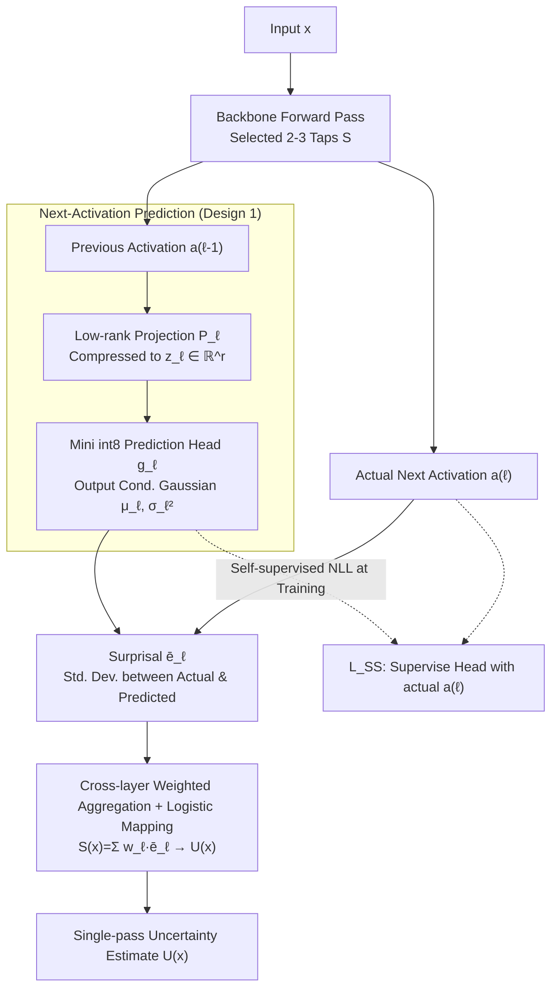

# SNAP-UQ: Self-supervised Next-Activation Prediction for Single-Pass Uncertainty

**Conference**: ICLR 2026  
**arXiv**: [2508.12907](https://arxiv.org/abs/2508.12907)  
**Code**: None  
**Area**: Self-supervised  
**Keywords**: Uncertainty Estimation, TinyML, Single-pass, Self-supervised, Microcontroller Deployment, OOD Detection

## TL;DR

SNAP-UQ proposes a single-pass uncertainty estimation method tailored for TinyML scenarios: it attaches tiny int8 prediction heads to selected layers of the backbone network to predict next-layer activation statistics in a self-supervised manner. The deviation between actual activations and predictions ("surprisal") is aggregated into an uncertainty score. This approach requires no additional forward passes, temporal buffering, or ensembles, enabling reliable out-of-distribution (OOD) and failure detection on microcontrollers with only a few dozen KB of additional flash memory.

## Background & Motivation

TinyML models are increasingly deployed on battery-powered microcontrollers (MCUs) for private, low-latency perception in vision and audio. However, input distributions change post-deployment due to sensor drift, lighting and acoustic environment changes, and the alternation of common in-distribution (CID) corruptions and out-of-distribution (OOD) samples. Modern neural networks often exhibit overconfidence under these shifts, even if well-calibrated on a hold-out set.

Addressing uncertainty estimation on MCUs faces severe constraints:
- **MC Dropout** and **Deep Ensembles** require multiple forward passes, multiplying latency and flash costs.
- **Early-exit ensembles** still require additional classification heads and memory bandwidth during inference, and rely on softmax signals (fragile under CID).
- **Post-hoc calibration** (Temperature Scaling) typically fails under distribution shifts.
- **Classic OOD detectors** (ODIN/G-ODIN) generalize poorly on ultra-compact models.

Key Insight: Inter-layer dynamics reflect distribution shifts earlier than softmax confidence—features become atypical relative to the network's own transformations before the class posterior flattens.

## Method

### Overall Architecture

SNAP-UQ addresses the problem where softmax is overconfident when input distributions drift in TinyML deployments, yet reliable solutions like MC Dropout or Ensembles cannot run on microcontrollers. The approach attaches a **mini int8 prediction head** at 2-3 selected "taps" $\mathcal{S}$ of the backbone network. Each tap first performs a low-rank projection of the previous layer's activation and then outputs conditional Gaussian parameters for the next layer's activation, representing "what the network expects the next layer to look like." The standardized deviation between the actual activation and this prediction is treated as the surprisal score for that layer. These scores are weighted and aggregated across layers into a single SNAP score $S(x)$, which is then mapped to an uncertainty value $U(x)$ via a lightweight logistic function. The process requires only a single forward pass with no additional inference cycles or ensembles. The prediction heads are trained self-supervisedly using the next-layer activations generated by the backbone itself, requiring no additional labels.

### Key Designs

**1. Depth-wise Next-Activation Prediction: Replacing Unconditional Statistics with Inter-layer Conditionals**

Traditional single-pass UQ (Energy, Mahalanobis) relies on unconditional statistics fitted to a specific layer, which can be slow to react to shifts. SNAP-UQ instead explicitly models the mapping between adjacent layers $a_{\ell-1} \mapsto a_\ell$. At each tap $\ell \in \mathcal{S}$, a projector $P_\ell$ compresses the previous activation into a low-dimensional space $z_\ell = P_\ell a_{\ell-1} \in \mathbb{R}^{r_\ell}$ ($r_\ell \ll d_{\ell-1}$, saving computation and storage), and a prediction head $g_\ell$ outputs the parameters of a diagonal Gaussian $(\mu_\ell, \log \sigma_\ell^2) = g_\ell(z_\ell)$. When the input distribution shifts, the actual activation deviates from this self-consistent prediction before the class posterior does, making the signal earlier and more sensitive than softmax. To capture inter-channel correlations, a low-rank plus diagonal covariance $\Sigma_\ell = \text{diag}(\sigma_\ell^2) + B_\ell B_\ell^\top$ can be used, efficiently inverted via the Woodbury identity.

**2. Self-supervised Training Objective: Co-training with the Backbone**

The prediction heads require no additional labels—the supervision signal is the next-layer activation produced by the backbone itself, making it purely self-supervised. The auxiliary loss is the diagonal Gaussian NLL: $\mathcal{L}_{SS} = \frac{1}{|\mathcal{B}|}\sum_{x \in \mathcal{B}} \sum_{\ell \in \mathcal{S}} \frac{1}{2}[\|(a_\ell - \mu_\ell) \odot \sigma_\ell^{-1}\|^2 + \mathbf{1}^\top \log \sigma_\ell^2]$. This is combined with the classification loss: $\mathcal{L} = \mathcal{L}_{clf} + \lambda_{SS}\mathcal{L}_{SS} + \lambda_{reg}\mathcal{R}$. $\lambda_{SS}$ is kept small ($10^{-3}\sim10^{-2}$) to avoid interfering with the main task. To prevent variance collapse to zero, $\sigma_\ell^2$ is bounded by a softplus plus $\epsilon^2$, and a scale regularization $\mathcal{R}_{var} = \sum_\ell \|\log \sigma_\ell^2\|_1$ is added. For small backbones with limited capacity, the target activation $a_\ell$ can be detached (stop-grad) to avoid gradient tug-of-war.

**3. Single-pass Surprisal Aggregation and Mapping: Compressing Multi-layer Deviations**

During inference, each tap calculates a dimension-normalized standardized error $\bar{e}_\ell(x) = \frac{1}{d_\ell}\|(a_\ell - \mu_\ell) \odot \sigma_\ell^{-1}\|^2$ (division by $d_\ell$ ensures high-dimensional layers do not dominate). These are aggregated via a weighted sum: $S(x) = \sum_{\ell \in \mathcal{S}} w_\ell \bar{e}_\ell(x)$. Layer weights $w_\ell$ can be uniform or inverse-variance weighted $w_\ell \propto 1/\hat{\text{Var}}[\bar{e}_\ell]$ to minimize the contribution of noisy layers. Finally, a logistic mapping merges $S(x)$ with an optional confidence proxy $m(x)$ into the final uncertainty $U(x) = \sigma(\beta_0 + \beta_1 S(x) + \beta_2 m(x))$; these parameters are fitted offline and require no online labels.

**4. MCU-friendly Integer Implementation: Fitting into Dozens of KB**

For MCU deployment, $P_\ell$, $W_\mu$, and $W_\sigma$ are quantized to int8 using Quantization-Aware Training (QAT) in the final 20% of epochs. Exponential operations in the NLL, such as $\exp(-\frac{1}{2}\log\sigma^2)$, are replaced with a 256-entry lookup table (LUT) to avoid expensive floating-point math. Evaluated with 2 taps and $r_\ell \in [32,128]$, the computational overhead is less than 2% of the backbone, adding only dozens of KB to flash memory. It is compatible with CMSIS-NN and requires no temporal buffering. Student-$t$ or Huberized variants can be used for robust alternatives if the loss is noise-sensitive.

## Key Experimental Results

### Main Results—MCU Deployment Performance

| Platform/Task | Method | Flash (KB) | Peak RAM (KB) | Latency (ms) | Energy (mJ) |
|-----------|------|-----------|--------------|----------|----------|
| Big-MCU/SpeechCmd | BASE | 220 | 84 | 60 | 2.1 |
| | EE-ens | 360 | 132 | 85 | 3.0 |
| | DEEP | 290 | 108 | 70 | 2.5 |
| | **SNAP-UQ** | **182** | **70** | **52** | **1.7** |
| Small-MCU/CIFAR-10 | BASE | 180 | 92 | 260 | 9.5 |
| | EE-ens | OOM | — | — | — |
| | DEEP | OOM | — | — | — |
| | **SNAP-UQ** | **158** | **85** | **178** | **6.4** |

### Failure Detection

| Method | MNIST ID✓-ID× | SpeechCmd ID✓-ID× | CIFAR-10 ID✓-OOD | SpeechCmd ID✓-OOD |
|------|------|------|------|------|
| BASE | 0.75 | 0.90 | 0.90 | 0.88 |
| EE-ens | 0.85 | 0.90 | 0.90 | 0.90 |
| DEEP | 0.85 | 0.91 | 0.92 | 0.92 |
| **SNAP-UQ** | **0.90** | **0.94** | **0.92** | **0.94** |

### CID Stream Monitoring

| Method | MNIST-C AUPRC | Latency (frames) | SpeechCmd-C AUPRC | Latency (frames) |
|------|------|------|------|------|
| BASE | 0.54 | 42 | 0.52 | 67 |
| EE-ens | 0.63 | 31 | 0.59 | 55 |
| **SNAP-UQ** | **0.66** | **24** | **0.65** | **41** |

### Ablation Study

| Configuration | AUPRC (CIFAR-10-C) | Latency (ms) |
|------|---------|------|
| P only, r=32 | 0.62 | 88 |
| M+P, r=64 | 0.70 | 83 |
| M+P, r=128 | 0.72 | 86 |
| M+P+early, r=64 | 0.71 | 90 |

### Key Findings

- **SNAP-UQ is the only viable UQ solution on Small-MCUs**: While EE-ens and DEEP result in OOM errors on CIFAR-10/Small-MCU, SNAP-UQ deploys successfully.
- **Deep surprisal reacts to shifts earlier than softmax**: In stream monitoring, SNAP-UQ's detection latency is ~25-30% shorter than EE-ens.
- **INT8 quantization is nearly lossless**: The AUPRC of the INT8 head drops only 0.01 compared to FP32, while reducing flash usage by 1.6-2.1x.
- **Two taps are optimal**: The mid+penultimate combination consistently provides the best accuracy-latency tradeoff; adding an early tap reduces performance due to noise.

## Highlights & Insights

- The core innovation lies in using "inter-layer dynamic deviation" as an uncertainty signal—unlike traditional softmax, energy, or Mahalanobis-based methods, SNAP-UQ captures conditional, depth-wise signals.
- Transparent theoretical analysis: Proposition 2.1 proves SNAP scores are equivalent to an affine transformation of depth-wise negative log-likelihood; Proposition 2.2 proves equivalence to Mahalanobis distance to conditional means; Proposition 2.3 proves invariance to BN scaling.
- The design is highly engineering-oriented: int8 quantization, LUTs for exponents, CMSIS-NN compatibility, and no temporal buffering.
- Head-to-head comparisons with activation shaping methods like ASH and ReAct (Appendix O) show SNAP-UQ leads across risk-at-coverage and AURC metrics.

## Limitations & Future Work

- Some firmware might fuse or skip intermediate activations; exposing taps might require runtime modifications.
- Diagonal covariance cannot fully capture cross-channel structures, potentially under- or overestimating surprisal under extreme distortions.
- Performance is sensitive to the selection of tap locations and projector rank.
- The optional confidence blending and mapping still require a small labeled development set.
- Evaluation is limited to four benchmarks and two MCU tiers, not yet covering more modalities or tiny transformer architectures.

## Related Work & Insights

- MC Dropout (Gal & Ghahramani, 2016) and Deep Ensembles (Lakshminarayanan et al., 2017) are classic but resource-heavy UQ methods.
- Energy scores (Liu et al., 2020) and Mahalanobis detection (Lee et al., 2018) are single-pass but rely on unconditional statistics.
- QUTE (Ghanathe & Wilton, 2024) is a recent TinyML UQ contribution but remains dependent on early-exit architectures.
- Insight: The principle of "internal depth-wise dynamics as an anomaly signal" can be generalized to online monitoring of larger models.

## Rating
- Novelty: ⭐⭐⭐⭐⭐
- Experimental Thoroughness: ⭐⭐⭐⭐⭐
- Writing Quality: ⭐⭐⭐⭐⭐
- Value: ⭐⭐⭐⭐⭐

<!-- RELATED:START -->

## Related Papers

- [\[ICML 2026\] NITP: Next Implicit Token Prediction for LLM Pre-training](../../ICML2026/self_supervised/nitp_next_implicit_token_prediction_for_llm_pre-training.md)
- [\[ICLR 2026\] On the Alignment Between Supervised and Self-Supervised Contrastive Learning](on_the_alignment_between_supervised_and_self-supervised_contrastive_learning.md)
- [\[ICLR 2026\] GUIDE: Gated Uncertainty-Informed Disentangled Experts for Long-tailed Recognition](guide_gated_uncertainty-informed_disentangled_experts_for_long-tailed_recognitio.md)
- [\[ICLR 2026\] Equivariant Splitting: Self-supervised learning from incomplete data](equivariant_splitting_self-supervised_learning_from_incomplete_data.md)
- [\[ICLR 2026\] Soft Equivariance Regularization for Invariant Self-Supervised Learning](soft_equivariance_regularization_for_invariant_self-supervised_learning.md)

<!-- RELATED:END -->
