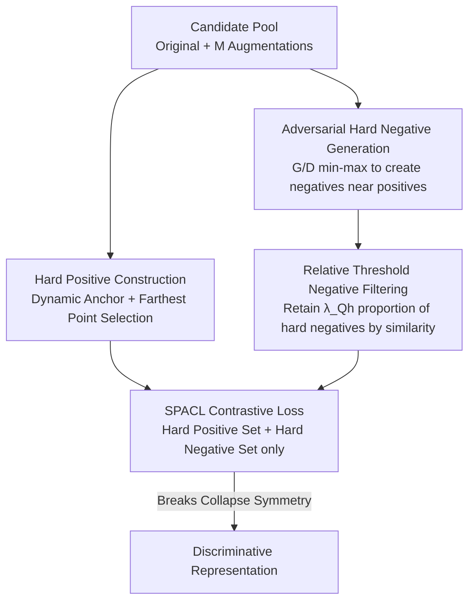

# SnaPhArd Contrast Learning

**Conference**: ICLR 2026  
**OpenReview**: [https://openreview.net/forum?id=4cZvjp8Iwk](https://openreview.net/forum?id=4cZvjp8Iwk)  
**Area**: Self-supervised / Representation Learning  
**Keywords**: Contrastive learning, hard samples, optimality analysis, collapse prevention, adversarial negative samples

## TL;DR
Starting from optimality conditions, this paper theoretically proves that "easy samples" in contrastive learning act as fixation points for the optimal solution and induce representation collapse. It proposes SPACL: using dynamic anchors + farthest point iteration to select hard positives, adversarial generators to create hard negatives, and relative thresholds to filter trivial negatives. It consistently outperforms or matches SOTA across image classification, knowledge graph link prediction, and out-of-distribution intent detection tasks.

## Background & Motivation

**Background**: The core of contrastive learning (CL) is to pull the representations of anchors closer to positive samples and push them away from negative samples. Mainstream research revolves around two lines: "how to construct contrastive pairs" (MoCo/SimCLR minibatch queues, data augmentation, knowledge priors) and "how to sample contrastive pairs" (increasing emphasis on selecting hard samples). Hard samples refer to ambiguous instances that the model finds difficult to distinguish from opposing classes, which are believed to force the model to capture subtle differences in data.

**Limitations of Prior Work**: Although hard sample sampling is empirically successful, theoretical explanations are almost non-existent—why choose hard samples? How exactly do hard samples contribute to performance? Under the introduction of hard samples, when does the solution collapse and when are there optimality guarantees? These questions remain unanswered. Worse, most methods only pick hard positives **or** hard negatives, rarely considering both simultaneously.

**Key Challenge**: The authors find that the root cause lies in "easy samples" acting as **fixation points**. Massive aggregation of easy negatives on the opposite side of the anchor absorbs significant weight and "nails" the potential solution, making it difficult to escape. Easy positives expand the convex hull of positive samples and compress the variation space of the encoder, potentially inducing multiple ambiguous solutions. This is the breeding ground for representation collapse ($x=p$, where the optimal solution degenerates to a single positive sample).

**Goal**: ① Provide a theoretical characterization of optimality/collapse conditions in CL; ② Design an algorithm that simultaneously filters hard positive and hard negative samples based on this; ③ Validate this on multi-modal and multi-task scenarios.

**Key Insight**: Since easy samples are the culprits pinning down the solution and only hard samples truly shape the optimization landscape, it is necessary to **explicitly generate and filter hard positive and hard negative contrastive pairs**. Disrupting collapse symmetry via geometric convex hull expansion allows for the learning of more discriminative representations.

## Method

### Overall Architecture

The starting point of SPACL is a clean theoretical observation: under the dual-encoder InfoNCE framework, taking the stationary points of the ratio of negative to positive sample exponential sums $s^-/s^+$ with respect to the anchor $x$ on the unit sphere allows for analytical prediction of the geometric properties of the optimal $x$. Theory suggests that collapse occurs when the "convex combination of negative samples is exactly a scaling of a single positive sample" (Theorem 2.1). Conversely, non-collapse is guaranteed as long as the positive sample projection line does not fall into the negative sample convex hull (Corollary 2.2). Easy samples precisely make this symmetric collapse condition easier to satisfy; thus, the engineering objective is to "remove the easy and keep/create the hard."

The overall process is as follows: For each original sample, a candidate pool consisting of itself and multiple augmented views is constructed. From this pool, **dynamic anchors** are selected and **farthest point iteration** is used to extract the hard positive set $P^h_i$. Simultaneously, an **adversarial generator** creates hard negatives close to $P^h_i$, which are merged with in-batch negatives. Then, a **relative threshold** is used to filter the hard negative set $Q^h_i$. Finally, the SPACL contrastive loss is calculated using only these two refined sets.

> Note: Theoretical analysis (optimality/collapse conditions) serves as the motivation throughout. The actual workflow corresponding to "Hard Positive Construction" and "Hard Negative Filtering" is detailed in "Key Design 1" below.

### Key Designs

**1. Optimality and Collapse Condition Analysis: Turning "Hard Sample Selection" from Empirical to Provable Geometric Motivation**

This design addresses the long-standing lack of theoretical support for "why pick hard samples." The authors rewrite InfoNCE as $L=\sum_i \log\left(s^-_i/s^+_i+1\right)$, where $s^+_i=\sum_j \exp\langle x_i,p_j\rangle$ and $s^-_i=\sum_j \exp\langle x_i,n_j\rangle$. Since $n_j, p_j$ produced by the derived encoder $g$ are constants when optimizing $f$, the geometric properties of the optimal $x_i$ can be analytically predicted. The stationary point condition is equivalent to constrained minimization on the unit sphere:

$$\min_{\|x\|_2^2=1}\ \frac{\sum_j \exp\langle x,n_j\rangle}{\sum_j \exp\langle x,p_j\rangle}.$$

Under a single positive sample, Theorem 2.1 provides the necessary and sufficient condition for collapse ($x=p$): there exists $C\in\mathbb{R}$ such that $\sum_j w_j n_j / C = p$, where $w_j=\exp\langle n_j,p\rangle/\sum_k\exp\langle n_k,p\rangle$. Intuitively, when the convex reconstruction of negatives is exactly a scaled version of the positive, symmetry causes the solution to degenerate to the positive sample itself. Corollary 2.2 provides the non-collapse condition: as long as $\forall c\neq0,\ cp\notin \mathrm{conv}\{n_j\}$, then $x\neq p$. Coupled with Lemma 2.4 (asymptotic upper bound of gradient norm is 2 when $\|x\|=1$, and approximately 1.76 for single positive/negative), this suggests that the contribution of negative samples becomes negligible once their quantity exceeds a critical threshold. Together, these conclusions provide a clear engineering directive: **easy samples are fixation points pinning the solution and should be excluded; hard samples determine the optimization landscape**.

**2. Hard Positive Construction: Dynamic Anchor + Farthest Point Iteration to Expand Positive Convex Hull**

Addressing the issue where "easy positives compress the convex hull and induce ambiguity," SPACL moves away from fixing the original sample as the anchor with random augmented views. It first defines the difficulty of each candidate in the pool $C_i=\{\tilde z_i\}\cup\{\tilde z_i^{(1)},\dots,\tilde z_i^{(M)}\}$ as its average dissimilarity to other samples in the pool: $h(u)=\frac{1}{|C_i|-1}\sum_{v\in C_i\setminus\{u\}} d(u,v)$ (where $d$ is inner product, aligning with theoretical analysis). The hardest instance is dynamically chosen as the anchor $z_i=\arg\max_u h(u)$, and others are added via **farthest point iteration**: each step selects $u^*=\arg\max_{u}\min_{v\in P^h_i} d(u,v)$ until $|P^h_i|=\lambda_{P^h}$.

This farthest point strategy maximizes the spread of $P^h_i$ on the unit sphere, equivalent to expanding $\mathrm{conv}(P^h_i)$. Combined with Theorem 2.1/Corollary 2.2, geometric expansion of the convex hull prevents the anchor from degenerating to a single positive sample, mitigating collapse at the source.

**3. Adversarial Hard Negative Generation: Actively Creating Negatives near Positive Boundaries**

Relying solely on in-batch or momentum queue negatives often fails to cover the critical boundary region near the positive convex hull. SPACL introduces an adversarial generator $G$, encouraging it to produce adversarial negatives that "resemble the hard positive set $P^h_i$," while the discriminator $D$ learns to distinguish real positives from generated negatives. The min-max objective is:

$$\min_G \max_D\ \mathbb{E}_{z^+\in P^h_i}[\log D(z^+)] + \mathbb{E}_{\tilde z^-\sim G(\tilde z_i)}[\log(1-D(\tilde z^-))].$$

Generated adversarial negatives are merged with in-batch negatives into the candidate set $Q_i=\{\tilde z_j\}_{j\neq i}\cup\{\tilde z^-_i\}$. The benefit is that these "synthetic boundary-aware negatives" complement the boundary regions missed by original negatives, tightening decision boundaries and enhancing discriminability.

**4. Relative Threshold Negative Filtering: Selecting Hard Negatives by Proportion Rather Than Fixed Count**

SPACL selects the hard negative subset $Q^h_i$ with the highest similarity to the anchor from $Q_i$, subject to the constraint that every hard negative in the subset has higher similarity than any negative outside it, satisfying a relative quota:

$$\sum_{z^{h,-}_i\in Q^h_i}\mathrm{sim}(f(z_i),g(z^{h,-}_i)) = \lambda_{Q^h}\sum_{z^-_i\in Q_i}\mathrm{sim}(f(z_i),g(z^-_i)),\quad \lambda_{Q^h}\in(0,1].$$

The key insight is: positive samples are selected by **absolute quantity** $\lambda_{P^h}$, while negative samples use a **relative threshold** $\lambda_{Q^h}$. Because negatives are naturally far more diverse than positives, a fixed count would either include trivial negatives or miss informative ones. A relative threshold adaptively retains the batch of negatives "clinging to $\mathrm{conv}(P^h_i)$" across datasets, making $\mathrm{conv}(Q^h_i)$ flush against $\mathrm{conv}(P^h_i)$, which more easily disrupts the symmetric collapse condition of Theorem 2.1.

### Loss & Training

Finally, SPACL calculates contrastive loss only on the refined sets $P^h_i$ and $Q^h_i$:

$$L_{\text{SPACL}} = -\sum_i \log\frac{\sum_{j}^{|P^h_i|}\exp(\langle f(z_i),g(z^{h,+}_i)\rangle/\tau)}{\sum_{j}^{|P^h_i|}\exp(\langle f(z_i),g(z^{h,+}_i)\rangle/\tau)+\sum_{j}^{|Q^h_i|}\exp(\langle f(z_i),g(z^{h,-}_i)\rangle/\tau)}.$$

Primary hyperparameters are $\lambda_{P^h}=2, \lambda_{Q^h}=0.95$. Similarity uses inner product. For image classification, ResNet-50 is used for 200 epochs with batch size 256. For OOD detection, Adam (lr 1e-5) is used with batch size 8 for 20 epochs.

## Key Experimental Results

### Main Results

In image classification (ResNet-50, Top-1 %), SPACL leads across supervised, self-supervised, and weak-supervised paradigms:

| Dataset | Paradigm | SPACL | Prev. SOTA | Gain |
|--------|------|-------|----------|------|
| CIFAR-10 | Supervised | 97.04 | VarCon 95.94 | +1.10 |
| CIFAR-100 | Supervised | 80.84 | SupCon 76.57 | +4.27 |
| ImageNet-100 | Supervised | 87.62 | VarCon 86.34 | +1.28 |
| ImageNet-1K | Supervised | 80.98 | VarCon 79.36 | +1.62 |
| CIFAR-100 | Self-supervised | 72.28 | Barlow Twins 71.02 | +1.26 |
| ImageNet-100 | Weak-supervised | 50.18 | MaskCon 47.74 | +2.44 |

Knowledge graph link prediction (MRR / Hit@10) and text OOD detection also show consistent leads: on the harder FB15K-237 (without inverse relations), MRR reaches 41.3% and Hit@10 reaches 61.2%, exceeding LMKGE$_{l2}$ by +1.30 MRR. In StackOverflow OOD detection, F1-OOD averages 96.72 and 76.39 for 25%/75% training class ratios, exceeding MOGB by 2.3/5.1 points.

### Ablation Study

Deconstructing components on CIFAR-100 (Top-1 %):

| Configuration | Supervised | Self-supervised | Weak-supervised | FB15K-237(MRR) | Description |
|------|--------|--------|--------|----------------|------|
| Full | 80.8 | 72.3 | 69.2 | 41.3 | Full model |
| w/o Anc | 79.7 | 70.9 | 67.2 | 40.6 | No dynamic anchor selection |
| w/o HP | 80.1 | 71.4 | 68.3 | 40.9 | No farthest point positive selection |
| w/o AN | 79.5 | 70.5 | 67.0 | 40.5 | No adversarial negatives |
| w/o NS | 77.9 | 68.1 | 64.8 | 39.2 | No relative threshold negative filtering |

### Key Findings
- **Negative Filtering (NS) contributes the most**: Removing it caused the steepest drop (from 72.3 to 68.1 in self-supervised CIFAR-100). Without filtering, trivial negatives are retained, expanding the negative convex body and weakening decision boundaries, consistent with Theorem 2.1.
- **Adversarial Negatives (AN) and Dynamic Anchors (Anc) provide medium contribution**: Anc verifies the role of anchor selection in maximizing angular spread and avoiding symmetric collapse. AN shows that adversarially generated negatives sharpen negative region boundaries.
- **Hard Positive selection (HP) contributes the least**: While farthest point selection helps expand the positive convex hull and increase diversity, it is less critical than maintaining good separation between positives and negatives.

## Highlights & Insights
- **Turning Hard Sample Selection from Alchemy to Geometric Theorem**: Using collapse symmetry conditions on the unit sphere (Theorem 2.1) to explain "easy samples = fixation points, hard samples = shaping forces" provides provable motivation for hard sample sampling.
- **Asymmetric Selection Logic for Positives and Negatives**: Absolute quantity for positives vs. relative threshold for negatives captures the essence of negative sample diversity.
- **Adversarial Boundary Completion**: Instead of passively waiting for hard negatives in a queue, actively generating adversarial negatives near the positive convex hull targets the most ambiguous areas of the decision boundary.
- **Modality Agnostic**: The same mechanism improves performance across image, KG, and text tasks, indicating it optimizes the geometric structure of contrastive loss itself rather than modality-specific priors.

## Limitations & Future Work
- Theoretical analysis is mainly built on idealized settings like dual-encoders with single/symmetric negative samples. Conditions for multi-positives and asymmetric distributions are only roughly explored in the appendix.
- The introduction of adversarial generator $G$ and discriminator $D$ brings extra training overhead and potential instability.
- Complexity and sensitivity to $\lambda_{P^h}/\lambda_{Q^h}$ are primarily discussed in the appendix, with limited evidence in the main text.

## Related Work & Insights
- **vs. MoCo / SimCLR**: They rely on in-batch data and global queues, treating all negatives equally; SPACL adds a layer of "hard sample filtering + adversarial generation" with theoretical justification.
- **vs. Single-sided Selection**: Most existing works only modify either the positive **or** negative side; SPACL optimizes both simultaneously under a unified geometric framework.
- **vs. SupCon / VarCon**: Outperforming them on benchmarks like CIFAR-100 by ~4 points demonstrates that hard sample geometric shaping is equally effective in supervised scenarios.

## Rating
- Novelty: ⭐⭐⭐⭐⭐ Uses optimality/collapse conditions to provide provable motivation for hard sampling; optimizes both sides.
- Experimental Thoroughness: ⭐⭐⭐⭐ Broadly covers Vision/KG/Text tasks, but evidence for training costs is mainly in the appendix.
- Writing Quality: ⭐⭐⭐⭐ Clear derivation chain from theory to method, though formulas are dense.
- Value: ⭐⭐⭐⭐ Provides a transferable geometric analysis framework and modality-agnostic CL algorithm.

<!-- RELATED:START -->

## Related Papers

- [\[CVPR 2026\] Beyond Binary Contrast: Modeling Continuous Skeleton Action Spaces with Transitional Anchors](../../CVPR2026/self_supervised/beyond_binary_contrast_modeling_continuous_skeleton_action_spaces_with_transitio.md)
- [\[ICLR 2026\] On the Alignment Between Supervised and Self-Supervised Contrastive Learning](on_the_alignment_between_supervised_and_self-supervised_contrastive_learning.md)
- [\[ICLR 2026\] Part-level Semantic-guided Contrastive Learning for Fine-grained Visual Classification](part-level_semantic-guided_contrastive_learning_for_fine-grained_visual_classifi.md)
- [\[ICLR 2026\] Understanding the Robustness of Distributed Self-Supervised Learning Frameworks Against Non-IID Data](understanding_the_robustness_of_distributed_self-supervised_learning_frameworks_.md)
- [\[ICLR 2026\] Understanding the Learning Phases in Self-Supervised Learning via Critical Periods](understanding_the_learning_phases_in_self-supervised_learning_via_critical_perio.md)

<!-- RELATED:END -->
