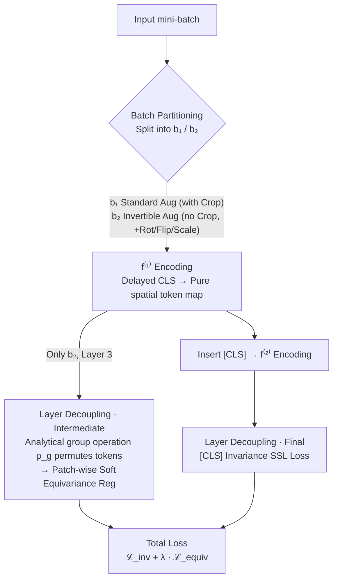

# Soft Equivariance Regularization for Invariant Self-Supervised Learning

**Conference**: ICLR 2026  
**arXiv**: [2603.06693](https://arxiv.org/abs/2603.06693)  
**Code**: [https://github.com/aitrics-chris/SER](https://github.com/aitrics-chris/SER)  
**Area**: Self-Supervised Learning  
**Keywords**: Self-supervised learning, equivariance, invariance, ViT, regularization

## TL;DR
Proposes SER (Soft Equivariance Regularization), a layer-decoupling design that applies soft equivariance regularization to intermediate layers of ViT while maintaining the invariance objective at the final layer. It consistently improves classification accuracy and robustness for invariant SSL methods (MoCo-v3, DINO, Barlow Twins) without introducing additional modules.

## Background & Motivation

**Background**: The mainstream Self-Supervised Learning (SSL) paradigm involves learning representations invariant to semantic-preserving augmentations (e.g., random cropping, color jittering) through contrastive learning or redundancy reduction. Representative methods include MoCo-v3, DINO, and Barlow Twins.

**Limitations of Prior Work**: Strong invariance learning suppresses transformation-related structural information (e.g., rotation, flip, scale cues), which is beneficial for geometric robustness and spatially sensitive downstream tasks (e.g., object detection). Prior works attempted to incorporate equivariance objectives into invariant SSL but typically imposed both objectives on the **same final representation**.

**Key Challenge**: Final representations are often spatially collapsed (e.g., the [CLS] token of ViT or global average pooling), making it difficult to define spatial group operations. Enforcing equivariance at this layer leads to conflicts with the invariance objective. The authors' experiments demonstrate that pushing equivariance regularization to deeper layers increases the equivariance score but degrades ImageNet-1k linear evaluation accuracy.

**Goal**: How to elegantly introduce equivariance into invariant SSL without altering the baseline SSL architecture and objectives, thereby avoiding the invariance-equivariance trade-off?

**Key Insight**: Invariance and equivariance should be applied at different layers—a layer-decoupling design. Spatial token maps in intermediate layers preserve the grid structure, which is naturally suited for defining analytical group operations.

**Core Idea**: Apply soft equivariance regularization using analytical group operations on the spatial token maps of intermediate ViT layers while maintaining the original invariance SSL objective at the final layer.

## Method

### Overall Architecture
SER aims to incorporate "equivariance" into "invariant" SSL methods (e.g., MoCo-v3, DINO) without conflicting with the original objectives or adding extra modules. Its **Mechanism** is **layer decoupling**: invariance and equivariance are assigned to different depths. The invariance SSL loss is kept at the final layer ([CLS] token), while equivariance regularization is moved to a spatial token map of an intermediate layer (e.g., Layer 3) that still retains an $H_f \times W_f$ grid structure.

Workflow: A mini-batch is split into two halves (batch partitioning). One half undergoes standard augmentation (including cropping), while the other undergoes invertible augmentation (no cropping, includes rotation, flip, and scaling). Both halves enter the decomposed ViT encoder $f = f^{(2)} \circ f^{(1)}$, where $f^{(1)}$ produces a pure spatial token map without the [CLS] token (insertion of [CLS] is delayed to the input of $f^{(2)}$). On this clean token map, soft equivariance regularization via analytical group operations $\rho_g$ is applied only to the half with invertible augmentations. Subsequently, the [CLS] token is inserted and processed by $f^{(2)}$, followed by the standard invariance SSL loss calculation for both halves. The final objective is the sum of the invariance loss and a weighted equivariance regularizer.

### Key Designs

**1. Layer Decoupling: Separating Invariance and Equivariance**
Enforcing equivariance on final SSL representations is problematic because the spatial structure is often collapsed ([CLS] only or global pooling), precluding the definition of group operations like "token rearrangement post-rotation." SER decouples these objectives: intermediate layers (e.g., Layer 3) preserve the $H_f \times W_f$ grid structure for analytical group operations $\rho_g$, while the final layer targets invariance. Experiments show that Layer 3 is the "sweet spot"; pushing equivariance deeper increases the equivariance score but degrades ImageNet accuracy due to direct conflict with invariance.

**2. Analytical Feature Space Group Operation $\rho_g$: Token Permutation instead of Auxiliary Networks**
The group $\mathcal{G}$ considers transformations that are invertible and can be precisely replicated in feature space: 90° rotations, horizontal flips, and anisotropic scaling (excluding cropping). These have analytical correspondences on the token grid: discrete rotations and flips are token permutations, while scaling is implemented via deterministic grid resampling. Because transformations are analytical, SER requires no additional transformation networks or transformation-coordinate predictions. This keeps the training FLOPs increase to a negligible $1.008\times$.

**3. Batch Partitioning: Overcoming Non-invertible Cropping**
Standard SSL uses RandomResizedCrop, which is non-invertible and does not form a group, making the relative transformation $g = g_2 g_1^{-1}$ ill-defined. SER splits the mini-batch: $b_1$ uses standard augmentation (with cropping), while $b_2$ uses invertible augmentation $\mathcal{T}_{eq} = \mathcal{T} \setminus \{\text{Random Crop}\} \cup \{\text{Rotation } 90°\}$. Both sub-batches contribute to the invariance loss, but only $b_2$ undergoes equivariance regularization, ensuring that $g$ is always a well-defined group element.

**4. Delayed [CLS] Token Insertion: Maintaining Grid Regularity**
If the [CLS] token participates in attention from the first layer, its interaction with spatial tokens disrupts the grid regularity of the intermediate token maps. SER decomposes the encoder $f = f^{(2)} \circ f^{(1)}$, where $f^{(1)}$ outputs a pure spatial token map. The [CLS] token is inserted at the input of $f^{(2)}$, i.e., after the equivariance regularization layer, ensuring that $\rho_g$ can be accurately applied to the spatial grid.

### Loss & Training

Equivariance regularization uses a patch-wise NT-Xent contrastive loss:

$$\mathcal{L}_{\text{equiv}}^{i,j} = -\log \frac{\exp(s(z_{ij}, z'_{ij}))}{\exp(s(z_{ij}, z'_{ij})) + \sum_{m \neq i} \sum_n \exp(s(z_{ij}, z_{mn})) + \sum_{m \neq i} \sum_n \exp(s(z_{ij}, z'_{mn}))}$$

where $s(x,y) = \frac{1}{\tau} \frac{x^\top y}{\|x\| \|y\|}$ and $\tau$ is the temperature (0.3 for MoCo-v3/BT, 0.5 for DINO).

Total loss: $\mathcal{L} = \mathcal{L}_{\text{inv1}} + \mathcal{L}_{\text{inv2}} + \lambda \mathcal{L}_{\text{equiv}}$

Training uses AdamW, batch size 2048, 100 epochs, with 10-epoch warmup and cosine decay.

## Key Experimental Results

### Main Results

| Method | Views | ImageNet Top-1 | ImageNet-Sketch Top-1 | ImageNet-V2 Top-1 | ImageNet-R Top-1 |
|------|-------|---------------|----------------------|-------------------|-----------------|
| MoCo-v3 | 2 | 68.44 | 17.65 | 56.54 | 18.59 |
| +AugSelf | 2 | 67.55 | 13.30 | 53.74 | 17.62 |
| +STL | 2 | 65.49 | 15.40 | 55.43 | 17.22 |
| **+SER (Ours)** | **2** | **69.28** | **17.68** | **56.95** | **18.95** |
| +EquiMod | 3 | 68.95 | 14.81 | 56.31 | 16.54 |
| +E-SSL | 2+4 | 70.60 | 19.23 | 58.33 | 19.86 |
| **+SER (Ours)** | **2+4** | **71.56** | **19.76** | **59.50** | **20.27** |

Under strictly matched 2-view settings, SER is the only equivariance add-on that improves MoCo-v3 accuracy (+0.84), while others degrade it.

### Ablation Study

| Config | Equiv Loss Layer | ImageNet Top-1 | Rotation Equiv ↑ |
|------|-----------------|----------------|------------------|
| MoCo-v3 (baseline) | - | 68.44 | 0.804 |
| MoCo + SER | Layer 3 | **69.28** | 0.840 |
| MoCo + SER | Layer 9 | 68.72 | 0.888 |
| MoCo + SER | Layer 12 | 68.18 | 0.924 |
| +SER, λ=0 (control) | Layer 3 | 68.82 | - |
| +SER, λ>0 (full) | Layer 3 | **69.28** | - |

### Key Findings
- **Layer decoupling is crucial**: Equivariance regularization works best at Layer 3 (of 12 ViT layers). Pushing it deeper hurts classification accuracy even if equivariance scores improve.
- **Generic design principle**: Moving the equivariance target from Layer 12 to Layer 3 in other methods improves performance: EquiMod Top-1 (68.95 $\to$ 69.51) and AugSelf (67.55 $\to$ 68.23).
- **Equiv loss efficiency**: The control experiment ($\lambda=0$) shows a +0.38 gain (from batch partitioning), while enabling $\mathcal{L}_{\text{equiv}}$ further boosts the gain to +0.84.
- **Consistency**: Effectively improves DINO (+0.26) and Barlow Twins (+0.68).
- **Downstream impact**: Larger gains in spatial tasks: COCO detection (+1.7 mAP) and ImageNet robustness (+1.11 ImageNet-C).

## Highlights & Insights
- **Layer Decoupling Principle**: Invariance and equivariance should not be enforced at the same depth. This insight extends beyond SER and can be treated as a general design rule for multi-objective regularization.
- **Analytical Group Operations**: Leveraging the ViT patch grid allows rotation/flip to be treated as token permutations, avoiding extra parameters.
- **Batch Partitioning for Irreversibility**: Splitting the batch allows standard cropping to coexist with a subset of data that maintains well-defined group relations for equivariance loss.

## Limitations & Future Work
- Primarily validated on ViT-S/16; performance on larger models (ViT-B/L) or longer training (300/800 epochs) remains to be explored.
- Group $\mathcal{G}$ is restricted to discrete transformations; richer transformation groups (e.g., continuous rotations) are not explored.
- The absence of cropping in $b_2$ might reduce data diversity; "invertible cropping" could be a future direction.
- Optimal layer placement (Layer 3) might vary with model scale, needing further tuning.
- Computational overhead of patch-wise contrastive loss scales quadratically with spatial resolution.

## Related Work & Insights
- **vs. EquiMod**: EquiMod uses an auxiliary transformation network at the final layer with 3-view training; SER uses analytical operations at intermediate layers with higher 2-view accuracy and zero extra parameters.
- **vs. E-SSL**: E-SSL uses 2+4 multi-crop for implicit equivariance; SER outperforms E-SSL in the matched 2+4 view setting (71.56 vs 70.60).
- **vs. AugSelf**: AugSelf predicts transformation parameters; it degrades accuracy in 2-view settings (67.55 < 68.44), whereas SER improves it.

## Rating
- Novelty: ⭐⭐⭐⭐ (The layer decoupling principle is insightful, though the loss itself is standard)
- Experimental Thoroughness: ⭐⭐⭐⭐⭐ (Strict view-matched comparisons, multiple baselines, and robustness benchmarks)
- Writing Quality: ⭐⭐⭐⭐ (Logical flow and clear notation)
- Value: ⭐⭐⭐⭐ (Layer decoupling is a broadly applicable design principle)

<!-- RELATED:START -->

## Related Papers

- [\[CVPR 2026\] Tunable Soft Equivariance with Guarantees](../../CVPR2026/self_supervised/tunable_soft_equivariance_with_guarantees.md)
- [\[NeurIPS 2025\] T-REGS: Minimum Spanning Tree Regularization for Self-Supervised Learning](../../NeurIPS2025/self_supervised/t-regs_minimum_spanning_tree_regularization_for_self-supervised_learning.md)
- [\[ICLR 2026\] On the Alignment Between Supervised and Self-Supervised Contrastive Learning](on_the_alignment_between_supervised_and_self-supervised_contrastive_learning.md)
- [\[ICLR 2026\] Unsupervised Representation Learning - An Invariant Risk Minimization Perspective](unsupervised_representation_learning_-_an_invariant_risk_minimization_perspectiv.md)
- [\[ICLR 2026\] Understanding the Learning Phases in Self-Supervised Learning via Critical Periods](understanding_the_learning_phases_in_self-supervised_learning_via_critical_perio.md)

<!-- RELATED:END -->
## Related Papers

- [\[CVPR 2026\] Tunable Soft Equivariance with Guarantees](../../CVPR2026/self_supervised/tunable_soft_equivariance_with_guarantees.md)
- [\[NeurIPS 2025\] T-REGS: Minimum Spanning Tree Regularization for Self-Supervised Learning](../../NeurIPS2025/self_supervised/t-regs_minimum_spanning_tree_regularization_for_self-supervised_learning.md)
- [\[ICLR 2026\] On the Alignment Between Supervised and Self-Supervised Contrastive Learning](on_the_alignment_between_supervised_and_self-supervised_contrastive_learning.md)
- [\[ICLR 2026\] Unsupervised Representation Learning - An Invariant Risk Minimization Perspective](unsupervised_representation_learning_-_an_invariant_risk_minimization_perspectiv.md)
- [\[ICLR 2026\] Understanding the Learning Phases in Self-Supervised Learning via Critical Periods](understanding_the_learning_phases_in_self-supervised_learning_via_critical_perio.md)

<!-- RELATED:END -->
