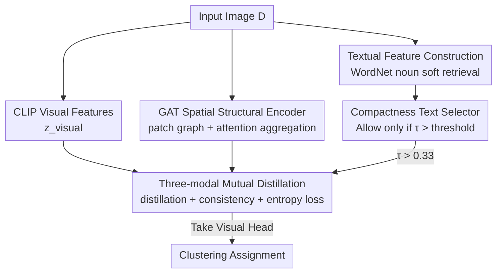

# Spatial Structure and Selective Text Jointly Facilitate Image Clustering

**Conference**: ICLR 2026  
**OpenReview**: [https://openreview.net/forum?id=3DOgmfZ2k6](https://openreview.net/forum?id=3DOgmfZ2k6)  
**Code**: https://zizhjiu.github.io/SATC/ (Project Page)  
**Area**: Self-supervised / Image Clustering / Representation Learning  
**Keywords**: Image Clustering, CLIP, Graph Attention Network, Textual Feature Selection, Mutual Distillation

## TL;DR
SATC constructions a graph for each image using GAT to extract spatial structure features between patches, compensating for the missing local structure in CLIP. It employs a selector based on "textual compactness $\tau$" to automatically decide whether to introduce text features for a given dataset. Finally, it achieves clustering through mutual distillation across vision, spatial, and textual modalities, outperforming SOTAs like TAC across 18 benchmarks.

## Background & Motivation

**Background**: The core of image clustering lies in injecting "prior knowledge" into unlabeled data. Priors have evolved from early "internal compactness constraints" (e.g., K-Means, DEC) to "external textual guidance." Represented by TAC, these methods leverage the image-text alignment capabilities of CLIP to introduce external textual knowledge, such as WordNet nouns, as auxiliary supervision, significantly improving performance.

**Limitations of Prior Work**: Two overlooked issues are identified. First, CLIP is trained for image-text alignment; compressing an image into a shared semantic space results in the loss of **spatial structure** (object shapes, positions, part layouts), which is crucial for distinguishing categories. The paper cites an example from OxfordPets where visual and textual modalities incorrectly pull a Shiba Inu and a Keeshond closer, whereas the spatial modality correctly groups two Shiba Inus together. Second, existing methods assume "textual features are beneficial for all datasets." However, empirical testing on 18 datasets shows that blindly introducing text features leads to **performance degradation** on many datasets—text is not a universal solution.

**Key Challenge**: CLIP's image-text alignment naturally sacrifices local spatial relationships, and the effectiveness of textual priors is highly dataset-dependent; a uniform "always-on" text strategy introduces noise.

**Goal**: (1) Recover the spatial structure missing from CLIP; (2) Enable the model to autonomously determine whether to use text for each dataset.

**Key Insight**: Treat image patches as graph nodes and model their relationships via graph attention to explicitly encode spatial structure. Simultaneously, use the "clustering compactness of text features themselves" as an objective signal to decide text availability.

**Core Idea**: Jointly drive clustering with **spatial structure features + selective text**. GAT extracts spatial structures, a compactness selector filters text, and three-modality mutual distillation produces the final assignments.

## Method

### Overall Architecture
SATC addresses the gaps where "CLIP visual features are insufficient" and "textual features are not always useful." The framework processes an image through three paths: visual (directly from CLIP), spatial (ResNet-50 patches $\rightarrow$ GAT graph aggregation), and textual (retrieved from WordNet nouns per the TAC pipeline). The textual path must pass through a compactness selector, and is only integrated if $\tau$ exceeds a threshold. Each path connects to an MLP clustering head, aligned via mutual distillation. The **visual head** assignment after distillation is taken as the final output.

### Key Designs

**1. GAT Spatial Structural Encoder: Recovering Local Structures Discarded by CLIP**

To address the loss of spatial structure in CLIP, the authors move beyond using a single global vector. They decompose an image into patches and explicitly model their relationships. Specifically, a pre-trained ResNet-50 (without the final pooling and FC layers) extracts patch-level features $X=[x_1,\dots,x_M]^\top\in\mathbb{R}^{M\times d}$. Each patch serves as a graph node. Edges $E$ are constructed within the **same image** based on feature similarity and processed by a GAT. The GAT uses learnable attention to weight neighbor aggregation for node updates:

$$x'_i = \sigma\!\left(\sum_{j\in N(i)} \frac{\exp(f(x_i,x_j))}{\sum_{k\in N(i)}\exp(f(x_i,x_k))}\, x_j\right)$$

where $f(x_i,x_j)$ is a learnable attention scoring function. Updated node features are globally average-pooled to obtain the spatial embedding $z_{\text{spatial}}\in\mathbb{R}^d$. GAT is chosen over GCN or Transformer because its attention **adaptively weights different neighbor patches**, unlike the uniform aggregation in GCN or the fixed receptive field in Transformers. Ablations show an average ACC of 73.7% for GAT, higher than GCN (71.9%) and Transformer (70.4%).

**2. Compactness Text Selector: Letting the Model Decide Text Usage**

To address the "text is not always beneficial" issue, a dataset-level switch is designed using the **clustering compactness $\tau$** of the textual features. Textual features are constructed following TAC: visual features are clustered into $K_1=\lfloor N/300\rfloor$ clusters via K-Means, the top-5 nouns with the highest posterior probabilities are retrieved for each cluster center, and soft retrieval ($\beta_1=0.005$) is performed for each sample to synthesize textual features $z_{\text{textual}}$. All textual features are then clustered via K-Means into $K_t=10$ clusters. Compactness is defined as the average intra-cluster distance:

$$\tau = \frac{1}{K_t}\sum_{j=1}^{K_t}\frac{1}{|D_j|}\sum_{z\in D_j}\|z - C_j\|^2$$

The intuition is: a lower $\tau$ indicates text features are cluttered and semantically redundant, offering no help for discrimination; a higher $\tau$ indicates more diverse and discriminative semantics. $\tau$ is computed once per dataset before training. If $\tau > 0.33$ (an **empirically discovered rule** from 18 datasets, not a per-test-set hyperparameter), text is used in mutual distillation. Table 2 shows that for datasets with $\tau < 0.33$, text usage almost always leads to performance drops, while for $\tau > 0.33$, it yields gains.

**3. Three-modal Mutual Distillation: Aligning Vision, Spatial, and Text for Clustering**

Each feature path connects to an MLP clustering head (512-512-K) to produce soft clustering distributions. They are aligned via pairwise distillation. The total loss consists of three components:

$$L = \sum_{k=1}^{3} L^k_{\text{distill}} + \lambda_1 \sum_{k=1}^{3} L^k_{\text{consist}} - \lambda_2 \sum_{m\in M} L^m_{\text{entropy}}$$

where $M=\{\text{visual, textual, spatial}\}$. The mutual distillation loss $L_{\text{distill}}$ uses a contrastive form (temperature $T$) to pull together cluster assignments for the same sample across modalities while pushing apart those of different samples. The consistency loss $L_{\text{consist}}=-\frac{1}{N}\sum_i \log(c^{\text{visual}\top}_i c^{\text{spatial}}_i)$ further aligns assignments between modalities for the same anchor. The entropy loss $L_{\text{entropy}}$ encourages confident assignments and prevents collapse. Spatial and textual modalities serve as auxiliary information to strengthen the discriminative power of the visual modality.

### Loss & Training
CLIP ViT-B/32 is used for visual and textual features. Three MLP heads (512-512-K) are used. Training lasts 200 epochs with a batch size of 512, with early stopping after 10 epochs of no loss decrease. Hyperparameters follow TAC: $T=0.5, \lambda_1=1.0, \lambda_2=5.0$, and textual threshold 0.33. Results are reported as the mean of 10 seeds.

## Key Experimental Results

### Main Results
Evaluation on 18 benchmarks, with primary comparisons on ImageNet-10 / ImageNet-Dogs / STL-10 / CIFAR-10 / CIFAR-100 across ACC / NMI / ARI (%) metrics. Baselines include K-Means, DEC, CC, SPICE, DPAC, DINOv2/v3+K-Means, Turtle, and TAC.

| Dataset | Metric | SATC | TAC (Next Best) | Gain |
|--------|------|------|------------|------|
| ImageNet-10 | ACC | 99.8 | 99.5 | +0.3 |
| ImageNet-Dogs | ACC | 91.4 | 84.4 | +7.0 |
| STL-10 | ACC | 99.0 | 98.3 | +0.7 |
| CIFAR-10 | ACC | 94.5 | 92.2 | +2.3 |
| CIFAR-100 | ACC | 63.4 | 59.0 | +4.4 |

SATC ranks first in nearly all metrics across five datasets, with a significant 7.0% ACC gain over TAC on the challenging ImageNet-Dogs.

### Ablation Study
Spatial architecture ablation (Average ACC% across 18 datasets, Table 3):

| Configuration | Avg ACC | Description |
|------|----------|------|
| CLIP only | 60.8 | Raw CLIP features + K-Means |
| + ResNet-50 node | 69.1 | Adding patch node features (with text distillation) |
| + GCN | 71.9 | Spatial modeling with GCN |
| + Transformer | 70.4 | Spatial modeling with Transformer |
| + GAT (Full) | 73.7 | Complete model |

Text Selector Ablation (Table 2, 18 datasets): The selector's Use/No-Text decision for each dataset matches the **actual optimal choice**, validating $\tau$ as a criterion.

### Key Findings
- **Spatial structure is the primary source of gain**: Replacing raw CLIP (60.8) with patch+GAT (73.7) increases performance by nearly 13 percentage points. GAT's adaptive weighting outperforms GCN and Transformers.
- **Text is not a panacea**: In Table 2, datasets with $\tau < 0.33$ suffer significant drops when using text (e.g., Index 1: 89.8% No-Text vs. 60.7% Use-Text). The selector correctly identifies these cases.
- **Vision and Spatial are complementary**: While pure vision (+V) and pure spatial (+S) via K-Means yield similar performance, their mutual distillation (+V+S) exceeds either single modality, indicating spatial provides structural cues while vision provides semantics.
- **Hyperparameter robustness**: Performance remains stable for $\lambda_1, \lambda_2$ over a wide range.

## Highlights & Insights
- **Turning text utility into a computable objective**: Using textual clustering compactness $\tau$ as a switch moves beyond the blind assumption of text utility. The criterion is label-free and computed once before training, making it highly efficient.
- **Patch graphs + GAT for structural recovery**: Modeling intra-image relationships via GAT is a generalizable strategy for "patching" global alignment models like CLIP.
- **Visual-head-only output**: Spatial and textual modalities act as "teachers" during training. Relying solely on the visual head for inference maintains simplicity while benefiting from multi-modal cues.

## Limitations & Future Work
- The text selector is a **dataset-level** hard switch; it cannot perform fine-grained selection for individual samples or sub-clusters.
- The 0.33 threshold is empirical. Its optimality on datasets with significantly different distributions remains to be fully explored.
- Spatial features rely on an additional ResNet-50 for patch extraction, increasing complexity compared to pure CLIP workflows.
- Future direction: Transitioning the $\tau$ selector from a hard threshold to soft weighting or sample-level selection to extract locally useful textual info.

## Related Work & Insights
- **vs. TAC**: TAC introduces CLIP textual features as constant supervision. SATC argues text is not universally beneficial, using a compactness selector for adaptive selection and adding GAT for spatial structure.
- **vs. GATCluster**: While also using graph attention, GATCluster builds graphs on sample relationships. SATC applies GAT to **internal patches within a single image**.
- **vs. Pure CLIP/DINOv2/v3 + K-Means**: These rely on global features and lack local structure. SATC's explicit structural recovery shows clear advantages on structure-sensitive datasets like ImageNet-Dogs.

## Rating
- Novelty: ⭐⭐⭐⭐ The combination of a compactness text selector and patch-level GAT spatial features addresses two genuine blind spots in CLIP-based clustering.
- Experimental Thoroughness: ⭐⭐⭐⭐⭐ 18 benchmarks, 10-seed means, and extensive ablations on spatial, textual, and loss components.
- Writing Quality: ⭐⭐⭐⭐ Motivations are clearly illustrated through counter-examples and the compactness-gain correlation in Table 2.
- Value: ⭐⭐⭐⭐ Provides a reusable paradigm for enhancing foundation models with local structure and adaptive prior selection.

<!-- RELATED:START -->

## Related Papers

- [\[ICLR 2026\] Mini-cluster Guided Long-tailed Deep Clustering](mini-cluster_guided_long-tailed_deep_clustering.md)
- [\[ICLR 2026\] Relationship Alignment for View-aware Multi-view Clustering](relationship_alignment_for_view-aware_multi-view_clustering.md)
- [\[CVPR 2026\] Text-Phase Synergy Network with Dual Priors for Unsupervised Cross-Domain Image Retrieval](../../CVPR2026/self_supervised/text-phase_synergy_network_with_dual_priors_for_unsupervised_cross-domain_image_.md)
- [\[ICLR 2026\] HiMAE: Hierarchical Masked Autoencoders Discover Resolution-Specific Structure in Wearable Time Series](himae_hierarchical_masked_autoencoders_discover_resolution-specific_structure_in.md)
- [\[ICCV 2025\] A Token-level Text Image Foundation Model for Document Understanding (TokenFD/TokenVL)](../../ICCV2025/self_supervised/a_tokenlevel_text_image_foundation_model_for_document_unders.md)

<!-- RELATED:END -->
