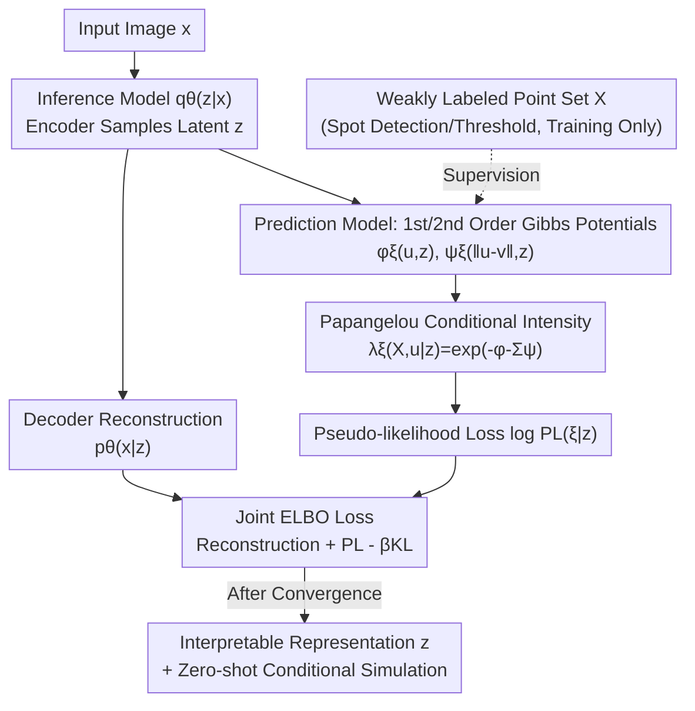

# Spatially Informed Autoencoders for Interpretable Visual Representation Learning

**Conference**: ICLR 2026  
**OpenReview**: [https://openreview.net/forum?id=09YSBymX6O](https://openreview.net/forum?id=09YSBymX6O)  
**Code**: https://git.mpi-cbg.de/mosaic/software/machine-learning/si-vae  
**Area**: Self-supervised Representation Learning / Interpretability / Spatial Statistics / Biological Microscopy Imaging  
**Keywords**: Variational Autoencoders, Spatial Point Processes, Papangelou Conditional Intensity, Pseudo-likelihood, Interpretable Representations

## TL;DR
This paper proposes **SI-VAE (Spatially Informed Variational Autoencoder)**, which utilizes the pseudo-likelihood of spatial point processes as a self-supervised objective to supervise the VAE latent space. This allows the model to learn statistically interpretable representations of "spatial arrangements between objects" rather than just pixel intensities. On synthetic data, it improves point pattern classification accuracy from 48% (standard VAE) to 80%–90% and enables zero-shot conditional simulation of point processes from single images, applied to the analysis of protein localization in human cells.

## Background & Motivation

**Background**: In many scientific imaging scenarios (e.g., forest fires/species distribution in satellite imagery, protein/virus distribution in cells under fluorescence microscopy), the image semantics reside not in the appearance or texture of objects, but in **how** these "discrete point-like objects" are arranged in space—whether they exhibit clustering, repulsion, or complete randomness. To learn useful representations from such images, mainstream approaches involve self-supervised deep learning: contrastive learning, Masked Autoencoders (MAE), and various VAEs.

**Limitations of Prior Work**: Self-supervised signals in these methods are almost entirely built on **pixel intensity or pixel similarity**. Contrastive learning encourages pixel-level similarity between augmented views, while MAE has been shown to rely heavily on reconstructing unmasked patches, often ignoring the spatial arrangement of masked tokens during decoding. Common image loss metrics also focus more on image appearance than spatial content. Consequently, models can distinguish "overall intensity levels" but fail to capture the **second-order correlation structure** between objects (attraction vs. repulsion). Even GP-VAEs with Gaussian Process priors encode correlations "between images" rather than "between objects within an image."

**Key Challenge**: Scientific applications require **mechanistic and statistically inferable** explanations for spatial organization (e.g., "why these proteins cluster in the nucleus"). However, purely self-supervised or discriminative representations provide neither mechanistic insights nor the probabilistic framework required for rigorous downstream statistical analysis. They are also prone to "Clever Hans" shortcuts—learning spurious correlations instead of real features. There is a lack of a prior that explicitly incorporates "spatial correlation structure" into the self-supervised objective.

**Goal**: (1) Design a self-supervised signal that forces the VAE latent space to explicitly encode the spatial interactions of point-like objects; (2) Ensure the learned representations are interpretable within a spatial statistics framework; (3) Obtain the capability to perform conditional simulation of point processes directly from images.

**Key Insight**: Spatial statistics offers mature tools like **spatial point processes**, particularly Gibbs point processes, which explicitly model first-order trends and second-order interactions using energy functions. By using the predictive likelihood of such processes as a self-supervised objective for the VAE, "spatial organization" is directly optimized within the loss function.

**Core Idea**: Use the **Papangelou conditional intensity and pseudo-likelihood** of point processes as the self-supervised objective. The VAE latent variable $z$ acts as a predictor for the "point process probability density" via a lightweight prediction head, replacing or supplementing "pixel reconstruction" with "explaining observed point patterns."

## Method

### Overall Architecture

The backbone of SI-VAE remains a standard VAE: an inference model $q_\theta(z|x)$ (encoder) samples a latent code $z$ from the input image $x$, and a decoder handles image reconstruction $p_\theta(x|z)$. The critical modification is the addition of a **prediction model** $\lambda_\xi(X,u|z)$ that maps $z$ to the **Papangelou conditional intensity** of a Gibbs point process to explain the spatial arrangement $X$ of objects in the image. During training, the point set $X$ is extracted via weak labeling (e.g., spot detection or thresholding). During inference, only the image $x$ is required, and the point process components are not used, making SI-VAE a drop-in replacement for standard VAEs.

The total loss combines three terms (Equation 5): image reconstruction $\mathbb{E}_q[\log p_\theta(x|z)]$ + point process pseudo-likelihood $\mathbb{E}_q[\log p_\xi(X|z)]$ + KL regularization $\beta\,\mathrm{KL}(q_\theta(z|x)\|p(z))$. The authors show that under two mild assumptions ($x\perp X\,|\,z$ and posterior depends only on the image), this loss is the ELBO for the joint generative model $p(X,x,z)=p(X|x,z)p(x|z)p(z)$.

### Key Designs

**1. Point Process Pseudo-Likelihood Objective: Hardcoding "Spatial Correlation" into the Loss**

This is the core contribution addressing the limitation that "self-supervised signals focus only on pixel intensity." Instead of just reconstructing pixels, the model must **explain the observed point patterns**. A Gibbs point process models the point set $X$ using energy density:
$$p_\xi(X)\propto\exp\Big(-\sum_{u\in X}\phi_\xi(u)-\sum_{\{u,v\}\subseteq X}\psi_\xi(u,v)\Big)$$
where $\phi_\xi$ is the first-order potential (tendency of a single point to appear) and $\psi_\xi$ is the second-order potential (pair interaction, determining attraction/neutrality/repulsion). Since the normalization constant for Gibbs density is intractable, maximum likelihood estimation is unfeasible. The authors instead model the **Papangelou conditional intensity**: $\lambda_\xi(X,u)$, which represents the probability density of observing a point at $u$ given all other points. This simplifies to $\lambda_\xi(X,u)=\exp\!\big(-\phi_\xi(u)-\sum_{v\in X}\psi_\xi(u,v)\big)$, **bypassing the normalization constant**. The logarithmic pseudo-likelihood (PL):
$$\log \mathrm{PL}(\xi)=\sum_{u\in X\cap D}\log\lambda_\xi(X,u)-\int_D \lambda_\xi(X,u)\,\mathrm{d}u$$
is used as a differentiable loss ($D=W\ominus R$ is the domain eroded by interaction distance $R$ to avoid boundary effects).

**2. Dual Shallow Gibbs Potential Networks + Isotropic and Distance Decay Constraints**

The first-order potential $\phi_\xi$ and second-order potential $\psi_\xi$ are represented by **shallow two-layer networks taking $z$ as input**. Unrestricted degrees of freedom for $\psi_\xi$ lead to trivial solutions (Appendix B), so two constraints are added: (a) $\psi_\xi(u,v)=\psi_\xi(\|u-v\|_2)$ is made **symmetric and isotropic**, ensuring invariance to translation and rotation; (b) a **distance-decay weight** $w_{uv}$ limits interactions to a range $L$: $\psi_\xi(u,v)=w_{uv}\psi_\xi(\|u-v\|_2)$. The latter is crucial: long-range interactions are mathematically indistinguishable from inhomogeneity. Without this regularization, non-homogeneous point processes would be unidentifiable.

**3. Hybrid Joint Model Perspective: Interpretable Representations + Zero-shot Simulation**

SI-VAE models $p(X,x)=p(X|x)p(x)$, making it a **hybrid model** rather than purely discriminative. Hybrid models typically learn richer representations robust to outliers. This enables two capabilities beyond classification. First, because the VAE samples from $q_\theta(z|x)$, the model provides **uncertainty quantification**. Second, since $\lambda_\xi(X,u|z)$ parameterizes the distribution of $X$, it can be plugged into an MCMC sampler to **conditionally simulate point processes from a single query image**—the first instance of "image-conditioned point process simulation."

### Loss & Training

The total objective is the joint ELBO from Equation 5: Reconstruction + Pseudo-likelihood $-\,\beta$·KL. The pseudo-likelihood is computed using $\lambda_\xi(X,u|z)$ in Equation 4. Models are trained using the Adam optimizer until validation convergence. In synthetic experiments, $\beta=0.1$ and the interaction range $L=0.25$. During evaluation, representations use the posterior mean of $q_\theta(z|x)$.

## Key Experimental Results

### Main Results

Synthetic data: Six categories (Attraction/Thomas, Repulsion/Strauss, Independent/Poisson, each with Homogeneous/Inhomogeneous intensities), 5,000 noisy images per category. Expected points $\approx 52$ across all images to prevent cheating via point counting. A linear probe evaluates the latent space.

| Model / Weak Label | SNR | Acc (↑) | F1 (↑) |
|---|---|---|---|
| VAE (entire image) | 12.8 | 0.48 | 0.47 |
| VAE (entire image) | 9.6 | 0.48 | 0.47 |
| mask VAE (perfect masks) | ∞ | 0.63 | 0.62 |
| **SI-VAE** (GT points) | 12.8 | **0.90** | **0.90** |
| **SI-VAE** (GT points) | 9.6 | **0.88** | **0.88** |
| SI-VAE (Spotiflow) | 12.8 | 0.90 | 0.90 |
| SI-VAE (Spotiflow) | 9.6 | 0.83 | 0.83 |
| SI-VAE (Otsu threshold) | 12.8 | 0.80 | 0.80 |

Standard VAE remains stuck at ~0.48, learning only global pixel intensity (homogeneous vs. inhomogeneous). SI-VAE significantly outperforms this, even with simple Otsu thresholding under low SNR. Error sensitivity analysis ($S_{F1}\le 1$) confirms SI-VAE **suppresses** spot detection errors during training.

### Key Findings
- The point process self-supervised objective is the primary contributor; removing it drops accuracy from 0.90 to 0.48.
- Weak labeling quality has limited impact; even simple thresholding maintains 0.80+ accuracy.
- Isotropic and distance decay constraints are essential for identifiability.

## Highlights & Insights
- **Integrating Spatial Statistics into Self-Supervision**: Using Papangelou intensity to bypass intractable partition functions allows Gibbs point processes to act as a loss function for deep learning.
- **Intrinsic Interpretability**: The learned $\phi_\xi,\psi_\xi$ directly represent the first and second-order interaction structures, providing mechanistic insights (e.g., "short-range repulsion + long-range attraction").
- **Drop-in Replacement**: SI-VAE behaves like a normal VAE during inference, as the point process components are only required for training.
- **Multi-capability Loss**: A single ELCO provides interpretable representations, uncertainty quantification, and zero-shot conditional generation.

## Limitations & Future Work
- **Incomplete Decoupling of Features**: For Poisson processes (where $\psi=0$), SI-VAE still predicts some attraction/repulsion due to sensitivity to specific point configurations.
- **Over-prediction in Clustering Processes**: Thomas process simulations show a high RIE, tending to predict too many points.
- **Detection Bias**: Weak labels often miss points in dense regions, which can systematically bias the learned correlation structures.
- **Model Assumptions**: Currently limited to pairwise, isotropic, and homogeneous interactions. Future work could explore score matching for non-pairwise interactions or marked point processes.

## Related Work & Insights
- **Contrastive/MAE**: These capture appearance; SI-VAE captures second-order spatial correlation.
- **Cytoself**: Cytoself uses ground-truth labels and deep architectures to achieve slightly better clustering (0.33 vs 0.29 Silhouette score), but SI-VAE is label-free, lower complexity, and mechanistically interpretable.
- **GP-VAE**: GP-VAEs model "between-image" correlations, while SI-VAE models "within-image" object interactions.

## Rating
- Novelty: ⭐⭐⭐⭐⭐ 
- Experimental Thoroughness: ⭐⭐⭐⭐ 
- Writing Quality: ⭐⭐⭐⭐⭐ 
- Value: ⭐⭐⭐⭐⭐ 

<!-- RELATED:START -->

## Related Papers

- [\[CVPR 2026\] Franca: Nested Matryoshka Clustering for Scalable Visual Representation Learning](../../CVPR2026/self_supervised/franca_nested_matryoshka_clustering_for_scalable_visual_representation_learning.md)
- [\[ICLR 2026\] Unsupervised Representation Learning - An Invariant Risk Minimization Perspective](unsupervised_representation_learning_-_an_invariant_risk_minimization_perspectiv.md)
- [\[ICLR 2026\] Beyond Hearing: Learning Task-Agnostic ExG Representations from Earphones via Physiology-Informed Tokenization](beyond_hearing_learning_task-agnostic_exg_representations_from_earphones_via_phy.md)
- [\[ICLR 2026\] GUIDE: Gated Uncertainty-Informed Disentangled Experts for Long-tailed Recognition](guide_gated_uncertainty-informed_disentangled_experts_for_long-tailed_recognitio.md)
- [\[ICCV 2025\] Scaling Language-Free Visual Representation Learning](../../ICCV2025/self_supervised/scaling_languagefree_visual_representation_learning.md)

<!-- RELATED:END -->
