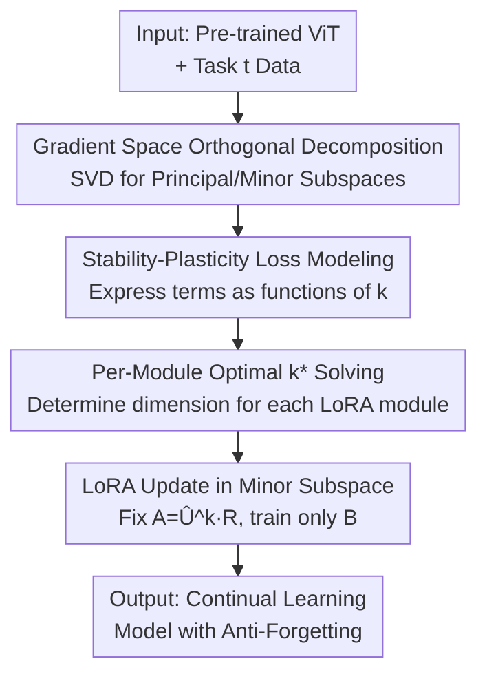

# SplitLoRA: Balancing Stability and Plasticity in Continual Learning Through Gradient Space Splitting

**Conference**: ICLR 2026  
**OpenReview**: [https://openreview.net/forum?id=Zm1hjXxRQV](https://openreview.net/forum?id=Zm1hjXxRQV)  
**Code**: https://github.com/qhmiao/SplitLoRA  
**Area**: Continual Learning / Parameter-Efficient Fine-Tuning / Representation Learning  
**Keywords**: Continual Learning, Gradient Projection, LoRA, Stability-Plasticity, Minor Subspace

## TL;DR
SplitLoRA transforms the long-standing challenge of "determining the minor subspace dimension" in continual learning from a heuristic threshold into a solvable optimization problem. It derives a theoretical upper bound for "Stability Loss + Plasticity Loss" as a function of the subspace dimension $k$, solves for the module-specific optimal $k^*$ for each LoRA module, and fixes the LoRA down-projection matrix $A$ to this subspace while training only $B$. It outperforms existing methods by 2%–5% on ImageNet-R, CIFAR-100, and DomainNet.

## Background & Motivation

**Background**: Continual Learning (CL) requires models to learn a sequence of tasks while maintaining "stability" (preserving old knowledge) and "plasticity" (learning new tasks). A dominant approach is **Gradient Projection**: the space spanned by old task gradients is decomposed via SVD into a "principal subspace" (large singular values, carrying old knowledge) and a "minor subspace" (small singular values). New task updates are constrained to the minor subspace to minimize interference. Combined with pre-trained ViT and LoRA (PEFT), this forms strong baselines like InfLoRA and VPT-NSP2.

**Limitations of Prior Work**: The dimension of the minor subspace determines the stability-plasticity balance. A larger $k$ provides more learning capacity (plasticity) but allows more residual old-gradient components (reduced stability). Current methods (e.g., InfLoRA, VPT-NSP2) typically use a **preset threshold** $\tau$: for every module, $k$ is selected such that the cumulative squared singular values are below $\tau$.

**Key Challenge**: This thresholding approach has two fundamental flaws. First, $\tau$ is a hyperparameter with no direct theoretical relationship to the "total loss across all tasks," making its tuning essentially a black-box process. Second, a uniform threshold ignores the fact that different layers and weights carry vastly different amounts of knowledge; a one-size-fits-all threshold is sub-optimal for individual modules.

**Goal**: (1) Formulate an explicit, analyzable relationship between the subspace dimension $k$ and the "upper bound of total loss increment"; (2) Solve for the optimal $k^*$ for **each** LoRA module to balance stability and plasticity.

**Key Insight**: Leveraging the $L$-smooth property of the loss function, the authors derive an upper bound for the "total loss change after one update step." This bound naturally splits into a stability term and a plasticity term, both monotonic with $k$ but in opposite directions. Selecting $k$ thus becomes an optimization problem of minimizing the sum of these two terms.

**Core Idea**: Use the theoretically grounded optimization target of "minimizing the upper bound of Stability Loss + Plasticity Loss" to determine the optimal minor subspace dimension $k^*$ per module, replacing global heuristic thresholds.

## Method

### Overall Architecture
SplitLoRA follows the "Gradient Projection + LoRA" framework but replaces the heuristic subspace splitting with a theoretically supported per-module optimization. During task $t$, the pipeline is as follows: train the current task's LoRA normally, accumulate the average gradient of tasks $1{\sim}t{-}1$ as $G^{old}_t$ (Eq. 3), and perform SVD on $G^{old}_t$. The last $k$ left singular vectors form the minor subspace $\hat U^k_t$. Crucially, instead of using a threshold, $k$ is determined by solving an optimization problem for **each LoRA module** based on the stability/plasticity loss model. Finally, the LoRA matrix $A_t = \hat U^k_t R$ is fixed to the subspace, and only $B_t$ is trained, ensuring updates remain in low-interference directions.

### Key Designs

**1. Stability-Plasticity Loss Bound Modeling: Transforming Thresholds into Analyzable Functions**

To address the lack of theoretical grounding in $\tau$, the authors derive a **loss increment upper bound** (Proposition 4.1). Assuming the loss is $L$-smooth and previous updates were orthogonal to old gradients, the total loss change from $W_{t-1}$ to $W_t = W_{t-1} + \Delta W_t$ is bounded by:

$$\sum_{i=1}^{t}\big(L_i(W_t)-L_i(W_{t-1})\big) \le \underbrace{(t-1)\langle \Delta W_t, G^{old}_t\rangle}_{\text{Stability Loss}} + \underbrace{\langle \Delta W_t, G_t\rangle}_{\text{Plasticity Loss}} + \frac{(t-1)L}{2}\lVert\Delta W_t\rVert_F^2 .$$

The first term (alignment between update and old gradients) represents stability loss/interference. The second term (alignment between update and new gradient) represents plasticity/learning progress. By substituting the projected update $\Delta\hat W_t = \hat U^k_t \hat U^{k\top}_t \Delta W_t$ and defining an error function $\epsilon(k)=\frac{\sum_{i=d-k+1}^{d}\sigma_i}{\sum_{1=1}^{d}\sigma_i}$ for the secondary components, the expected closed-form for both terms is derived (Theorem 4.2):

$$\mathbb{E}[L^S_t(W_t)] = (t-1)\,\epsilon_t(k_t)\,\langle \Delta W_t, G^{old}_t\rangle,\qquad \mathbb{E}[L^P_t(W_t)] = \frac{k_t}{d}\langle \Delta W_t, G_t\rangle .$$

This step maps "subspace size" to "total loss" using $\epsilon(k)$ and $k/d$. As $k$ increases, plasticity improves while stability worsens, creating a trade-off with an optimizable expression.

**2. Per-Module Optimal Subspace Solving: Independent $k^*$ for Each LoRA Module**

With the expected terms defined, selecting $k$ becomes minimizing their sum: $k^*_t = \arg\min_k\big(\mathbb{E}[L^S_t] + \mathbb{E}[L^P_t]\big)$ (Eq. 13). Since $\Delta W_t$ and $G_t$ change during training while the subspace must be fixed beforehand, the authors introduce a ratio parameter $\alpha = -\frac{\langle \Delta W_t, G_t\rangle}{\langle \Delta W_t, G^{old}_t\rangle}$ ($\alpha > 0$ as typically $\langle\Delta W_t,G_t\rangle<0$ and $\langle\Delta W_t,G^{old}_t\rangle>0$), rewriting the objective solely in terms of $k$:

$$k^*_t = \arg\min_k\Big((t-1)\,\epsilon_t(k_t) - \alpha\,\frac{k_t}{d}\Big).$$

Since $k$ is an integer in $[1, d]$, it is solved by simple traversal. $\alpha$ is treated as a **fixed hyperparameter** controlling the stability-plasticity trade-off. Crucially, this optimization is performed **per LoRA module**, providing a targeted correction to InfLoRA's uniform global threshold.

**3. LoRA Update in Minor Subspace: Fixing $A$, Training $B$**

To ensure updates strictly fall within the minor subspace, LoRA updates $\Delta W_t = A_t B_t$ are constrained by fixing the down-projection matrix:

$$A_t = \hat U^k_t R,$$

where $\hat U^k_t \in \mathbb{R}^{d \times k}$ are the orthonormal bases of the minor subspace and $R \in \mathbb{R}^{k \times r}$ is a random Gaussian matrix. By **fixing $A_t$ and optimizing only $B_t$**, the update direction is locked within $\hat U^k_t$, achieving the effect of gradient projection without requiring explicit projection transforms at every step. This requires only 1 extra forward pass per task (vs. 2 for InfLoRA), and memory does not scale with the number of tasks.

### Loss & Training
The backbone is an ImageNet-21K pre-trained ViT-Base with LoRA rank $r=10$ and embedding dimension $D=768$. SplitLoRA modules are inserted into the key/value projections. Default $\alpha=20$, optimized with AdamW. Learning rates: $1\mathrm{e}{-3}$ for LoRA and $1\mathrm{e}{-2}$ for the head. Batch size 256, 10 epochs per task. After each task, a single pass over the data is performed to compute the average gradient for updating $G^{old}_t$.

## Key Experimental Results

### Main Results
On ImageNet-R with 5/10/20 task splits, reporting Final Average Accuracy (FAA) and Cumulative Average Accuracy (CAA):

| Setting | Metric | InfLoRA (CVPR24) | VPT-NSP2 (NeurIPS24) | SplitLoRA | Gain |
|------|------|------|------|------|------|
| 5-task | FAA | 79.82 | 79.71 | **81.92** | +2.1 |
| 10-task | FAA | 78.10 | 79.35 | **81.00** | +1.7 |
| 20-task | FAA | 73.81 | 76.72 | **78.82** | +2.1 |
| 20-task | CAA | 81.02 | 82.91 | **84.57** | +1.7 |

Results on CIFAR-100 (10 tasks) and DomainNet (5 tasks):

| Dataset | Metric | Prev. SOTA | SplitLoRA |
|--------|------|----------|-----------|
| CIFAR-100 | FAA | 88.76 (CoSO) | **90.33** |
| CIFAR-100 | CAA | 92.99 (CoSO) | **93.70** |
| DomainNet | FAA | 83.83 (VPT-NSP2) | **84.31** |
| DomainNet | CAA | 88.63 (VPT-NSP2) | **88.99** |

### Ablation Study

| Config | Key Metric (IN-R 5/10/20 FAA) | Description |
|------|------|------|
| $A_t$=Random Init | 76.57 / 76.13 / 72.30 | No projection; high plasticity but high interference |
| $A_t$=InfLoRA Threshold | 78.92 / 78.10 / 73.81 | Global threshold splitting |
| $A_t=\hat U^k R$ (Ours) | **81.92 / 81.00 / 78.82** | Module-specific optimal subspace projection |

Efficiency (ImageNet-R 10 tasks): SplitLoRA requires only 1 extra forward pass per task. Memory usage (23.03 GB) and time (1h43m) are comparable to or better than InfLoRA (23.06 GB / 1h48m).

### Key Findings
- **Initialization of $A_t$ is decisive**: Replacing random initialization with module-specific optimal projection improves 20-task FAA from 72.30 to 78.82 (+6.5 points), validating the superiority of the $k^*$ optimization.
- **High Robustness to $\alpha$**: FAA remains stable between 78–82 across $\alpha$ values from 1 to 30, consistently outperforming InfLoRA without tedious fine-tuning.
- **Scalability with task count**: The performance gain is sustained or increased as the number of tasks grows (e.g., 20-task split), suggesting per-module balancing is more critical in long-sequence scenarios.

## Highlights & Insights
- **Heuristic to Optimization**: The conversion of a subspace dimension hyperparameter into an optimizable target based on loss bounds provides theoretical grounding to a previously empirical design.
- **Granular Control**: Addressing the variance in knowledge across different layers via per-module $k^*$ selection is a targeted and effective improvement over global thresholding.
- **Engineering Elegance**: Constructing $A = \hat U^k R$ to "bake" the subspace constraint into the LoRA structure reduces computational overhead and simplifies the implementation of gradient projection.

## Limitations & Future Work
- Experiments are restricted to ViT-Base and image classification; performance in NLP, multi-modal, or larger backbone scenarios remains unverified.
- $\alpha$ is a manually fixed hyperparameter; ideally, it should adapt dynamically during training.
- The theoretical bound relies on the $L$-smooth assumption and neutral gradient distribution, which may result in a gap between $k^*$ and the true empirical optimum.
- Calculating the average gradient and storing $G^{old}$ requires a data pass and storage that may become significant for extremely long task sequences.

## Related Work & Insights
- **vs InfLoRA / VPT-NSP2**: These use a global threshold $\tau$ for subspace splitting; SplitLoRA introduces per-module optimization for $k^*$ based on stability-plasticity trade-offs, improving balance and efficiency (1 vs. 2 extra forward passes).
- **vs GPM**: GPM established the orthogonal decomposition paradigm. SplitLoRA migrates this to the PEFT/LoRA setting while providing a theoretical solution for the "dimension selection" problem.
- **vs SD-LoRA / C-LoRA**: Unlike other LoRA-CL methods that focus on scaling or combining LoRA modules, SplitLoRA focuses on explicitly embedding the anti-forgetting subspace constraint into the LoRA matrix $A$.

## Rating
- Novelty: ⭐⭐⭐⭐ (Solid theoretical refinement of subspace selection)
- Experimental Thoroughness: ⭐⭐⭐⭐ (Strong benchmarks and efficiency analysis, though limited to CV)
- Writing Quality: ⭐⭐⭐⭐ (Clear derivation-to-algorithm mapping)
- Value: ⭐⭐⭐⭐ (Practical and effective improvement over SOTA LoRA-CL baselines)

<!-- RELATED:START -->

## Related Papers

- [\[CVPR 2026\] Exemplar-Free Continual Learning for State Space Models](../../CVPR2026/self_supervised/exemplar-free_continual_learning_for_state_space_models.md)
- [\[ICLR 2026\] Equivariant Splitting: Self-supervised learning from incomplete data](equivariant_splitting_self-supervised_learning_from_incomplete_data.md)
- [\[CVPR 2026\] DGS: Dual Gradient and Semantic-Shift Guided Low-Rank Adaptation for Class Incremental Learning](../../CVPR2026/self_supervised/dgs_dual_gradient_and_semantic-shift_guided_low-rank_adaptation_for_class_increm.md)
- [\[CVPR 2026\] Parameter-efficient Continual Learning for Enhancing Plasticity without Forgetting under Limited Model Capacity](../../CVPR2026/self_supervised/parameter-efficient_continual_learning_for_enhancing_plasticity_without_forgetti.md)
- [\[ICLR 2026\] Symmetric Space Learning for Combinatorial Generalization](symmetric_space_learning_for_combinatorial_generalization.md)

<!-- RELATED:END -->
