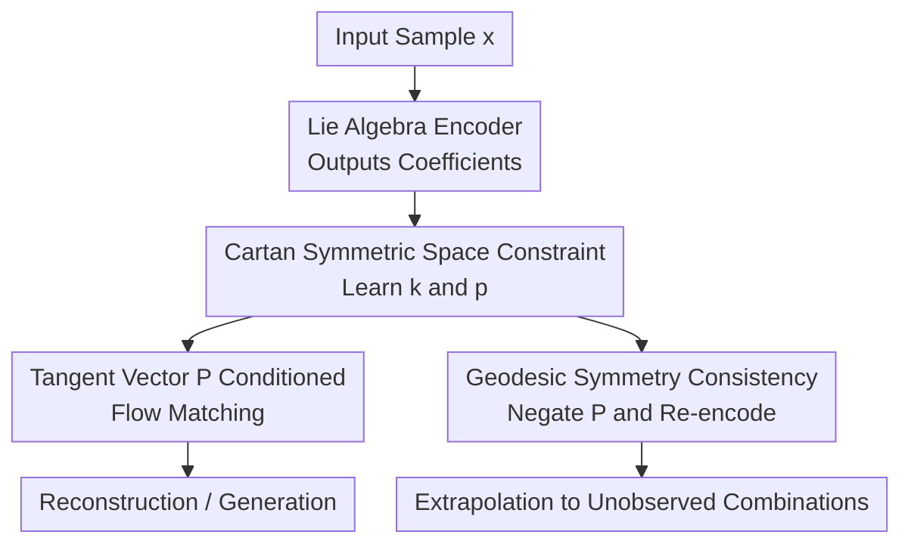

# Symmetric Space Learning for Combinatorial Generalization

**Conference**: ICLR 2026  
**OpenReview**: [https://openreview.net/forum?id=e8t9F4vX9N](https://openreview.net/forum?id=e8t9F4vX9N)  
**Code**: Not provided  
**Area**: Self-Supervised Learning / Representation Learning / Combinatorial Generalization  
**Keywords**: [Combinatorial Generalization, Symmetric Spaces, Lie Algebra, Geodesic Symmetry, Flow Matching]  

## TL;DR

This paper proposes CartanFM, which constrains the latent representation space to a symmetric space. By utilizing Cartan decomposition and geodesic symmetry consistency, the model extrapolates symmetries from observed combinations to unobserved ones. It significantly outperforms VAEs and existing symmetry learning methods on combinatorial generalization benchmarks such as dSprites, 3D Shapes, and MPI3D.

## Background & Motivation

**Background**: Combinatorial Generalization (CG) focuses on whether a model can generalize from seen combinations of semantic factors to new, unseen combinations. For instance, a training set might contain specific shapes, colors, and positions, but not a particular combination of them. An ideal representation learning model should understand these factors independently rather than just memorizing the joint distribution of the training set.

**Limitations of Prior Work**: A major research direction involves using symmetry or group actions to model semantic changes. Intuitively, transformations like translation, rotation, and scaling can be viewed as altering specific factors while maintaining object identity. However, the paper notes that existing symmetry learning methods typically learn group actions only from observed samples. When training data covers only a portion of the semantic manifold, the learned transformations are easily restricted to observed regions and fail to naturally reach unobserved areas.

**Key Challenge**: The issue is not that group theory cannot express global symmetry, but that the model only sees local data. If transformations on the training set are directly treated as transformations of the entire space, the model lacks a principled mechanism to define how "the same symmetry should extend to unseen combinations." The authors term this gap "symmetry generalization": a symmetry group $G_{obs}$ learned from $X_{obs}$ may not contain an element $g \in G_{obs}$ such that $g \cdot x_{obs}$ generates $x_{new} \in X \setminus X_{obs}$.

**Goal**: The paper aims to construct a representation space where the model can not only learn local transformations within observed regions but also extrapolate these transformations to unobserved regions using geometric structures. Specifically, the authors address two sub-problems: first, the underlying symmetry group and stabilizer subgroups of real data are unknown; second, structures learned solely from observations require additional constraints to remain consistent for unobserved combinations.

**Key Insight**: The authors select symmetric spaces as a geometric prior for the latent space. Symmetric spaces are a special class of homogeneous spaces with a strong global geometric structure and a workable local property: geodesics near any point can be "reflected" through that point. In a tangent space centered at the origin, this geodesic symmetry simplifies to $P \mapsto -P$, allowing the generation of unseen samples and enforcement of encoding consistency as a trainable self-supervised signal.

**Core Idea**: Impose a symmetric space structure on the latent space using a learnable Cartan decomposition of Lie algebras, then use geodesic symmetry consistency to negate and re-encode representations of observed samples, forcing the model to learn symmetries that transcend the training regions.

## Method

### Overall Architecture

The proposed method, CartanFM, integrates representation learning, symmetric space geometry, and Flow Matching generative models. Input samples pass through a Lie Algebra Encoder to obtain a tangent vector $P$ in the Lie algebra subspace $\mathfrak{p}$. This $P$ serves both as a condition for the Conditional Flow Matching generation process and as a participant in the Cartan Loss and Geodesic Symmetry Consistency Loss, which constrain the local algebraic structure and consistency in unseen regions, respectively.

From a training perspective, CartanFM employs two complementary paths. The main path uses $P$ to condition the vector field, enabling the model to reconstruct or generate data. The geometric structure path organizes learnable basis matrices into a $\mathfrak{k} \oplus \mathfrak{p}$ structure consistent with Cartan decomposition. It utilizes $-P$ to approximate geodesic reflection in symmetric spaces, creating a self-supervised loop to verify if the encoder maps the "reflected sample" back to the negated tangent vector.

### Key Designs

**1. Symmetry Generalization: Localizing CG Failure to "Non-Extrapolatable Symmetries"**

A primary conceptual contribution is reframing the shortcomings of prior symmetry learning: the problem is not just "lack of disentanglement" but that "symmetry itself does not generalize." If training data only covers a subset $X_{obs}$ of the full semantic space $X$, the learned $G_{obs}$ only explains transformations between observed samples. There is no guarantee that $g \cdot x_{obs} = x_{new}$ for an unseen combination $x_{new}$. This redefines the problem from an empirical benchmark failure to a clear structural gap: the model needs a geometric operation defined beyond the observed regions. Symmetric spaces provide a trainable handle for this; while global group actions are hard to learn, the geodesic reflection property ($P$ vs $-P$) allows for cross-region extrapolation constraints without explicitly knowing the full group action.

**2. Cartan Loss: Modeling the Latent Space via Learnable Lie Algebra Bases**

To ensure the latent representation possesses the algebraic structure of a symmetric space without predefining a specific Lie group, the authors learn two sets of basis matrices: $\{K_i\}$ for the subalgebra $\mathfrak{k}$ and $\{P_j\}$ for the tangent space $\mathfrak{p}$. The encoder outputs coefficients $c_k$ and $c_p$ to linearly combine these into $K = \sum_i c_{k,i}K_i$ and $P = \sum_j c_{p,j}P_j$. $P \in \mathfrak{p}$ is used as the Flow Matching condition. The Cartan Loss enforces the Cartan decomposition requirements for $\mathfrak{g}=\mathfrak{k}\oplus\mathfrak{p}$ via three Lie bracket relations: $[\mathfrak{k},\mathfrak{k}]\subseteq\mathfrak{k}$, $[\mathfrak{k},\mathfrak{p}]\subseteq\mathfrak{p}$, and $[\mathfrak{p},\mathfrak{p}]\subseteq\mathfrak{k}$. These are transformed into projection errors or orthogonality constraints at the basis level, allowing the network to discover local algebraic coordinates.

**3. Geodesic Symmetry Consistency (GSC): Self-Supervised Loops for Unseen Combinations**

Cartan Loss alone is insufficient as it primarily learns local structures based on observations. The GSC Loss transforms the geodesic reflection of symmetric spaces into a training signal: an observed sample $x_{obs}$ is encoded to $P$, a candidate sample is generated using $-P$, and this candidate is re-encoded with the requirement that its representation approaches $-P$. This candidate sample effectively represents a "symmetric position" relative to the origin, which likely corresponds to a combination of factors unseen in the training set. To reduce cost, the implementation uses a one-step approximation: $L_{GSC}=\mathbb{E}\|Encoder(x_0+(1-\sigma_{min})v(x_0,0,-P;\theta))+P\|^2$.

**4. Flow Matching Conditional Generation: Decoding Lie Algebra Representations**

The Cartan structure is integrated with Conditional Flow Matching (CFM) rather than a standard VAE. CFM learns a probability flow from a noise distribution to the data distribution, with the vector field $v(x,t,P)$ conditioned on $P$. This choice aligns with the goal: the Cartan structure provides geometric directions in the tangent space, while Flow Matching provides a differentiable, continuous, and conditioned generative dynamical system that maps these directions to changes in the data space.

### Loss & Training

The complete objective function consists of generation loss, VAE-style regularization, and two geometric losses:  
$$L=L_{CFM}+\beta L_{KL}+\lambda_{Cartan}L_{Cartan}+\lambda_{GSC}L_{GSC}+\epsilon L_{basis}$$  
$L_{basis}=\sum_i 1/\|K_i\|_1 + \sum_j 1/\|P_j\|_1$ prevents the learnable bases from collapsing to zero. For image tasks, hyperparameter settings include $\lambda_{Cartan}=1.0$, $\lambda_{GSC}=1.0$, $\epsilon=0.001$, and $\beta=0.01$. The generation module uses a simplified UNet with AdaGN to inject Lie algebra conditions, and an Euler ODE solver is used for decoding.

## Key Experimental Results

### Main Results

The主实验 (Main Results) demonstrate the model's superiority across multiple benchmarks. In a 3D spherical point cloud task where training data only covers a 270-degree arc, CartanFM reliably reconstructs the unobserved 90-degree arc.

| Task / Dataset | Metric | Ours | Prev. SOTA / Baseline | Gain |
|--------|------|------|----------|------|
| Sphere Unseen 90° Arc | Chamfer distance ↓ | 0.0061 | Vanilla VAE: 0.0601 | ~89.9% reduction |
| dSprites R2R Case1 | MSE ↓ | 7.02 | MAGANet: 115.46 | Significant improvement |
| 3D Shapes R2E Case1 | MSE ↓ | 5.20 | CLGVAE: 15.54 | Over 2x improvement |
| MPI3D R2R Case2 | MSE ↓ | 0.76 | MAGANet: 7.71 | Order of magnitude gain |

### Ablation Study

Ablations analyze the contributions of $L_{Cartan}$ and $L_{GSC}$. Both improve performance individually, but the combination is most stable, especially in R2R settings requiring out-of-range extrapolation.

| Dataset / Case | Configuration | Key Metric (MSE ↓) |
|------|---------|------|
| dSprites R2R Case1 | w/o $L_{Cartan}$, w/o $L_{GSC}$ | 29.06 |
| dSprites R2R Case1 | Only $L_{GSC}$ | 13.11 |
| dSprites R2R Case1 | Full Model | 7.02 |

### Key Findings

- **Synergy**: The failure of Cartan+VAE suggests that learning algebraic structures requires a generative process compatible with tangent vector conditions (like Flow Matching).
- **Extrapolation**: GSC is critical for R2R splits, where test combinations fall outside the training range.
- **Robustness**: CartanFM outperforms explicit symmetry methods (MAGANet, CLGVAE) which often fail when the training set does not fully represent the group action.

## Highlights & Insights

- **Problem Framing**: Defining the bottleneck as "symmetry generalization" provides a clear theoretical gap to address in representation learning.
- **Cartan Implementation**: The method successfully translates abstract symmetric space theory into concrete, optimizable Lie bracket regularization terms for neural networks.
- **GSC Paradigm**: Using geometric involutions (like $P \mapsto -P$) to generate and regularize unseen regions is a powerful paradigm that could extend to other domains like robotics or physics.

## Limitations & Future Work

- **Geometric Assumptions**: The latent manifold must approximate a symmetric space, and negation must correspond to meaningful semantic reflection, which may not hold for highly discrete or asymmetric data.
- **Approximation Error**: The one-step Flow Matching approximation in GSC may introduce bias.
- **Scalability**: Higher computational costs (approx. 30 hours per run) and memory requirements may hinder scaling to high-resolution images or larger models.

## Related Work & Insights

- **vs CLGVAE**: While CLGVAE focuses on commutative Lie group structures for disentanglement, CartanFM allows for non-commutative structures and focuses on extrapolation to unobserved regions.
- **vs MAGANet**: Unlike MAGANet which learns group actions from data, CartanFM uses geometric priors to ensure symmetries remain defined even where data is missing.
- **Insight**: Combinatorial generalization requires not just factor disentanglement, but also the preservation of geometric relationships between those factors across the entire latent manifold.

## Rating

- **Novelty**: ⭐⭐⭐⭐⭐ Formalizing "symmetry generalization" and applying Cartan decomposition provides a unique geometric solution.
- **Experimental Thoroughness**: ⭐⭐⭐⭐☆ Solid benchmarks and ablations, though evaluation on non-visual or high-complexity real-world data is pending.
- **Writing Quality**: ⭐⭐⭐⭐☆ Clear methodology, though requires background in differential geometry.
- **Value**: ⭐⭐⭐⭐⭐ Significant implications for representation learning beyond simple benchmarks.

<!-- RELATED:START -->

## Related Papers

- [\[ICLR 2026\] Self-Predictive Representations for Combinatorial Generalization in Behavioral Cloning](self-predictive_representations_for_combinatorial_generalization_in_behavioral_c.md)
- [\[ICLR 2026\] MaskCO: Masked Generation Drives Effective Representation Learning and Exploiting for Combinatorial Optimization](maskco_masked_generation_drives_effective_representation_learning_and_exploiting.md)
- [\[ICLR 2026\] SplitLoRA: Balancing Stability and Plasticity in Continual Learning Through Gradient Space Splitting](splitlora_balancing_stability_and_plasticity_in_continual_learning_through_gradi.md)
- [\[ICLR 2026\] PonderLM: Pretraining Language Models to Ponder in Continuous Space](ponderlm_pretraining_language_models_to_ponder_in_continuous_space.md)
- [\[CVPR 2026\] Learning by Analogy: A Causal Framework for Compositional Generalization](../../CVPR2026/self_supervised/learning_by_analogy_a_causal_framework_for_compositional_generalization.md)

<!-- RELATED:END -->
## Related Papers

- [\[ICLR 2026\] Self-Predictive Representations for Combinatorial Generalization in Behavioral Cloning](self-predictive_representations_for_combinatorial_generalization_in_behavioral_c.md)
- [\[ICLR 2026\] MaskCO: Masked Generation Drives Effective Representation Learning and Exploiting for Combinatorial Optimization](maskco_masked_generation_drives_effective_representation_learning_and_exploiting.md)
- [\[ICLR 2026\] SplitLoRA: Balancing Stability and Plasticity in Continual Learning Through Gradient Space Splitting](splitlora_balancing_stability_and_plasticity_in_continual_learning_through_gradi.md)
- [\[CVPR 2026\] Learning by Analogy: A Causal Framework for Compositional Generalization](../../CVPR2026/self_supervised/learning_by_analogy_a_causal_framework_for_compositional_generalization.md)
- [\[ICLR 2026\] PonderLM: Pretraining Language Models to Ponder in Continuous Space](ponderlm_pretraining_language_models_to_ponder_in_continuous_space.md)

<!-- RELATED:END -->
