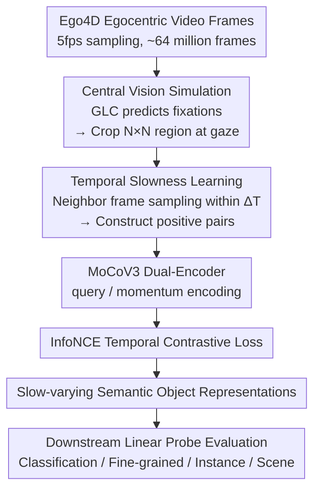

# Temporal Slowness in Central Vision Drives Semantic Object Learning

**Conference**: ICLR2026  
**arXiv**: [2602.04462](https://arxiv.org/abs/2602.04462)  
**Code**: None  
**Area**: Self-supervised Learning  
**Keywords**: central vision, temporal slowness, self-supervised learning, Ego4D, semantic representation

## TL;DR
By simulating human central vision (fixation-based cropping) and the temporal slowness principle (temporal contrastive learning), this work trains an SSL model on Ego4D data. The findings suggest that the combination of these two effectively enhances semantic object representations—central vision strengthens foreground extraction, while temporal slowness distills semantic information during fixations.

## Background & Motivation

### Background

**Background**: Humans acquire semantic object representations from egocentric visual streams with minimal supervision, yet SSL models perform poorly when trained on human-like visual experiences.

**Limitations of Prior Work**: Existing SSL models ignore two key biological processes: (1) central high-resolution processing of the retina (central vision), and (2) the tendency for temporally close inputs to obtain similar representations (slowness principle).

**Key Challenge**: Full-field training mixes foreground and background information, and it fails to leverage temporal object tracking information.

**Goal**: To investigate the roles of central vision and temporal slowness in the formation of semantic object representations.

**Key Insight**: Utilize a fixation prediction model on Ego4D (representing 5 months of visual experience) to generate gaze coordinates, crop the central visual field region, and train a temporal contrastive SSL model.

## Method

### Overall Architecture

This work addresses the question of whether incorporating two biological constraints of human vision—processing only the center of the visual field with high resolution and mapping temporally close inputs to similar representations—into self-supervised learning (SSL) can lead to better semantic object representations. The researchers do not alter the model architecture; instead, they modify only the data pipeline. First, egocentric videos from Ego4D are sampled at 5fps, resulting in approximately 64 million frames. For each frame, a Gaze Labeled Center (GLC) model estimates where a human would look, and an $N \times N$ central region is cropped around this fixation point as the model input. Next, a neighboring frame within a temporal window $\Delta T$ is randomly sampled as a positive sample for an InfoNCE-based temporal contrastive loss using a MoCoV3 query/momentum dual-encoder. In summary: **"Where to look" is determined by central vision, and "what constitutes the same object" is determined by temporal slowness.** The resulting slow-varying representations are evaluated via linear probing on downstream tasks including classification, fine-grained recognition, instance recognition, and scene understanding.

### Key Designs

**1. Central Vision Simulation: Concentrating Training Focus Around Fixation Points**

A flaw in full-field training is the mixing of foreground objects and background scenes, causing learned features to incorporate background layouts irrelevant to object semantics. This work modifies only the data side: it uses the GLC model (Lai et al., 2024), which utilizes spatiotemporal information to generate saliency maps for each frame, taking the most salient pixel $(x_g, y_g)$ as the gaze coordinate. An $N \times N$ area centered at this coordinate is cropped as the input, simulating foveal high-resolution processing. The crop size $N$ is a critical hyperparameter: if too small (e.g., 112), object information is lost; if too large, it reverts to full-field training. Experiments show that 224–336 is the "sweet spot." Its effectiveness is most evident in ImageNet-9 foreground/background analysis—replacing the background drops accuracy by only 10%, whereas replacing the foreground drops it by 20%, indicating the model focuses its discriminative criteria on foreground objects.

**2. Temporal Slowness Learning: Replacing Spatial Augmentation with Temporal Neighbors**

Standard SSL relies on spatial augmentations like cropping, flipping, and color jittering to generate two views of the same image, which differs significantly from human learning. This work follows the slowness principle (where temporally adjacent inputs should map to similar representations), replacing the positive pair construction method. For an anchor frame $x_t$, a positive sample $x_{t'}$ is randomly sampled from a temporal window $\Delta T$ within the same video, representing different moments of the same scene. $\Delta T$ defines the proximity of what constitutes the "same object." If the window is too large, different objects switched after a saccade might be incorrectly paired; if it is too small, it degrades into static augmentation. Optimal windows were found to be $\Delta T=3$ for ResNet50 and $\Delta T=1$ for ViT. The authors further point out that what truly matters is the contrast within small windows during fixations, where different perspectives of the same object and semantic associations between co-occurring objects are distilled into the representation.

### Loss & Training

The contrastive objective follows MoCoV3's InfoNCE. The query encoder $f_q$ computes the anchor embedding $q_t = f_q(x_t)$, and the momentum encoder $f_k$ computes the neighbor embedding $k_{t'} = f_k(x_{t'})$. The loss is minimized for each positive pair $(q_t, k_{t'})$:

$$\mathcal{L}_{q_t} = -\log \frac{\exp\bigl(\mathrm{sim}(q_t, k_{t'})/\tau\bigr)}{\sum_{i=0}^{K}\exp\bigl(\mathrm{sim}(q_t, k_i)/\tau\bigr)}$$

where $\mathrm{sim}$ is cosine similarity, $\tau$ is temperature, and $K$ is the number of negative samples from $f_k$ in the same batch. Intuitively, it pulls temporally adjacent views together and pushes other batch views away. Momentum encoder parameters are updated via Exponential Moving Average (EMA): $\theta_k \leftarrow m\theta_k + (1-m)\theta_q$. A notable training detail is that the model approaches saturation after just a **single epoch** on the 64 million frames, with a second epoch adding only ~0.5% Gain—this highlights the high temporal redundancy of Ego4D at 5fps.

## Key Experimental Results

### Main Results

| Method | ImageNet-1k | Fine-grained Avg. | Instance Recognition |
|------|------------|-----------|---------|
| Frames Learning (Full-field, No Slowness) | 49.50 | Baseline | Baseline |
| **Bio-inspired** (Central + Slowness) | **49.58** | **Gain** | **Gain** |

### Key Findings
- Central vision strengthens feature extraction for foreground objects (vs. background).
- Temporal slowness during fixations distills broader semantic information (category, contextual co-occurrence).
- The model aligns more closely with human semantic judgments (CKA analysis).
- The two are complementary: Central vision provides "what," while slowness provides "semantic associations."

## Ablation Study

| Ablation / Analysis | Finding |
|-----------|------|
| Crop Size $N$ | 224-336 is the sweet spot; N=112 is too small; full frames benefit scenes but hurt objects. |
| Temporal Window $\Delta T$ | Best $\Delta T=3$ for ResNet50, $\Delta T=1$ for ViT. |
| Foreground vs. Background | Central vision reduces the importance of background features (verified via ImageNet-9). |
| Fixation vs. Saccade | Temporal contrastive learning during fixations (small windows) distills the richest info. |
| Object Co-occurrence CKA | Bio-inspired models show higher CKA alignment with GloVe co-occurrence embeddings. |
| Training Epochs | Returns saturate after one epoch (second epoch adds only +0.5%) due to 5fps redundancy. |

### ImageNet-9 Foreground/Background Analysis

| Model | Normal Accuracy | Background Removal Acc. Change | Foreground Removal Acc. Change |
|------|-----------|----------------|----------------|
| Frames Learning (Full) | 75% | -15% | -5% |
| **Bio-inspired** (Central + Slowness) | **80%** | **-10%** | **-20%** |

→ Indicates central vision makes the model more dependent on foreground objects than background—aligning with human visual processing.

### Semantic Dimension Performance (ResNet50)

| Semantic Dimension | Frames Learning | Bio-inspired | Gain |
|----------|----------------|-------------|------|
| Category Recognition Avg. | 45.65 | **46.94** | +1.29 |
| Fine-grained Recognition Avg. | 33.84 | **38.42** | **+4.58** |
| Instance Recognition Avg. | 59.03 | **67.00** | **+7.97** |
| Scene Recognition (Places365) | **43.02** | 42.95 | -0.07 |

## Highlights & Insights
- **Interdisciplinary Integration**: Combines "temporal slowness principle" and "central vision" from computational neuroscience with SSL to validate neuroscience hypotheses through computational experiments.
- **Complementarity**: Central vision identifies "what to look at" (strengthens foreground features), while temporal slowness identifies "how to associate" (different views of the same object, co-occurring objects).
- **Explanation for Scene Degradation**: Full-field images contain more background/spatial layout information beneficial for scene recognition; central vision crops this information out.
- **Inspiration for Embodied AI**: Robotic visual processing can mimic humans by processing only the area around fixations at high resolution, significantly reducing computational load.
- **Semantic Distillation during Fixations**: A brilliant discovery showing that human "seeing" is not just data collection; even while staying still, time-consistency is used to learn invariant representations.

## Limitations & Future Work
- The absolute performance gain is modest (category recognition +1.29%), suggesting its value lies more in scientific understanding than engineering benchmarks.
- Errors introduced by the gaze prediction model (GLC)—real human gaze data only accounts for 45 hours, while the remaining 3600+ hours rely on predictions.
- Evaluation is primarily on ResNet50 and ViT-B/16; validation on larger models (e.g., ViT-L) is missing.
- Saturation after one epoch on Ego4D may be due to data redundancy rather than being an inherent property of the method.
- Lacks direct comparison with other specialized egocentric SSL methods (e.g., EgoVLP, VC-1).

## Related Work & Insights
- **vs. R3M (Nair et al.)**: R3M learns slow-varying representations on Ego4D for robotics but uses full-field views; this work adds central vision cropping to further improve object features.
- **vs. DINO/MoCo**: Standard SSL relies on spatial augmentations; this work replaces them with temporal neighbors, aligning closer to biological learning.
- **vs. Orhan et al. (2024)**: Their egocentric SSL training ignores the specific role of central vision.
- **vs. VIP (Ma et al.)**: VIP learns video prediction representations focusing on temporal progress; this work focuses on temporal slowness.
- **Insight**: The combination of central vision + temporal slowness can serve as a data processing strategy for visual foundation model pre-training—modifying data sampling rather than model architecture.

## Rating
- Novelty: ⭐⭐⭐⭐ Innovative combination of bio-inspiration and SSL with scientific value.
- Experimental Thoroughness: ⭐⭐⭐⭐ Multidimensional analysis (classification, fine-grained, instance, scene, co-occurrence).
- Writing Quality: ⭐⭐⭐⭐ Clear logic with targeted experimental design.
- Value: ⭐⭐⭐⭐ Scientific contribution to understanding human visual learning and practical inspiration for Embodied AI.

<!-- RELATED:START -->

## Related Papers

- [\[ICLR 2026\] MaskCO: Masked Generation Drives Effective Representation Learning and Exploiting for Combinatorial Optimization](maskco_masked_generation_drives_effective_representation_learning_and_exploiting.md)
- [\[ICLR 2026\] OrthoRF: Exploring Orthogonality in Object-Centric Representations](orthorf_exploring_orthogonality_in_object-centric_representations.md)
- [\[CVPR 2026\] Temporal Representation Enhancement (TRE): Learning to Forget Dominant Patterns for Enhanced Temporal Spiking Features](../../CVPR2026/self_supervised/temporal_representation_enhancement_tre_learning_to_forget_dominant_patterns_for.md)
- [\[ICLR 2026\] PredNext: Explicit Cross-View Temporal Prediction for Unsupervised Learning in Spiking Neural Networks](prednext_explicit_cross-view_temporal_prediction_for_unsupervised_learning_in_sp.md)
- [\[ICLR 2026\] Part-level Semantic-guided Contrastive Learning for Fine-grained Visual Classification](part-level_semantic-guided_contrastive_learning_for_fine-grained_visual_classifi.md)

<!-- RELATED:END -->
