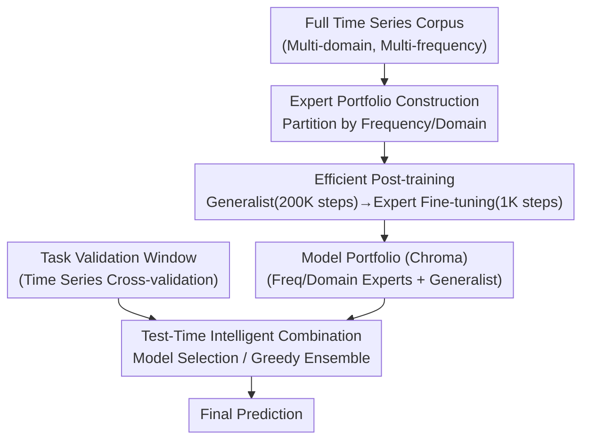

# Test-Time Efficient Pretrained Model Portfolios for Time Series Forecasting

**Conference**: ICLR 2026  
**arXiv**: [2510.06419](https://arxiv.org/abs/2510.06419)  
**Code**: None  
**Area**: Time Series / Foundation Models  
**Keywords**: Model Portfolios, Mixture of Experts, Test-Time Selection, Time Series Foundation Models, Chronos-Bolt

## TL;DR

Chroma is proposed as a framework for small pretrained time series model portfolios. By producing frequency/domain experts from a generalist model through post-training (achieving 10× training acceleration) and combining them via test-time model selection or greedy ensemble, a portfolio with 4M parameters matches the performance of large monolithic models with 205M-500M parameters on Chronos Benchmark II, while maintaining inference computation far below that of test-time fine-tuning.

## Background & Motivation

**Background**: Time series foundation models (Chronos, TimesFM, Moirai) follow the "bigger is better" scaling paradigm—increasing model parameters (10M-500M) and training data to improve zero-shot forecasting capabilities. However, the high training and inference costs of large models limit practical deployment.

**Limitations of Prior Work**:

1. Monolithic large models treat all domains/frequencies equally → However, time series characteristics vary significantly across different domains (energy/retail/weather) and frequencies (minute/hour/monthly).
2. Diminishing marginal returns of "bigger is better" → Improvements from Mini (9M) to Base (205M) are limited.
3. Fine-tuning is the primary way to utilize additional computation at test time → High cost and slow gradient updates.
4. Model portfolio (ensemble/selection) strategies, proven effective in NLP/CV, have not yet been introduced to time series foundation models.

**Key Challenge**: In the generalization error of foundation models, bias is significantly larger than variance → Traditional ensemble variance reduction has limited effect → It is necessary to reduce bias for specific sub-domains through specialization, and then achieve overall bias reduction through intelligent combination.

**Goal**: Instead of training one giant generalist model, multiple small expert models are trained → At test time, they are intelligently selected or combined based on validation set performance.

## Method

### Overall Architecture

Chroma aims to answer: Do time series foundation models necessarily have to be "larger"? Its answer is to replace one large generalist model with a set of small experts. In the training phase, a generalist model is first trained on the full corpus, then the data is partitioned into several sub-sectors based on metadata to produce corresponding experts through brief post-training (1K steps). These, along with the generalist model, form the model portfolio (Chroma). During the testing phase for a new task, each model in the portfolio is evaluated on a validation window to select the most suitable expert or combine several experts via weighted averaging for prediction. The implementation is built on Chronos-Bolt (T5 encoder-decoder), with individual models having only 1M to 9M parameters, ensuring that even when multiple experts are activated, the effective parameters are far fewer than those of 200M+ monolithic models.

### Key Designs

**1. Expert Specialization: Leveraging Data Diversity over Random Seeds**

Ensembles succeed through diversity. While traditional ensembles rely on different random seeds to reduce variance, Chroma partitions training data by metadata to create experts naturally proficient in specific signals. Partitioning occurs across two dimensions: **Frequency** (hourly / daily / weekly / monthly / subhour) to capture time-scale differences, and **Domain** (energy / retail / transport / weather / web, etc.) to capture application domain differences. Each expert is trained only on its specific partition, with a generalist model trained on the full dataset included as a fallback. Experiments show frequency partitioning consistently outperforms domain partitioning (WQL ~4% lower, MASE ~5% lower), aligning with prior work like TTM, as frequency directly determines periodicity and sampling scales more effectively than abstract domains.

**2. Efficient Post-training Construction: Reducing Costs by ~10×**

Training $N$ experts from scratch for 200K steps each would require $200\text{K} \times N$ total steps, which is prohibitive, especially for data-scarce partitions (e.g., yearly sampling). Chroma utilizes a two-stage approach: a generalist model is trained for 200K steps, then fine-tuned for only 1K steps on each data partition to obtain experts. Total cost is reduced to $200\text{K} + 1\text{K} \times N$. Expert fine-tuning accounts for only 0.5% of the generalist training, resulting in a speedup of roughly:

$$\frac{200\text{K} \times N}{200\text{K} + 1\text{K} \times N} \approx 10\times$$

Crucially, experts obtained via post-training show no significant accuracy gap compared to training from scratch and exhibit better scaling behavior.

**3. Test-Time Intelligent Combination: Selection over Naive Averaging**

For a new, unseen task, Chroma uses time series cross-validation on a validation window at the end of the available history. Two strategies are used: **Model Selection** picks the single expert with the lowest validation loss (costing $N+1$ forward passes); **Greedy Ensemble** uses the ensemble selection algorithm (Caruana et al., 2004) to iteratively pick models and weights, resulting in a weighted prediction $\hat{y}_{\text{ens}} = \sum_{m=1}^M w_m \cdot \hat{y}_m$ (selecting ~2.5 models on average, costing $N+2.5$ forward passes). Screening by validation performance is critical: simple averaging or performance-weighted averaging across the entire portfolio performs worse than the generalist model alone (WQL increases by +0.19~+0.24) because systematic bias in foundation models cannot be averaged out; only filtering unsuitable experts truly reduces bias.

## Key Experimental Results

### Main Results: Performance on Chronos Benchmark II

| Model | Parameters | BM2 Relative WQL ↓ |
|------|:---:|:---:|
| Seasonal Naive | - | 1.000 |
| Auto ETS | - | 0.892 |
| Chronos-Bolt Mini (9M) | 9M | 0.835 |
| Moirai-1.1 Large | 311M | ~0.82 |
| Chronos-Bolt Base | 205M | ~0.80 |
| TimesFM-2.0 | 500M | ~0.79 |
| **Chroma 4M (freq, best)** | **4M** | **~0.81** |
| **Chroma tiny (freq, ens.)** | **9M** | **~0.80** |

Chroma matches the performance of 200M+ parameter monolithic models with only 4M active parameters.

### Ablation Study: Portfolio Design Choices

| Method | WQL (Rel. to 1M Generalist) |
|------|:---:|
| Single Generalist (1M) | 1.000 |
| Generalist Ensemble × 5 | 0.987 |
| Domain Experts - Selection | 0.963 |
| Domain Experts - Ensemble | 0.957 |
| **Frequency Experts - Selection** | **0.918** |
| **Frequency Experts - Ensemble** | **0.926** |

Key Insights:

1. **Generalist ensembles are nearly ineffective** (0.987 vs 1.000) → variance reduction is useless as bias dominates.
2. **Frequency Experts > Domain Experts** (~4% WQL advantage).
3. **Model Selection vs. Ensemble shows little difference** → Selection is more computationally efficient.

### Scaling Analysis

| Model Scale | Single Generalist WQL | Chroma (freq best) WQL |
|---------|:---:|:---:|
| 1M | 1.000 | 0.918 |
| 2M | 0.977 | 0.916 |
| 4M | 0.960 | 0.880 |
| 9M (tiny) | 0.958 | 0.909 |

Portfolios follow scaling laws similar to monolithic models (log-log fit), suggesting the method extrapolates to larger scales.

### Test-Time Computational Efficiency

| Method | Test-Time GFLOPs (Rel.) | Rel. WQL Improvement |
|------|:---:|:---:|
| Zero-shot Generalist | 1× | Baseline |
| Chroma (Selection) | ~7× | -8.2% |
| Chroma (Ensemble) | ~9× | -7.4% |
| Fine-tuning 1K steps | ~80× | -6.5% |

Chroma's test-time computation is far lower than fine-tuning (~1/10) while achieving better performance gains.

### Bias-Variance Analysis

Estimation on synthetic data using 10 independently trained generalists:

| Model Scale | Bias | Variance | Bias/Variance Ratio |
|---------|:---:|:---:|:---:|
| 1M | 65.3 | 10.1 | 6.5× |
| 2M | 49.0 | 12.3 | 4.0× |
| 4M | 22.0 | 6.4 | 3.4× |
| 9M | 20.1 | 8.4 | 2.4× |

Bias is significantly larger than variance across all scales → Traditional variance reduction is ineffective → Chroma's advantage stems from reducing sub-domain bias through specialization and intelligent selection.

## Highlights & Insights

### Pros
1. **Deep Insight**: The bias-variance analysis clearly explains why generalist ensembles fail while expert portfolios succeed.
2. **Practicality**: Post-training reduces portfolio construction costs to ~1/10 of a generalist model.
3. **Comprehensive Evaluation**: Benchmarked on BM2 and GIFT-Eval, with scaling, efficiency, and ablation analyses.
4. **Interpretability**: Expert activation heatmaps show selections align well with task metadata.

### Limitations
1. Verified only on Chronos-Bolt (T5) → Applicability to other architectures (decoder-only, Mamba) is unknown.
2. Manual partition design (frequency/domain) → Automatic partitioning strategies remain unexplored.
3. Maximum model size restricted to 9M parameters → Scaling behavior at the 100M+ level is unverified.
4. Requires multiple forward passes at test time → Might be restricted in real-time, ultra-low-latency scenarios.

### Rating
⭐⭐⭐⭐

Chroma provides an elegant and practical alternative to the "bigger is better" paradigm in time series foundation models. Its core contribution lies in the insight that pretrained model errors are bias-dominated, necessitated by specialization rather than random ensembles. Matching 200M+ models with 4M parameters demonstrates the effectiveness of "many small experts > one large generalist." The computational efficiency gains make it highly attractive for real-world deployment.

<!-- RELATED:START -->

## Related Papers

- [\[ICLR 2026\] ZeroSiam: An Efficient Asymmetry for Test-Time Entropy Optimization without Collapse](zerosiam_an_efficient_asymmetry_for_test-time_entropy_optimization_without_colla.md)
- [\[ICLR 2026\] HiMAE: Hierarchical Masked Autoencoders Discover Resolution-Specific Structure in Wearable Time Series](himae_hierarchical_masked_autoencoders_discover_resolution-specific_structure_in.md)
- [\[ICLR 2026\] NEO — No-Optimization Test-Time Adaptation through Latent Re-Centering](neo_no-optimization_test-time_adaptation_through_latent_re-centering.md)
- [\[ICLR 2026\] Fly-CL: A Fly-Inspired Framework for Enhancing Efficient Decorrelation and Reduced Training Time in Pre-trained Model-based Continual Representation Learning](fly-cl_a_fly-inspired_framework_for_enhancing_efficient_decorrelation_and_reduce.md)
- [\[ICLR 2026\] Adaptive Test-Time Training for Predicting Need for Invasive Mechanical Ventilation in Multi-Center Cohorts](adaptive_test-time_training_for_predicting_need_for_invasive_mechanical_ventilat.md)

<!-- RELATED:END -->
