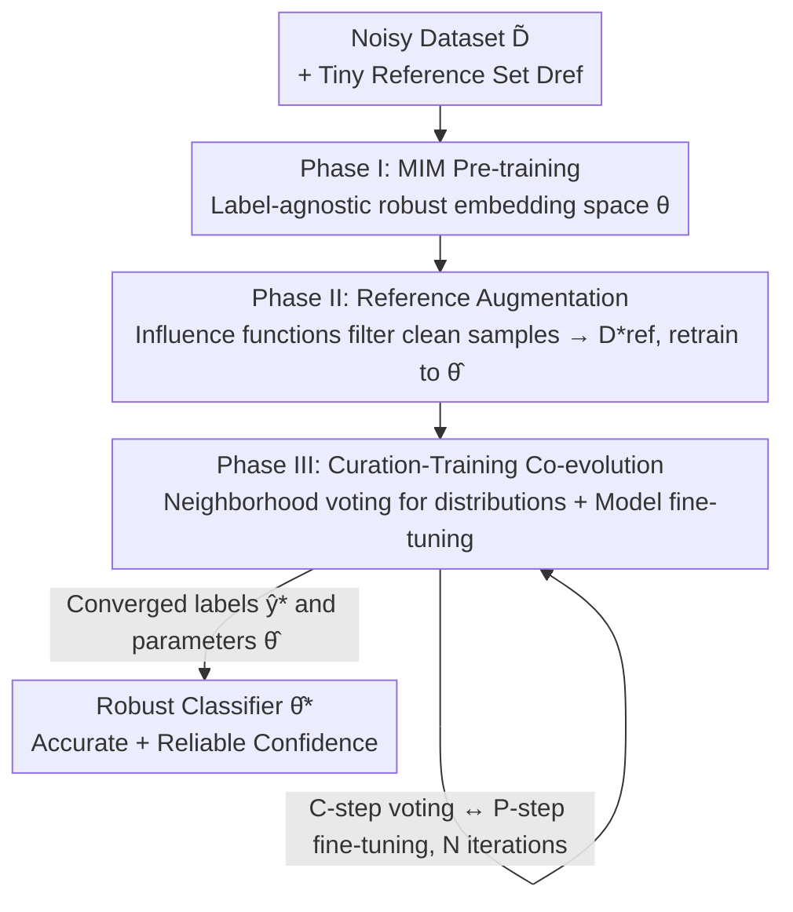

# TrainRef: Curating Data with Label Distributions and Minimal Reference Samples for Accurate Prediction and Reliable Confidence

**Conference**: ICLR 2026  
**OpenReview**: [https://openreview.net/forum?id=jSs8CDsF0A](https://openreview.net/forum?id=jSs8CDsF0A)  
**Area**: Self-supervised Representation Learning / Learning with Noisy Labels  
**Keywords**: Noisy Label Learning, Confidence Calibration, Data Curation, Label Distribution, Reference Set

## TL;DR
TrainRef utilizes a minimal (one sample per class is sufficient) trusted reference set $D_\text{ref}$ as "extrinsic normality" to select clean samples. It rewrites labels from "one-hot classes" into "label distributions." Through a three-phase process—MIM pre-training, influence function filtering, and curation-training co-evolution—it achieves new SOTA performance in both accuracy and Expected Calibration Error (ECE) on CIFAR-100, Animal-10N, and WebVision.

## Background & Motivation
**Background**: Real-world classification tasks (medical diagnosis, autonomous driving, fraud detection) require both high accuracy and reliable confidence, as users rely on confidence to decide whether to adopt model decisions. Since high-quality labels are expensive or unavailable, Learning with Noisy Labels (LNL) is essential. Current mainstream methods employ "class curation" via pseudo-labeling or semi-supervised learning to change noisy labels from one category to another (e.g., DivideMix, DISC, L2B).

**Limitations of Prior Work**: Class curation exhibits two structural flaws. First is **normality pollution**: these methods learn the definition of "clean/normal" from the **internal noisy dataset itself**. Under high noise rates, noisy samples can cluster into "false normality," leading to incorrect selection and relabeling. Second is **class ambiguity**: as the number of classes increases, more samples are inherently ambiguous (e.g., an image being 70% snake and 30% worm). Forcing one-hot labels leads to overconfidence and unreliable calibration.

**Key Challenge**: Accuracy and calibration are typically treated as separate issues. Denoising methods (DISC/L2B) improve accuracy through filtering or hard relabeling but discard "uncertain yet informative" samples, weakening calibration. Post-hoc calibration (temperature scaling, label smoothing, mixup) only adjusts output probabilities and cannot fix confidence rankings skewed by noise. Unifying both is difficult.

**Goal**: Develop a mechanism to simultaneously achieve high accuracy under heavy noise and reliable confidence calibration in multi-class settings.

**Key Insight**: The authors observe that **even a tiny amount of ground-truth extrinsic information (extrinsic reference), even one sample per class, can identify clean samples more accurately**, bypassing the pollution of learning normality from noisy sets. Simultaneously, changing the curation goal from "swapping a class" to "voting for a label distribution" naturally accommodates intrinsic ambiguity.

**Core Idea**: Replace "internal statistics + class labels" with an "extrinsic minimal reference set + label distributions." Use neighborhood voting in a near-perfect embedding space to curate each noisy sample into a soft label distribution.

## Method

### Overall Architecture
Given a noisy training set $\tilde{D}=\{(x,\tilde{y})\}$ and a minimal trusted reference set $D_\text{ref}$, TrainRef aims to construct a noise-robust embedding space and expand the reference set into a representative prototype pool $D^*_\text{ref}$. Samples in this pool provide accurate supervision for all other samples through **neighborhood voting**. The method revolves around the **co-evolution** of the model's embedding space and the curated dataset across three sequential phases, with the third phase involving iterative optimization.

The theoretical basis is the Representer Point theorem: given an optimal embedding $f_{\theta^*}$, any query sample's prediction can be expressed as a similarity-weighted linear combination of reference samples. TrainRef defines label curation as similarity-based voting:
$$\hat{y}^*(x_t)=\frac{1}{|D_\text{ref}|}\sum_{(x_\text{ref},y_\text{ref})\in D_\text{ref}} y_\text{ref}\cdot k\big(\hat{f}(x_\text{ref}),\hat{f}(x_t)\big)$$
To implement this, the method must overcome distorted embedding spaces and insufficient prototype diversity.

### Key Designs

**1. Phase I: Noise-Robust Embedding via MIM Pre-training**

The source of pollution in class curation is that the embedding space is learned by minimizing empirical risk on noisy labels. TrainRef **removes labels entirely from this step** by performing Masked Image Modeling (MIM) pre-training on $\tilde{D}$. Since the task is reconstructing masked patches, the resulting initial embedding $\theta$ is naturally immune to label noise and encodes semantic similarity.

**2. Phase II: Prototype Expansion via Influence Functions**

One reference sample per class is insufficient for reliable voting. TrainRef identifies truly clean samples from $\tilde{D}$ to include in the pool. Evaluation is based on consistency: a clean sample should provide a training signal that is **aligned or harmless** to predicting the reference sample of the same class. Consistency is measured using the TraceIn influence function on a classification head $g_\phi$ fine-tuned on $D_\text{ref}$:
$$\text{IF}(s_i,s_\text{ref})=\frac{\nabla_\phi L_i^\top \nabla_\phi L_\text{ref}}{\|\nabla_\phi L_i\|\cdot\|\nabla_\phi L_\text{ref}\|}$$
Samples with an influence score above $\delta_\text{IF}=0.8$ are added to the augmented reference set $D^*_\text{ref}$, which is then used to update $\theta,\phi$ to $\hat{\theta}$. Because "normality" is derived from **extrinsic ground truth**, this phase resists false normality even under high noise rates ($|D_\text{ref}|=1$ maintains augmented set noise <2.3%).

**3. Phase III: Co-evolution and Distributed Soft Labels**

The final phase alternates between label curation and model training in an EM-like fashion.  
**C-step (Curation)**: Fix the embedding $\hat{f}$ and perform neighborhood voting for each noisy sample in the augmented pool to generate a **class distribution**:
$$\hat{y}(x)=\frac{1}{Z(x)}\sum_{(x_\text{ref},y_\text{ref})\in D^*_\text{ref}} y_\text{ref}\cdot \mathbb{1}\big(x_\text{ref}\in D^*_\text{vote}(x)\big)\cdot \text{Cosine}\big(f(x),f(x_\text{ref})\big)$$
The voting pool $D^*_\text{vote}$ is filtered by **semantic relevance** (top 75th percentile similarity $\tau$) and **prototype diversity** (selecting the $k$ most diverse samples in the subset). Distributions are sharpened using a temperature of $t=0.5$.  
**P-step (Parameter Update)**: Fine-tune the model using cross-entropy and $\ell_2$ regularization with these soft labels. "Distributed soft labels" preserve intrinsic ambiguity, fixing confidence calibration at the root.

### Loss & Training
The P-step optimization target is cross-entropy with $\ell_2$ regularization using soft labels:
$$\hat{\theta}=\arg\min_{\theta,\phi}\frac{1}{|\hat{D}|}\sum_{i=1}^{|\hat{D}|}\Big[L_\text{CE}\big(g_\phi\circ f_\theta(x_i),\hat{y}^*_i\big)+\lambda\|\theta\|_2^2\Big]$$
Key hyperparameters: Influence threshold $\delta_\text{IF}=0.8$, similarity threshold $\tau$ at 75th percentile, temperature $t=0.5$. Typically $|D_\text{ref}|=5$ is used.

## Key Experimental Results

### Main Results
On CIFAR-100 with synthetic noise, TrainRef consistently outperforms SOTA denoising methods, with higher gains under heavier noise (e.g., +8% over L2B-C2D at Sym 80%):

| Noise Type | CE | DISC | L2B-C2D | TrainRef |
|----------|------|------|---------|----------|
| Sym 20% | 55.17 | 78.75 | 79.67 | **85.44** |
| Sym 50% | 32.40 | 75.21 | 78.23 | **82.07** |
| Sym 80% | 7.70 | 57.61 | 69.66 | **77.85** |
| Asym 40% | 40.63 | 76.50 | 78.22 | **79.67** |
| Inst 40% | 43.17 | 78.44 | 79.43 | **82.33** |

On real-world noisy data: WebVision Top-1 improved to **82.28** (vs 81.40 for LSL) and Animal-10N improved to **90.90** (vs 89.1).

Regarding calibration (CIFAR-100 ECE, lower is better), TrainRef achieves the best accuracy-calibration trade-off. When combined with Temperature Scaling (TS), ECE is significantly lower than baselines:

| Method | Sym80 Test Acc | Sym80 ECE |
|------|----------------|-----------|
| DISC+TS | 57.61 | 0.061 |
| L2B+TS | 69.66 | 0.057 |
| TrainRef | 77.85 | 0.082 |
| **TrainRef+TS** | **77.85** | **0.011** |

### Ablation Study

| Configuration | Key Metric | Description |
|------|---------|------|
| Full Model | Sym80 Acc 77.85 / ECE+TS 0.011 | All phases enabled |
| $|D_\text{ref}|=1$ | Noise rate 2.30% / Acc 77.85 | Minimal drop with 1 sample/class |
| $|D_\text{ref}|=100$ | Noise rate 1.57% / Acc 77.91 | Diminishing returns from larger reference |
| Hard Relabeling | ECE 0.065 / Acc 81.77 | Similar accuracy, worse calibration |
| Soft Labeling | ECE 0.046 / Acc 82.33 | Distribution is the key to calibration |

### Key Findings
- **Extrinsic reference is the root of anti-pollution**: Normality derived from external ground truth prevents the model from being misled by noise clusters.
- **Label distributions primarily contribute to calibration**: Switching to one-hot labels maintains accuracy but degrades ECE, proving soft labels are essential for preserving sample ambiguity.
- **Unification of Denoising and Calibration**: While post-hoc methods fail to fix rankings and denoising often hurts calibration, TrainRef integrates both via soft labeling and extrinsic guidance.

## Highlights & Insights
- **The leverage of "minimal extrinsic reference"**: Moving the definition of "clean" to an external ground-truth set effectively avoids self-pollution in high-noise regimes.
- **Lifting labels to "distributions"**: Directly addressing the reality that many samples exist "between classes" replaces post-hoc calibration with an intrinsic training property.
- **Elegant Co-evolution**: The EM-like framework provides a clear narrative for progress as embeddings and labels reach mutual convergence.
- **MIM as a Foundation**: Using label-agnostic self-supervision to "clean" the embedding space before voting ensures the geometry of the space is reliable.

## Limitations & Future Work
- Currently focused on vision tasks and MIM; performance on other modalities like LLMs/text is not yet verified.
- The three-phase process and EM iterations in Phase III introduce higher computational overhead compared to simple filtering.
- Requires some ground-truth samples, making it inapplicable to scenarios with zero trusted labels.

## Related Work & Insights
- **vs DISC / L2B**: These methods rely on internal statistics and hard relabeling, which fail under high noise. TrainRef's extrinsic anchor and soft labels provide higher accuracy and better ECE.
- **vs Post-hoc Calibration (TS)**: Temperature scaling cannot fix incorrect confidence rankings caused by noise; TrainRef ensures intrinsic calibration during training.
- **vs Meta-learning LNL**: While meta-learning also uses clean references, it relies on expensive bi-level optimization. TrainRef achieves similar goals with influence functions and voting at a lower cost.

## Rating
- Novelty: ⭐⭐⭐⭐⭐ 
- Experimental Thoroughness: ⭐⭐⭐⭐ 
- Writing Quality: ⭐⭐⭐⭐ 
- Value: ⭐⭐⭐⭐ 

<!-- RELATED:START -->

## Related Papers

- [\[NeurIPS 2025\] Hybrid Autoencoders for Tabular Data: Leveraging Model-Based Augmentation in Low-Label Settings](../../NeurIPS2025/self_supervised/hybrid_autoencoders_for_tabular_data_leveraging_model-based_augmentation_in_low-.md)
- [\[ICLR 2026\] Regularized Latent Dynamics Prediction is a Strong Baseline for Behavioral Foundation Models](regularized_latent_dynamics_prediction_is_a_strong_baseline_for_behavioral_found.md)
- [\[ICLR 2026\] Samples Are Not Equal: A Sample Selection Approach for Deep Clustering](samples_are_not_equal_a_sample_selection_approach_for_deep_clustering.md)
- [\[CVPR 2026\] Harnessing the Power of Foundation Models for Accurate Material Classification](../../CVPR2026/self_supervised/harnessing_the_power_of_foundation_models_for_accurate_material_classification.md)
- [\[ICLR 2026\] Equivariant Splitting: Self-supervised learning from incomplete data](equivariant_splitting_self-supervised_learning_from_incomplete_data.md)

<!-- RELATED:END -->
