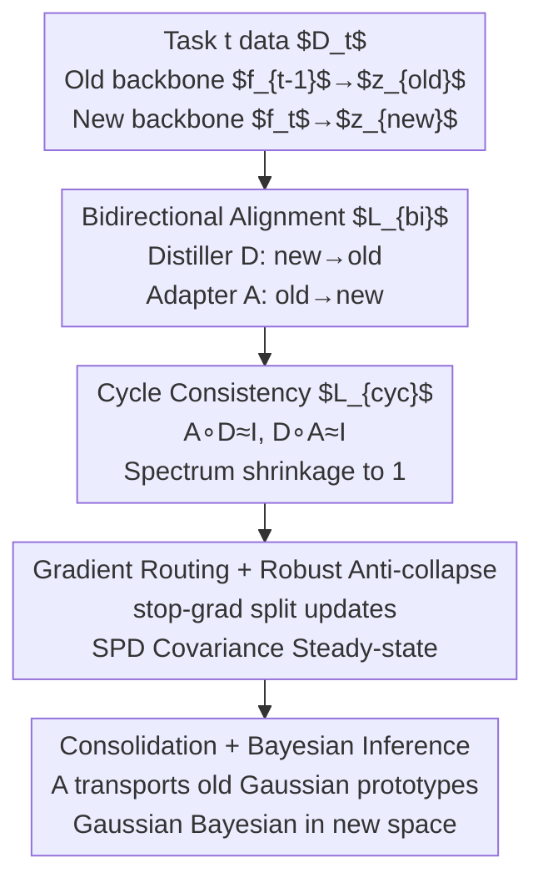

# Two-Way is Better Than One: Bidirectional Alignment with Cycle Consistency for Exemplar-Free Class-Incremental Learning

**Conference**: ICLR 2026  
**OpenReview**: [https://openreview.net/forum?id=7UfZAxKo5K](https://openreview.net/forum?id=7UfZAxKo5K)  
**Code**: https://github.com/HXuSz11/BiCyc_ICLR2026  
**Area**: Continual Learning / Representation Learning  
**Keywords**: Exemplar-Free Class-Incremental Learning, Prototype Drift Compensation, Bidirectional Alignment, Cycle Consistency, Gaussian Bayesian Classification

## TL;DR
Addressing the challenge of "old class prototype drift caused by backbone updates" in Exemplar-Free Class-Incremental Learning, this paper proposes BiCyc: simultaneously learning an "old $\to$ new" adapter $A$ and a "new $\to$ old" distiller $D$ during the training phase. It enforces both as mutual inverse mappings using stop-gradient gating and cycle consistency loss, thereby accurately transporting old class Gaussian prototypes to the new feature space. It minimizes forgetting and outperforms state-of-the-art methods like AdaGauss and DPCR on from-scratch benchmarks including CIFAR-100 and TinyImageNet.

## Background & Motivation

**Background**: Continual Learning (CL) aims to enable models to continuously learn new classes from a task stream without forgetting old ones. In the stricter setting of **Exemplar-Free Class-Incremental Learning (EFCIL)**, saving any original samples of old tasks is **prohibited** due to privacy or memory constraints. Mainstream approaches only cache compact statistics of each old class—**prototypes** (class means or covariances)—and use nearest prototype or Gaussian Bayesian scoring for inference, achieving strict zero-exemplar replay with minimal computation.

**Limitations of Prior Work**: The vulnerability of prototype-based schemes is **representation drift**. When the backbone $f_{t-1} \to f_t$ is updated to fit new classes, the geometry of the entire embedding space shifts and rotates. Consequently, old prototypes $\mu_c^{t-1}$ calculated using $f_{t-1}$ become "outdated" in the new space, biasing decisions toward recently learned classes. The primary remedy is "**drift compensation**": training an adapter $A$ post-hoc to transport old prototypes to the new space.

**Key Challenge**: The authors point out a systematic bias in existing **unidirectional, two-stage** paradigms. The two-stage process typically involves: Stage I, training on the new task (often with distillation to pull $f_t$ towards $f_{t-1}$), and Stage II, freezing the backbone to learn an old $\to$ new adapter. The problem is that the distillation (pulling new features to the old space) and adaptation (pushing old prototypes to the new space) **operate in opposite directions independently**. Adapters are fitted "post-hoc," leaving cross-space inconsistencies that **accumulate into cycle errors** over tasks (a feature traversing old $\to$ new $\to$ old cannot return to the origin).

**Goal**: To explicitly model the natural dual relationship between "distillation direction" and "adaptation direction" **during training**, allowing transport and representation to **co-evolve** rather than fixing the representation first and patching transport later.

**Key Insight**: Since $D: z_{new} \to z_{old}$ and $A: z_{old} \to z_{new}$ are functionally opposite, they should ideally be mutual inverse mappings. Therefore, both mappings should be learned simultaneously during Stage I, with **cycle consistency** constraints $A \circ D \approx I$ and $D \circ A \approx I$ to make the transport an approximate bijection.

**Core Idea**: Upgrade the unidirectional post-hoc adapter to a near-single-stage, geometry-preserving bidirectional transport system trained alongside the main task using "bidirectional alignment + cycle consistency + stop-gradient gating."

## Method

### Overall Architecture
During task $t$, BiCyc optimizes three components simultaneously: the current backbone $f_t$, the adapter $A$ (old $\to$ new), and the distiller $D$ (new $\to$ old). For each input $x$, the frozen old backbone provided $z_{old} = f_{t-1}(x)$, and the current backbone provides $z_{new} = f_t(x)$. Beyond standard cross-entropy classification, the model employs a bidirectional alignment loss $L_{bi}$, a cycle consistency loss $L_{cyc}$, and a robust anti-collapse loss for covariance stability. The refinement lies in **gradient routing**: which terms update $f_t$, which update only $A$, and which stabilize $(A,D)$ are precisely partitioned via `stop-gradient` operators. This prevents $A$ from dragging the backbone backward and avoids adversarial competition between $A$ and $D$. After Stage I, all backbones and $D$ are frozen, and $A$ undergoes a low-learning-rate fine-tuning "consolidation." During inference, old Gaussian prototypes $(\mu_c^{t-1}, \Sigma_c^{t-1})$ are transported via $A$ to the new space and combined with new class statistics for Gaussian Bayesian scoring.

### Key Designs

**1. Bidirectional Alignment: Making Distillation and Adaptation Inverse During Training**

This design addresses the issue where distillation and adaptation work in opposite directions independently. BiCyc trains both paths in Stage I:

$$L_{bi} = \|D(z_{new}) - z_{old}\|_2^2 + \|A(z_{old}) - \text{stopgrad}(z_{new})\|_2^2$$

The first term is **feature-level distillation (new $\to$ old)**, which **updates both $f_t$ and $D$**, forcing the new backbone to maintain "backward compatibility." The second term learns the **forward adaptation $A$ (old $\to$ new)**, but the target $z_{new}$ is truncated by `stopgrad` so it **only updates $A$**. This allows $A$ to track the evolving new space without pulling $f_t$ back or damaging plasticity. From a linear-Gaussian perspective, minimizing $L_{bi}$ reduces transport errors $\varepsilon_{old\to new}$ and $\varepsilon_{new\to old}$, which bound the mismatch of transported prototypes.

**2. Cycle Consistency: Forcing Transport Operators Toward Bijection to Prevent Rank Collapse**

$L_{bi}$ alone does not prevent degradation (e.g., rank collapse in weakly correlated directions). A cycle loss is added to push the composite of $A$ and $D$ toward an identity mapping:

$$L_{cyc} = \|A(D(z_{new})) - \text{stopgrad}(z_{new})\|_2^2 + \|D(A(z_{old})) - \text{stopgrad}(z_{old})\|_2^2$$

With `stopgrad` applied to targets, $L_{cyc}$ stabilizes $(A,D)$ without affecting the backbone. The theory shows that in a whitened space, the expected cycle error equals $\|M\|_F^2$ where $M = \tilde{A}\tilde{D} - I$. **Minimizing $L_{cyc}$ shrinks the singular spectrum of the composite transport $\tilde{A}\tilde{D}$ toward 1**, suppressing information loss and promoting near-isometric geometry preservation. This ensures faithful prototype transport.

**3. Gradient Routing and Robust Anti-collapse: Cutting Adversary with Stop-grad and Stabilizing Covariance**

This design resolves engineering hurdles. First, **gradient antagonism**: if $A$'s gradients flow back to $f_t$, $A$ and $D$ become adversarial, weakening distillation and tanking performance. Thus, $L_{bi}$'s second term and the entire $L_{cyc}$ use `stopgrad`. The Stage I total loss is:

$$L_{total} = L_{CE}(\ell_{new},y) + \text{Bicyc}(z_{old},z_{new}) + \alpha\,L_{ac}^{rob}$$

Second, **covariance collapse**: BiCyc improves upon AdaGauss's anti-collapse loss. Original versions failed when mini-batch $\Sigma$ was not SPD or was rank-deficient. The authors use symmetrization and shrinkage regularization: $\hat\Sigma = \tfrac12(\Sigma+\Sigma^\top) + \tfrac{\lambda\,\text{tr}(\tilde\Sigma)}{S}I + \varepsilon I$, and calculate a robust loss $L_{ac}^{rob} = -\tfrac1S\sum_i\min(\text{chol}(\hat\Sigma)_{ii}, \beta)$ to ensure numerical stability.

**4. Near-Single-Stage Flow: Consolidation and Gaussian Bayesian Inference**

After Stage I, a lightweight "consolidation" phase freezes $f_{t-1}, f_t, D$ and fine-tunes $A$ at a low learning rate for 30 epochs to better align old prototypes with the new geometry. Inference is performed in the $f_t$ space: old classes use transported Gaussians $\hat\mu_c^t = A\mu_c^{t-1}, \hat\Sigma_c^t = A\Sigma_c^{t-1}A^\top$, while new classes use estimated statistics, all fed into a Gaussian Bayesian classifier.

### Loss & Training
- **From-scratch Setting**: ResNet-18, batch 256, SGD 200 epochs, initial lr=0.1, weight decay $5 \times 10^{-4}$, decayed by 10x at {60, 120, 180} epochs.
- **Pre-trained Setting (CUB-200)**: ImageNet pre-trained initialization, backbone lr=0.01, head lr=0.1.
- **Adapter/Distiller**: lr=0.05, weight decay $1 \times 10^{-4}$; main experiments set $\lambda_{bi}=5, \lambda_{cyc}=1$.
- **Consolidation**: Only $A$, 30 epochs, SGD lr=0.01.

## Key Experimental Results

### Main Results
Mean of 5 runs ± standard deviation. $A_{last}$ is the average accuracy of the final task; $A_{inc}$ is the incremental average accuracy.

| Dataset / Setting | Metric | BiCyc | Next Best | Gain |
|--------------|------|-------|------|------|
| CIFAR-100 T=10 | $A_{last}$ | **50.6** | DPCR 50.2 | +0.4 |
| CIFAR-100 T=20 | $A_{last}$ | **41.5** | AdaGauss 37.9 | +3.6 |
| TinyImageNet T=10 | $A_{inc}$ | **49.1** | EFC 47.9 | +1.2 |
| TinyImageNet T=20 | $A_{last}$ | **30.2** | EFC 28.4 | +1.8 |
| ImageNet-100 T=20 | $A_{last}$ | **43.8** | AdaGauss 42.6 | +1.2 |

Forgetting rate $F_{last}$ (lower is better):

| Dataset | Setting | BiCyc | AdaGauss | Reduction |
|--------|------|-------|----------|------|
| CIFAR-100 | T=20 | **16.6** | 21.0 | −4.4 |
| TinyImageNet | T=10 | **12.0** | 18.7 | −6.7 |

BiCyc achieves the lowest forgetting rates on all from-scratch datasets.

### Ablation Study

Contribution of $L_{bi}$ and $L_{cyc}$ (CIFAR-100, starting from AdaGauss baseline):

| $L_{bi}$ | $L_{cyc}$ | T=10 $A_{last}$ | T=20 $A_{last}$ | Note |
|:---:|:---:|:---:|:---:|------|
| ✗ | ✗ | 46.8 | 37.9 | AdaGauss Baseline |
| ✓ | ✗ | 49.4 | 40.2 | Alignment only |
| ✓ | ✓ | **50.6** | **41.5** | Both combined are best |

### Key Findings
- **Complementary Losses**: Using $L_{bi}$ or $L_{cyc}$ alone improves the baseline, but combining them yields the best results, confirming that $L_{bi}$ reduces error while $L_{cyc}$ preserves geometry.
- **Early Task Gains**: Accuracy gains are concentrated on older tasks, providing direct evidence that BiCyc wins by reducing forgetting rather than just learning new classes better.
- **Architecture Choice**: MLP adapters outperform linear ones. Architectures like CrossAttention or MoE can further reduce forgetting but at a cost to overall accuracy.

## Highlights & Insights
- **Explicit Duality**: Instead of post-hoc patching, BiCyc treats distillation and adaptation as a dual pair during training, ensuring transport and representation co-evolve.
- **Theoretical Alignment**: Theoretical proofs regarding spectral shrinkage to 1 and log-odds stability are empirically verified by singular spectrum plots and forgetting rate metrics.
- **Gradient Routing as a Key Factor**: Precise use of `stop-gradient` is crucial. The authors identify that allowing adapter gradients to flow back to the backbone causes adversarial failure.
- **Portability**: This bidirectional regularization can be applied to any system where statistics must be transported across evolving domains.

## Limitations & Future Work
- **Limited Gain in Pre-trained Scenarios**: In settings like CUB-200 where drift is naturally small due to low learning rates, BiCyc's advantages are less pronounced.
- **Overhead**: Learning two additional mappings and a consolidation phase adds training cost.
- **Theoretical assumptions**: Mathematical proofs rely on assumptions like linear adapters and full-rank covariance which are approximations in practical deep learning.

## Related Work & Insights
- **vs AdaGauss (NeurIPS24)**: BiCyc evolves AdaGauss's post-hoc bidirectional structure into a simultaneous training regime with cycle consistency, significantly lowering forgetting rates and fixing numerical issues in anti-collapse losses.
- **vs SDC / ADC / EFC**: These methods utilize post-hoc unidirectional compensation. BiCyc addresses their inherent cross-space inconsistency and accumulated cycle errors.

## Rating
- Novelty: ⭐⭐⭐⭐ Explicitly dualizing distillation-adaptation is a strong insight with solid theoretical backing.
- Experimental Thoroughness: ⭐⭐⭐⭐ Comprehensive coverage of benchmarks, splits, and ablation variants.
- Writing Quality: ⭐⭐⭐⭐ Clear causal chain between motivation, theory, and observed phenomena.
- Value: ⭐⭐⭐⭐ Sets a new SOTA for forgetting rates in EFCIL.

<!-- RELATED:START -->

- **AdaGauss**: [Adaptive Gaussian Prototype Drift Compensation](https://arxiv.org/abs/2410.04169)
- **DPCR**: [Decomposed Prototype Compensation and Refinement](https://openreview.net/forum?id=...)
- **EFC**: [Exemplar-Free Class-Incremental Learning via Class-Specific Drift Compensation](https://arxiv.org/abs/2207.03904)

<!-- RELATED:END -->

## Related Papers

- [\[CVPR 2026\] Exemplar-Free Class Incremental Learning via Preserving Class-Discriminative Structure](../../CVPR2026/self_supervised/exemplar-free_class_incremental_learning_via_preserving_class-discriminative_str.md)
- [\[ICLR 2026\] One-Shot Exemplars for Class Grounding in Self-Supervised Learning](one-shot_exemplars_for_class_grounding_in_self-supervised_learning.md)
- [\[ACL 2025\] AnalyticKWS: Towards Exemplar-Free Analytic Class Incremental Learning for Small-footprint Keyword Spotting](../../ACL2025/self_supervised/analytickws_towards_exemplar-free_analytic_class_incremental_learning_for_small-.md)
- [\[CVPR 2026\] Beyond Myopic Alignment: Lookahead Optimization for Online Class-Incremental Learning](../../CVPR2026/self_supervised/beyond_myopic_alignment_lookahead_optimization_for_online_class-incremental_lear.md)
- [\[ICLR 2026\] Bidirectional Predictive Coding](bidirectional_predictive_coding.md)

<!-- RELATED:END -->
