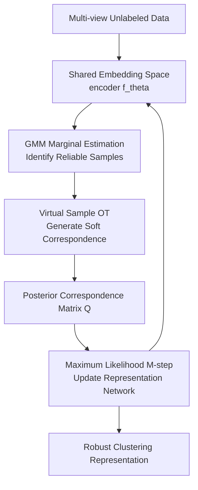

# Uncover Underlying Correspondence for Robust Multi-view Clustering

**Conference**: ICLR 2026  
**OpenReview**: [https://openreview.net/forum?id=a4S1nQay3b](https://openreview.net/forum?id=a4S1nQay3b)  
**Code**: https://github.com/XLearning-SCU/2026-ICLR-CorreGen  
**Area**: Self-supervised / Representation Learning  
**Keywords**: Multi-view clustering, noisy correspondence, EM algorithm, optimal transport, robust representation learning  

## TL;DR

This paper treats cross-view correspondences in noisy multi-view clustering as latent variables and proposes CorreGen. Using an EM framework, it generates soft correspondence distributions in the embedding space while simultaneously handling category-level mismatch, mismatched samples, and unalignable samples through GMM marginal estimation and a virtual sample mechanism, significantly enhancing clustering robustness in noisy correspondence scenarios.

## Background & Motivation

**Background**: Multi-view clustering aims to map different views or modalities of the same object (e.g., image and text) into a shared representation space, followed by clustering algorithms like K-means to obtain semantic clusters. Recent mainstream approaches utilize contrastive multi-view clustering: treating originally paired cross-view samples as positives and cross-view combinations of different instances as negatives to learn shared representations by pulling positives together and pushing negatives apart.

**Limitations of Prior Work**: This assumption holds for clean, curated datasets but is fragile on real-world web data. Image-text, recipe-image, or multimodal samples crawled from the web often contain mismatches: an apple pie image might be paired with irrelevant web text, or a text snippet might contain ads, links, or unrelated dish names, or even lack a valid corresponding image entirely. More critically, clustering focuses on category semantics rather than instance identity; different samples belonging to the same category should support each other but are pushed apart as negatives by standard contrastive learning.

**Key Challenge**: Traditional contrastive MVC relies on the "correctness of given pairs" as the training entry point, but noisy correspondence problems suggest these given pairs are unreliable. Pairwise reweighting only reduces the weight of suspected noisy pairs, and pairwise realignment only finds a more similar counterpart for each sample. Both revolve around patching single pairs, struggling to express "many-to-many semantic correspondences within the same category" or identify "unalignable" samples that lack any valid counterpart.

**Goal**: The authors decompose the problem into two levels: first, category-level mismatch, where cross-view samples of the same category are wrongly treated as negatives; second, sample-level mismatch, including realignable mismatched samples and contaminated, low-quality samples without valid counterparts. The goal is not to clean a hard one-to-one pairing table but to estimate a soft cross-view correspondence distribution during training, identifying which samples should share semantic probability mass and which should be downweighted or absorbed into noise mass.

**Key Insight**: The key observation is that multi-view clustering truly needs to recover underlying semantic correspondences rather than the pairing indices from data collection. Thus, the authors shift from a discriminative contrastive objective to a generative maximum likelihood objective: treating potential counterparts in other views as latent variables and summing over all possible cross-view combinations to allow the model to automatically assign higher probabilities to semantically consistent combinations by maximizing the marginal likelihood of observed data.

**Core Idea**: Replace "given pair correction" with "correspondence generation," modeling cross-view correspondence as a posterior soft distribution within EM. The E-step estimates semantic correspondence and noise margins, while the M-step uses these soft correspondences to train the embedding network.

## Method

### Overall Architecture

CorreGen takes a batch of multi-view unlabeled samples as input. Each sample passes through an encoder $f_\theta$ (shared or with similar structure) to obtain embeddings $z_i^{(v)}$. Instead of trusting original indices, it estimates a cross-view joint distribution $P^*$ and posterior correspondence matrix $Q$ based on current embeddings in each EM iteration. $Q$ then serves as soft supervision to update the encoder, making the embedding space clearer for the next round.

The process is a closed loop: a warmup phase uses an identity-like posterior to avoid messy early embeddings; the E-step then uses GMM to estimate the marginal credibility of each sample and obtains a many-to-many cross-view coupling through optimal transport with virtual samples; the M-step normalizes this coupling into a posterior distribution to maximize the weighted joint likelihood. After multiple iterations, the posterior matrix evolves from the original pairing towards a semantic correspondence with block-like categorical structures.

From a probabilistic modeling perspective, the paper defines the single-view marginal maximum likelihood $\sum_i \log p(x_i^{(v)};\theta)$, then expands the unknown counterparts between views as $\sum_i \log \sum_j p(x_i^{(v_1)},x_j^{(v_2)};\theta)$. Here, $j$ is a latent variable: a sample $x_i^{(v_1)}$ may have semantic correspondences with multiple same-category samples in another view or correspond to almost no real samples because it is noise.

Directly optimizing the log-sum is difficult, so the authors introduce an auxiliary distribution $Q(x_j^{(v_2)})$ and use Jensen's inequality for the EM lower bound. The E-step makes $Q$ close to the posterior $p(x_j^{(v_2)};x_i^{(v_1)},\theta^{(t)})$ under current parameters, and the M-step updates $\theta$ while fixing this posterior. This allows "finding correspondence" and "learning representation" to mutually reinforce each other.

### Key Designs

**1. Generative Correspondence Modeling: Reformulating Noisy Pairing as Latent Maximum Likelihood Estimation**

Traditional contrastive learning assumes $x_i^{(v_1)}$ and $x_i^{(v_2)}$ are the unique positive pair, while $x_i^{(v_1)}$ and $x_j^{(v_2)}(j\ne i)$ are negatives. For clustering, this naturally causes category-level mismatch as distinct instances of the same category are forced apart. CorreGen reverses the objective: for sample $x_i^{(v_1)}$, all $x_j^{(v_2)}$ in the other view are candidate counterparts, and the objective is:

$$
\theta^*=\arg\max_\theta \sum_i \log \sum_j p(x_i^{(v_1)},x_j^{(v_2)};\theta).
$$

The model no longer asks "is the original pair a positive?" but "which cross-view combinations are more likely to explain the observed data under current representations?" Samples of the same semantic category can gain probability mass in the joint distribution even if they are different instances; noise samples refrain from being forced into positive pairs.

**2. GMM Marginal Estimation: Determining Quality of Correspondence via Cluster Reliability**

Cross-view similarity alone is insufficient because optimal transport requires marginal constraints. If all marginals are uniform, noise samples are forced to assign mass; if only original pairs are considered, cluster structures are ignored. CorreGen fits a GMM in the embedding space of each view, converting the Mahalanobis distance from a sample to its Gaussian cluster center into a credibility score $d_i$, then obtaining marginal probabilities via a curve function:

$$
p(x_i^{(v)};\theta^{(t)})=\frac{m^{d_i}-1}{m-1}\cdot \frac{N_c}{N},\quad
d_i=\exp\left(-\epsilon\sqrt{(z_i^{(v)}-\mu_c)^\top\Sigma_c^{-1}(z_i^{(v)}-\mu_c)}\right).
$$

Samples near the centers of large, dense semantic clusters are more likely to have valid counterparts and thus receive higher marginal mass. Samples far from cluster centers, likely outliers or corrupted, receive less mass.

**3. Virtual Sample Optimal Transport: Allowing Unalignable Samples to "Disappear"**

Standard OT matches all probability mass between views, which is problematic for noisy correspondence. If a sample is sheer noise, it lacks a real counterpart. CorreGen adds a virtual sample to each view and assigns it noise mass $\rho$, ensuring the augmented joint matrix $\tilde P\in\mathbb{R}_+^{(N+1)\times(N+1)}$ satisfies:

$$
\tilde P\mathbf{1}_{N+1}=[p^{(v_1)};\rho],\quad
\tilde P^\top\mathbf{1}_{N+1}=[p^{(v_2)};\rho].
$$

Entropic-regularized OT is solved on the expanded similarity matrix $\tilde S$. Real samples assign mass based on cosine similarity, while low-quality or unalignable observations are absorbed by the virtual sample. This is more stable than forcing a nearest-neighbor realignment for every sample.

**4. Soft Posterior-driven M-step: Replacing Fixed Pairs with Generated Correspondences**

After the E-step, CorreGen normalizes $P^*$ into a posterior $Q_{ij}=P^*_{ij}/p_i^{(v_1)}$. The M-step uses $Q_{ij}$ to weight the log-likelihood of all cross-view combinations:

$$
\theta^*=\arg\max_\theta \sum_i\sum_j Q_{ij}\log\frac{\exp(s(z_i^{(v_1)},z_j^{(v_2)})/\tau)}{\sum_m\sum_n\exp(s(z_m^{(v_1)},z_n^{(v_2)})/\tau)}.
$$

This $Q$ can capture block-like categorical structures and many-to-many relationships while being low for noise. The paper proves that when marginals are uniform and the posterior collapses to identity, the objective reduces to standard InfoNCE.

### Loss & Training

CorreGen uses DIVIDE as the base model, retaining the feature extraction structure but replacing the contrastive objective. Training begins with a warmup using an identity matrix as the posterior start to avoid poor early OT/GMM results. Post-warmup, it tags on adaptive posterior estimation. The within-view module fuses the estimated posterior $Q$ with identity $I$ ($\beta=0.5$), while the cross-view module uses the estimated posterior directly.

Hyperparameters: PyTorch 2.1.2, Adam optimizer, learning rate 0.002; batch size 512 for Scene15/LandUse21, 1024 for Caltech101/UMPC-Food101; 200 total epochs, 50 warmup epochs. OT entropy $\lambda=0.03$, virtual sample mass $\rho=0.2$, GMM estimation $\epsilon=0.1$ and $m=10$ with momentum updates.

## Key Experimental Results

### Main Results

Evaluated on Scene15, LandUse21, Caltech101, and UMPC-Food101. Metrics: ACC, NMI, ARI. Scenarios include Mismatch Ratio (MR) and Corruption Ratio (CR).

| Setup | Dataset | CorreGen ACC | Top Representative Baseline ACC | Gain |
|------|--------|--------------|----------------------|------|
| MR=0% | Scene15 | 50.25 | ROLL 47.61 | +2.64 |
| MR=0% | Caltech101 | 68.52 | CANDY 67.64 | +0.88 |
| MR=50% | Scene15 | 45.07 | ROLL 42.41 | +2.66 |
| MR=80% | Caltech101 | 64.74 | CANDY 54.17 | +10.57 |
| MR=80% | UMPC-Food101 | 43.00 | CANDY 27.59 | +15.41 |

UMPC-Food101 results (Real-world noisy image-text data):

| Setup | Dataset | CorreGen ACC / NMI / ARI | Top Representative Baseline |
|------|--------|--------------------------|------------------|
| MR=0.2, CR=0.2 | UMPC-Food101 | 45.97 / 54.66 / 31.36 | CANDY 30.13 / 49.77 / 20.06 |
| MR=0.5, CR=0.5 | UMPC-Food101 | 37.26 / 49.30 / 23.25 | CANDY 24.70 / 46.58 / 17.19 |

### Ablation Study

Ablation on Scene15 and UMPC-Food101 (MR=0.2, CR=0.2):

| Config | Scene15 ACC / NMI / ARI | UMPC-Food101 ACC / NMI / ARI |
|------|--------------------------|-------------------------------|
| CorreGen | 41.78 / 41.67 / 25.50 | 45.97 / 54.66 / 31.36 |
| w/o Virtual | 41.10 / 41.12 / 24.77 | 44.01 / 53.92 / 30.36 |
| w/o Guide | 40.98 / 41.21 / 24.77 | 44.59 / 54.03 / 30.67 |
| Vanilla InfoNCE | 38.36 / 37.60 / 21.96 | 43.84 / 52.76 / 29.15 |

### Key Findings

- **Core benefit comes from soft correspondence generation**: Vanilla InfoNCE performs significantly worse, proving that relaxing the posterior from one-hot pairs to many-to-many semantic distributions is foundational for robustness.
- **GMM-guided marginal and Virtual Sample target different issues**: The former identifies reliable cluster members while the latter provides an exit for unalignable samples. Removing the Virtual Sample on UMPC-Food101 drops ACC by nearly 2%, confirming real-world data contains unalignable components.
- **Progressive recovery**: Posterior visualization shows that category-level correspondence structures are weak early but gradually evolve into blocks by mid-to-late training.
- **Category-level mismatch dominance**: Statistics show CMR exceeds 98% across datasets (e.g., 99.65% for Scene15), indicating that treating same-category instances as negatives is a structural flaw in instance-level contrastive objectives for clustering.

## Highlights & Insights

- **Elevation of Pair Correction to Latent Modeling**: The paper stops patching "if a pair is wrong" and instead redefines the MVC learning target as a category-level, many-to-many correspondence distribution.
- **Convincing Link to InfoNCE**: The proof that CorreGen reduces to InfoNCE under specific conditions clarifies its relationship with contrastive learning and explains why standard MVC fails under noisy correspondence.
- **Semantic-aware Marginals**: GMM marginal estimation forces the E-step to actively perceive whether a sample resembles a reliable category member based on cluster density and distance.
- **Virtual Samples for Real-world Noise**: Allowing mass to flow into a virtual sample is more consistent with data generation than forcing matches for corrupted observations.

## Limitations & Future Work

- **GMM Dependency**: Robustness depends on the quality of GMM fitting in the embedding space. Poor initial embeddings or non-Gaussian cluster structures could cause marginal misestimation.
- **Hyperparameter $\rho$**: While analysis shows stability, the noise rate in real data is often unknown and variable. Adaptive estimation of $\rho$ would be a valuable next step.
- **Computational Overhead**: OT and GMM introduce costs that grow with batch size, requiring potential sparse or approximate strategies for large-scale pre-training.
- **Agnostic to Hierarchy**: Currently treats unalignable samples as noise to be absorbed. In some tasks, these could be novel categories or useful anomalies.

## Related Work & Insights

- **vs pairwise reweighting**: Reweighting reduces the weight of suspected mispairs but still centers on original pairs. CorreGen generates soft correspondences across all candidates, recovering relationships between same-category instances.
- **vs pairwise realignment**: Realignment finds a single trusted counterpart, whereas CorreGen naturally supports many-to-many relationships and unalignable samples.
- **vs DIVIDE**: CorreGen achieves a 13.57% ACC improvement over DIVIDE on UMPC-Food101 (MR=0%), indicating gains stem from noise modeling rather than the backbone.
- **Inspiration**: CorreGen can be viewed as "Clustering EM-Contrastive Learning." This paradigm is suitable for cleaning noisy web data in multimodal foundation models and cross-modal bootstrapping.

## Rating

- Novelty: ⭐⭐⭐⭐⭐ Clear shift to generative latent correspondence modeling with a theoretical bridge to InfoNCE.
- Experimental Thoroughness: ⭐⭐⭐⭐ Extensive datasets and noise setups, though even larger-scale multimodal data could provide more insight.
- Writing Quality: ⭐⭐⭐⭐ Logically structured EM derivation, though dense in formulas.
- Value: ⭐⭐⭐⭐⭐ Highly practical for noisy multi-view clustering and transferable to other cross-modal noise tasks.

<!-- RELATED:START -->

## Related Papers

- [\[ICLR 2026\] Relationship Alignment for View-aware Multi-view Clustering](relationship_alignment_for_view-aware_multi-view_clustering.md)
- [\[ICLR 2026\] Unified and Efficient Multi-view Clustering from Probabilistic Perspective](unified_and_efficient_multi-view_clustering_from_probabilistic_perspective.md)
- [\[ICLR 2026\] Debiased and Denoised Representation Learning for Incomplete Multi-view Clustering](debiased_and_denoised_representation_learning_for_incomplete_multi-view_clusteri.md)
- [\[ICLR 2026\] Incomplete Multi-View Multi-Label Classification via Shared Codebook and Fused-Teacher Self-Distillation](incomplete_multi-view_multi-label_classification_via_shared_codebook_and_fused-t.md)
- [\[ICLR 2026\] PRISM: Progressive Robust Learning for Open-World Continual Category Discovery](prism_progressive_robust_learning_for_open-world_continual_category_discovery.md)

<!-- RELATED:END -->
## Related Papers

- [\[ICLR 2026\] Relationship Alignment for View-aware Multi-view Clustering](relationship_alignment_for_view-aware_multi-view_clustering.md)
- [\[ICLR 2026\] Unified and Efficient Multi-view Clustering from Probabilistic Perspective](unified_and_efficient_multi-view_clustering_from_probabilistic_perspective.md)
- [\[ICLR 2026\] Debiased and Denoised Representation Learning for Incomplete Multi-view Clustering](debiased_and_denoised_representation_learning_for_incomplete_multi-view_clusteri.md)
- [\[ICLR 2026\] Incomplete Multi-View Multi-Label Classification via Shared Codebook and Fused-Teacher Self-Distillation](incomplete_multi-view_multi-label_classification_via_shared_codebook_and_fused-t.md)
- [\[ICLR 2026\] PRISM: Progressive Robust Learning for Open-World Continual Category Discovery](prism_progressive_robust_learning_for_open-world_continual_category_discovery.md)

<!-- RELATED:END -->
