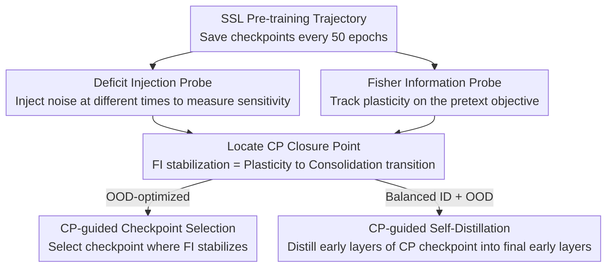

# Understanding the Learning Phases in Self-Supervised Learning via Critical Periods

**Conference**: ICLR 2026  
**OpenReview**: [https://openreview.net/forum?id=UxIRc97ecL](https://openreview.net/forum?id=UxIRc97ecL)  
**Area**: Self-Supervised Learning / Representation Learning  
**Keywords**: Self-supervised learning, critical periods, Fisher information, transferability tradeoff, checkpoint selection

## TL;DR
This paper identifies a "transferability tradeoff" in self-supervised pre-training—where intermediate checkpoints exhibit stronger out-of-distribution (OOD) generalization than final ones. Drawing on the biological and supervised learning concept of "critical periods," the authors characterize SSL through three stages—plasticity, consolidation, and over-specialization—using deficit injection and Fisher Information (FI) probes. They further propose two lightweight strategies, CP-guided checkpoint selection and self-distillation, to balance in-distribution (ID) and OOD performance.

## Background & Motivation
**Background**: Self-supervised learning (SSL) has become a mainstream pre-training paradigm, learning transferable representations from unlabeled data through pretext tasks like contrastive views or masked reconstruction. A simple heuristic exists in the industry: "train for as long as compute allows." Consequently, models are often pre-trained for thousands of epochs, with the final checkpoint used for downstream tasks.

**Limitations of Prior Work**: This heuristic lacks criteria for "how long to train." Under-training results in underdeveloped representations, while over-training wastes compute and leads to overfitting on the pretext objective. Crucially, SSL objectives and downstream transferability are only **implicitly aligned**. Representation quality is typically assessed via expensive linear probing or finetuning only after pre-training, providing no feedback **during** the process to indicate whether a representation is "under-learned" or "over-specialized."

**Key Challenge**: By evaluating the entire pre-training trajectory on fMoW remote sensing data, the authors observed an overlooked phenomenon: **in-distribution (ID) and out-of-distribution (OOD) performance do not synchronize**. While extended pre-training improves ID accuracy, OOD transferability peaks at an **intermediate checkpoint** and subsequently declines. The "longer is better" rule fails for OOD.

**Key Insight**: The authors borrow the concept of "Critical Periods (CP)" from neuroscience. Existing work shows that neural networks (in supervised settings) exhibit critical periods—early high-plasticity windows where data perturbations leave permanent scars, while later identical perturbations are harmless. This temporal sensitivity can be explained by Fisher Information (FI). The author hypothesizes that SSL undergoes similar structured learning phases and **reconstructs CP analysis for the unlabeled pre-training stage**.

**Core Idea**: Two probes—"deficit injection" and "Fisher Information on the pretext task"—are used to locate the SSL CP closure point. This point serves as the "sweet spot" for balancing transferability, guiding both checkpoint selection and cross-checkpoint self-distillation.

## Method

### Overall Architecture
The paper proposes a three-stage analysis framework—"observe, explain, and intervene"—rather than a new model architecture. It addresses the question: How long should SSL be pre-trained? The workflow involves saving checkpoints every 50 epochs, using two probes to characterize learning phases and locate the CP closure point, and then applying two lightweight intervention strategies.

In this pipeline, deficit injection and Fisher Information are complementary **observation probes** (the former checks if perturbations leave lasting effects; the latter provides an analytical perspective on time-varying sensitivity). Together, they pinpoint the CP closure point. CP-CS and CP-SD are **intervention strategies** built on this point, serving "OOD-only" and "balanced ID/OOD" requirements, respectively.

### Key Designs

**1. Deficit Injection Probe: Testing CP existence by "when to perturb"**

The core question for identifying a CP in SSL is: Does the same input perturbation cause different levels of damage to final representations if injected early versus late in pre-training? The authors replace the clean data distribution $p(x)$ with a perturbed distribution $p'(x)$ (using Gaussian noise) starting at epoch $t_0$ for a duration of $\Delta t$. After the window, training resumes with clean data until $T=1000$. The pretext task remains unchanged, but the signal during the window is noise. The authors define the **sensitivity score** as:

$$S(t_0) = \Phi(f_\theta) - \Phi(f_{\theta'}),$$

where $\Phi(\cdot)$ represents downstream metrics. If $S(t_0)$ for early perturbations is significantly larger than for late ones, it confirms a CP. Experiments using window sizes of 5/30/50 epochs and start points at early(0)/middle(450)/late(750) consistently showed that **the beginning of pre-training is the sensitive window**.

**2. Fisher Information Probe: Quantifying plasticity evolution on pretext tasks**

Deficit injection confirms "if" a perturbation has lasting effects but not "why." The authors use Fisher Information (FI) as a continuous marker of plasticity. Since SSL lacks labels, the pretext task is formalized as optimizing a conditional distribution $p_\theta(y|x)$ (e.g., $y$ specifying positive/negative pairs in contrastive learning or masked patches in MAE). For an infinitesimal perturbation $\theta'=\theta+\delta\theta$, the second-order Taylor expansion of KL divergence yields $\mathbb{E}_x \mathrm{KL}(p_\theta \| p_{\theta'}) = \tfrac12 \delta\theta^\top F \delta\theta + o(\|\delta\theta\|^2)$, where the Fisher Information Matrix (FIM) is $F = \mathbb{E}_x \mathbb{E}_{y\sim p_\theta(y|x)}[\nabla_\theta \log p_\theta(y|x)\, \nabla_\theta \log p_\theta(y|x)^\top]$. The authors use its trace:

$$\mathrm{tr}(F) = \mathbb{E}_x \mathbb{E}_{y\sim p_\theta(y|x)}\big[\|\nabla_\theta \log p_\theta(y|x)\|^2\big]$$

as a scalar measure of sensitivity, approximated using the gradient of the self-supervised loss. Experiments show FI **rising, peaking, then declining and stabilizing**. The authors define the sequence before stabilization as the CP, and the stabilization as **CP closure**. After closure, the model discards variability irrelevant to the pretext task and becomes insensitive to change.

**3. CP-CS: Checkpoint selection at zero additional cost**

Since the peak OOD transferability occurs near CP closure, Critical Period-guided Checkpoint Selection (CP-CS) is proposed: instead of defaulting to the final checkpoint, (i) monitor the FI trace across epochs, (ii) identify the stable interval, and (iii) select the nearest checkpoint. This requires **no labels and adds no cost** beyond standard pre-training.

**4. CP-SD: Restoring early layers to the CP state via self-distillation**

CP checkpoints excel at OOD, while post-CP checkpoints excel at ID. Layer-wise probing reveals that the OOD superiority of CP checkpoints is **most significant in early layers**, while post-CP ID benefits are concentrated in later layers. This occurs because early layers, which should encode general features, become compressed and specialized to the pretext task as pre-training continues. CP-guided Self-Distillation (CP-SD) treats the CP checkpoint as a **teacher** and distills its early layers into the post-CP checkpoint (the student). During downstream finetuning, the task and distillation losses are joint-optimized:

$$L = L_{\text{task}} + \lambda \sum_{l\in L} \|f^{\text{student}}_l - f^{\text{teacher}}_l\|_2^2,$$

where later layers only use $L_{\text{task}}$. This "pulls back" the final early layers to a CP state to recover OOD transferability while maintaining ID strength in the later layers.

## Key Experimental Results

### Main Results
Pre-training for 1000 epochs on fMoW-RGB across four SSL methods (SimCLR, VICReg, DINO, MAE). ID is evaluated via fMoW finetuning; OOD is evaluated on fMoW-WILDS, EuroSAT, and EuroSAT-Spatial. Downstream classification accuracy for VICReg-RN50 (mean of 3 runs):

| Model | fMoW-val (ID) | fMoW-WILDS (OOD) | EuroSAT (OOD) | EuroSAT-Spatial (OOD) |
|------|---------------|-------------------|----------------|------------------------|
| Final checkpoint | **0.621** | 0.341 | 0.917 | 0.894 |
| CP checkpoint | 0.610 | 0.430 | 0.931 | 0.912 |
| CP-SD (early layers) | 0.617 | **0.445** | **0.944** | **0.925** |
| CP-SD (all layers) | 0.611 | 0.421 | 0.929 | 0.908 |

The final checkpoint yields the highest ID but significantly degraded OOD. The CP checkpoint sacrifices some ID for a large OOD gain (WILDS 0.341 → 0.430). CP-SD (early layers) balances both, with OOD increasing to 0.445 and ID remaining high.

### Ablation Study

| Configuration | Key Phenomenon | Explanation |
|------|----------|------|
| CP-SD (early layers only) | Best OOD, ID close to Final | Restores early generalality; keeps late ID specialization |
| CP-SD (all layers) | OOD drops to 0.421 | Pulling the whole model toward CP overwrites useful ID late specialization |
| Deficit early vs late | Early $S(t_0)$ significantly larger | Confirms the existence of an early sensitivity window |

### Key Findings
- All four methods show an OOD "mid-point peak" and ID "monotonic rise" tradeoff, but **SimCLR's tradeoff occurs later**. This is attributed to its reliance on negatives, requiring constant restructuring of the representation space, which delays CP closure.
- FI trajectories (rise-peak-fall-stable) align closely with deficit injection sensitivity, with both probes independently confirming the CP.
- CP closure is the "sweet spot" (sufficient learning without over-specialization); the subsequent **over-specialization phase** sees ID rise while OOD declines.

## Highlights & Insights
- Transforms the practical question of "how long to train" into an observable critical period analysis with **zero or minimal overhead**.
- Ingeniously adapts Fisher Information to unlabeled SSL by formalizing pretext tasks as $p_\theta(y|x)$, allowing plasticity to be tracked continuously without downstream labels.
- The insight that "early layer distillation > all-layer distillation" highlights the functional division of labor across network depth (early layers are general, late layers are specialized).

## Limitations & Future Work
- The experiments focus on fMoW remote sensing data and specific OOD sets. Evidence for whether the CP closure point shifts significantly with massive scale (e.g., ImageNet) is limited.
- CP closure identification relies on visual/empirical judgment of when the FI curve stabilizes; an automated, threshold-based definition is missing.
- CP-SD introduces hyperparameters like layer selection and $\lambda$. The boundary for "early layers" across different architectures (ResNet vs. ViT) requires further exploration.

## Related Work & Insights
- **vs. Traditional CP Analysis (Achille et al. 2018)**: While previous work used FI to show plasticity windows in supervised learning, this paper reframes the analysis for **unlabeled pre-training** using pretext-defined FI.
- **vs. "Longer is Better" (SimCLR/MAE)**: Corrects the established heuristic by showing it holds only for ID, while OOD performance favors earlier checkpoints.
- **vs. Knowledge Distillation**: Unlike standard distillation between different models, CP-SD is a **cross-temporal self-distillation** targeting early layers to recover general features eroded by over-specialization.

## Rating
- Novelty: ⭐⭐⭐⭐⭐ 
- Experimental Thoroughness: ⭐⭐⭐⭐ 
- Writing Quality: ⭐⭐⭐⭐⭐ 
- Value: ⭐⭐⭐⭐⭐ 

<!-- RELATED:START -->

## Related Papers

- [\[ICLR 2026\] Understanding the Robustness of Distributed Self-Supervised Learning Frameworks Against Non-IID Data](understanding_the_robustness_of_distributed_self-supervised_learning_frameworks_.md)
- [\[ICML 2026\] Understanding Self-Supervised Learning via Latent Distribution Matching](../../ICML2026/self_supervised/understanding_self-supervised_learning_via_latent_distribution_matching.md)
- [\[ICLR 2026\] On the Alignment Between Supervised and Self-Supervised Contrastive Learning](on_the_alignment_between_supervised_and_self-supervised_contrastive_learning.md)
- [\[ICLR 2026\] Equivariant Splitting: Self-supervised learning from incomplete data](equivariant_splitting_self-supervised_learning_from_incomplete_data.md)
- [\[ICLR 2026\] Soft Equivariance Regularization for Invariant Self-Supervised Learning](soft_equivariance_regularization_for_invariant_self-supervised_learning.md)

<!-- RELATED:END -->
