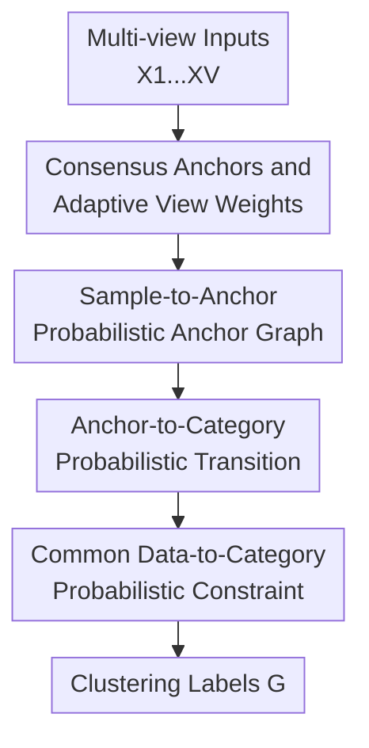

# Unified and Efficient Multi-view Clustering from Probabilistic Perspective

**Conference**: ICLR2026  
**OpenReview**: [https://openreview.net/forum?id=KAGR7Mqu4h](https://openreview.net/forum?id=KAGR7Mqu4h)  
**Code**: Not provided  
**Area**: Self-Supervised / Representation Learning / Multi-view Clustering  
**Keywords**: Multi-view clustering, anchor graph learning, probabilistic transition matrix, large-scale clustering, unsupervised learning  

## TL;DR
UEMCP reinterprets anchor-based multi-view clustering as "data point $\rightarrow$ anchor $\rightarrow$ category" probabilistic transition learning. It simultaneously learns consensus anchors, view weights, anchor graphs, and category assignments within a unified objective, achieving superior clustering performance and near-linear complexity on several large-scale multi-view datasets.

## Background & Motivation

**Background**: The goal of multi-view clustering is to integrate feature representations of the same set of samples across different views to recover the latent categorical structure without manual labels. Classic graph clustering approaches typically construct sample-to-sample similarity graphs for each view and obtain final partitions through graph fusion, Laplacian constraints, or spectral clustering. These methods explicitly represent local relationships and are well-suited for capturing non-linear structures.

**Limitations of Prior Work**: The cost of full sample graphs is prohibitive. For a dataset with $n$ samples, graph construction often requires $O(n^2)$ space or time, and subsequent eigendecomposition of the Laplacian matrix can reach $O(n^3)$, making it difficult to process massive multi-view data like Reuters, NUSWIDEOBJ, or NoisyMNIST. Anchor graph methods use $m$ anchors to connect $n$ samples, compressing the full graph into a sample-anchor bipartite graph. However, many methods still treat the anchor graph merely as an optimization variable or similarity matrix, failing to clarify the exact probabilistic relationship among "anchors, samples, and categories."

**Key Challenge**: Anchor graphs inherently possess the form of probabilistic matrices: non-negative with columns summing to 1. The connection intensity from a sample to different anchors can be understood as the transition probability from data points to anchors. However, existing methods often decouple anchor selection, graph construction, and category assignment into multiple stages, or emphasize only structural quality, resulting in a lack of a unified probabilistic explanation between final categories and input samples. In other words, despite being efficient, they do not fully exploit the interpretable chain of "samples reaching categories via anchors."

**Goal**: This work aims to achieve two goals: first, to maintain the scalability of anchor-based multi-view clustering so the method does not degrade when facing large-scale data; second, to integrate anchor learning, view fusion, and category assignment into a single probabilistic framework, ensuring clear semantic meaning for every variable—especially ensuring that final clustering results can be explained by a joint transition probability from data points to categories.

**Key Insight**: From a probabilistic transition perspective, the anchor graph $S$ (samples to anchors) is viewed as a transition matrix, and the matrix $H$ (anchors to categories) as a second-stage transition. Then, $HS$ approximates the joint transition probability matrix $G$ from data points to categories. Consequently, multi-view consistency is not just "graphs being similar," but different views serving the same set of consensus anchors and the same data-to-category probabilistic path.

**Core Idea**: Replace dispersed graph construction and post-processing in traditional anchor clustering with "consensus anchors + two-stage probabilistic transition + adaptive view weights," formulating large-scale multi-view clustering as an end-to-end unified optimization problem.

## Method

### Overall Architecture

UEMCP takes data matrices $\{X^v\}_{v=1}^V$ from $V$ views as input and outputs a data-to-category transition matrix $G$, from which clustering labels are derived. The method first learns a set of shared anchors $A$ across multiple views and uses view-specific projection matrices $P_v$ to map different feature dimensions into a common anchor space. Subsequently, it learns the sample-to-anchor probability matrix $S$ and the anchor-to-category probability matrix $H$, using $HS$ to constrain the consensus data-to-category transition matrix $G$. View weights $\alpha_v$ are updated within the same objective, assigning higher weights to views with smaller reconstruction errors and greater contributions.

The three contribution nodes in this diagram correspond to the following key designs: first, unifying views via consensus anchors and adaptive weights; second, assigning probabilistic meaning to the anchor graph $S$; and finally, establishing probabilistic consistency across anchors and categories through $H$ and $G$. This is not a mere symbolic replacement of existing anchor methods but an optimization of "graph connection strength" and "soft labels" within the same probabilistic chain.

### Key Designs

**1. Consensus Anchors and Adaptive View Weights: Aligning Views to a Common Space**

Traditional anchor methods often pick anchors first and then construct graphs. If anchors are merely sampled from raw data, their quality limits clustering. UEMCP treats anchors as learnable variables: for the $v$-th view, $X^v \in \mathbb{R}^{d_v \times n}$ is aligned to a public space via orthogonal projection $P_v$ and reconstructed by consensus anchors $A$ and anchor graph $S$, i.e., minimizing $\sum_v \alpha_v^2 \|X^v-P_vAS\|_F^2$. Here, $A$ is the shared representation and $S$ is the shared relationship, which constrains cross-view consistency more directly than fusing separate graphs.

Weights $\alpha_v$ are updated adaptively: views that align better with the consensus structure receive larger weights. The update rule is $\alpha_v = \frac{1/\|X^v-P_vAS\|_F}{\sum_{u=1}^{V}1/\|X^u-P_uAS\|_F}$, preventing noisy views from negatively impacting the graph structure.

**2. Sample-to-Anchor Probabilistic Anchor Graph: Interpreting Bipartite Connections as Transitions**

UEMCP imposes constraints $S \ge 0$ and $S^T\mathbf{1}=\mathbf{1}$, ensuring connection weights for each sample sum to 1. Thus, $S_{ij}$ is not just "similarity" but the probability of sample $j$ transitioning to anchor $i$. This turns the anchor graph from an engineering acceleration structure into an intermediate state in a probabilistic model.

Optimizing $S$ involves two forces: reconstruction error (ensures anchors explain raw features) and the constraint $\lambda\|HS-G\|_F^2$ (ensures anchor assignments support final category probabilities). Solving this as a quadratic program with simplex constraints allows $S$ to serve both representation and clustering.

**3. Anchor-to-Category Probabilistic Transition: Linking Samples, Anchors, and Categories via $HS$**

To obtain labels from $S$, an "anchor-to-category" mapping is needed. UEMCP introduces $H \in \mathbb{R}^{c \times m}$ with $H \ge 0$ and $H^T\mathbf{1}=\mathbf{1}$, where each anchor corresponds to a category distribution. $HS \in \mathbb{R}^{c \times n}$ then naturally represents the probability of each data point propagating to various categories via anchors.

By introducing $G$ as the consensus label matrix and minimizing $\|HS-G\|_F^2$, the two-stage transition distribution is aligned with the final clustering. This "interpretability" is built into the objective: final labels must be generated by the sample-anchor-category chain.

**4. Alternating Optimization and Near-Linear Complexity**

The objective involves $P_v, A, S, H, G, \alpha_v$. UEMCP uses alternating optimization: updating each variable while fixing others. Subproblems for $A$ and $P_v$ are solved via SVD (orthogonal Procrustes); $G$ is updated via SVD on $J=HS$; and $H$ updates represent selecting the closest category assignments for anchors. Since $m$ (anchors) and $c$ (categories) are much smaller than $n$ (samples), the complexity grows near-linearly with $n$.

### An Example

Consider an image dataset with HOG, GIST, and LBP views without labels. Instead of building full graphs for each view, UEMCP learns shared anchors $A$. An image is projected to the anchor space, and $S_{:,j}$ gives a distribution over $m$ anchors (e.g., probabilities of 0.55, 0.30, and 0.10 for the top three). If the first two anchors belong to "Indoor Scene" while the third belongs to "Street View," the product $HS$ will likely assign the image to "Indoor Scene." $G$ then refines this into a crisp clustering.

### Loss & Training

The global objective consists of multi-view reconstruction and probabilistic consistency:

$$
\min_{P_v,A,S,H,G} \sum_{v=1}^{V} \alpha_v^2\|X^v-P_vAS\|_F^2 + \lambda\|HS-G\|_F^2
$$

Constraints include $P_v^TP_v=I, A^TA=I, S\ge0, S^T\mathbf{1}=\mathbf{1}, H\ge0, H^T\mathbf{1}=\mathbf{1}, G\ge0$, and orthogonality on $G$. $\lambda$ controls the strength of the consistency term; $\lambda=0.5$ is often optimal. Training proceeds until convergence, typically within 20 iterations.

## Key Experimental Results

### Main Results

Evaluated on 7 datasets against baselines like ETLMSC, SFMC, BMVC, LMVSC, FMCNOF, FPMVS, MSC-BG, and EDMC.

| Dataset | Metric | UEMCP | Best Baseline | Gain |
|--------|------|-------|--------------|------|
| Caltech101-20 | ACC | 68.00 | FPMVS 66.20 | +1.80 |
| Scene15 | ACC | 50.27 | EDMC 48.00 | +2.27 |
| SUNRGBD | ACC | 31.50 | EDMC 27.00 | +4.50 |
| Reuters | ACC | 29.60 | EDMC 25.27 | +4.33 |
| NUSWIDEOBJ | ACC | 23.56 | EDMC 21.10 | +2.46 |
| AWA | ACC | 10.62 | EDMC 9.15 | +1.47 |
| NoisyMNIST | ACC | 10.28 | EDMC 9.00 | +1.28 |

| Dataset | Metric | UEMCP | Best Baseline | Gain |
|--------|------|-------|--------------|------|
| Caltech101-20 | NMI | 53.60 | FPMVS 63.28 | -9.68 |
| Scene15 | NMI | 42.70 | FPMVS 45.70 | -3.00 |
| SUNRGBD | NMI | 27.00 | LMVSC 25.43 | +1.57 |
| Reuters | NMI | 29.95 | EDMC 28.00 | +1.95 |
| NUSWIDEOBJ | NMI | 16.20 | EDMC 14.70 | +1.50 |
| AWA | NMI | 12.00 | BMVC 13.56 | -1.56 |
| NoisyMNIST | NMI | 3.62 | LMVSC 12.68 | -9.06 |

UEMCP outperforms in ACC across all datasets, though NMI results are more competitive. It shows significant gains on large-scale datasets.

### Ablation Study

| Configuration | Key Metric | Description |
|------|----------|------|
| Full UEMCP | Highest overall | Uses both reconstruction and $HS \rightarrow G$ consistency. |
| w/o probability transition term | Significant drop | Removing $\|HS-G\|_F^2$ weakens soft label constraints. |
| Small $\lambda$ | Decreased metrics | Weak categorical consistency. |
| Large $\lambda$ | Decreased metrics | Category constraints overpower reconstruction, hurting representation. |

### Key Findings
- The probability transition term is vital; without it, performance drops significantly.
- Anchor-based routes are essential for large-scale data; many full-graph baselines (ETLMSC etc.) fail on NUSWIDEOBJ/AWA/NoisyMNIST due to memory limits.
- UEMCP strikes a balance between interpretability, clustering quality, and efficiency.

## Highlights & Insights
- Probabilistic perspective provides clear semantics for anchor graph variables.
- Integrating anchor learning and category assignment is more robust than two-stage pipelines.
- Adaptive view weights effectively mitigate the impact of noisy views.

## Limitations & Future Work
- "Interpretability" is mathematical; visual case studies showing specific anchor-to-category assignments could strengthen the work.
- Parameters $\lambda$ and $m$ require tuning.
- The framework assumes the number of clusters $k$ is known.

## Related Work & Insights
- **vs. Full-graph methods**: Improved scalability from $O(n^2)$ or $O(n^3)$ to $O(n)$.
- **vs. LMVSC/SFMC**: Provides a unified probabilistic transition explanation ($HS$) rather than just graph fusion.
- **Insight**: If a system's constraints already resemble a probability simplex, explicitly modeling it as a transition chain often yields better interpretability and performance than generic regularization.

## Rating
- Novelty: ⭐⭐⭐⭐
- Experimental Thoroughness: ⭐⭐⭐⭐
- Writing Quality: ⭐⭐⭐
- Value: ⭐⭐⭐⭐

<!-- RELATED:START -->

## Related Papers

- [\[ICLR 2026\] Relationship Alignment for View-aware Multi-view Clustering](relationship_alignment_for_view-aware_multi-view_clustering.md)
- [\[ICLR 2026\] Uncover Underlying Correspondence for Robust Multi-view Clustering](uncover_underlying_correspondence_for_robust_multi-view_clustering.md)
- [\[ICLR 2026\] Debiased and Denoised Representation Learning for Incomplete Multi-view Clustering](debiased_and_denoised_representation_learning_for_incomplete_multi-view_clusteri.md)
- [\[ICLR 2026\] Incomplete Multi-View Multi-Label Classification via Shared Codebook and Fused-Teacher Self-Distillation](incomplete_multi-view_multi-label_classification_via_shared_codebook_and_fused-t.md)
- [\[ICLR 2026\] Samples Are Not Equal: A Sample Selection Approach for Deep Clustering](samples_are_not_equal_a_sample_selection_approach_for_deep_clustering.md)

<!-- RELATED:END -->
