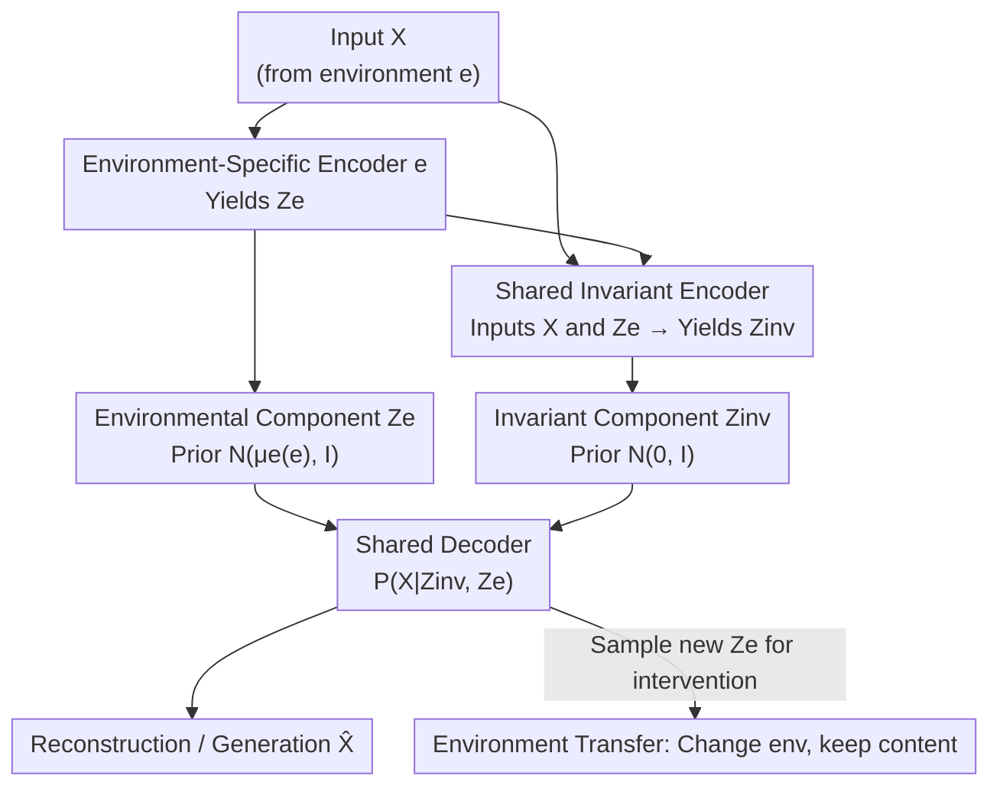

# Unsupervised Representation Learning - An Invariant Risk Minimization Perspective

**Conference**: ICLR 2026  
**OpenReview**: [https://openreview.net/forum?id=MTWFfKw3sd](https://openreview.net/forum?id=MTWFfKw3sd)  
**Code**: https://github.com/Yotamnor/UIRM  
**Area**: Self-Supervised/Representation Learning / Causal Inference / Out-of-Distribution Generalization  
**Keywords**: Invariant Risk Minimization, Unsupervised Representation Learning, Causal Generative Models, Variational Autoencoder, Environment Transfer

## TL;DR
This paper generalizes Invariant Risk Minimization (IRM), which originally depends on labels, to unlabeled scenarios. It redefines "invariance" as "feature distribution alignment across environments" and proposes two methods: PICA for linear Gaussian cases and VIAE for deep generative models. The approach achieves label-independent invariant structure extraction and cross-environment generalization on synthetic data, modified MNIST, and CelebA.

## Background & Motivation

**Background**: IRM (Arjovsky et al., 2019) is a cornerstone of Out-of-Distribution (OOD) generalization. It assumes data originates from multiple environments with differing distributions, where a subset of latent features remains stable across environments (invariant features $Z_{inv}$) while others vary (environmental/spurious features $Z_e$). The goal of IRM is to learn a representation $\phi(X)$ that retains only invariant features and filters out environmental ones, ensuring the classifier $w \circ \phi$ built upon it is robust to distribution shifts. The original objective is a bi-level optimization:

$$\min_{\phi, w} \sum_{e \in E_{train}} R^e(w \circ \phi) \quad \text{s.t.} \quad w \in \arg\min_{\bar{w}} R^e(\bar{w} \circ \phi) \ \forall e.$$

**Limitations of Prior Work**: IRM and its numerous successors (IRMv1, Sparse IRM, IB-IRM, etc.) inherently **depend on labels $Y$**. "Invariance" is defined via the "consistency of the optimal predictor across environments," which cannot be formulated without labels. However, in many real-world scenarios, labels are expensive or unavailable, leaving a gap in obtaining unsupervised representations resistant to distribution shifts.

**Key Challenge**: The definition of invariance in IRM is naturally tied to the "label-predictor" relationship. In an unsupervised setting, the absence of $Y$ and risk $R^e$ causes the entire bi-level constraint to fail. To adapt IRM to the unsupervised world, one must find an **equivalent constraint that characterizes "environment invariance" without relying on labels**.

**Goal**: (1) Provide an unsupervised definition of invariance and an optimization objective; (2) derive a solvable algorithm for simple linear Gaussian cases; (3) implement the separation of invariant/environmental latent variables in deep generative models to support controllable generation and environment transfer.

**Key Insight**: The authors observe that "predictor consistency across environments" in supervised IRM is essentially a form of distribution alignment. Thus, they shift invariance directly to the **feature level**: requiring the learned representation $\phi(X)$ to have identical distributions across all environments, $P^{e_1}(\phi(X)) = P^{e_2}(\phi(X))$. This constraint avoids labels while preserving the spirit of IRM.

**Core Idea**: Replace "optimal predictor across environments" with "feature distribution alignment across environments," and substitute the risk term in IRM with a maximum likelihood term, thereby achieving unsupervised invariant representation learning under a new "Unsupervised Structural Causal Model."

## Method

### Overall Architecture

The paper presents two pathways under a unified unsupervised IRM framework. The optimization objective is to maximize data likelihood across environments while forcing the learned feature distributions to be identical:

$$\max_{\theta} \sum_{e \in E_{train}} \log P_\theta^e(X \mid \phi(X)) P_\theta^e(\phi(X)) \quad \text{s.t.} \quad P_\theta^i(\phi(X)) = P_\theta^j(\phi(X)) \ \forall i, j.$$

The likelihood term serves the role of "empirical risk" in supervised IRM, while the constraint term serves as "invariance." This objective is based on a proposed **Unsupervised Structural Causal Model (Unsupervised SCM)**, which unifies FIIF/PIIF and causal/anti-causal structures from prior IRM literature into a single generative graph: the latent space is decomposed into an invariant component $Z_{inv}$ and an environmental component $Z_e$, which together generate $X$ through a cross-environment stable causal mechanism.

Under this framework, PICA handles simplified linear Gaussian cases by solving for the invariant projection direction using the null space of covariances, serving as an analytical dimensionality reduction algorithm. The primary method, VIAE, uses a Variational Autoencoder to explicitly decompose the latent space into invariant and environmental blocks, supporting sampling, latent intervention, and environment transfer. The VIAE data flow is as follows:

### Key Designs

**1. Unsupervised IRM Objective: Replacing "Label Invariance" with "Feature Distribution Alignment"**

Supervised IRM defines invariance by requiring the predictor to be optimal for every environment, necessitating labels $Y$ and risk $R^e$. The key step here is to push invariance down to the feature distribution level: requiring $P^i_\theta(\phi(X)) = P^j_\theta(\phi(X))$ for any pair of environments, and replacing the risk in the objective with the sum of log-likelihoods across environments. This objective only uses unlabeled data $X^e \sim P^e_X$ while maintaining the dual structure of "empirical risk + invariance constraint." It shares roots with unsupervised representation learning like VAE and probabilistic PCA but adds an explicit "cross-environment feature distribution equality" constraint, which gives the representation OOD robustness potential.

**2. PICA: Solving for Invariant Projection via Null Space under Linear Gaussian Assumptions**

To implement the abstract objective, the authors solve the simplest case where data in each environment follows a Gaussian distribution $X^e \sim \mathcal{N}(\mu^e, \Sigma^e_x)$ and is zero-mean centered. The goal is to find a unit direction $u$ such that the variance of the projection $u^\top X$ is maximized across environments while the distribution remains identical. Under Gaussian assumptions, "identical distribution" is equivalent to "identical variance," leading to the constraint $u^\top \Sigma^i_x u = u^\top \Sigma^j_x u$. In a two-environment case, the invariance constraint simplifies to $u^\top(\Sigma^1_x - \Sigma^2_x)u = 0$, meaning $u$ must lie in $\ker(\Sigma^1_x - \Sigma^2_x)$. The objective simplifies to $u^\top(\Sigma^1_x + \Sigma^2_x)u$. PICA proceeds in two steps: first find the null space $U = \ker(\Sigma^1_x - \Sigma^2_x)$, then select the direction within $U$ that maximizes $u^\top(\Sigma^1_x + \Sigma^2_x)u$. To retain $d_r$ invariant principal directions, the second step is repeated $d_r$ times within the null space. This acts as a dimensionality reducer that "performs PCA only within the invariant subspace," filtering out dimensions that drift with the environment.

**3. VIAE: Factorized Latent Space + Shared Invariant Encoder + Environment-Specific Encoders**

PICA applies only to linear Gaussian cases; the primary method VIAE brings the same logic to VAEs. it explicitly factorizes the latent space into invariant components $Z_{inv}$ and environmental components $Z_e$, designing the encoding/decoding structure based on causal independencies derived from the unsupervised SCM. Priors are set as $Z_{inv} \perp Z_e$ and $Z_{inv} \perp e$, with $Z_{inv} \sim \mathcal{N}(0, I)$, while each environment is assigned an environment-specific prior $Z_e \sim \mathcal{N}(\mu^e(e), I)$ with distinct means to facilitate targeted sampling. The posterior factorizes as $P^e(Z_{inv}, Z_e \mid X) = P(Z_{inv} \mid Z_e, X)\,P^e(Z_e \mid X)$. Because $Z_{inv}$ and $Z_e$ become correlated given $X$ due to the collider structure $Z_{inv} \to X \leftarrow Z_e$, the **invariant encoder takes both $X$ and $Z_e$ as input**, while each environment-specific encoder takes only $X$. The network consists of one shared decoder, one shared invariant encoder, and $|E_{train}|$ environment-specific encoders (each with independent parameters). The decoder satisfies $P^e(X \mid Z_{inv}, Z_e) = P(X \mid Z)$ according to the causal mechanism, meaning the environment provides no extra information once the latent variables are given—thus, the decoder receives no explicit environment ID.

**4. Environment Transfer: Redefining "Solving IRM" as Aligning All Samples to the Same Environment**

In an unsupervised setting, where the decoder is neither a classifier nor a regressor, the definition of "solving IRM" needs redefinition. The authors propose that if datasets from different environments can be **all transferred to the same target environment** while preserving invariant content, distribution shift is eliminated, and the problem reduces to standard learning. Formally, to transfer a sample from source $e_s$ to target $e_t$: extract $X^{e_s}$ → pass through source encoder to get $\hat{Z}_{e_s}$ → feed $X^{e_s}$ and $\hat{Z}_{e_s}$ to the invariant encoder to get $\hat{Z}_{inv}$ → sample $\hat{Z}_{e_t} \sim \mathcal{N}(\mu^e(e_t), I)$ from the target prior → decode $\hat{X}^{e_t} = \text{Dec}(\hat{Z}_{inv}, \hat{Z}_{e_t})$. The beauty of this perspective is that it does not require "stripping environmental features" (which can be ill-defined, e.g., an X-ray without brightness is destroyed data) but rather **aligning environments**. This works well for seen source environments $e_s \in E_{train}$. For unseen source environments $e_s \in E_{test}$, lacking a corresponding encoder, the authors approximate $\hat{Z}_{e_s}$ by averaging outputs from all training encoders. This succeeds on simple datasets (SMNIST) but fails on harder ones (SCMNIST) where the training environments do not cover the subspace of the test environment (e.g., the blue channel being constant 0 in training).

### Loss & Training

VIAE follows standard VAE ELBO training (reconstruction likelihood + latent KL regularization), but the latent space is split into invariant and environmental parts following the causal posterior factorization. Environmental KL is aligned to environment-specific priors $\mathcal{N}(\mu^e(e), I)$, and invariant KL to $\mathcal{N}(0, I)$. A narrow latent space acts as an information bottleneck, consistent with the conclusion in IRM literature that bottlenecks help identify invariant predictors. (Note: The main text does not provide the explicit itemized ELBO formula; refer to the original paper/appendix and code for the exact objective.)

## Key Experimental Results

### Main Results

The core validation for VIAE is "whether the latent space is truly separated into invariant/environmental parts." The authors train four linear classifiers on the VIAE encoder outputs and evaluate them on test samples from training environments (mean ± SD of 10 runs):

| Classifier | Meaning | SMNIST | SCMNIST |
|------------|---------|--------|---------|
| $\hat{Y}_{I2L}$ | Predict Label using Invariant Features | 0.845 ± 0.050 | 0.832 ± 0.072 |
| $\hat{Y}_{e2L}$ | Predict Label using Env Features | 0.362 ± 0.041 | 0.345 ± 0.045 |
| $\hat{e}_{I2e}$ | Predict Env using Invariant Features | 0.556 ± 0.066 | 0.583 ± 0.055 |
| $\hat{e}_{e2e}$ | Predict Env using Env Features | 1.0 ± 0 | 1.0 ± 0 |

The invariant features predict digit labels with high accuracy (≈0.84), while environmental features show a significant drop (≈0.35). Crucially, predicting the environment using invariant features is near random (0.55–0.58 vs. 0.5 baseline), indicating the invariant space contains almost no environmental information. Conversely, environmental features predict the environment perfectly (1.0), indicating environmental info is strictly captured in $Z_e$.

### Ablation Study

Validation of PICA on synthetic data: The generation process is $X^e = \mu^e(e) + A_{inv}Z_{inv} + A_e Z_e + \epsilon$, where two environments differ in mean, environmental variance ($\sigma^2_{e(1)}=10, \sigma^2_{e(2)}=2$), and covariance structure. Using 1000 samples, PICA with $d_r=1$ yields projection distributions that almost overlap across environments, proving it identifies the invariant direction.

| Scenario | Observation | Explanation |
|----------|-------------|-------------|
| PICA Synthetic ($d_r=1$) | Overlapping projection distributions | Null space method successfully extracts invariant direction |
| Env Transfer ($e_s \in E_{train}$) | Successful on SMNIST / SCMNIST | Seen source environments perform well |
| Env Transfer ($e_s \in E_{test}$) | OK on SMNIST, fails on SCMNIST | Training envs do not cover the test subspace |

### Key Findings
- **Successful separation is the strongest evidence**: The contrast between $\hat{e}_{I2e}\approx 0.5$ (invariant features cannot predict environment) and $\hat{e}_{e2e}=1.0$ (environmental features predict environment perfectly) directly demonstrates the latent space is split into orthogonal blocks.
- **Unseen environment transfer is constrained by "environment coverage"**: The failure on SCMNIST is because training environments do not span the "blue dimension," aligning with theory by Rosenfeld et al. (2020) that sufficient environments are needed for generalization—this is a fundamental OOD limitation rather than an algorithmic bug.
- **Controllable Generation**: By fixing $Z_{inv}$ and changing the $Z_e$ prior, the decoder generates samples matching the target environment while maintaining digit content without explicit environment labels, validating the stability of the causal mechanism.

## Highlights & Insights
- **"Anchor Shift" for Invariance**: Moving invariance from the "label-predictor" relationship to "feature distribution alignment" cleanly Decouples IRM from label dependency. This is the most impactful step of the work.
- **"Aligning Environments" vs. "Stripping Environments"**: Using the X-ray brightness example to show that "purely invariant samples" are often undefined, the paper reframes the IRM goal as environment alignment. This is more practical than the intuitive "removing spurious features" and is applicable to style transfer and domain adaptation.
- **Causal Graph Driven Architecture**: The collider structure $Z_{inv}\to X\leftarrow Z_e$ dictates that the "invariant encoder must process both $X$ and $Z_e$," providing a clear example of "theory-guided architecture" in causal representation learning.

## Limitations & Future Work
- **No theoretical guarantee for seen environment transfer**: For $e_s \in E_{test}$, the method relies on a simple average of environmental encoders, which fails on complex data. The authors identify this as an open problem, suggesting Meta-Learning (e.g., MAML) for few-shot or one-shot adaptation.
- **Vanilla VAE Architecture**: Experiments are limited to SMNIST/SCMNIST/CelebA. The authors acknowledge that stronger generators like GANs or Diffusion models are needed for real-world complex data.
- **Strong Distribution Assumptions**: PICA relies on linear Gaussian assumptions, while VIAE depends on the causal independence assumptions of the unsupervised SCM. The robustness of the method when these assumptions are violated is not systematically investigated.
- **Residual Label Information in Environment Features**: $\hat{Y}_{e2L}\approx 0.35$ is higher than random (0.1), suggesting some label-related information still leaks into the environmental component.

## Related Work & Insights
- **vs. Supervised IRM (Arjovsky et al., 2019)**: They define invariance via cross-environment optimal predictors, requiring labels; this work uses cross-environment feature distribution equality, requiring no labels, replacing bi-level risk with MLE + distribution alignment.
- **vs. VAE-based Unsupervised Invariant Representations (Lopez et al., 2018; Moyer et al., 2018)**: While also using VAEs, this work is rooted in a new unsupervised SCM, explicitly separates environment-specific encoders, and supports environment transfer and intervention.
- **vs. Salaudeen & Koyejo (2024)**: Both parameterize $Z_{inv}$ and $Z_e$ simultaneously, but this work utilizes the separation for cross-environment sample transfer and attempts unseen environment extrapolation.
- **vs. Domain Adaptation (Tzeng et al., 2017; Zhu et al., 2017)**: Environment transfer resembles domain adaptation, but VIAE can potentially transfer from **unseen source environments**, whereas traditional domain adaptation typically requires source and target environments to be seen during training.

## Rating
- Novelty: ⭐⭐⭐⭐⭐ First clean generalization of IRM to the unsupervised setting; the redefinition of invariance is sharp.
- Experimental Thoroughness: ⭐⭐⭐ Solid proof-of-concept (separation experiments are convincing), but datasets are simple and lack quantitative comparisons with existing unsupervised representation methods.
- Writing Quality: ⭐⭐⭐⭐ Clear derivation from causal assumptions to architecture; the motivation for environment transfer is well-articulated.
- Value: ⭐⭐⭐⭐ Opens a new path for unlabeled OOD representation learning; the framework and the "environment alignment" perspective have strong extensibility.

<!-- RELATED:START -->

## Related Papers

- [\[ICLR 2026\] Difficult Examples Hurt Unsupervised Contrastive Learning: A Theoretical Perspective](difficult_examples_hurt_unsupervised_contrastive_learning_a_theoretical_perspect.md)
- [\[ICLR 2026\] Soft Equivariance Regularization for Invariant Self-Supervised Learning](soft_equivariance_regularization_for_invariant_self-supervised_learning.md)
- [\[ICLR 2026\] Disentangled representation learning through unsupervised symmetry group discovery](disentangled_representation_learning_through_unsupervised_symmetry_group_discove.md)
- [\[ICLR 2026\] PredNext: Explicit Cross-View Temporal Prediction for Unsupervised Learning in Spiking Neural Networks](prednext_explicit_cross-view_temporal_prediction_for_unsupervised_learning_in_sp.md)
- [\[ICLR 2026\] Rethinking Unsupervised Cross-Modal Flow Estimation: Learning from Decoupled Optimization and Consistency Constraint](rethinking_unsupervised_cross-modal_flow_estimation_learning_from_decoupled_opti.md)

<!-- RELATED:END -->
