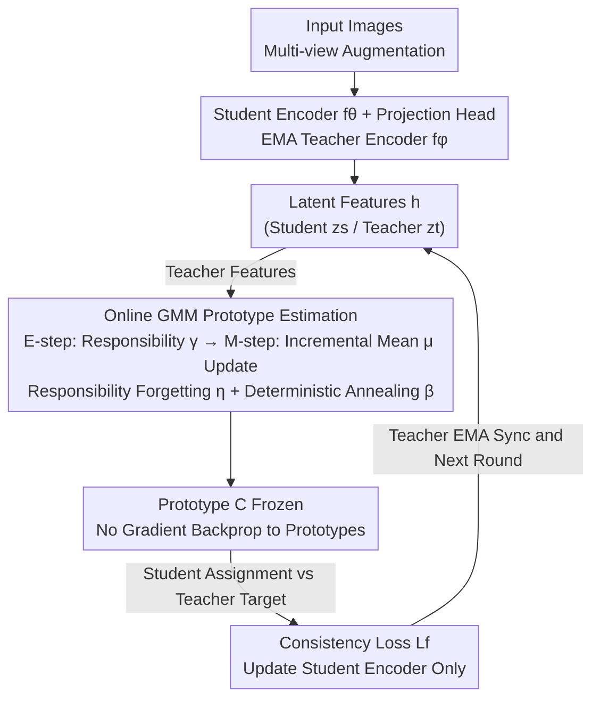

# Why Prototypes Collapse: Diagnosing and Preventing Partial Collapse in Prototypical Self-Supervised Learning

**Conference**: ICLR 2026  
**arXiv**: [2510.20108](https://arxiv.org/abs/2510.20108)  
**Code**: [GitHub](https://dsb-ifi.github.com/proto-decoupling)  
**Area**: Self-Supervised Learning / Prototypical Learning / Representation Collapse  
**Keywords**: prototype collapse, self-supervised learning, DINO, decoupling, Gaussian mixture

## TL;DR
This work diagnoses the root cause of partial prototype collapse in prototypical self-supervised learning (SSL) as shortcut learning induced by the joint optimization of the encoder and prototypes. It proposes a fully decoupled training strategy—using an online GMM to independently estimate prototypes—to eliminate collapse and improve downstream performance.

## Background & Motivation

**Background**: Prototypical SSL frameworks (DINO, DINOv2, CARP, etc.) use learnable prototype vectors as clustering anchors to guide representations into semantically consistent regions. Recently, these methods have achieved performance comparable to language-supervised schemes.

**Limitations of Prior Work**: Several methods suffer from severe **partial prototype collapse**, where a large number of prototypes converge to nearly identical representations. DINO retains only 1.5% unique prototypes, and the DINOv2 instance head collapses by 98%. In practice, this is only mitigated through over-parameterization.

**Key Challenge**: The purpose of prototypes is to provide diverse targets to guide rich representations, but collapse makes prototypes redundant, violating the original design intent.

**Goal**: (1) Systematically diagnose the root cause of collapse; (2) Design a fundamental solution.

**Key Insight**: It was observed that the CAPI method maintains 99.9% unique prototypes due to partial decoupling of teacher prototype updates, suggesting that joint optimization is the root cause.

**Core Idea**: Fully decouple prototype estimation from encoder optimization—estimating prototypes using an independent online GMM while training the encoder with a consistency loss—to eliminate the incentive for shortcut learning.

## Method

### Overall Architecture
Standard practice in prototypical SSL is joint optimization of encoder parameters $\theta$ and the prototype matrix $C$ within a single objective: $\min_{\theta, C} \mathcal{L}_f(f_\theta, C)$. This paper argues that this joint optimization enables collapse—since prototypes are learnable, the optimizer allows them to drift toward overlapping positions to minimize the loss via a "shortcut." The paper quantifies collapse across methods and identifies joint optimization as the cause. The proposed solution changes training into two alternating, non-coupled sub-processes. Specifically, the student encoder $f_\theta$ and the EMA-maintained teacher encoder $f_\phi$ map multi-view inputs to latent features $h$. Teacher features are fed into an **online Gaussian Mixture Model (GMM)** to estimate prototypes independently, while the encoder is updated using the consistency loss with fixed prototypes (no gradient backpropagation to prototypes). By removing prototypes from backpropagation, the incentive for shortcut learning is eliminated.

### Key Designs

**1. Diagnosis of Partial Collapse: Quantifying the root cause in joint optimization**

To resolve collapse, it must be measured. The study calculates the ratio of "unique prototypes" across SSL methods—prototypes with an angular distance greater than a threshold $\epsilon$. Results show that in DINO, only 1.5% of 60,000 prototypes are unique; CARP has 10.8%, and DINOv2’s instance head is as low as 1.0%. A key counterexample is CAPI, which achieves 99.9% unique prototypes (at $\epsilon=0.025$) because it partially decouples teacher prototype updates. Since collapse occurs extremely early in training, these clues point to joint optimization under a shared loss creating shortcut learning, rather than specific framework details.

**2. Fully Decoupled Training: Removing prototypes from backpropagation**

Since joint optimization is the cause, the remedy is to decouple it completely. Unlike CAPI’s "partial decoupling" (where student prototypes are still jointly optimized), this work implements **full decoupling**: prototypes are entirely removed from gradient updates. Training alternates between two separate objectives at iteration $t$: updating prototypes using current teacher features, and then updating the student encoder via consistency loss while the prototypes are frozen. Since prototypes can no longer drift towards redundant positions to lower the loss, the "shortcut" is blocked without requiring explicit regularization.

**3. Online GMM Prototype Estimation: Incremental EM with forgetting and annealing**

The core design after decoupling is the prototype estimation method. Prototypes are modeled as component means $\mu_k$ of an online GMM. For each batch, a two-step update is performed: calculating soft assignment responsibilities $\gamma_{ik}$ for teacher features $h_i$, then incrementally updating mixture weights, means, and diagonal covariances. To prevent responsibility imbalance when the number of components $K$ is large, the method uses responsibility forgetting (decaying old statistics with factor $\eta$) and deterministic annealing (adjusting soft assignment sharpness with factor $\beta$). This online approach incorporates dataset-wide information and fits seamlessly into batch-wise SSL training while saving memory by removing prototypes from the computation graph.

### Loss & Training
The encoder retains the original consistency loss (e.g., cross-view prediction in DINO/CARP). The only modification is that prototypes $C$ are provided by the online GMM and are frozen during the encoder update step. The two sub-processes alternate: GMM prototypes are refreshed by current features, followed by the backpropagation of the encoder using fixed prototypes.

## Key Experimental Results

### Main Results: Prototype Diversity

| Method | Initial Prototypes | Unique Prototypes ($\epsilon=0.025$) | Percentage |
|------|----------|----------|--------|
| DINO | 60,000 | 908 | 1.5% |
| CARP | 65,536 | 7,052 | 10.8% |
| DINOv2 Instance Head | 262,144 | 2,556 | 1.0% |
| CAPI (Partial Decoupling)| 16,384 | 16,383 | 99.9% |
| **CARP+Decoupling (Ours)** | **65,536** | **65,536** | **100%** |

### Ablation Study

| Configuration | Unique Prototypes | Downstream Performance |
|------|---------|---------|
| Joint Optimization (Original) | Low | Baseline |
| + KoLeo Regularization | Medium | Slight Gain |
| Partial Decoupling | High | Gain |
| Full Decoupling (Ours) | 100% | Best |

### Key Findings
- Partial prototype collapse is a universal phenomenon in prototypical SSL, not limited to the DINO family.
- Collapse occurs very early in training, indicating a shortcut learning mechanism.
- Full decoupling maintains 100% uniqueness across all thresholds.
- Higher prototype diversity leads to better downstream representation quality.
- The decoupling method is more robust under long-tailed distributions.

## Highlights & Insights
- Emphasis on both diagnosis and remedy—quantifying the root cause before desigining the solution.
- Shortcut learning perspective—joint optimization lets prototypes take a "shortcut," which differs from traditional regularization perspectives.
- Online GMM serves as a simple and effective prototype estimator.

## Limitations & Future Work
- Primarily validated on instance-level objectives; effects on MIM (Masked Image Modeling) objectives remain for future work.
- GMM introduces additional implementation complexity.
- Downstream performance gains are sometimes incremental.

## Related Work & Insights
- **vs KoLeo-Proto**: Regularization only treats the symptoms, while decoupling addresses the root cause.
- **vs CAPI**: Partial decoupling inspired the full decoupling approach.
- **vs SWaV**: Online prototypes updated via gradients Still involve joint optimization and carry collapse risks.

## Rating
- Novelty: ⭐⭐⭐⭐ Both the diagnosis and full decoupling solution are innovative.
- Experimental Thoroughness: ⭐⭐⭐⭐ Comprehensive cross-method analysis and training dynamics tracking.
- Writing Quality: ⭐⭐⭐⭐⭐ Extremely clear narrative from diagnosis to solution.
- Value: ⭐⭐⭐⭐ Provides a key solution for robust prototypical SSL training.

## Related Papers

- [\[ICLR 2026\] ZeroSiam: An Efficient Asymmetry for Test-Time Entropy Optimization without Collapse](zerosiam_an_efficient_asymmetry_for_test-time_entropy_optimization_without_colla.md)
- [\[ICML 2025\] Collapse-Proof Non-Contrastive Self-Supervised Learning](../../ICML2025/self_supervised/collapse-proof_non-contrastive_self-supervised_learning.md)
- [\[ICLR 2026\] On the Alignment Between Supervised and Self-Supervised Contrastive Learning](on_the_alignment_between_supervised_and_self-supervised_contrastive_learning.md)
- [\[ICLR 2026\] Understanding the Learning Phases in Self-Supervised Learning via Critical Periods](understanding_the_learning_phases_in_self-supervised_learning_via_critical_perio.md)
- [\[ICLR 2026\] Equivariant Splitting: Self-supervised learning from incomplete data](equivariant_splitting_self-supervised_learning_from_incomplete_data.md)

<!-- RELATED:END -->

<!-- RELATED:START -->

## Related Papers

- [\[ICLR 2026\] ZeroSiam: An Efficient Asymmetry for Test-Time Entropy Optimization without Collapse](zerosiam_an_efficient_asymmetry_for_test-time_entropy_optimization_without_colla.md)
- [\[ICML 2025\] Collapse-Proof Non-Contrastive Self-Supervised Learning](../../ICML2025/self_supervised/collapse-proof_non-contrastive_self-supervised_learning.md)
- [\[ICLR 2026\] On the Alignment Between Supervised and Self-Supervised Contrastive Learning](on_the_alignment_between_supervised_and_self-supervised_contrastive_learning.md)
- [\[ICLR 2026\] Understanding the Learning Phases in Self-Supervised Learning via Critical Periods](understanding_the_learning_phases_in_self-supervised_learning_via_critical_perio.md)
- [\[ICLR 2026\] Equivariant Splitting: Self-supervised learning from incomplete data](equivariant_splitting_self-supervised_learning_from_incomplete_data.md)

<!-- RELATED:END -->
