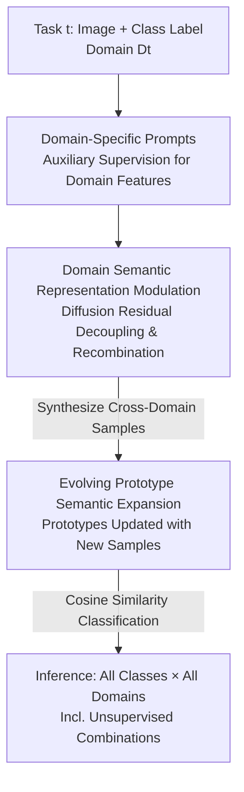

# XIL: Cross-Expanding Incremental Learning

**Conference**: ICLR 2026  
**OpenReview**: [Published as a conference paper at ICLR 2026](https://openreview.net/) (⚠️ Link as per original)  
**Code**: Not mentioned  
**Area**: Continual Learning / Class-Incremental Learning / Domain Generalization  
**Keywords**: Class-Incremental Learning, Cross-Domain Transfer, Domain-Specific Prompts, Generative Replay, Prototype Classification

## TL;DR
This paper proposes a novel continual learning setting, XIL, where class-incremental data originates from **evolving domains**. It requires the model to "fill" new classes back into old domains and "expand" old classes into new domains (Bi-directional Domain Transfer, BiDoT). The XEED framework is introduced, utilizing domain-specific prompts, diffusion models to generate cross-domain transfer samples, and evolving prototype classification, improving BiDoT scores by up to 31.41% on datasets with strong domain shifts.

## Background & Motivation
**Background**: Class-Incremental Learning (CIL) enables models to learn new classes sequentially without forgetting old ones. Recently, "prompt tuning" has become the mainstream approach as it can reuse large pre-trained models and adapt to new tasks at minimal cost, often outperforming full fine-tuning.

**Limitations of Prior Work**: Almost all CIL methods rely on an implicit assumption—that all tasks, training, and test data come from the **same domain distribution**. Once a domain shift occurs (e.g., training on high-definition factory part images but deploying on mobile photos, technical drawings, or sketches), performance drops significantly. Some works attempt to mitigate this by combining domain adaptation/generalization, but they generally assume a **shared label space** across domains (the same classes exist in every domain) to leverage shared attributes for transfer.

**Key Challenge**: In the real world, data availability is highly uneven across domains and classes—a class might only be labeled in the domain where it first appeared, leaving **zero samples of that class in other domains** to learn cross-domain shared attributes. Moreover, deployment environments switch or regress frequently, requiring the model to recognize **all seen classes** across **all seen domains**, even for "class-domain" combinations that were never directly supervised. This is the blind spot conventional CIL fails to cover.

**Goal**: To extend CIL into a new setting capable of handling "cross-domain class increment + bi-directional class-domain association expansion," providing quantifiable evaluation metrics and a functional baseline framework.

**Key Insight**: The authors first provide empirical evidence—using Joint-FT and various SOTA methods to test accuracy on **new combinations** of "seen domains × seen classes," discovering massive performance drops (Fig. 2). This indicates existing architectures and training protocols **inherently lack** bi-directional domain transfer capabilities. Since models fail to learn cross-domain shared attributes autonomously, generative models are used to "create" samples of these missing combinations.

**Core Idea**: Define the **XIL** (Cross-Expanding Incremental Learning) setting and the **BiDoT Score** metric; use diffusion models to decouple and recombine "class semantics" and "domain style" to synthesize unsupervised "class-domain" transfer samples. Coupled with domain-specific prompts and evolving prototypes, this allows class semantics to **expand bi-directionally** across all historical domains.

## Method

### Overall Architecture
XEED (Semantic Expansion through Evolving Domains) addresses the problem: given that task $t$ only provides "class set $C_t$ + domain $D_t$," the model must generalize to all "class-domain" combinations $\bigcup_i \bigcup_j (C_i, D_j)$ at inference—including those never directly supervised. The workflow consists of three interconnected components: first, **domain-specific prompts** are learned via auxiliary supervision to encode "which domain this is" into a frozen pre-trained feature extractor; second, a **pre-trained diffusion model performs representation modulation** to "transfer" the style of one domain to the classes of another task, synthesizing missing cross-domain samples without training; finally, these synthetic samples **continuously update evolving prototypes**, allowing the classifier's semantic space to expand bi-directionally as domains evolve. The entire process is rehearsal-free—original data is discarded after use, retaining only pseudo-samples generated based on class centroids.

Formally, the XIL task sequence is $T_{XIL} = \{(C_1, D_1), (C_2, D_2), \dots, (C_t, D_t)\}$, where class sets are mutually exclusive $C_i \cap C_j = \varnothing$, and domain distributions change with tasks $P^i_{XY} \neq P^j_{XY}$. The inference evaluation set $E_{XIL} = \bigcup_{i}\bigcup_{j}(C_i, D_j)$ covers both "knowledge retention" and "bi-directional domain transfer."

### Key Designs

**1. Domain-Specific Prompts + Auxiliary Supervision: Separating "Domain Style" from "Class Semantics"**
The challenge is that domains evolve, but the model must extract meaningful features for old classes in any historical domain—even if those "class-domain" combinations lack supervision. The approach assigns a learnable prompt $P^{D_t} \in \mathbb{R}^{L \times D}$ to each task domain $D_t$, inserted after the class token and before image patches. The input $z_i = [x_{cls}, P^{D_t}, x_{img}]$ is fed into a **frozen** feature extractor $f_\phi$, with the class token output serving as the representation $h_i = f_\phi(z_i)[0]$. An auxiliary linear classifier $A_\phi$ is trained using cross-entropy to predict the class within domain $D_t$: $L_{CE} = -\sum y_i \log A_\phi(h_i)$. During training, **only the prompts $P^{D_t}$ and $A_\phi$ are updated**, while the feature extractor remains frozen.

The auxiliary supervision serves as a "regularizer": since class prediction is performed by the prompt and auxiliary head together, the prompt is forced to encode **shared domain style features** rather than class-specific semantics (which are handled by the frozen backbone and subsequent prototypes). This decouples domain and class, allowing the prompt to act as a "domain style switch."

**2. Domain Semantic Representation Modulation: "Creating" Unsupervised Class-Domain Combinations**
This is where bi-directional transfer occurs. For a class $T^{t'}$ supervised only in its own domain, it needs to be "moved" to domain $t$ without real samples or training a new generator. The authors utilize IP-Adapter + SDXL for **training-free** semantic modulation. Image conditions $I_i$ and class name text conditions $T_i$ are encoded (using CLIP), and a **residual vector** is calculated to remove class semantics, leaving only domain features:

$$\delta^t_I = \text{Enc}_I(I^t_i) - \text{Enc}_T(T^t_i)$$

Using the target class text $T^{t'}_i$ as semantics and $\delta^t_I$ as the domain condition, cross-domain transfer samples are generated:

$$x^{t' \leftarrow t}_{transfer} = g_\theta(z, k, \text{Enc}_T(T^{t'}_i), \delta^t_I)$$

To prevent interference between class semantics and domain style, $\delta^t_I$ is injected only into **specific Transformer blocks responsible for layout/style** to modify cross-attention. A small number of denoising steps $k$ is used during generation—altering only low-level details while preserving high-level semantics, which prevents overfitting to the original image and speeds up generation.

**3. Evolving Prototype Semantic Expansion: Growing Classification Boundaries with Synthetic Samples**
To incorporate synthetic samples into the classifier, the authors replace trainable linear heads with **domain-aware prototypes**. Each class $c$ under domain $D_t$ is represented by a prototype vector, calculated as the mean of feature embeddings (including synthetic samples):

$$\mu^{D_t}_c = \frac{1}{|E^{D_t}_c|} \sum_{x_i \in E^{D_t}_c} f_\phi(x_i, P^{D_t})$$

The support set $E^{D_t}_c$ **continuously expands** as new samples are synthesized or encountered, and prototypes update dynamically ("evolving"). At inference, classification is performed using cosine similarity: $\hat{y} = \arg\max_c \frac{\langle h, \mu^{D_t}_c \rangle}{\|h\|\|\mu^{D_t}_c\|}$.

Since the test image domain is unknown at inference, the model must **select the correct domain prompt**: the test embedding $f_\phi(x)$ is compared to domain prototypes $\mu^{D_t}$, and the nearest domain is chosen: $\hat{D} = \arg\min_{D_t} \|f_\phi(x) - \mu^{D_t}\|^2$.

### Loss & Training
The objective consists of a single item: the auxiliary classifier's cross-entropy loss $L_{CE}$ on the current task. Only domain prompts and the auxiliary head are updated; the backbone is frozen. Generation is training-free. Key hyperparameters: prompt length $L=5$, denoising steps $k=50$; 5–10 centroids per class used to synthesize 25–30 samples; backbone is ImageNet1K pre-trained ViT-B/16; generator is SDXL + IP-Adapter.

## Key Experimental Results

Datasets require "every class to be visible in every domain" to construct and test unseen combinations: **PACS**, **DomainNet**, and **Office-31**. Metrics include standard accuracy (Avg/Final) and the proposed **BiDoT Score** (A-BiDoT for average / F-BiDoT for final), which specifically measures recognition of historical classes in "unsupervised domains."

### Main Results

| Dataset | Metric | XEED (Ours) | Next Best Baseline | Gain |
|--------|------|------|----------|------|
| PACS | F-BiDoT | **65.19** | 33.78 (CPrompt) | +31.41 |
| PACS | Final Acc | **61.86** | 43.48 (S-Prompts) | +18.38 |
| Office-31 | F-BiDoT | **78.08** | 69.06 (SimpleCIL) | +9.02 |
| Office-31 | Final Acc | **80.72** | 75.84 (CODA-P) | +4.88 |
| DomainNet | F-BiDoT | **33.63** | 29.71 (CPrompt) | +3.92 |
| DomainNet | Final Acc | 35.30 | **37.26 (CPrompt)** | −1.96 |

Across all datasets: Standard accuracy +7.1% on average, BiDoT up to +31.41%. XEED leads significantly in BiDoT; the gap is especially large on high cross-domain variance datasets like PACS.

### Ablation Study

| Config | PACS F-BiDoT | DomainNet F-BiDoT | Office-31 F-BiDoT | Description |
|------|------|------|------|------|
| XEED (Full) | **65.19** | **33.63** | **78.08** | All components |
| w/o prompts | 45.22 | 26.62 | 65.41 | Domain prompts removed |
| w/o generation | 20.91 | 4.47 | 33.62 | Synthetic samples removed |
| w/o prototype | 18.85 | 5.24 | 35.60 | Linear head used instead |

### Key Findings
- **Generation + Prototypes are vital for BiDoT**: Removing either causes BiDoT to collapse (e.g., PACS dropping from 65.19 to ~20).
- **Domain Prompts provide stable gains**: Removing them drops BiDoT by 7–20 points; they act as "style decouplers" rather than the sole driver.
- **Inference domain selection is critical**: Random domain prompt selection at inference on PACS drops F-BiDoT from 65.19 to 52.33.
- **Balanced Generalization**: XEED shows significantly lower variance across domains. While EWC drops by 52.6% on DomainNet's Clipart domain relative to its mean, XEED's worst-case deviation is only 4.8%.

## Highlights & Insights
- **Treating "Domain" as an additive residual vector in CLIP space**: (Image Embedding − Class Embedding = Domain Feature) is a clever design. It transforms missing class-domain combinations from "uncollectible data" into "calculable vector operations."
- **Full pipeline**: Introducing a new setting + new metric + baseline framework establishes a benchmark for evaluating CIL under domain evolution.
- **Training-free generation modulation**: Injecting domain residuals into specific attention blocks using shallow denoising provides a controllable generation strategy for any "style swap" task.
- **Privacy-friendly Rehearsal-free**: Original data is discarded, and only pseudo-samples generated from centroids are kept, which is more practical under tightening privacy regulations.

## Limitations & Future Work
- **Dependency on large pre-trained generators**: XEED relies on SDXL and CLIP priors; its performance might be limited in domains outside the pre-training distribution (e.g., specialized medical or industrial data).
- **Generation overhead**: Synthesizing 25–30 samples per class increases cost as class/domain counts grow.
- **DomainNet standard accuracy**: Final Acc is slightly lower than CPrompt on DomainNet, indicating a trade-off between "transfer gain" and "synthetic noise" in extreme domain shifts.
- **Inference misclassification**: Domain prototype matching might select the wrong prompt if domain styles are too similar.

## Related Work & Insights
- **vs. Prompt-based CIL (S-Prompts, CODA-P)**: These assume shared domain distributions and focus on forgetting. XEED focuses on **domain style encoding** and explicitly fills missing combinations.
- **vs. Domain-Adaptive CIL**: Prior works usually assume some target domain labels exist. XIL assumes **each class appears in only one domain**, requiring unsupervised bi-directional transfer.
- **vs. Generative Replay**: Traditional replay aims to "redraw old classes to prevent forgetting." XEED upgrades this to "redrawing **old classes in new domains / new classes in old domains**."

## Rating
- Novelty: ⭐⭐⭐⭐⭐ 
- Experimental Thoroughness: ⭐⭐⭐⭐ 
- Writing Quality: ⭐⭐⭐⭐ 
- Value: ⭐⭐⭐⭐ 

<!-- RELATED:START -->

## Related Papers

- [\[CVPR 2026\] HyCal: A Training-Free Prototype Calibration Method for Cross-Discipline Few-Shot Class-Incremental Learning](../../CVPR2026/self_supervised/hycal_training_free_prototype_calibration_for_cross_discipline_fscil.md)
- [\[ICLR 2026\] PredNext: Explicit Cross-View Temporal Prediction for Unsupervised Learning in Spiking Neural Networks](prednext_explicit_cross-view_temporal_prediction_for_unsupervised_learning_in_sp.md)
- [\[ICLR 2026\] Rethinking Unsupervised Cross-Modal Flow Estimation: Learning from Decoupled Optimization and Consistency Constraint](rethinking_unsupervised_cross-modal_flow_estimation_learning_from_decoupled_opti.md)
- [\[CVPR 2026\] Representation-Steered Incremental Adapter-Tuning for Class-Incremental Learning with Pre-Trained Models](../../CVPR2026/self_supervised/representation-steered_incremental_adapter-tuning_for_class-incremental_learning.md)
- [\[ICLR 2026\] Maximizing Incremental Information Entropy for Contrastive Learning](maximizing_incremental_information_entropy_for_contrastive_learning.md)

<!-- RELATED:END -->
## Related Papers

- [\[CVPR 2026\] HyCal: A Training-Free Prototype Calibration Method for Cross-Discipline Few-Shot Class-Incremental Learning](../../CVPR2026/self_supervised/hycal_training_free_prototype_calibration_for_cross_discipline_fscil.md)
- [\[ICLR 2026\] PredNext: Explicit Cross-View Temporal Prediction for Unsupervised Learning in Spiking Neural Networks](prednext_explicit_cross-view_temporal_prediction_for_unsupervised_learning_in_sp.md)
- [\[ICLR 2026\] Rethinking Unsupervised Cross-Modal Flow Estimation: Learning from Decoupled Optimization and Consistency Constraint](rethinking_unsupervised_cross-modal_flow_estimation_learning_from_decoupled_opti.md)
- [\[CVPR 2026\] Representation-Steered Incremental Adapter-Tuning for Class-Incremental Learning with Pre-Trained Models](../../CVPR2026/self_supervised/representation-steered_incremental_adapter-tuning_for_class-incremental_learning.md)
- [\[ICLR 2026\] Maximizing Incremental Information Entropy for Contrastive Learning](maximizing_incremental_information_entropy_for_contrastive_learning.md)

<!-- RELATED:END -->
