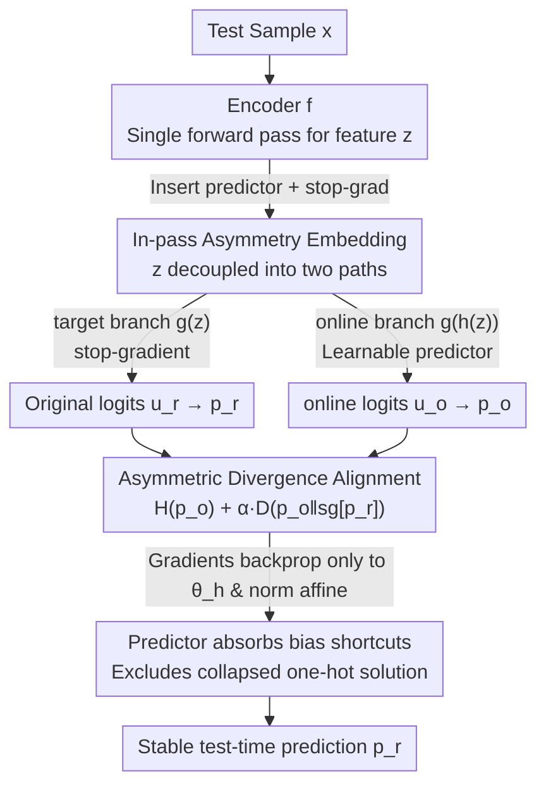

# ZeroSiam: An Efficient Asymmetry for Test-Time Entropy Optimization without Collapse

**Conference**: ICLR 2026  
**OpenReview**: [https://openreview.net/forum?id=x6jHZYhnhL](https://openreview.net/forum?id=x6jHZYhnhL)  
**Code**: https://github.com/Cascol-Chen/ZeroSiam  
**Area**: Test-Time Adaptation / Self-Supervised Representation Learning  
**Keywords**: Test-Time Entropy Minimization, Model Collapse, Asymmetric Siamese, stop-gradient, Test-Time Adaptation

## TL;DR
To address the issue where test-time entropy minimization easily collapses into degenerate solutions (predicting the same class for all samples), this paper transfers the "asymmetric structure" from negative-free SSL. By inserting a learnable predictor before the classifier and applying a stop-gradient, it creates asymmetric online/target branches within a single forward pass. Alignment regularization excludes constant one-hot solutions from the optimal set. With almost zero extra overhead, it achieves greater stability and performance across vision TTA and LLM reasoning tasks, especially on collapse-prone small models.

## Background & Motivation
**Background**: Test-time entropy minimization is a lightweight adaptation paradigm. After a model is deployed to a new environment, it uses the entropy of its own predicted distribution as a self-supervised signal for online optimization without any labels. In Test-Time Adaptation (TTA), it is used to combat domain shift (with Tent as a representative work); in LLMs, it is used to trigger reasoning capabilities and calibrate uncertainty online. The core attraction is "no source data, no change to training pipeline."

**Limitations of Prior Work**: Pure entropy minimization has a fatal shortcut—the definition of entropy only requires the predicted distribution to be "sharp," not "correct." Consequently, the model can take two lazy paths: (i) mindlessly inflating logit norms to sharpen the distribution; (ii) aligning all logits to a dominant class. Both lead to a collapsed trivial solution (e.g., outputting the same one-hot for any input). While entropy is minimized, the model learns nothing and accuracy crashes. This collapse is particularly severe for weak base models (e.g., ConvNeXt-Tiny) or in wild scenarios like long-term streams and class imbalance where source accuracy is low and entropy gradients are unreliable.

**Key Challenge**: Existing TTA methods (EATA / SAR / DeYO / COME) primarily rely on **heuristic thresholds to filter unreliable gradients** or use sharpness-aware loss to mitigate perturbations. However, thresholds are difficult to determine and generalize across domains, and filtering is only local—as long as some gradients remain for optimization, entropy can still be minimized by collapsing to a constant one-hot. In other words, these methods treat symptoms rather than the root cause; the intrinsic risk of collapse is not excluded from the optimization objective.

**Key Insight**: The authors noticed that negative-free SSL (SimSiam / BYOL) faces a nearly identical problem—two branches collapsing to the same constant representation. The SSL solution is not sample filtering, but **architectural asymmetry** (one branch with a predictor, the other with a stop-gradient), which causes the constant solution to naturally have a non-zero alignment loss, thereby structurally excluding collapse. The authors hypothesize that this asymmetric mechanism can similarly prevent trivial solutions in entropy optimization.

**Core Idea**: Incorporate "asymmetry" into test-time entropy minimization. However, SSL asymmetry is designed for similarity learning and requires extra backbone passes, making direct application inefficient. The key in this paper is **embedding asymmetry within a single forward pass**: insert a learnable predictor and stop-gradient before the classifier, decoupling the same feature into online and target asymmetric branches. The online branch minimizes entropy and aligns with the target branch—trading the cost of a single predictor for stable, collapse-free adaptation.

## Method

### Overall Architecture
ZeroSiam aims to solve the problem where "optimizing only entropy at test-time leads to collapse." The overall strategy is: **instead of filtering gradients, modify the network structure so that collapsed solutions are no longer valid minima of the optimization objective**.

Specifically, given a test sample $x$, the encoder $f$ runs once to obtain feature $z=f(x;\theta_f)$. Then $z$ splits into two paths: the **target branch** passes directly through classifier $g$ to get original logits $u_r=g(z;\theta_g)$, with a stop-gradient applied; the **online branch** passes through a lightweight linear predictor $h$ and then the same classifier to get $u_o=g(h(z;\theta_h);\theta_g)$. Softmax yields $p_r, p_o$. The loss consists of the entropy $H(p_o)$ of the online branch plus an alignment regularization that pulls $p_o$ toward $\mathrm{sg}[p_r]$. During optimization, only the predictor parameters $\theta_h$ and normalization layer affine parameters are updated (following Tent for vision; LoRA parameters for LLMs). The predictor is initialized as an identity map for a warm start and naturally creates asymmetry as it deviates from identity during online learning.

The pipeline requires no data augmentation, no extra backbone forward passes, and no teacher model. Compared to Tent, it only adds one predictor, making the overhead negligible (193s for 50k images on ViT-Base, equivalent to Tent and much lower than DeYO's 280s).

### Key Designs

**1. In-pass Asymmetry Embedding: Transforming Single-branch Entropy Optimization into a Siamese Structure**

Entropy minimization naturally has only one prediction branch, while SSL asymmetry is designed for "two augmented views" and requires multiple backbone passes—direct migration is neither applicable nor efficient. This work **inserts a predictor $h$ and a stop-gradient operator before the classifier and after the encoder**, splitting the same feature $z$ into two asymmetric views: the target branch $u_r=g(z;\theta_g)$ provides original logits with frozen gradients, and the online branch $u_o=g(h(z;\theta_h);\theta_g)$ classifies after a predictor transformation. Thus, with only one encoder pass, a Siamese-style asymmetry is created within single-branch entropy optimization without augmentations, extra forward passes, or teachers. This is the core mechanism for transferring SSL's "structural collapse prevention" to TTA—asymmetry comes not from different inputs, but from the inequality of "with/without predictor" and "with/without gradient backprop" on the same feature.

**2. Asymmetric Divergence Alignment: Excluding Constant One-hot from Valid Minima**

Having two branches is not enough; a loss must bind them. The objective function of ZeroSiam is:

$$L = H(p_o) + \alpha\, D\big(p_o \,\big\|\, \mathrm{sg}[p_r]\big),$$

where $H(p)=-\sum_c p_c\log p_c$ is the predicted entropy of the online branch, $D(\cdot\|\cdot)$ is the divergence (defaulting to symmetric KL, $D(p\|q)=D_{\mathrm{KL}}(p\|q)+D_{\mathrm{KL}}(q\|p)$, penalizing both under-coverage and over-coverage of modes), and $\alpha$ is fixed at 1. The entropy term learns discriminative features, while the alignment term ensures the online output does not deviate from the frozen target output. Crucially, because the online branch has a predictor and the target branch is stop-gradiented, they are asymmetric; thus, the collapsed solution of "outputting the same constant one-hot for any input" results in a non-zero alignment loss—constant collapse is no longer a valid minimum for $L$. Identity initialization ensures a warm start, and the online branch rapidly deviates from identity during learning to create the asymmetry needed for anti-collapse (Table 8 shows that even using a fixed random predictor to break symmetry improves Tent's 47.3% to 60.7%).

**3. Predictor as Shortcut Absorber: Beyond Anti-collapse to Regularizing Biased Learning Signals**

The authors explain why this simple structure is effective both theoretically and empirically. The key insight is defining a "shortcut" as a pattern that can be learned by a minimal network (the predictor $h$, a single FC layer), which trivially reduces loss but does not help generalization. Due to its minimal capacity, the predictor **prioritizes absorbing these biased shortcut signals**, transferring biased signals in entropy optimization from the backbone to itself, where they are explicitly penalized by the alignment loss. Empirically (Figure 2), when faced with higher imbalance ratios and more collapse-prone streams, the predictor parameters $\theta_h$ deviate from identity faster and further, effectively **applying stronger alignment regularization adaptively**. Meanwhile, while Tent's logit L2 norm and center dominance soar (collapse), ZeroSiam suppresses and stabilizes both. Theoretically (Theorem 1): when $\alpha=0$, the online branch changes more easily toward collapse than the target branch; when $\alpha>0$, the predictor acts as a filter, inhibiting gradient directions that push $p_o$ away from $p_r$ (corresponding to excessive logit inflation), and the system converges to a stable non-collapsed equilibrium where $p_o\to p_r$. This explains a key phenomenon—**ZeroSiam improves performance even when collapse does not occur by regularizing biased signals**.

### Loss & Training
The objective function is $L=H(p_o)+\alpha D(p_o\|\mathrm{sg}[p_r])$, with $\alpha$ fixed at 1 and $D$ as symmetric KL. Learnable parameters: for vision tasks, update predictor $\theta_h$ + normalization affine parameters (consistent with Tent); for LLM tasks, update predictor + LoRA parameters. The predictor is a single-layer linear module with identity initialization. Table 10 shows that this mechanism is generalizable to objectives other than entropy (SLR / CE / $-p^2$) and various divergences (KL / rKL / JS / MSE), proving that "asymmetric alignment" is a plug-and-play stabilization component rather than dependent on a specific loss form.

## Key Experimental Results

### Main Results
Vision tasks on ImageNet-C (level 5), covering three wild TTA scenarios: online class-imbalanced shift, long-term stream with 15 mixed corruptions, and batch size=1. Models span ResNet50-GN / ViT-Base / ViT-Small / ConvNeXt-Tiny / Swin-Tiny.

| Scenario (Avg Acc%) | NoAdapt | Tent | SAR | EATA | COME | DeYO | ZeroSiam |
|------|------|------|------|------|------|------|------|
| Online Label Shift (Table 3) | 29.0 | 30.9 | 38.8 | 40.7 | 42.5 | 43.1 | **52.9** |
| 15-Corruption Stream (Table 2) | 29.9 | 14.3 | 39.5 | 42.9 | 34.4 | 38.1 | **44.2** |
| batch size=1 (Table 4) | 29.0 | 33.2 | 37.2 | 36.0 | 43.0 | 44.0 | **52.5** |
| Blind-spot Subset bs=1 (Table 6) | 29.0 | 21.7 | 33.8 | 33.5 | 33.6 | 29.8 | **52.0** |

LLM Online Reasoning (Llama3.1-8B-Instruct, Mathematical Reasoning):

| Method | Math-500 | CollegeMath | AIME24 | Minerva | Average |
|------|------|------|------|------|------|
| Baseline | 49.20 | 25.00 | 3.33 | 20.96 | 24.62 |
| Tent | 50.00 | 24.17(−0.83) | 6.67 | 20.59 | 25.36 |
| COME | 49.80 | 25.42 | 6.67 | 22.74 | 26.16 |
| **ZeroSiam** | **52.60(+3.40)** | **26.25** | **13.33(+10.00)** | 22.06 | **28.56(+3.94)** |

ZeroSiam achieves 52.9% avg. in label shift vs SAR's 38.8%, and +8.5% over DeYO at batch=1. In reasoning, it gains +10.00% on AIME24, while most baselines drop on CollegeMath (Tent -0.83%, SAR -0.75%); ZeroSiam gains +1.25% due to regularizing non-generalizing shortcuts.

### Ablation Study

| Configuration | Key Indicator | Description |
|------|---------|------|
| Tent (No Asymmetry) | 47.3 | ViT-Base Label Shift baseline |
| ZeroSiam (Linear FC predictor) | 64.1 | Full model |
| Fixed Random FC predictor | 60.7 | Large gain over Tent just by breaking symmetry |
| FC+ReLU+FC (Deeper/Non-linear) | 64.0 | No gain; predictor needs minimal capacity to absorb shortcuts |
| ZeroSiam + EATA / DeYO | 49.0 / 53.9 | Plug-and-play: +8.4% for EATA, +7.4% for DeYO |

### Key Findings
- The core of anti-collapse is "asymmetry" itself: a fixed random predictor (not trained) improves 47.3% to 60.7%, proving that breaking symmetry is more critical than what the predictor learns.
- Large capacity is not needed for the predictor: deepening it to FC+ReLU+FC gives almost no gain (64.0 vs 64.1), confirming its role as a "biased shortcut absorber" rather than learning rich representations.
- Blind-spot subset (adapting only on samples misclassified by the original model) is the ultimate stress test: DeYO collapses to worse-than-NoAdapt in 12/20 scenarios, while ZeroSiam improves steadily (29.0%→52.0%), showing reliable adaptation even when pseudo-labels are entirely incorrect.
- Anti-noise learning: after pre-adaptation on pure Gaussian noise, CETA crashes from 67.3% to 27.2%, while ZeroSiam maintains ≈72%, showing it absorbs and regularizes non-semantic shortcuts.
- Mechanism generality: effective across different entropy-replacement objectives (SLR/CE/$-p^2$) and divergences (KL/rKL/JS/MSE).

## Highlights & Insights
- **Minimalist Domain Transfer**: Transfers the "asymmetric anti-collapse" idea from negative-free SSL to TTA without adopting the heavy two-view/dual-forward structure. Using a "pre-classifier predictor + stop-gradient" achieves asymmetry in a single pass—overhead matches Tent. This strategy of "finding the mechanism's essence for minimal implementation" is highly instructive.
- **Root Cause Solution at the Objective Level**: While previous methods patched the problem by "filtering bad gradients," this work ensures the collapsed one-hot is no longer a valid minimum for the loss—a structural solution rather than heuristic filtering.
- **Counter-intuitive Gain without Collapse**: The perspective of the predictor as a low-capacity shortcut absorber plus alignment regularization effectively adds a sidecar to penalize biased signals. This can be transferred to any self-training/pseudo-label scenario.
- **Cross-task Generality**: The same mechanism works for both visual TTA and LLM reasoning, providing the largest gains for small models which are most prone to collapse.

## Limitations & Future Work
- Integration with sample filtering methods (EATA/DeYO) does not guarantee better results than ZeroSiam alone—the authors acknowledge ZeroSiam is inherently robust to incorrect pseudo-labels, so traditional sample selection gains partially overlap. Optimal fusion remains future work.
- Theoretical analysis relies on several assumptions (Assumptions 1 & 2), and the characterization of "shortcut absorption" is somewhat qualitative; exactly which patterns the predictor absorbs remains a black box.
- Experiments focused on ImageNet-C corruptions and math reasoning; effectiveness in broader modalities like detection, segmentation, or multimodal generation is yet to be tested.
- The predictor uses a single linear layer, and parameters are updated with normalization affines—whether this can be applied directly to architectures with severe parameter constraints or no norm layers is not fully discussed.

## Related Work & Insights
- **vs Tent**: Tent minimizes entropy on a single branch with no anti-collapse mechanism, leading to literal collapse (logit norm explosion) in wild scenarios. ZeroSiam inserts a predictor + stop-grad to exclude collapse with minimal overhead.
- **vs SAR / DeYO / EATA**: These rely on heuristic thresholds/sharpness/weighting to filter unreliable gradients—treating symptoms. They are sensitive to models and scenarios (DeYO drops to 0.1% accuracy on weak models). ZeroSiam targets the root structural cause.
- **vs SimSiam / BYOL (Negative-free SSL)**: Both use asymmetry for anti-collapse. However, SSL is for pre-training representations, requires augmentations/dual passes, and optimizes similarity. ZeroSiam is for test-time entropy, uses single passes, requires no augmentation/teacher, and reveals a new role for asymmetry in TTA: "regularizing biased shortcuts."

## Rating
- Novelty: ⭐⭐⭐⭐⭐ First to introduce SSL asymmetric structures to TTA entropy optimization with a single-pass minimal implementation.
- Experimental Thoroughness: ⭐⭐⭐⭐⭐ 5 models × multiple wild scenarios + LLM reasoning + blind-spot/noise stress tests + theoretical analysis.
- Writing Quality: ⭐⭐⭐⭐ Motivation and mechanism are clear; theory is dense but explained via Remarks.
- Value: ⭐⭐⭐⭐⭐ Plug-and-play, zero extra overhead, high gains for small models, strong deployment utility.

<!-- RELATED:START -->

## Related Papers

- [\[ICLR 2026\] Test-Time Efficient Pretrained Model Portfolios for Time Series Forecasting](test-time_efficient_pretrained_model_portfolios_for_time_series_forecasting.md)
- [\[ICLR 2026\] NEO — No-Optimization Test-Time Adaptation through Latent Re-Centering](neo_no-optimization_test-time_adaptation_through_latent_re-centering.md)
- [\[ICLR 2026\] Architecture-Agnostic Test-Time Adaptation via Backprop-Free Embedding Alignment](architecture-agnostic_test-time_adaptation_via_backprop-free_embedding_alignment.md)
- [\[ICLR 2026\] Adaptive Test-Time Training for Predicting Need for Invasive Mechanical Ventilation in Multi-Center Cohorts](adaptive_test-time_training_for_predicting_need_for_invasive_mechanical_ventilat.md)
- [\[ICLR 2026\] Why Prototypes Collapse: Diagnosing and Preventing Partial Collapse in Prototypical Self-Supervised Learning](why_prototypes_collapse_diagnosing_and_preventing_partial_collapse_in_prototypic.md)

<!-- RELATED:END -->
