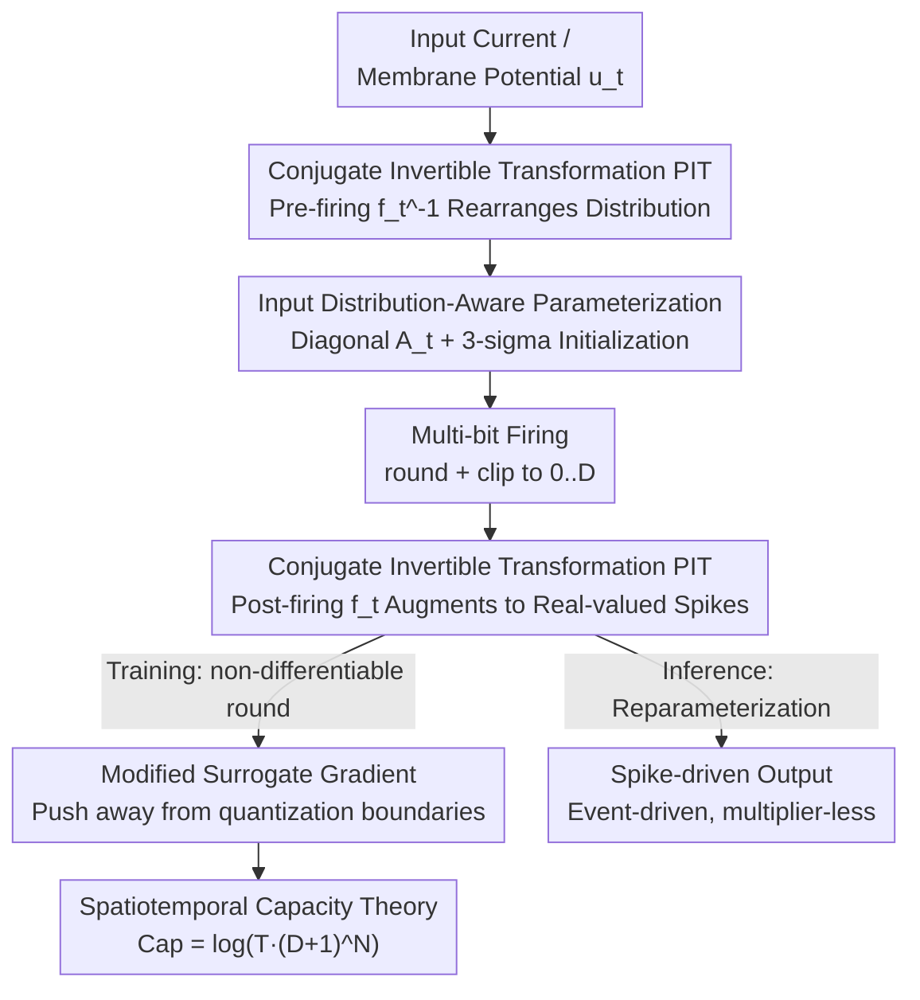

# Advancing Spatiotemporal Representations in Spiking Neural Networks via Parametic Invertible Transformation

**Conference**: ICLR 2026  
**OpenReview**: [https://openreview.net/forum?id=3JwNXQzxll](https://openreview.net/forum?id=3JwNXQzxll)  
**Code**: https://github.com/YinsongYan/ICLR26  
**Area**: Spiking Neural Networks / Neuromorphic Computing / Representation Learning  
**Keywords**: Spiking Neural Networks, Parametric Invertible Transformation, Multi-bit Spikes, Surrogate Gradient, Neuromorphic Computing

## TL;DR
Addressing the limited representation of binary spikes and surrogate gradient mismatch in Spiking Neural Networks (SNNs), this paper proposes Parametric Invertible Transformation (PIT). PIT applies conjugate invertible linear transformations before and after neuron firing: "rearranging" the membrane potential distribution into a quantization-friendly form before firing and "augmenting" integer spikes into spatiotemporal real-valued outputs after firing. This is coupled with a modified surrogate gradient that pushes inputs away from quantization decision boundaries. The method also characterizes SNN spatiotemporal representation capacity through linear algebra. Across CIFAR, ImageNet, and DVS datasets, various architectures achieved new SOTA results (e.g., SEW ResNet34 improved by 5.62%).

## Background & Motivation
**Background**: SNNs utilize asynchronous binary spike communication, converting dense multiply-accumulate (MAC) operations into sparse accumulations (AC). Combined with event-driven computation (triggered only upon spike reception), SNNs are naturally low-power and suitable for resource-constrained real-time scenarios. Mainstream training relies on BPTT combined with surrogate gradients. Strategies for enhancing representation include complex neuron dynamics, normalization, multi-bit spikes, attention mechanisms, and spike-driven transformers.

**Limitations of Prior Work**: Two fundamental constraints remain unresolved. First, the low-precision representation of binary spikes causes inherent information loss—compressing full-precision membrane potential $u$ via a firing operator $g(\cdot)$ into $\{0,1\}$ spikes leads to significant accuracy drops in complex data flows. Prior works mostly insert learnable parameters or multi-compartment structures into neuron dynamics "before firing," which adds complexity but **does not truly expand the output space**, resulting in limited reduction of information loss. Second, integer-spike neurons commonly use clipped rectangular surrogate gradients (similar to STE, using the identity function as the derivative of the round operator), which causes gradient mismatch. This leads to outputs oscillating between adjacent quantized states during training, hindering convergence to a well-generalized solution.

**Key Challenge**: Representation capacity and training stability must be addressed simultaneously. Improving only the pre-firing dynamics fails to expand the output space; merely changing the surrogate gradient fails to suppress quantization errors. Furthermore, the temporal dynamics of SNNs require "time-varying and spatially heterogeneous" processing, making "spatiotemporal homogeneous" strategies from traditional quantization literature unsuitable.

**Goal**: (1) Truly expand the spatiotemporal representation space of SNNs without destroying the spike-driven, event-driven inference paradigm; (2) Design a stable surrogate gradient for integer spikes; (3) Propose a measurable theoretical framework for "how much space an SNN can represent."

**Key Insight**: The authors re-evaluate firing as a "transformation during information propagation." Since information loss stems from the $u\to s=g(u)$ step, they introduce mutually inverse transformations $f_t$ and $f_t^{-1}$ on **both sides** of $g$. Before firing, $f_t^{-1}$ rearranges the membrane potential distribution to positions that are easier to quantize (minimizing loss). After firing, $f_t$ converts integer spikes back to real values and augments them across space and time. Because the boundaries are mutually inverse, input-output variance remains consistent, ensuring stable propagation in deep networks.

**Core Idea**: Wrapping the firing operator with a pair of "conjugate invertible transformations" ($s(t)=f_t\circ g\circ f_t^{-1}(u(t))$) reduces quantization error pre-firing and augments real-valued spike representations post-firing. Reparameterization ensures that inference remains pure spike-based and multiplier-free.

## Method

### Overall Architecture
The method is built upon Integer LIF (I-LIF) neurons. While standard LIF neurons fire binary spikes $s_t=H(u_t-\vartheta_{th})$, I-LIF allows integer firing during training: $s_t=\mathrm{clip}(\lfloor u_t\rceil,0,D)$, where $D$ is the maximum integer value. PIT is embedded into the I-LIF firing process in a **conjugate** manner: for each timestep and layer, a transformation matrix $A_t^l$ is used. Before firing, $(A_t^l)^{-1}$ transforms the membrane potential to quantization-friendly coordinates; after quantization (round + clip), $A_t^l$ transforms it back and augments it into a real-valued output. The dynamics follow a charge-fire-reset sequence:

$$u_t^l=\lambda v_{t-1}^l+W^l s_{t-1}^l,\quad s_t^l=A_t^l\,\mathrm{clip}\!\left(\lfloor (A_t^l)^{-1}u_t^l\rceil,0,D\right),\quad v_t^l=u_t^l-s_t^l.$$

To remain efficient and stable, $A_t^l$ is defined as a diagonal matrix $A_t^l=\mathrm{diag}(a_t^l)$, reducing the transformation to element-wise operations that add almost no parameters and preserve event-driven inference. The coefficients $a_t^l$ are initialized using an input-aware 3-sigma rule and updated via BPTT. A modified surrogate gradient is used during training to push inputs away from quantization boundaries. Finally, a linear algebra framework proves that SNN spatiotemporal capacity scales logarithmically with firing bits $D$ and timesteps $T$, explaining why PIT expands capacity. The data flow is as follows:

### Key Designs

**1. Parametric Invertible Transformation (PIT): Wrapping the firing operator with conjugate transformations to reduce loss and expand representation.**

Addressing the hardware limitation where pre-firing functions cannot expand output space, PIT applies transformations on both sides of the firing operator $g$: $s(t)=f_t\circ g\circ f_t^{-1}(u(t))$. Intuitively, $f_t^{-1}$ rotates/scales "hard-to-quantize" membrane distributions to "easy-to-quantize" positions, minimizing information loss during quantization ($g$). Subsequently, $f_t$ transforms the quantized results back and multiplies integer spikes $\{0, \dots, D\}$ by real-valued coefficients, augmenting spikes into real values across spatiotemporal dimensions. This design provides double benefits: additional degrees of freedom via the dual transformations and consistent input-output variance through the conjugate structure, which is crucial for deep networks. Through reparameterization, diagonal coefficients are absorbed into weights during inference, maintaining pure-integer, multiplier-free, event-driven execution.

**2. Input Distribution-Aware Diagonal Parameterization: 3-sigma initialization instead of min-max to avoid outliers.**

The core of PIT lies in the parameterization of $A_t^l$. Standard min-max scaling used in quantization literature is sensitive to large outliers, leading to unstable quantization ranges and slow convergence, especially at ultra-low bits. This work adopts a per-channel initialization based on the Gaussian 3-sigma rule:

$$a_t^l=\max\!\left(\,|\mu(u_t^l)-3\sigma(u_t^l)|,\;|\mu(u_t^l)+3\sigma(u_t^l)|\,\right)\big/\sqrt{D},$$

where $\mu$ and $\sigma$ are calculated from the membrane potentials of the first training batch. This ensures the quantization interval covers the main body of the distribution (approx. 99.7% of the mass) rather than being stretched by outliers. Using a diagonal matrix ensures this remains computationally negligible.

**3. Modified Surrogate Gradient: An augmentation term to push inputs away from decision boundaries.**

Rounding in integer firing is non-differentiable. Prior works using STE/rectangular gradients suffer from gradient mismatch and oscillations. This work corrects the gradient based on the distance of the input from the rounding decision boundary:

$$\frac{\partial\lfloor x\rceil}{\partial x}=1+\lambda\big(0.5-\mathrm{sign}(\mathrm{dis}(x))\,\mathrm{dis}(x)\big),\quad \mathrm{dis}(x)=x-\lfloor x\rfloor-0.5,$$

where $\mathrm{dis}(x)\in[-0.5,0.5]$ is the distance to the boundary. This term effectively acts as an $\ell_2$ penalty on $\|0.5-\mathrm{sign}(\mathrm{dis}(x))\cdot\mathrm{dis}(x)\|_2^2$, **encouraging inputs to move away from quantization boundaries**. Stronger correction is applied near the boundary to push inputs toward integer centers. This stabilizes rounding statistics and training oscillations. Experiments show that accuracy varies by <1% across a wide range of $\lambda \in [0.001, 0.1]$.

**4. Spatiotemporal Capacity Theory: Proving expansion via linear algebra.**

To demonstrate that PIT is more than empirical tuning, the authors define a measurable representation space as the linear subspace spanned by spikes: $\mathrm{Span}\{s\}=\{\sum_j k_j s_j\mid k_j\in\mathbb{R}\}$, where capacity is the logarithm of its cardinality $\mathrm{Cap}=\log|\cdot|$. For multi-bit SNNs, the capacity is $\mathrm{Cap}=\log\!\big(T\cdot(D+1)^N\big)$ ($T$ timesteps, $N$ hidden dimensions, $D$ quantization levels). Capacity increases logarithmically with $D$ and linearly with $N$. By introducing PIT, the output becomes $\{A_t s_t\}$, integrating extra parameters $a_{ij}$ into combination coefficients to provide more spatiotemporal degrees of freedom and expand the space. Compared to vanilla binary spikes ($\log(T\cdot 2^N)$), PIT offers higher capacity. ⚠️ *Note: The capacity expression for PIT in Corollary 1 is isomorphic to Proposition 1; expansion is primarily reflected in the increased degrees of freedom from real-valued coefficients. Details follow Appendix C.*

## Key Experimental Results

### Main Results
Evaluated on CIFAR10/100, ImageNet-1k (static), CIFAR10-DVS, and DVS-Gesture (neuromorphic) across various architectures. Timestep configuration is denoted as $T \times D$. Results are averaged over 3 seeds.

| Dataset | Architecture | Config $T\times D$ | PIT (Ours) | Representative Comparison | Gain |
|--------|------|------|------|----------|------|
| CIFAR10 | ResNet19 | 1×4 | **96.72%** | Trainable Ternary 95.80% (2×2) | — |
| CIFAR100 | ResNet19 | 1×4 | **81.59%** | Trainable Ternary 80.20% (2×2) | +1.39% |
| CIFAR100 | ResNet20 | 1×4 | 78.83% (RN18) | Real Spike 66.60% | +14.99% (vs Real Spike) |
| ImageNet-1k | SEW ResNet18 | 1×4 | **69.39%** | SEW ResNet18 baseline 63.18% | +6.21% |
| ImageNet-1k | SEW ResNet34 | 1×4 | **72.66%** | SEW ResNet34 baseline 67.04% | +5.62% |
| ImageNet-1k | E-SpikeFormer-M | 1×4 | **79.41%** | E-SpikeFormer-M 78.50% | +0.91% |

Highlights: PIT-enhanced SEW ResNet34 (72.66%) outperforms the 152-layer SEW ResNet (69.26%) and approaches its ANN counterpart (73.31%). PIT architectures often **surpass baseline accuracy within a single epoch of training**.

### Ablation Study

| Configuration | Key Metric | Description |
|------|---------|------|
| $\lambda=0.1/0.01/0.001$ | CIFAR10 95.73/95.86/95.70% | Insensitive to $\lambda$; <1% fluctuation across a wide range. |
| PIT vs LIF (CIFAR10 RN18) | 95.86% vs 94.22% | +1.64% with lower NS-ACE (4.31 vs 6.45G). |
| PIT vs QAT (CIFAR100 RN18) | 78.83% vs 77.91% | +0.92% gain over QAT under identical conditions. |
| Training RAM (ImageNet RN34) | 24.66 vs 18.86 GB | Improved accuracy at the cost of higher training memory. |

### Key Findings
- **PIT enhances both accuracy and efficiency**: Adaptive modulation reduces firing activity, leading to lower NS-ACE (neuromorphic synaptic computations) than vanilla LIF.
- **Membrane Potential Visualization**: Vanilla LIF shows nearly uniform temporal distribution; PIT dynamically adjusts distributions across timesteps to capture temporal structures.
- **Robust Hyperparameters**: $\lambda$ requires minimal tuning.
- **Trade-off**: The primary cost is increased training memory (+5.8GB on ImageNet SEW ResNet34), yielding over 5% accuracy gain.

## Highlights & Insights
- **Conjugate transformation is the most elegant design**: By flanking the firing operator with mutually inverse transformations, it resolves quantization loss and limited output space simultaneously while maintaining variance through deep layers.
- **Reparameterization preserves the SNN's core value**: All complex operations exist only during training; inference remains pure-spike, event-driven, and multiplier-free.
- **3-sigma initialization for outlier avoidance**: Using distribution statistics instead of min-max is a simple, reusable quantization trick that optimizes quantization levels at low bits.
- **"Pushing away from boundary" perspective**: Viewing STE mismatch as oscillation leads to a gradient correction that pushes inputs toward integer centers—a clean, transferable concept.
- **Quantitative capacity definition**: $\mathrm{Cap}=\log(T\cdot(D+1)^N)$ provides a unified metric for comparing different spike coding schemes.

## Limitations & Future Work
- **Training Memory**: Storing spatiotemporal transformation states increases memory overhead, which may be significant for large models or long timesteps.
- **Theoretical Ambiguity**: The link between "capacity" and "degrees of freedom" in Corollary 1 could be more direct.
- **Vision-Centric Validation**: Testing is limited to static image and DVS vision tasks; applications in RL, speech, or long-sequence time-series modeling are yet to be explored.
- **Diagonal Constraint**: While efficient, the diagonal constraint limits inter-channel coupling; low-rank or non-diagonal structures could be investigated.

## Related Work & Insights
- **vs Pre-firing Enhancement (PLIF / Learnable Thresholds)**: These do not expand the output space. PIT proves that adding transformations on both sides of firing is essential for true expansion.
- **vs Ternary/Multi-bit Spikes**: PIT provides higher capacity via real-valued augmentation than fixed ternary scales.
- **vs Real Spike**: Real Spike uses per-channel spatial scales for binary spikes; PIT uses spatiotemporal heterogeneous coefficients with integer firing.
- **vs I-LIF + STE**: PIT improves upon I-LIF by replacing standard STE with the "boundary-pushing" surrogate gradient, enhancing stability.

## Rating
- Novelty: ⭐⭐⭐⭐⭐ (Conjugate transformation + capacity theory + modified gradient).
- Experimental Thoroughness: ⭐⭐⭐⭐⭐ (Broad datasets, multiple architectures, energy metrics).
- Writing Quality: ⭐⭐⭐⭐ (Clear methodology, though some theoretical isomorphism in corollaries).
- Value: ⭐⭐⭐⭐⭐ (High accuracy while maintaining spike-driven efficiency).

<!-- RELATED:START -->

## Related Papers

- [\[CVPR 2025\] Neural Video Compression with Context Modulation](../../CVPR2025/signal_comm/neural_video_compression_with_context_modulation.md)
- [\[CVPR 2025\] Continuous Space-Time Video Resampling with Invertible Motion Steganography](../../CVPR2025/signal_comm/continuous_space-time_video_resampling_with_invertible_motion_steganography.md)
- [\[ICLR 2026\] Mamba-3: Improved Sequence Modeling using State Space Principles](mamba-3_improved_sequence_modeling_using_state_space_principles.md)
- [\[ICLR 2026\] TS-DDAE: A Novel Temporal-Spectral Denoising Diffusion AutoEncoder for Wireless Signal Recognition Model Pre-training](ts-ddae_a_novel_temporal-spectral_denoising_diffusion_autoencoder_for_wireless_s.md)
- [\[ICLR 2026\] Synchronizing Probabilities in Model-Driven Lossless Compression](synchronizing_probabilities_in_model-driven_lossless_compression.md)

<!-- RELATED:END -->
