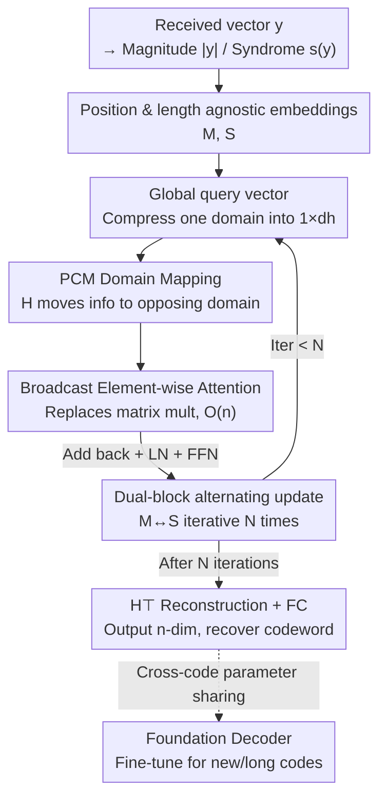

# Efficient Message-Passing Transformer for Error Correcting Codes

**Conference**: ICLR2026  
**OpenReview**: [https://openreview.net/forum?id=Xk8cwnwu2e](https://openreview.net/forum?id=Xk8cwnwu2e)  
**Code**: https://github.com/iil-postech/efficientmpt  
**Area**: Signal Processing / Communications / Error Correcting Code Decoding  
**Keywords**: Error correcting codes, Transformer decoder, linear complexity attention, parity-check matrix, foundation model

## TL;DR
EfficientMPT replaces the $O(n^2)$ standard attention in Transformer-based error-correcting code (ECC) decoders with a linear-complexity EEC attention based on "global query vectors + element-wise multiplication." While maintaining error correction performance comparable to state-of-the-art (CrossMPT), it reduces GPU memory and FLOPs by dozens of times for long LDPC codes. Its parameter count is independent of code length, allowing it to serve as a fine-tuneable "foundation model" for error correction.

## Background & Motivation

**Background**: Error Correcting Codes (ECC) are the foundation of reliable communication over noisy channels. Recently, deep learning has introduced new solutions for ECC decoding via Transformer-based decoders, achieving SOTA error correction performance on short codes. The pioneering work ECCT (Error Correction Code Transformer) utilized masked self-attention to inject the Parity-Check Matrix (PCM) $H$ into the attention mechanism. Subsequently, CrossMPT adopted masked cross-attention to treat magnitude $|y|$ and syndrome $s(y)$ separately, updating them alternately through two cross-attention modules, which further enhanced performance and reduced the size of the attention map.

**Limitations of Prior Work**: These Transformer decoders are constrained by the quadratic complexity $O(n^2)$ of the attention modules ($n$ is the code length/number of tokens). ECCT concatenates $|y|$ and $s(y)$ into an input of length $2n-k$, resulting in an attention map size of $(2n-k)^2$. CrossMPT's dual cross-attention maps total $2n(n-k)$. This leads to an explosion in GPU memory and computation as code length increases. In empirical tests, ECCT fails to train on all long LDPC codes, and CrossMPT fails on the $(1056,880)$ LDPC code due to out-of-memory (OOM) errors in experimental environments—meaning the advantages of Transformer decoders cannot currently scale to long codes.

**Key Challenge**: Error correction performance relies on attention to model relationships between bits, but the "matrix multiplication + large attention map" approach used to model these relationships is precisely the source of complexity explosion. To support long codes, the quadratic term in the attention calculation must be eliminated; however, removing it while maintaining error correction performance is difficult, as these two goals are conflicting within existing frameworks.

**Goal**: To design an attention module that allows the complexity (parameters, memory, FLOPs) of an ECC Transformer to grow approximately linearly with code length, without sacrificing error correction performance, and preferably in a way that creates a foundation model shareable across code families and fine-tuneable for new codes.

**Key Insight**: The authors observe that the primary cost of standard attention lies in the large matrix multiplications $QK^\top$ and $\text{softmax}(\cdot)V$. However, ECC decoding is essentially a message-passing process—propagating "global information" from one domain (magnitude) to another (syndrome). If the global information of one domain can be condensed into a single "global query vector" and then broadcast to another domain using the PCM $H$ (the natural mapping between domains), the matrix multiplication can degenerate into element-wise multiplication.

**Core Idea**: Replace the matrix multiplication and value projection of standard attention with "global query vector + PCM domain mapping + broadcast element-wise multiplication" to obtain a linear-complexity EEC (Efficient Error-Correcting) attention. Use this to construct EfficientMPT with alternating magnitude/syndrome updates.

## Method

### Overall Architecture

The input to EfficientMPT consists of two components derived from the pre-processed channel-received vector $y$: the magnitude vector $|y|=(|y_1|,\dots,|y_n|)$ and the syndrome vector $s(y)=Hy_b$ (where $y_b=\text{bin}(\text{sign}(y))$). These are embedded via shared linear layers into magnitude embeddings $M\in\mathbb{R}^{n\times d}$ and syndrome embeddings $S\in\mathbb{R}^{(n-k)\times d}$. The primary objective of the network is to estimate the multiplicative noise $\tilde z_s$ (satisfying $y=x_s\tilde z_s$), with the final output being an $n$-dimensional vector used to recover the codeword $\hat x=\text{bin}(\text{sign}(y\,f(y)))$.

The main structure consists of $N$ iterations of two **EfficientMPT blocks** that mimic message passing: the left block uses syndrome information to update magnitude embeddings $M\to M'$, and the right block uses the updated $M'$ to update syndrome embeddings $S\to S'$ alternately. This is a neural version of the "variable node ↔ check node" message passing in classical BP decoding. Within each block, the core is EEC attention: the attention output $\Delta M$ (or $\Delta S$) is computed and added back to the original embeddings ($M\leftarrow M+\Delta M$), followed by LayerNorm and a residual feed-forward layer. After the final block, the two embeddings are normalized; the syndrome embedding is projected back from $(n-k)\times d$ to $n\times d$ using $H^\top$ and added to the magnitude embedding, then passed through a fully connected layer to produce the $n$-dimensional output.

Crucially, all trainable parameters (embedding weights $W_M, W_S$, attention weights $W_Q, W_K, W_O$, and FFN layers) are independent of bit positions and code length. The PCM $H$ is only "used for multiplication" rather than being encoded into the parameters, allowing a single model to share parameters across different code families—naturally forming a foundation model.

### Key Designs

**1. Global Query Vector: Condensing domain-wide information into one vector**

Standard attention calculates an $n \times n$ attention map to allow each token to view the entire global context, which is the source of quadratic complexity. EEC attention reverses this logic—since ECC decoding requires propagating the "global context of the magnitude domain" to the "syndrome domain," rather than calculating separate queries for each position, the queries for all positions are summed and passed through a softmax to obtain a single global query vector:

$$q^i_{\text{global}}=\text{softmax}\Big(\sum_{j=1}^{n} Q^i(j)\Big)\in\mathbb{R}^{1\times d_h},$$

where $Q^i(j)$ is the $j$-th row of the $i$-th head query matrix. This vector is a condensed representation of all elements in the magnitude domain, acting as a high-level global summary that can be uniformly applied to every position in the syndrome domain. Its advantage lies in replacing the entire $n \times n$ attention map with a single $1 \times d_h$ vector; global context is achieved through "summing then distributing" rather than pairwise dot-products, marking the first step in reducing complexity from quadratic to linear.

**2. PCM Domain Mapping: Using the Parity-Check Matrix as a bridge**

To propagate the global query from the magnitude domain to the syndrome domain, a "bridge" is required. The authors use the PCM $H$ directly as this bridge: the key matrix $K^i \in \mathbb{R}^{n \times d_h}$ is left-multiplied by $H$ to project it into the syndrome domain, $K^i_H = HK^i \in \mathbb{R}^{(n-k) \times d_h}$. The rationale for this is strong—$H$ itself defines the constraints $Hx=0$ that all valid codewords must satisfy, precisely characterizing the relationship between magnitude elements and syndrome elements as a natural encoding of the code structure.

This differs fundamentally from previous uses of $H$: ECCT and CrossMPT used $H$ to create mask matrices that indirectly block irrelevant positions in the attention map. EfficientMPT **directly performs matrix projection with $H$**, physically mapping magnitude information into the syndrome space. The code structure is "used in" the calculation rather than being "pasted onto" attention scores. Because $H$ is not part of the parameters and only participates in forward multiplication, the model remains code-length agnostic. The paper also validates this by replacing $H$ with a randomly initialized trainable matrix; after training, it spontaneously approximates the structure of the real PCM, confirming the validity of using $H$.

**3. Broadcast Element-wise Multiplicative Attention: Replacing matrix multiplication with $O(n)$ operations**

With the global query vector and the mapped keys, the attention output is no longer computed via $\text{softmax}(QK^\top)V$. Instead, the global query vector is broadcast and multiplied element-wise with $K^i_H$:

$$\Delta S=\big[q^1_{\text{global}}\circledast K^1_H,\ \cdots,\ q^h_{\text{global}}\circledast K^h_H\big]W_O\in\mathbb{R}^{(n-k)\times d},$$

where $\circledast$ denotes broadcast element-wise multiplication—copying the global query vector across each row of $K^i_H$ and multiplying. This effectively "spreads" the global context from the magnitude domain into every position of the syndrome space. Notably, **the value matrix $V$ is entirely discarded**: in standard attention, $V$ carries weighted content, whereas in EEC attention, the "content" is already carried by $K^i_H$ and the "weights" are provided by the global query. Removing one linear projection and one matrix multiplication further reduces overhead.

The complexity of this design is clear: the only remaining quadratic-like term is the multiplication with the PCM $HK^i$, but this does not dominate the computation, resulting in approximately linear growth of FLOPs (as shown by the nearly straight FLOPs-vs-length curve in Figure 5). The attention output $\Delta S$ is integrated back via simple addition $S\leftarrow S+\Delta S$, and this "calculate increment and add" update style further improves training efficiency.

**4. Position/Length-Agnostic Architecture: A Foundation Decoder across code families**

By combining these designs, all trainable parameters in EfficientMPT are decoupled from specific bit positions and code lengths. Magnitude and syndrome embeddings use shared $W_M$ and $W_S$, and attention weights are code-agnostic. Code structure is injected solely through forward multiplication by $H$. Consequently, the parameter count remains constant: with $N=6, d=128$, the model maintains 1.09M (1,097,649) parameters regardless of the code, whereas CrossMPT/ECCT parameters skyrocket with code length (e.g., ECCT reaches 21.98M for the $(3328,640)$ 5G NR LDPC code).

This allow a single model to be trained simultaneously on various codes (FEfficientMPT is trained on 4 codes). It achieves excellent performance on trained codes and can decode unseen codes with minimal fine-tuning—eliminating the expensive cost of training a decoder from scratch for every new code, especially for long codes.

### Loss & Training
The study follows the ECCT/CrossMPT settings: 1000 epochs, 1000 minibatches per epoch, with a batch size of 128. The Adam optimizer is used with a learning rate decaying from $10^{-4}$ to $5\times10^{-7}$ via a cosine schedule. Training uses all-zero codewords with $E_b/N_0$ ranging from 3dB to 7dB, while testing uses random codewords. Short code configurations use $h=8, N=6, d=128$, while long LDPC codes use $N=10$. The foundation model FEfficientMPT is trained for 4000 epochs across 4 distinct codes.

## Key Experimental Results

### Main Results

Error correction performance (BER, lower is better): On short codes such as BCH, LDPC, and Polar, EfficientMPT consistently outperforms ECCT and matches SOTA CrossMPT. On long LDPC codes, it surpasses BP decoders with 20/50 iterations and is the only Transformer decoder capable of training (ECCT and CrossMPT suffer OOM on long codes or specific large configurations).

| Code | $E_b/N_0$ | EfficientMPT | CrossMPT | ECCT |
|------|------|------|------|------|
| BCH (31,16) | 6 dB | 3.58e-6 | 3.79e-6 | 2.35e-5 |
| LDPC (121,70) | 6 dB | 4.26e-8 | 2.46e-8 | 1.10e-7 |
| Polar (128,64) | 6 dB | 3.25e-7 | 3.88e-7 | 5.13e-6 |

Complexity ($N=6, d=128$, percentages relative to ECCT): Savings become more dramatic as code length increases.

| Code | Memory EfficientMPT | Memory CrossMPT | Memory ECCT | FLOPs EfficientMPT | Params EfficientMPT / ECCT |
|------|------|------|------|------|------|
| 802.11n LDPC (648,540) | 0.05 GB (15%) | 0.13 GB | 0.34 GB | 0.94 G (53%) | 1.09M / 1.78M |
| WiMAX LDPC (1056,880) | 0.07 GB (9%) | 0.26 GB | 0.82 GB | 1.65 G (43%) | 1.09M / 2.65M |
| 5G NR LDPC (3328,640) | 0.31 GB (2%) | 8.42 GB | 17.98 GB | 21.44 G (34%) | 1.09M / 21.98M |

For the $(3328,640)$ 5G NR LDPC code, CrossMPT and ECCT consume nearly 20× and 50× more GPU memory than EfficientMPT, respectively. The abstract's mention of 85%/91% memory savings and 47%/57% FLOPs savings relative to ECCT is derived from these results.

### Ablation Study

| Configuration | Observation | Explanation |
|------|------|------|
| Real PCM $H$ | Normal | Default setting; code structure injected via $H$. |
| $H$ replaced by trainable random matrix | Spontaneously approximates PCM | Model learns PCM structure, validating the use of $H$. |
| FEfficientMPT-0 (Zero-shot) | $\approx$ EfficientMPT on trained codes | Foundation model maintains performance without loss. |
| FEfficientMPT-300 (300 epoch fine-tune) | Outperforms ECCT on unseen (204,102) | Generalizes to new codes with minimal fine-tuning. |
| FEfficientMPT-200 | Outperforms BP on unseen long (1920,1600) | Short-code pre-training + fine-tuning scales to long codes. |

### Key Findings
- **EEC attention is the driver of efficiency**: Complexity advantages come from replacing large attention maps (ECCT's $(2n-k)^2$ or CrossMPT's $2n(n-k)$) with element-wise multiplication. The only residual quadratic term is the PCM multiplication, which is shown to be non-dominant, leading to linear-like FLOPs.
- **Savings scale with code length**: While memory savings are significant on short codes (94% of ECCT), they reach as high as 2% for long codes—directly addressing the bottleneck preventing Transformer decoders from being used for long codes.
- **Foundation models transfer to long codes**: A foundation model trained on short codes can outperform BP on long WiMAX LDPC codes through fine-tuning, avoiding the high cost of full training from scratch for long codes.

## Highlights & Insights
- **Redefining attention via "Global Query + Broadcast Mult"**: Rather than approximating softmax attention, the authors identify the essence of ECC decoding as "distributing global context across domains" and design a task-specific attention mechanism. Compressing global context into a single vector to avoid the $n \times n$ map is a strategy transferable to other tasks with explicit domain structure priors.
- **PCM Evolution from Mask to Projection**: While prior work used $H$ as a mask (applied to scores), this work uses $H$ as a domain mapping matrix (used in computation). This simultaneously injects code structure and achieves code-length independence—a single modification solving both structural embedding and foundation model goals.
- **Trainable $H$ spontaneously approximating PCM**: The experiment where the model learns the PCM structure from a random matrix both validates the design and suggests that the PCM is a nearly optimal structural prior for these tasks.
- **Constant parameter count of 1.09M**: Code-agnostic parameterization ensures that the model size does not scale with code length, providing a major advantage for both memory efficiency and deployment in long-code scenarios.

## Limitations & Future Work
- **Performance upper bound anchored by CrossMPT**: The goal of the paper is efficiency without performance loss, so EfficientMPT matches rather than surpasses SOTA performance. On some specific codes (e.g., LDPC (121,70)), the BER is slightly inferior to CrossMPT.
- **Residual quadratic multiplication with PCM**: $HK^i$ remains a quadratic term. While argued to be non-dominant, its impact on extremely long codes or dense PCMs requires further verification.
- **Fine-tuning needed for unseen long codes**: The foundation model does not initially perform well on completely unseen long codes (e.g., (1920, 1600)) and requires fine-tuning to surpass BP. Total generalization without fine-tuning remains an open challenge.
- **Evaluation limited to AWGN and standard codes**: Experiments focus on AWGN channels and classic codes (BCH/LDPC/Polar). Performance in more complex channels, extremely long codes, or real-world hardware deployments has not yet been investigated.

## Related Work & Insights
- **vs. ECCT**: ECCT uses masked self-attention and concatenates magnitude and syndrome into a $2n-k$ input, leading to a $(2n-k)^2$ attention map. EfficientMPT uses domain-separated linear attention, resulting in significantly lower memory, FLOPs, and parameter counts, enabling training on long codes where ECCT fails.
- **vs. CrossMPT**: CrossMPT alternates updates using two masked cross-attentions. While more efficient than ECCT, it still relies on matrix multiplications and $2n(n-k)$ maps. EfficientMPT inherits the alternating update logic but simplifies attention to element-wise multiplication, maintaining performance while reducing complexity further.
- **vs. FECCT (ECCT Foundation Model)**: Both aim for cross-code foundation models. However, FECCT introduces dense weighting matrices that increase complexity. EfficientMPT achieves foundation model capabilities via code-agnostic parameterization and PCM projection with much lower overhead.
- **vs. Classical BP Decoder**: EfficientMPT and CrossMPT both outperform BP (20/50 iterations) on long LDPC codes. EfficientMPT is the first Transformer-based decoder to scale to $n > 1000$ while remaining trainable, effectively extending the advantages of neural decoding to the long-code regime.

## Rating
- Novelty: ⭐⭐⭐⭐ Redefining attention based on ECC principles and upgrading the PCM from a mask to a projection is a clear and effective innovation, though built on the message-passing framework of ECCT/CrossMPT.
- Experimental Thoroughness: ⭐⭐⭐⭐ Covers multiple code families, measures all complexity metrics, and includes foundation model and trainable PCM analysis; primarily limited to AWGN channels.
- Writing Quality: ⭐⭐⭐⭐ Logical flow from motivation to method and complexity analysis; high-quality comparative diagrams for attention types.
- Value: ⭐⭐⭐⭐⭐ Successfully addresses the "long code" bottleneck for Transformer ECC decoders. The orders-of-magnitude reduction in memory and FLOPs without performance loss has significant engineering value.

<!-- RELATED:START -->

## Related Papers

- [\[CVPR 2025\] ABC-Former: Auxiliary Bimodal Cross-domain Transformer with Interactive Channel Attention](../../CVPR2025/signal_comm/abc-former_auxiliary_bimodal_cross-domain_transformer_with_interactive_channel_a.md)
- [\[ECCV 2024\] PYRA: Parallel Yielding Re-Activation for Training-Inference Efficient Task Adaptation](../../ECCV2024/signal_comm/pyra_parallel_yielding_re-activation_for_training-inference_efficient_task_adapt.md)
- [\[ICLR 2026\] Synchronizing Probabilities in Model-Driven Lossless Compression](synchronizing_probabilities_in_model-driven_lossless_compression.md)
- [\[ICLR 2026\] TS-DDAE: A Novel Temporal-Spectral Denoising Diffusion AutoEncoder for Wireless Signal Recognition Model Pre-training](ts-ddae_a_novel_temporal-spectral_denoising_diffusion_autoencoder_for_wireless_s.md)
- [\[ICLR 2026\] Lossy Common Information in a Learnable Gray-Wyner Network](lossy_common_information_in_a_learnable_gray-wyner_network.md)

<!-- RELATED:END -->
