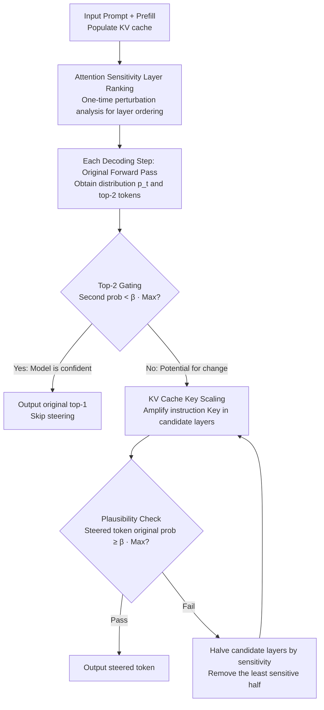

# Enhancing Instruction Following of LLMs via Activation Steering with Dynamic Rejection

**Conference**: ICLR 2026  
**arXiv**: [2603.06745](https://arxiv.org/abs/2603.06745)  
**Code**: [Yes](https://github.com/mjk0618/directer)  
**Area**: Signal/Communication  
**Keywords**: Activation Steering, Instruction Following, KV Cache Scaling, Dynamic Rejection, Oversteering Mitigation  

## TL;DR

Proposes Directer (Dynamic Rejection Steering), which significantly enhances the instruction-following capabilities of LLMs by dynamically adjusting KV cache steering intensity and introducing plausibility constraints at each decoding step, while avoiding text quality degradation caused by oversteering.

## Background & Motivation

LLMs still struggle to perfectly follow complex user instructions after instruction tuning. Activation Steering techniques enhance instruction following by modifying internal model representations, but existing methods face the risk of **oversteering**—where over-emphasizing instructions degrades task accuracy and generation quality.

**Limitations of Prior Work**:

**Static steering intensity**: Methods like PASTA and SpotLight rely on fixed hyperparameters determined by manual tuning, failing to adapt to the optimal dynamic steering intensity required at each decoding step.

**High pre-computation costs**: PASTA requires hundreds to thousands of validation samples for grid searching attention heads, with pre-computation costs nearing the training level.

**Large computational overhead**: SpotLight requires an additional softmax operation at each decoding step, effectively doubling latency.

**Quality-following trade-off**: Enhancing instruction following often comes at the expense of task correctness and text quality.

## Method

### Overall Architecture

Directer is a pure inference-time module that does not pre-tune a fixed steering intensity. Instead, it determines "how strong the steering should be" in real-time at each decoding step. The overall workflow is: after the prompt prefill is completed, a one-time attention sensitivity layer ranking is performed to determine the order of "steering effectiveness" for all layers. Subsequently, during the step-by-step decoding, a Top-2 gate is first used as a cheap check to judge if "this step is worth steering." If so, the Key vectors of the instruction tokens in the KV cache are amplified to strengthen attention. Then, a plausibility check compares the output distributions before and after steering. If the steering is too aggressive, the candidate layers are removed one by one from lowest to highest sensitivity until the steering result is "both a changed choice and not unreasonable."

### Key Designs

**1. KV Cache Key Scaling: Writing "Attention to Instructions" into Cache with One Multiplication**

The goal of activation steering is to make the model focus more on instructions, but directly modifying logits or attention scores is either requiring extra softmax operations or is incompatible with FlashAttention. Directer chooses to directly multiply a scaling factor $\alpha$ to the Key vectors belonging to the instruction token interval $\mathcal{I}$ and the candidate layer set $\mathcal{L}$:

$$\mathbf{k'}^{(l)}_i = \begin{cases} \alpha \cdot \mathbf{k}^{(l)}_i, & \text{if } i \in \mathcal{I} \text{ and } l \in \mathcal{L} \\ \mathbf{k}^{(l)}_i, & \text{otherwise} \end{cases}$$

Scaling the Key instead of the Value is because the Key undergoes another softmax during attention scoring, meaning the amplification effect is naturally normalized and will not spiral out of control. This enhances the attention weights of instruction tokens without any additional computation and is natively compatible with FlashAttention as it only modifies values in the KV cache. The scaling factor is set to $\alpha=100$, but experiments show performance remains stable across five orders of magnitude ($10^1 \sim 10^5$), effectively removing this hyperparameter from the tuning list.

**2. Plausibility-Guided Decoding: Step-wise Comparison and Layer-wise Withdrawal**

The biggest risk of static steering is oversteering—sacrificing answer correctness for format compliance. Directer performs a standard forward pass at each decoding step to get the original distribution $p_t$, then applies Key scaling to candidate layers $\mathcal{L}_{\text{cand}}$ to get the steered distribution $\tilde{p}_t$. It then checks if the probability of the steered token in the original distribution remains sufficiently high: $p_{t,\tilde{i}^*_t} \geq \beta \cdot p_{t,i^*_t}$ (threshold $\beta=0.5$). This condition implies that "steering can change the model's choice, but the chosen token must not be too unreasonable in the original state." If not met, the number of candidate layers is halved—prioritizing the removal of the least sensitive half—and steering is re-evaluated. This progressive withdrawal continues until the check passes or the candidate layers are empty (reverting to the original distribution). Thus, steering intensity adaptively scales based on confidence, preserving format following while maintaining correctness. $\beta$ outperforms the non-steering baseline across its entire range.

**3. Top-2 Gating: A Cheap Pre-check for Steering Necessity**

Running the full loop at every step is expensive. Directer utilizes the probabilities of the top-2 tokens in the original distribution for a cheap pre-judgment: if the second-best token satisfied $p_{t,i^{**}_t} < \beta \cdot p_{t,i^*_t}$, it indicates the model is already highly confident, and no steering is likely to change the choice (unless the steered top-1 remains the same). The steering attempt is skipped in such "high confidence" cases. Since most decoding steps fall into this category, the gating mechanism cuts significant redundant computation, keeping overall throughput only about 16% lower than the zero-shot baseline and over 2x faster than SpotLight.

**4. Attention Sensitivity Layer Ranking: Perturbation Propagation for Order of Withdrawal**

Progressive withdrawal requires knowing "which layers have weak steering effects and can be discarded first." Directer performs a one-time analysis after prompt prefill: it applies steering to each layer $\ell$ individually and observes the perturbation on the hidden states of all layers $j$, calculated as the sum of a direct effect and a propagation effect:

$$D_j(\ell) = \underbrace{(\text{dist}(\mathbf{H}^{(j)}_{\text{pre}}, \mathbf{H}^{(j,\ell)}_{\text{post}}) - \text{dist}(\mathbf{H}^{(j)}_{\text{pre}}, \mathbf{H}^{(j)}_{\text{post}}))}_{\text{Direct Effect}} + \underbrace{(\text{dist}(\mathbf{H}^{(j,\ell)}_{\text{pre}}, \mathbf{H}^{(j)}_{\text{post}}) - \text{dist}(\mathbf{H}^{(j)}_{\text{pre}}, \mathbf{H}^{(j)}_{\text{post}}))}_{\text{Propagation Effect}}$$

The average perturbation of a layer on the entire network is $\text{Sensitivity}(\ell) = \frac{1}{L}\sum_{j=1}^{L} D_j(\ell)$, which is used for ranking. This ranking is calculated once but used throughout the decoding. Ablations show that reversing this order (withdrawing sensitive layers first) or using random layer steering results in significant performance drops, proving that "withdrawing by sensitivity" captures the essence of steering.

### Loss & Training

Directer is a pure inference-time method without any training or additional datasets. The mechanism relies on only two hyperparameters: the scaling factor $\alpha=100$ (stable within $10^1 \sim 10^5$) and the plausibility threshold $\beta=0.5$ (superior to the baseline across its range). The same configuration is used for all tasks without task-specific tuning, achieving true plug-and-play capability.

## Key Experimental Results

### Main Results

| Method | IFEval P.Acc / I.Acc | LIFBench List/OD/MD | GSM8K-Format F.Acc/T.Acc | Average |
|------|---------------------|---------------------|--------------------------|------|
| Zero-shot | 73.5 / 81.5 | 63.4 / 68.6 / 40.9 | 79.2 / 82.7 | 70.0 |
| PASTA* | 76.5 / 83.4 | 61.8 / 66.0 / 47.8 | 98.9 / 62.7 | 71.0 |
| SpotLight* | 76.3 / 83.6 | 61.4 / 70.8 / 38.8 | 95.4 / 78.7 | 72.1 |
| **Directer** | **78.8 / 84.8** | **64.4 / 70.0 / 51.7** | **99.1 / 86.9** | **76.5** |

| Model Scale | Zero-shot | PASTA* | SpotLight* | Directer |
|----------|-----------|--------|------------|----------|
| Llama-3.2-1B | 61.3 | 59.7 | 60.6 | **61.6** |
| Qwen-2.5-3B | 63.9 | 65.2 | 62.8 | **67.1** |
| Qwen-2.5-7B | 72.4 | 73.0 | 74.9 | **74.4** |
| Qwen-2.5-14B | 81.6 | 80.1 | 81.7 | **83.5** |

### Ablation Study

| Variant | Accuracy |
|------|--------|
| Zero-shot | 77.5 |
| **Directer (Full)** | **81.8** |
| + Reversed Ranking | 79.0 |
| + Random Layer Steering | 80.2±0.7 |
| + Random Token Steering | 79.2±1.1 |

### Key Findings

1. **Oversteering is a major issue**: PASTA's original settings caused GSM8K accuracy to drop from 82.7% to 48.1%, while Directer maintained 86.9%.
2. **Dynamic is superior to static**: In fixed intensity setups, low intensity (ST1/ST2) provides minor gains while high intensity causes sharp declines; Directer's adaptive adjustment outperforms all.
3. **Plausibility constraints are universal**: Applying plausibility checks as a safety gate to PASTA/SpotLight also significantly mitigates their oversteering issues.
4. **Controlled inference efficiency**: Throughput is only ~16% lower than zero-shot baseline and over 2x faster than SpotLight, with negligible memory overhead.
5. **Optimal generation quality and fidelity**: Task fidelity judged by LLMs reached ≈92%, with text quality remaining on par with the un-intervened baseline.

## Highlights & Insights

1. **Precise Problem Definition**: Identifies oversteering as the core bottleneck of activation steering methods, rather than simply pursuing stronger steering.
2. **Elegant Design**: The plausibility check, progressive halving, and sensitivity ranking form a cohesive adaptive feedback loop.
3. **Near Zero-Tuning**: $\alpha$ is stable across five orders of magnitude and $\beta$ is superior to the baseline across its range, enabling true plug-and-play.
4. **KV Cache Operation Compatibility**: Modifications made at the KV cache level remain compatible with FlashAttention, a practical advantage missing in attention-level interventions.

## Limitations & Future Work

1. Requires explicit instruction span annotation; the ability to automatically identify instruction boundaries remains to be explored.
2. Layer ranking is based on a single prefill analysis; updates might be needed for multi-turn dialogues where instructions change dynamically.
3. Primarily validated on Llama and Qwen series; applicability to architectures like Mixture-of-Experts is unknown.
4. Only greedy decoding has been validated; compatibility with sampling strategies remains to be verified.

## Related Work & Insights

- **Relation to PASTA**: PASTA steers by suppressing attention scores of non-instruction tokens but requires massive validation samples for head profiling and is prone to oversteering due to static config; Directer requires no extra data and adjusts dynamically.
- **Relation to SpotLight**: SpotLight ensures target attention ratios for instruction tokens via post-softmax logit biasing, which is computationally heavy; Directer achieves more efficient steering via KV cache operations.
- **Insights**: The plausibility-guided decoding framework can be generalized to other scenarios requiring balanced intervention intensity, such as safety alignment or style control.

## Rating

- Novelty: ⭐⭐⭐⭐ — Dynamic rejection steering and sensitivity-based ranking are novel contributions.
- Experimental Thoroughness: ⭐⭐⭐⭐⭐ — Comprehensive evaluation across benchmarks, models, ablations, efficiency, and generation quality.
- Writing Quality: ⭐⭐⭐⭐ — Clear logic and rigorous derivation.
- Value: ⭐⭐⭐⭐ — A practical, plug-and-play inference-time enhancement module.

<!-- RELATED:START -->

## Related Papers

- [\[CVPR 2026\] AcTTA: Rethinking Test-Time Adaptation via Dynamic Activation](../../CVPR2026/signal_comm/actta_rethinking_test-time_adaptation_via_dynamic_activation.md)
- [\[NeurIPS 2025\] Angular Steering: Behavior Control via Rotation in Activation Space](../../NeurIPS2025/signal_comm/angular_steering_behavior_control_via_rotation_in_activation_space.md)
- [\[ACL 2025\] WirelessMathBench: A Mathematical Modeling Benchmark for LLMs in Wireless Communications](../../ACL2025/signal_comm/wirelessmathbench_a_mathematical_modeling_benchmark_for_llms_in_wireless_communi.md)
- [\[ICML 2025\] Fourier Position Embedding: Enhancing Attention's Periodic Extension for Length Generalization](../../ICML2025/signal_comm/fourier_position_embedding_enhancing_attentions_periodic_extension_for_length_ge.md)
- [\[ICLR 2026\] Advancing Spatiotemporal Representations in Spiking Neural Networks via Parametric Invertible Transformation](advancing_spatiotemporal_representations_in_spiking_neural_networks_via_parametr.md)

<!-- RELATED:END -->
