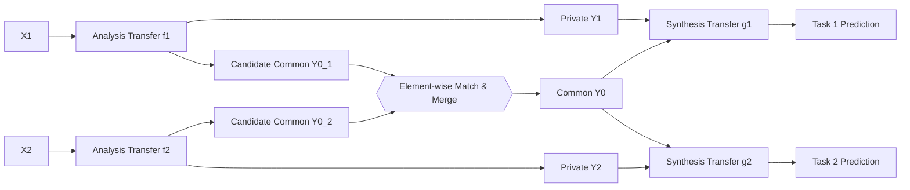

# Lossy Common Information in a Learnable Gray-Wyner Network

**Conference**: ICLR 2026  
**OpenReview**: [https://openreview.net/forum?id=v05SW2X3IC](https://openreview.net/forum?id=v05SW2X3IC)  
**Code**: [github.com/adeandrade/research](https://github.com/adeandrade/research)  
**Area**: Source Coding / Coding for Machines / Information-theoretic Representation Learning  
**Keywords**: Gray-Wyner Network, Lossy Common Information, transmit-receive tradeoff, multi-task coding, learnable entropy models  

## TL;DR
The authors implement the classic information-theoretic Gray-Wyner Network as a learnable three-channel codec, utilizing a $\beta$-parameterized objective to decouple "common" and "private" information between two vision tasks while enabling an adjustable tradeoff between "transmit rate" and "receive rate."

## Background & Motivation
**Background**: In multi-task scenarios, the same image is often used for multiple machine vision tasks (detection, segmentation, depth estimation, etc.), which share significant overlapping information despite different semantics. Mainstream approaches in "coding for humans and machines" typically utilize only two channels—one common channel and one private channel (specific to reconstruction)—assuming all information used by machine tasks is useful for reconstruction.

**Limitations of Prior Work**: When a pair of tasks contains both Common Information (CI) and distinct private information, a two-channel structure is insufficient. Furthermore, "perfectly" isolating common information into a single channel is nearly impossible under lossy coding; some common information invariably leaks into private channels, or vice-versa.

**Key Challenge**: This is the transmit-receive tradeoff. The **transmit rate** $R_t=R_0+R_1+R_2$ (total rate when one device performs both tasks) and the **receive rate** $R_r=2R_0+R_1+R_2$ (total rate when two devices perform tasks separately) cannot be optimized simultaneously. Increasing common channel usage optimizes $R_t$ but degrades $R_r$, and vice-versa. These extremes correspond to two information-theoretic measures: Wyner common information $C$ (minimum common info for optimal $R_t$) and Gács-Körner common information $K$ (maximum common info for optimal $R_r$).

**Goal**: To construct a learnable network capable of separating common information between tasks and providing an optimization objective that can select any point between $C$ and $K$.

**Core Idea**: **[Learnable Gray-Wyner Network]** The classic three-channel GWN (one common + two private) is implemented as a neural codec. Learnable entropy models serve as rate functions, and a single hyperparameter $\beta$ is introduced to slide along the transmit-receive tradeoff curve.

## Method

### Overall Architecture
Two input sources $X_1, X_2$ (degenerated to the same image $X$ in experiments) are encoded via analysis transforms $f_1, f_2$. Outputs are quantized and split into "private" and "candidate common" components. The candidate common tensors from both branches are merged into a single common representation $Y_0$. Together with private representations $Y_1, Y_2$, these are encoded by entropy models and subsequently reconstructed by synthesis transforms $g_1, g_2$ to predict task targets $\hat Z_1, \hat Z_2$.

### Key Designs

**1. Upper and Lower Bound Theorems for Lossy Common Information.** The paper extends Wyner’s (1975) lossless results to the lossy case, proving that $K(X_1,X_2;D_1,D_2)$ and $C(X_1,X_2;D_1,D_2)$ are the bounds of the mutual information $I(X_1,X_2;\hat Z_1;\hat Z_2)$ taking the max over the "receive-optimal set" and the min over the "transmit-optimal set" respectively: $K \le \max_{\hat Z^{(r)}} I \le \min_{\hat Z^{(t)}} I \le C$. Equality holds only if the common part $W$ is perfectly separable. This provides a key insight: **there is usually a gap between $K$ and $C$** (for Gaussian sources with correlation $1-\rho$, $K$ is even zero), making the exploration of the transmit-receive tradeoff a necessity rather than an addition.

**2. Reformulating Gray-Wyner Objective as Differentiable Entropy Optimization (Theorem 2).** The classic GWN objective $T(\alpha_1,\alpha_2;D_1,D_2)=\inf\{I(X_1,X_2;Y_0)+\alpha_1 R_{X_1|Y_0}(D_1)+\alpha_2 R_{X_2|Y_0}(D_2)\}$ is difficult to optimize due to lack of concavity/convexity in $P_{Y_0}$. Assuming channels are deterministic functions $Y_0=f_0(X_1,X_2)$, $Y_{1,2}=f_{1,2}(X_{1,2})$, the paper proves this can be written in entropy form $\inf\{H(Y_0)+\alpha_1 H(Y_1|Y_0)+\alpha_2 H(Y_2|Y_0)\}$. Replacing entropy terms with rate functions $r_0(Y_0)=-\mathbb{E}[\log\tilde P(Y_0)]$ and $r_{1,2}(Y_{1,2},Y_0)=-\mathbb{E}[\log\tilde P(Y_{1,2}|Y_0)]$ aligns it with standard learnable codec training frameworks.

**3. Sliding between Wyner and Gács-Körner via the $\beta$ knob.** Let $\alpha_1=\alpha_2$ and $\beta=1/\alpha_{1,2}$. The Lagrangian relaxation yields the training loss:
$$L=\inf\big\{\beta\,r_0(Y_0)+r_1(Y_1,Y_0)+r_2(Y_2,Y_0)+\lambda_1 d_1(\hat Z_1,Z_1)+\lambda_2 d_2(\hat Z_2,Z_2)\big\}.$$
Setting $\beta=1$ optimizes the transmit rate $R_t$ (targeting $R_0=C$), $\beta=2$ optimizes the receive rate $R_r$ (targeting $R_0=K$), and $\beta=3/2$ balances both. Values outside $\beta \in (1,2)$ may result in suboptimal configurations. Intuitively, $\beta$ "prices" the use of the common channel.

**4. Element-wise Matching Merger + Auxiliary Loss.** To align candidate common tensors $Y_0^{(1)}, Y_0^{(2)}$ into a single channel, they are merged element-wise: the average $\tfrac12(Y_0^{(1)}+Y_0^{(2)})$ is taken where they match (allowing gradients to flow to both sides), and set to 0 where they differ. An auxiliary loss is added:
$$L_{aug}=L+\mathbb{E}\Big[\tfrac{\gamma}{|Y_0|}\big\|Y_0^{(1)}-Y_0^{(2)}\big\|_2^2\Big]$$
to encourage alignment. In practice, $\gamma$ is fixed at 1, and the common channel cost $\beta$ is tuned. Furthermore, private entropy models $h_1, h_2$ use $Y_0$ as context for conditional coding to handle redundancy, while synthesis transforms concatenate private and common representations to aid compatibility.

## Key Experimental Results

### Main Results (Real vision tasks, BD-rate vs Joint baseline)

| Dataset / Task Pair | Independent | Proposed (Transmit) | Proposed (Receive) |
|---|---|---|---|
| Cityscapes: Seg + Depth | +143.69% | **+22.32%** | +51.97% |
| COCO 2017: Detect + Keypoint | +77.56% | **+13.16%** | +42.70% |

(Lower BD-rate is better, calculated relative to Joint baseline. The proposed method significantly outperforms Independent and approaches Joint.) On average, the method achieves a **−81.58% BD-rate** advantage in transmit rate compared to single-task codecs.

### Ablation Study (Linear regression, architecture and $\beta$ comparison)

| Comparison Item | Conclusion |
|---|---|
| Shared vs Separated vs Combined (β=1, transmit) | Shared BD-rate (+10.42%) outperforms Separated (+71.07%) and Combined (+87.55%) |
| Common Rate vs Mutual Info | β=1 is above MI, β=2 is below MI, β=3/2 is between—verifying $\beta$ slides along the tradeoff curve |
| $\beta$ Values | β=3/2 is a reasonable compromise, performing only slightly worse than β=1/β=2 on their respective optimal metrics |

### Key Findings
- The single $\beta$ knob allows common channel rates to fall above, below, or between empirical mutual information, walking the transmit-receive tradeoff curve.
- The method degrades correctly at boundaries (zero MI or total dependence), indicating no hard-coded assumptions about task correlation.
- The "Shared" architecture (dual analysis transforms seeing both sources) consistently outperforms others, which is explained via "representation compatibility" in the appendix.

## Highlights & Insights
- **Operationalizing a 1974 Information Theory Structure**: Not just a name-drop; the authors strictly reformulate the Gray-Wyner objective as a differentiable entropy optimization (Theorem 2).
- **The Elegance of $\beta$**: A single hyperparameter with clear information-theoretic meaning ($\beta=1\to C$, $\beta=2\to K$) controls the allocation of common vs. private information.
- **Honesty Regarding Inseparable Information**: Theorem 1 quantifies the gap between $K$ and $C$, theoretically justifying why a tradeoff is necessary rather than pursuing perfect isolation.

## Limitations & Future Work
- **Scaled to 2 Tasks Only**: Channel counts grow exponentially with the number of tasks; scaling beyond 3 tasks requires a more dynamic architecture.
- **$X_1=X_2$ in Experiments**: Real-world vision experiments degenerate two sources into a single image, leaving physical multi-source settings untested.
- **Empirical Rates Exceed Theoretical Bounds**: Like most learnable codecs, measured rates are significantly higher than theoretical limits.
- **Mixture Case Performance**: Performance drops significantly in "Mixture" scenarios where common information is inherently difficult to separate.

## Related Work & Insights
- **Information Theoretic Foundations**: Gray-Wyner (1974), Wyner (1975), Gács-Körner (1973), and the tradeoff characterization by Viswanatha et al. (2014).
- **Learnable Image Coding**: Follows the paradigm of Ballé et al. (hyperpriors) and He et al. 
- **Coding for Machines**: Extends the two-channel split of Choi & Bajić (2022) and de Andrade & Bajić (2024) to a three-channel GWN framework with common information separation.
- **Insight**: The concept of "achievable regions" in information theory can be translated into "hyperparameter trajectories" in learnable systems.

## Rating
- **Novelty**: ⭐⭐⭐⭐⭐ Rigorous implementation of GWN as a learnable system with new lossy bound theorems.
- **Experimental Thoroughness**: ⭐⭐⭐⭐ Covers synthetic, MNIST, and real vision tasks, though limited to 2-task cases.
- **Writing Quality**: ⭐⭐⭐⭐ Clear derivation of theorems; high entry barrier for readers unfamiliar with rate-distortion theory.
- **Value**: ⭐⭐⭐⭐ Provides a theoretically grounded framework for distributed inference and representation compression.

<!-- RELATED:START -->

## Related Papers

- [\[ICCV 2025\] Generalizable Non-Line-of-Sight Imaging with Learnable Physical Priors](../../ICCV2025/signal_comm/generalizable_non-line-of-sight_imaging_with_learnable_physical_priors.md)
- [\[ECCV 2024\] QueryCDR: Query-based Controllable Distortion Rectification Network for Fisheye Images](../../ECCV2024/signal_comm/querycdr_query-based_controllable_distortion_rectification_network_for_fisheye_i.md)
- [\[ICML 2025\] Large Language Model (LLM)-enabled In-context Learning for Wireless Network Optimization](../../ICML2025/signal_comm/large_language_model_llm-enabled_in-context_learning_for_wireless_network_optimi.md)
- [\[ICLR 2026\] Mamba-3: Improved Sequence Modeling using State Space Principles](mamba-3_improved_sequence_modeling_using_state_space_principles.md)
- [\[ICLR 2026\] Advancing Spatiotemporal Representations in Spiking Neural Networks via Parametic Invertible Transformation](advancing_spatiotemporal_representations_in_spiking_neural_networks_via_parametr.md)

<!-- RELATED:END -->
