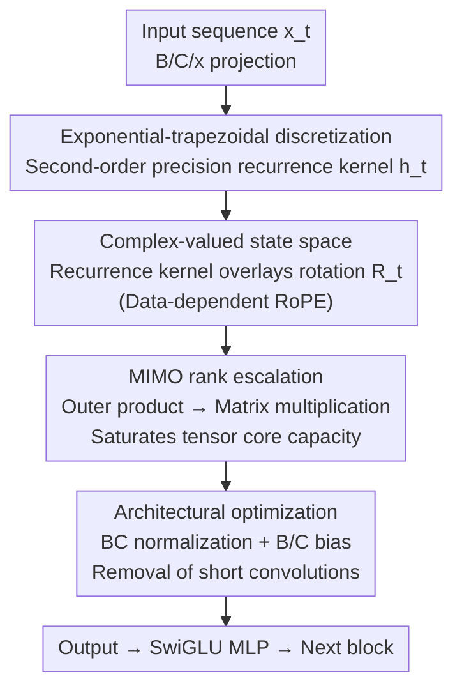

# Mamba-3: Improved Sequence Modeling using State Space Principles

**Conference**: ICLR 2026  
**arXiv**: [2603.15569](https://arxiv.org/abs/2603.15569)  
**Code**: [Available](https://github.com/state-spaces/mamba)  
**Area**: Video Understanding  
**Keywords**: State Space Models, Mamba, Sequence Modeling, Inference Efficiency, MIMO

## TL;DR

Three core improvements are proposed from an SSM perspective: exponential-trapezoidal discretization, complex-valued state spaces, and Multi-Input Multi-Output (MIMO) formulation. These enhance model quality and state-tracking capabilities significantly without increasing decoding latency, pushing the performance-efficiency Pareto frontier forward.

## Background & Motivation

Test-time compute has become a key driver of LLM performance. Techniques like Chain-of-Thought reasoning and iterative refinement make inference efficiency a central concern in model design. Although Transformers are the current industry standard, they are limited by:
- **Quadratic computational complexity**: Self-attention mechanism.
- **Linear memory requirements**: KV cache grows linearly with sequence length.

While sub-quadratic models (SSMs, linear attention) offer constant memory and linear computation, three major deficiencies remain:

**Restricted Expressivity**: Mamba-2 sacrificed some expressivity for training speed, showing a performance drop compared to Mamba-1.

**Lack of State-Tracking Capability**: Inability to solve simple tasks like parity.

**Low Hardware Efficiency**: During the decoding stage, arithmetic intensity is only approximately 2.5 ops/byte, leading to significant hardware idling.

## Method

### Overall Architecture

Mamba-3 aims to address three weaknesses of sub-quadratic sequence models (SSMs) relative to Transformers: expressivity sacrificed for training acceleration, lack of state-tracking capability, and hardware idling caused by low arithmetic intensity in the decoding stage. It retains the overall backbone of Mamba-2—an Llama-style architecture, alternating Mamba-3 blocks and SwiGLU MLP blocks with pre-normalization—while consolidating all modifications within the recurrence of a single Mamba-3 block. After a token enters the block, it undergoes B/C/x projection, updates the state via a second-order recurrence kernel defined by **exponential-trapezoidal discretization**, overlays the data-dependent rotation introduced by the **complex-valued state space**, and utilizes **MIMO** to escalate the outer product in the recurrence to a rank-increased matrix multiplication that saturates compute capacity. Finally, a few **architectural optimizations** (BC normalization, B/C bias, removal of short convolutions) conclude the process, and the output is fed into the SwiGLU MLP. The four key designs below represent the four modifications to this recurrence.

### Key Designs

**1. Exponential-Trapezoidal Discretization: Providing a theoretically grounded, lower-error discrete recurrence for continuous-time SSMs.**

To implement a continuous-time SSM as a discrete recurrence, a discretization scheme must be chosen. The discretization used in Mamba-1/2 has been heuristic and lacked theoretical proof. This paper formalizes it as the "Exponential-Euler" method, noting it as a first-order approximation (error $O(\Delta_t^2)$). Following this logic, a higher-order "Exponential-Trapezoidal" method is proposed, elevating approximation accuracy to the second order (error $O(\Delta_t^3)$). The new exponential-trapezoidal recurrence is written as:

$$\mathbf{h}_t = e^{\Delta_t A_t}\mathbf{h}_{t-1} + (1-\lambda_t)\Delta_t e^{\Delta_t A_t}\mathbf{B}_{t-1}x_{t-1} + \lambda_t\Delta_t\mathbf{B}_t x_t$$

where $\lambda_t \in [0,1]$ is a data-dependent scalar: setting $\lambda_t=1$ reduces to the Euler method of Mamba-2, while $\lambda_t=\frac{1}{2}$ is the classic trapezoidal method. From another perspective, this recurrence is equivalent to applying a data-dependent convolution of width 2 to the state input $\mathbf{B}_t x_t$ before entering the linear recurrence—notably, this convolution resides inside the recurrence core, fundamentally differing from the standard external short convolution in Mamba. Computationally, it does not slow down training: utilizing the SSD framework, the structured mask $\mathbf{L}$ corresponding to the new recurrence is the product of a 1-semiseparable matrix and a 2-band matrix (a specific 2-semiseparable matrix), which remains efficiently parallelizable via matrix multiplication.

**2. Complex-Valued State Space Model: Allowing the transition matrix to express "rotation" to solve state tracking.**

The eigenvalues of the transition matrices in real-valued SSMs (like Mamba-2) are locked to real numbers, preventing the expression of "rotational" dynamics—whereas parity can be expressed precisely using a rotation matrix $\mathbf{R}(\pi x_t)$, which is the root of Mamba-2's failure on parity tasks. This paper extends the underlying parameters of the SSM to complex values. A key equivalence is established: a discretized complex-valued SSM is equivalent to a real-valued SSM overlaid with a data-dependent rotary embedding (RoPE):

$$\mathbf{h}_t = e^{\Delta_t A_t}\mathbf{R}_t\mathbf{h}_{t-1} + \Delta_t\mathbf{B}_t x_t$$

Here, $\mathbf{R}_t$ is a block-diagonal rotation matrix with rotation angles determined by data projection. Due to this equivalence, the implementation adds almost no overhead: complex-valued SSMs are efficiently realized by cumulatively applying the rotation matrix to the B/C projections (where B/C correspond to Q/K in attention). This equivalence also bridges two previously independent directions: complex-valued SSMs and data-dependent RoPE.

**3. Multi-Input Multi-Output (MIMO) SSM: Fully utilizing idle compute during the decoding stage.**

The true bottleneck of slow SSM decoding is not insufficient compute but low arithmetic intensity—standard SISO decoding has only about 2.5 ops/byte, while the H100 matmul peak is about 295 ops/byte. This means most hardware is idling, and computation is heavily bound by memory IO. The MIMO approach fills this idle capacity: by escalating $\mathbf{B}_t \in \mathbb{R}^N$ to $\mathbb{R}^{N \times R}$ and $\mathbf{x}_t \in \mathbb{R}^P$ to $\mathbb{R}^{P \times R}$, the original outer product $\mathbf{B}_t\mathbf{x}_t^\top$ becomes a matrix multiplication that saturates tensor cores. Consequently, FLOPs increase by $R$ times, and arithmetic intensity is raised from $\Theta(1)$ to $\Theta(R)$, but wall-clock latency remains nearly unchanged because the additional computation overlaps with memory IO. Training is also considered: MIMO can be split into $R^2$ parallel SISO calls, and by setting the chunk size to $C_{\text{MIMO}} = \frac{1}{R}C_{\text{SISO}}$, total FLOPs only grow by $R$ rather than $R^2$. For a fair comparison with baselines, the extra parameters from MIMO are compensated for by reducing the MLP width (e.g., in a 1.5B model, the MLP width is reduced by only 6.6%).

**4. Architectural Optimization: Small changes for cleaner implementation of the above designs.**

Several adjustments accompany the new recurrence. First is BC normalization, adding RMSNorm (similar to QKNorm in Transformers) after B/C projections, which allows the removal of post-gate RMSNorm. Second is B/C bias, adding learnable head-specific biases to B/C to provide a data-independent component, functioning similarly to a convolution. Third is the removal of short convolutions—the combination of exponential-trapezoidal discretization and B/C bias already covers the functionality of short convolutions, allowing the original standard short convolution to be removed entirely.

### Loss & Training

- Standard language modeling training: 100B FineWeb-Edu tokens, Llama-3.1 tokenizer, 2K context.
- Identical training protocol for all scales for fair comparison.
- MIMO rank $R=4$, parameter count matched by reducing MLP width.

## Key Experimental Results

### Main Results

1.5B parameter model trained on 100B FineWeb-Edu tokens, average accuracy across 8 downstream tasks:

| Model | FW-Edu ppl↓ | Downstream Avg Acc↑ |
|------|:-:|:-:|
| Transformer-1.5B | 10.51 | 55.4 |
| GDN-1.5B | 10.45 | 55.8 |
| Mamba-2-1.5B | 10.47 | 55.7 |
| **Mamba-3-SISO-1.5B** | **10.35** | **56.4** |
| **Mamba-3-MIMO-1.5B** | **10.24** | **57.6** |

Mamba-3 SISO improves by +0.6 points over the second-best model GDN; MIMO further improves by +1.2 points, totaling a +1.8 point gain. MIMO improves PPL by 0.11.

| Model | 180M | 440M | 880M | 1.5B |
|------|:-:|:-:|:-:|:-:|
| Mamba-2 | 42.9 | 49.6 | 53.4 | 55.7 |
| Mamba-3 SISO | 43.4 | 49.8 | 54.4 | 56.4 |
| Mamba-3 MIMO | 43.5 | 51.0 | 55.3 | 57.6 |

Mamba-3 outperforms baselines across all model scales.

### Ablation Study

**Component Ablation** (440M scale):

| Variant | PPL↓ |
|------|:-:|
| Mamba-3 - bias - trap | 16.68 |
| Mamba-3 - bias | 16.49 |
| Mamba-3 | 15.72 |
| Mamba-3 + conv | 15.85 |

B/C bias and trapezoidal discretization work synergistically, making short convolutions optional (adding them actually leads to higher PPL).

**State Tracking Tasks**:

| Model | Parity↑ | Arithmetic (No brackets)↑ | Arithmetic (Brackets)↑ |
|------|:-:|:-:|:-:|
| Mamba-2 | 0.90 | 47.81 | 0.88 |
| Mamba-3 (w/o RoPE) | 2.27 | 1.49 | 0.72 |
| Mamba-3 (w/ Std. RoPE) | 1.56 | 20.70 | 2.62 |
| **Mamba-3** | **100.00** | **98.51** | **87.75** |
| GDN [-1,1] | 100.00 | 99.25 | 93.50 |

Data-dependent RoPE is the key to state tracking: Mamba-2 fails completely (near random), whereas Mamba-3 solves Parity nearly perfectly.

**State Size Experiment**: Mamba-3 MIMO at $d_{\text{state}}=64$ achieves the PPL of Mamba-2 at $d_{\text{state}}=128$, achieving the same quality with half the latency.

### Key Findings

- Empirical performance is better when $\lambda_t$ in exponential-trapezoidal discretization is not strictly constrained to $\frac{1}{2}$.
- Under BF16 precision, the Mamba-3 SISO kernel is actually faster than Mamba-2 and GDN (0.156ms vs 0.203ms vs 0.257ms).
- MIMO scaling with $R=4$ only adds approximately 2× training time, but decoding latency remains nearly the same.
- Hybrid models (Mamba-3 + NoPE attention, 5:1 ratio) significantly outperform pure linear models on retrieval tasks.

## Highlights & Insights

1.  **Unity of SSM Perspective**: The three improvements arise naturally from the continuous-time SSM viewpoint, which would be difficult to derive from linear attention or test-time regression perspectives.
2.  **Substantial Theoretical Contribution**: Strictly proves for the first time that Mamba-1/2 discretization is "Exponential-Euler" and provides a superior trapezoidal generalization.
3.  **Complex SSM → RoPE**: Establishes the equivalence between complex-valued SSMs and data-dependent RoPE, unifying two independently developed research directions.
4.  **Practical Value of MIMO**: Increases computation without increasing latency, perfectly utilizing hardware idling during the decoding stage.

## Limitations & Future Work

- Pure linear models are still significantly weaker than Transformers in semi-structured/unstructured data extraction (SWDE, FDA).
- The choice of normalization type and position in hybrid models remains unclear, presenting competitive trade-offs.
- Validation is limited to scales ≤1.5B and 100B tokens; large-scale results await confirmation.
- The choice of the optimal rank $R$ for MIMO requires theoretical guidance.
- Long-context extrapolation capabilities may require additional RMSNorm layers (increasing complexity).

## Related Work & Insights

- Competes with Gated DeltaNet (GDN) in performance but with a completely different methodology (SSM discretization vs. delta rule).
- RoPE equivalence in complex SSMs may inspire new designs for positional encoding in Transformers.
- MIMO's arithmetic intensity optimization can be generalized to other memory-bound computational scenarios.
- Already adopted by large-scale hybrid models like NVIDIA Nemotron and Alibaba Qwen3, validating industrial feasibility.

## Rating

- Novelty: ⭐⭐⭐⭐⭐ — All three improvements possess theoretical novelty; the complex SSM-RoPE equivalence is particularly elegant.
- Technical Depth: ⭐⭐⭐⭐⭐ — Covers the full chain from continuous-time ODEs to discrete recurrence and efficient kernel implementation.
- Experimental Thoroughness: ⭐⭐⭐⭐⭐ — Includes 4 scales + synthetic tasks + retrieval tasks + kernel performance benchmarks.
- Value: ⭐⭐⭐⭐⭐ — Open-sourced and already being adopted by industry.

<!-- RELATED:START -->

## Related Papers

- [\[ACL 2025\] WirelessMathBench: A Mathematical Modeling Benchmark for LLMs in Wireless Communications](../../ACL2025/signal_comm/wirelessmathbench_a_mathematical_modeling_benchmark_for_llms_in_wireless_communi.md)
- [\[NeurIPS 2025\] Masked Symbol Modeling for Demodulation of Oversampled Baseband Communication Signals](../../NeurIPS2025/signal_comm/masked_symbol_modeling_for_demodulation_of_oversampled_baseband_communication_si.md)
- [\[CVPR 2026\] CLAY: Conditional Visual Similarity Modulation in Vision-Language Embedding Space](../../CVPR2026/signal_comm/clay_conditional_visual_similarity.md)
- [\[NeurIPS 2025\] Angular Steering: Behavior Control via Rotation in Activation Space](../../NeurIPS2025/signal_comm/angular_steering_behavior_control_via_rotation_in_activation_space.md)
- [\[CVPR 2025\] Continuous Space-Time Video Resampling with Invertible Motion Steganography](../../CVPR2025/signal_comm/continuous_space-time_video_resampling_with_invertible_motion_steganography.md)

<!-- RELATED:END -->
