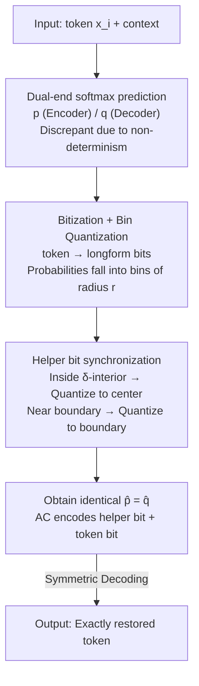

# Synchronizing Probabilities in Model-Driven Lossless Compression

**Conference**: ICLR 2026  
**OpenReview**: [https://openreview.net/forum?id=nGzYkW4FSB](https://openreview.net/forum?id=nGzYkW4FSB)  
**Code**: None  
**Area**: Signal Processing & Communications / Lossless Compression / Information Theory  
**Keywords**: Lossless compression, Arithmetic coding, Model-driven compression, Prediction mismatch, Non-determinism

## TL;DR
To address the fatal issue in LLM-driven lossless compression where prediction probabilities must be bit-level identical across encoder and decoder to avoid "cascading collapse," this paper proposes PMATIC—an alternative to arithmetic coding that quantizes bit probabilities into bins and uses low-entropy helper bits to synchronize both ends on the same quantized probability. PMATIC tolerates bounded prediction mismatches, theoretically guarantees correct decoding, and achieves perfect restoration under real-world cross-machine non-determinism while maintaining compression rates significantly superior to traditional tools like gzip and cmix.

## Background & Motivation

**Background**: The classic paradigm of lossless compression is "probability prediction + arithmetic coding." For each symbol, a model predicts its occurrence probability given the current context, encoding the entire message into a sub-interval within $[0, 1)$. Symbols with higher probabilities cause less interval shrinkage and consume fewer bits. Deep models (especially LLMs) capture rich dependencies and, when used as predictors with arithmetic coding, have recently outperformed traditional compressors like gzip and CMIX, approaching information-theoretic limits.

**Limitations of Prior Work**: Arithmetic coding (AC) is extremely sensitive to numerical values. It requires the **encoder and decoder to calculate the exact same probability distribution at every step**. Even a minute discrepancy in a single bit of probability can lead to decoding an incorrect token, which subsequently poisons the context for all following tokens, causing the entire message to fail (cascading collapse).

**Key Challenge**: Modern neural network inference is **non-deterministic**. Differences in the execution order of GPU floating-point operations lead to rounding discrepancies. Different hardware, library versions, or computation graphs can result in different logits for the "same input, weight, and random seed." Official CUDA/cuDNN documentation explicitly states that reproducibility is not guaranteed. Consequently, it is nearly impossible for an encoder and decoder (often running on different machines) to obtain bit-level identical predictions, making AC effectively "dead on arrival" in these conditions.

**Goal**: Design a coding algorithm capable of **tolerating a certain amount of prediction mismatch** while ensuring correct decoding and minimizing the overhead in compression efficiency. The algorithm should serve as a drop-in replacement for arithmetic encoders in existing model-driven compression pipelines.

**Key Insight**: The authors observe that while recovery is impossible if the mismatch is arbitrarily large, if the mismatch is **known to be small and bounded**, both sides can "meet in the middle" on a **shared third-party probability distribution**. Crucially, it is a reasonable assumption that logits generated by the same model and input across different machines are bounded by a small $\varepsilon$ in the $L_\infty$ norm.

**Core Idea**: Instead of forcing the two ends to compute identical probabilities, the probabilities are **quantized into discrete "bins."** A minimal amount of side-channel information (helper bits) is used to ensure both ends collapse to the same quantized value for every bit. This transforms the impossible task of "exact synchronization" into the achievable task of "synchronization within tolerance."

## Method

### Overall Architecture
PMATIC (Probability Matching Interval Coding) is a replacement for arithmetic coding. It takes a sequence of tokens and a predictor model as input and outputs a compressed bitstream; the decoder restores the original sequence using the same (potentially slightly biased) model. Instead of directly applying AC to the multivariate token probabilities, it flattens each token into a binary bitstring and encodes it bit-by-bit. For each bit, instead of the precise probability from the model, a **quantized** version is used. An additional helper bit informs the decoder where to quantize, ensuring both ends use the **literally identical** probability value.

The pipeline for a single token follows: Predict next-token probabilities using the encoder model $\to$ map the token to a longform bitstring of length $\ell = \lceil \log_2 |\mathcal{A}| \rceil \to$ calculate conditional bit probabilities and assign them to bins $\to$ determine the helper bit and quantize the probability to a "bin center" or "bin boundary" based on the bin position $\to$ write the helper bit and token bit sequentially using arithmetic coding. The decoder symmetrically decodes the helper bit first, determines how to quantize its own probability, and then decodes the token bit. If the prediction discrepancy is within tolerance, the quantized probabilities match exactly, ensuring correct decoding.

### Key Designs

**1. Formalizing "Probability Matching" as a Bounded Mismatch Problem: $L_\infty$ Logit Bound $\to$ CTV Bound**

This theoretical foundation addresses how to characterize non-determinism. The authors abstract the encoder and decoder models as two functions $M_{\text{Enc}}, M_{\text{Dec}}$ that output logit vectors $u, v$ for the same context, which are then softmax-transformed into probabilities $p, q$. It is assumed that $\|u - v\|_\infty \le \varepsilon$. Since AC depends on conditional probabilities, the authors define a **Conditional Total Variation distance** $d_{\text{CTV}}(p, q) := \max_{\varnothing \neq S \subseteq \mathcal{A}} d_{\text{TV}}(p(\cdot|S), q(\cdot|S))$, which is the maximum TV distance between two distributions after conditioning on any non-empty subset $S$.

Proposition 1 proves: $\|u - v\|_\infty \le \varepsilon \Rightarrow d_{\text{CTV}}(p, q) \le \varepsilon/2$. This translates hardware-level logit jitter into an **algorithmically usable probability-level tolerance** $\delta$, paving the way for correctness proofs.

**2. Longform Bitization + Bitwise Bin Quantization**

Quantizing a multivariate distribution directly is difficult. This design decomposes multivariate probabilities into a **sequence of binary decisions**. Each token is mapped to a longform bitstring $b_i$ of length $\ell = \lceil \log_2 |\mathcal{A}| \rceil$. When encoding the $j$-th bit, the scalar $p_i(j) \in [0, 1]$ (the conditional probability that the $j$-th bit is 1) is derived by normalizing the next-token probability vector over the event that the first $j-1$ bits are fixed.

The interval $[0, 1]$ is then partitioned into **bins** of length $2r$ with radius $r$, where $m = 1/(2r)$ (requiring $r = 1/(2m)$ and $r > 2\delta$). Each bin $I_k = [2r(k-1), 2rk]$ has a center $c_k = 2r(k-1) + r$. A **$\delta$-interior** $I_k^\delta$ is defined as the part of the bin at least $\delta$ away from any point outside the bin. If the encoder's probability $p_i(j)$ falls within the $\delta$-interior and the discrepancy is $\le \delta$, the decoder's probability must fall into the **same bin**.

**3. Helper bit: Synchronizing Quantized Probabilities with Side Information**

The helper bit $b_i'(j)$ is the core mechanism of PMATIC, used to resolve bin ambiguity:

- If $p_i(j)$ is in the $\delta$-interior of a bin $\to$ helper $= 0$. The encoder quantizes to the **bin center** $c_k$. Since the decoder must be in the same bin, $\hat{p} = \hat{q} = c_k$.
- If $p_i(j)$ is not in the $\delta$-interior $\to$ helper $= 1$. This implies it is near a **bin boundary** $2rk$ ($|2rk - p_i(j)| < \delta$). The encoder quantizes to the **nearest boundary**, as does the decoder. Since $r > 2\delta$, the decoder’s probability will be within $2\delta$ of the correct boundary and at least $2r - 2\delta > 2\delta$ from others, ensuring $\hat{p} = \hat{q} = 2rk$.

In both cases, both ends lock onto the exact same quantized probability. The helper bit is also sent via AC with a probability $p' = \delta/r$. Crucially, when $r \gg \delta$, $p'$ is very small, meaning the helper bit has **very low entropy and consumes negligible space**.

**4. Correctness Theorem and Bin Width $r$ Trade-off**

Theorem 1 concludes: if $d_{\text{CTV}}(p^{(i)}, q^{(i)}) \le \delta$, then $\hat{q}_i(j) = \hat{p}_i(j)$ for all bits, guaranteeing correct decoding. Combined with Proposition 1, if logits differ by $\le \varepsilon$, setting $\delta = \varepsilon/2$ ensures correctness.

The overhead analysis reveals a trade-off for $r$: (i) **Helper bit entropy** $h(\delta/r) \approx \frac{\delta}{r} \log \frac{r}{\delta}$ (decreases as $r$ increases); and (ii) **Quantization loss** $d_{\text{KL}}(p_i(j) \| \hat{p}_i(j)) \le 2 \log(e) r$ (increases as $r$ increases). Balancing these gives:

$$r \approx \frac{\sqrt{\delta \log(1/\delta)}}{\sqrt{2 \log e}},$$

resulting in a total overhead of $O(\sqrt{\delta \log(1/\delta)})$. This bound shows that smaller mismatches result in lower costs and smoothly approach zero as $\delta \to 0$.

## Key Experimental Results

Experiments used three quantized LLMs (LLaMA 3.1 8B 4-bit, Mistral 7B v0.1 3-bit, Qwen 2.5 Instruct 7B 3-bit) across datasets including enwik8, Wikipedia, and literary texts. Robustness settings: $\delta = 10^{-5} (r = 0.005)$, $\delta = 10^{-3} (r = 0.05)$, $\delta = 10^{-2} (r = 0.125)$. Compression Ratio = Compressed Size / Original Size.

### Main Results
Compression ratios for LLaMA 3.1 (selected):

| Dataset | no PMATIC | $\delta = 10^{-5}$ | $\delta = 10^{-3}$ | $\delta = 10^{-2}$ (Most Robust) | cmix | gzip |
|---------|-----------|------------------|-------------------|---------------------------------|------|------|
| enwik8  | 0.0780    | 0.0847           | 0.1353            | 0.2492                          | 0.3558 | 0.4601 |
| Wikipedia| 0.0700   | 0.0878           | 0.1330            | 0.2085                          | 0.3644 | 0.4759 |
| Hamlet  | 0.0878    | 0.0952           | 0.1514            | 0.2772                          | 0.3865 | 0.5007 |
| Emma    | 0.0606    | 0.0660           | 0.1099            | 0.2113                          | 0.3797 | 0.4852 |

Even at $\delta = 10^{-2}$, PMATIC (e.g., 0.2492 for enwik8) significantly outperforms cmix (0.3558) and gzip (0.4601). The "robustness overhead" decreases as $\delta$ decreases, consistent with the $O(\sqrt{\delta \log(1/\delta)})$ theory.

### Ablation Study: Helper Bit Behavior

| Setting | Expected helper=1 ($\delta/r$) | Actual helper=1 freq | Helper bit ratio in file |
|---------|------------------------------|----------------------|--------------------------|
| no PMATIC | 0                          | 0                    | 0                        |
| $\delta = 10^{-5}, r = 0.005$ | 0.002  | 0.00051              | 0.04594                  |
| $\delta = 10^{-3}, r = 0.05$ | 0.02    | 0.00368              | 0.18947                  |
| $\delta = 10^{-2}, r = 0.125$ | 0.08   | 0.01145              | 0.34073                  |

The actual frequency of helper=1 is far lower than expected (4–7x lower), because next-bit probabilities are often near 0 or 1, rarely falling near bin boundaries. This suggests further compression gains are possible by refining helper bit probability estimation.

### Key Findings
- **Robustness Verification**: PMATIC successfully decoded files with synthetic logit noise within $[-2\delta, 2\delta]$. In real cross-machine tests (M2 Pro vs. M4 Max), standard AC and $\delta=0.001$ failed completely, while **$\delta=0.01$ restored all files correctly**.
- **Sync Insurance**: The helper bit mechanism is "nearly free"; most of the robustness cost comes from quantization loss rather than the helper bits themselves.
- **Binary Success**: Robustness is a threshold issue—$\delta$ must cover the actual hardware mismatch bound to be effective.

## Highlights & Insights
- **From Exact to Tolerant Synchronization**: The core insight is shifting from "identical probabilities" to "identical quantized values," solving hardware non-determinism at the algorithmic level.
- **Elegant Helper Bit Design**: Using a low-entropy side-channel to resolve quantization ambiguity is a classic example of trading minimal redundancy for deterministic reliability.
- **Drop-in Replaceability**: PMATIC operates on bit probabilities and is model-agnostic, making it easily integrated into existing pipelines.

## Limitations & Future Work
- Only validated on **text** models and data; extension to other domains like images is needed.
- Assumes **strictly bounded** mismatch; handling stochastic outliers (occasional large discrepancies) without inflating $\delta$ is an open problem.
- Helper bits currently use a fixed $\delta/r$ probability; more accurate estimation would reduce overhead.
- Information-theoretic lower bounds for model-driven compression under mismatch remain unknown.

## Related Work & Insights
- **vs Standard Arithmetic Coding**: Standard AC requires zero tolerance for discrepancies; PMATIC adds a "quantization + helper" layer to handle non-determinism.
- **vs Delétang et al. (2024) / LLMZip**: These show LLMs surpass traditional tools but ignore mismatch; PMATIC provides the necessary "usability patch" for real-world deployment.
- **vs Deterministic Backends**: While some work focuses on eliminating non-determinism via specialized backends, PMATIC is complementary, providing robustness where hardware-level determinism is costly or unavailable.

## Rating
- Novelty: ⭐⭐⭐⭐⭐ Formulates the mismatch problem in model-driven compression for the first time with a provably correct algorithm.
- Experimental Thoroughness: ⭐⭐⭐⭐ Solid validation across models and hardware; however, real-world tests could be scaled further.
- Writing Quality: ⭐⭐⭐⭐⭐ Clear progression from theory to intuition with rigorous definitions.
- Value: ⭐⭐⭐⭐⭐ Directly addresses a major hurdle for deploying LLM-based compression.

<!-- RELATED:START -->

## Related Papers

- [\[CVPR 2025\] Neural Video Compression with Context Modulation](../../CVPR2025/signal_comm/neural_video_compression_with_context_modulation.md)
- [\[ICLR 2026\] TS-DDAE: A Novel Temporal-Spectral Denoising Diffusion AutoEncoder for Wireless Signal Recognition Model Pre-training](ts-ddae_a_novel_temporal-spectral_denoising_diffusion_autoencoder_for_wireless_s.md)
- [\[ICML 2026\] Joint Model and Data Sparsification via the Marginal Likelihood](../../ICML2026/signal_comm/joint_model_and_data_sparsification_via_the_marginal_likelihood.md)
- [\[ECCV 2024\] RAW-Adapter: Adapting Pre-trained Visual Model to Camera RAW Images](../../ECCV2024/signal_comm/raw-adapter_adapting_pre-trained_visual_model_to_camera_raw_images.md)
- [\[ICML 2025\] Large Language Model (LLM)-enabled In-context Learning for Wireless Network Optimization](../../ICML2025/signal_comm/large_language_model_llm-enabled_in-context_learning_for_wireless_network_optimi.md)

<!-- RELATED:END -->
