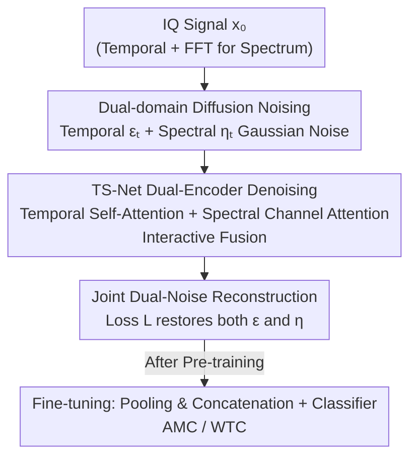

# TS-DDAE: A Novel Temporal-Spectral Denoising Diffusion AutoEncoder for Wireless Signal Recognition Model Pre-training

**Conference**: ICLR 2026  
**OpenReview**: [https://openreview.net/forum?id=RKDkqkkZ5m](https://openreview.net/forum?id=RKDkqkkZ5m)  
**Code**: https://github.com/BUPT-GAMMA/FoundWSR  
**Area**: Self-Supervised Pre-training / Wireless Signal Recognition / Diffusion Models  
**Keywords**: Wireless Signal Recognition, Diffusion AutoEncoder, Temporal-Spectral Dual-Domain, Self-Supervised Pre-training, Modulation Recognition

## TL;DR
To address Wireless Signal Recognition (WSR) pre-training, this work introduces the "noising-denoising" paradigm of diffusion models into signal self-supervision and proposes TS-DDAE. Gaussian noise is injected into IQ signals in both temporal and spectral domains simultaneously, followed by a joint restoration using a specialized dual-encoder TS-Net (temporal self-attention + spectral channel attention). The learned representations outperform the best baseline by an average of 1.32% across 4 datasets and multiple tasks like AMC/WTC, exceeding the AMC SOTA model IQFormer by approximately 8.75%.

## Background & Motivation

**Background**: Wireless Signal Recognition (WSR) aims to determine the attributes of received signals (e.g., Automatic Modulation Classification, AMC; or Wireless Technology Classification, WTC) without prior knowledge, serving as a fundamental module for civilian/military radios and intelligent communication systems. Deep learning models (e.g., IQFormer) have reached high precision on individual benchmarks, and the "pre-training + fine-tuning" paradigm has proven in CV/NLP that universal representations can be transferred to numerous downstream tasks at low cost.

**Limitations of Prior Work**: However, the signal domain has not yet fully benefited from pre-training. A few existing pre-training models (e.g., SpectrumFM) adopt the "mask-and-reconstruct" strategy from BERT—setting parts of the signal magnitude to zero and then restoring them. The problem is that signal time series and spectra exhibit **strong local dependencies**. Directly zeroing out a segment of the signal is equivalent to abruptly erasing a chunk of content, which destroys the delicate temporal-spectral structure and causes the pre-training task to learn distorted features. Furthermore, most of these methods focus solely on time series and **ignore critical information contained in the spectrum**.

**Key Challenge**: Self-supervision requires "disruption + restoration" to force the model to learn representations, but the disruption method (masking) conflicts with the intrinsic structure of signals (strong local dependency, dual temporal-spectral characteristics). If masking is too severe, the reconstruction task fails to learn fine-grained, transferable features.

**Goal**: Design a WSR pre-training framework that respects the dual temporal-spectral nature of signals without crudely erasing information.

**Key Insight**: The "noising-reconstruction" approach of diffusion models is an **additive** disruption. By overlaying random Gaussian noise onto clean data and then restoring it, the input does not lose as much content as it would with masking. This retains finer-grained information while still forcing the model to learn semantically rich and transferable representations. DDAE has demonstrated that diffusion denoising serves as an excellent self-supervised objective for images, providing confidence to apply diffusion to signal pre-training.

**Core Idea**: Replace "mask-and-reconstruct" with "dual-domain noising-denoising"—injecting Gaussian noise into both temporal and spectral domains to disrupt the signal, and then using a temporal-spectral dual-encoder network for joint restoration. This diffusion denoising is used as the self-supervised pre-training objective for WSR. According to the authors, this is the first application of diffusion theory to WSR pre-training.

## Method

### Overall Architecture
TS-DDAE follows a two-stage "pre-training (diffusion self-supervision) → fine-tuning (downstream classification)" pipeline. During pre-training, it follows the two processes of the diffusion paradigm: the **forward process** gradually adds T-step Gaussian noise to IQ data, polluting both temporal and spectral domains to obtain noisy signals; the **backward process** uses the specialized TS-Net to restore the noisy signal to the original IQ data, with the reconstruction error serving as the self-supervised loss. During fine-tuning, TS-Net is frozen or further trained, and the outputs of the dual encoders are concatenated after global average pooling and fed into a classifier using standard cross-entropy for downstream tasks like AMC and WTC.

IQ data is represented as a real matrix $x \in \mathbb{R}^{2\times L}$ with two rows (modeling I and Q channels simultaneously for efficient real-number computation), and the spectrum $z = \mathcal{F}(x) \in \mathbb{R}^{2\times L}$ is obtained via Fourier Transform. The pipeline is a clear sequential flow:

### Key Designs

**1. Dual-Domain Noising-Denoising: Replacing Destructive Masking with Additive Noise**

This design specifically targets the limitation where "mask-reconstruction tears apart local signal dependencies." The forward process no longer zeros out signal segments but overlays Gaussian noise on **both temporal and spectral domains individually**. Spectral noising is denoted as $z_t = \tilde{\mu}_t \mathcal{F}(x_{t-1}) + (\tilde{\tau}_t/\sigma)\cdot\delta_t$, and after inverse transform back to the temporal domain, temporal noise is added: $x_t = \tilde{\alpha}_t \mathcal{F}^{-1}(z_t) + \tilde{\beta}_t\varepsilon_t$. Since the inverse Fourier transform of a Gaussian function remains Gaussian, by letting $\eta_t=\mathcal{F}^{-1}(\delta_t)\sim\mathcal{N}(0,I)$, the single-step noising can be combined as:

$$x_t = \alpha_t x_{t-1} + \beta_t \varepsilon_t + \gamma_t \eta_t,\quad \alpha_t^2+\beta_t^2+\gamma_t^2=1$$

Where $\varepsilon_t$ is temporal noise and $\eta_t$ is the temporal equivalent noise (originating from the spectral domain). Using reparameterization, noisy data at any step can be obtained directly from the original $x_0$: $x_t = \bar{\alpha}_t x_0 + \bar{\beta}_t\bar{\varepsilon}_t + \bar{\gamma}_t\bar{\eta}_t$. This additive disruption perturbs the data while preserving the original temporal-spectral structure, allowing the denoising task to learn finer-grained features than masking. The backward process uses Bayes' theorem to derive $p(x_{t-1}|x_t,x_0)$, and since $x_0$ is invisible during inference, the neural network is used to fit $x_0$.

**2. TS-Net Heterogeneous Dual-Encoder + Interactive Fusion: Optimal Operators for Temporal and Spectral Domains**

TS-Net is the backward denoising network and an architectural innovation of this paper. It does **not** use the same operator for both domains; instead, it uses specialized designs according to their characteristics. The **Temporal Encoder** treats IQ sequences similarly to text, using a multi-head self-attention backbone to capture long-range temporal dependencies: $X_{out}=X_{feat}+\text{MultiHead}(W^Q X_{feat}, W^K X_{feat}, W^V X_{feat})$, and adopts point-wise convolution + GLU + depth-wise convolution (kernel=3) from SpectrumFM to extract local signal structures. The **Spectral Encoder** intentionally avoids self-attention—since signal spectra typically have high magnitudes at only a few points, sequence dependency is not pronounced. Instead, it uses convolution for local features and **Channel Attention** to select key feature dimensions: $Z_{feat}=\text{FFN}(\text{Pool}(Z_{local}))*Z_{local}$. This re-weighting suppresses irrelevant frequency bands and amplifies discriminative ones. The two encoders are not isolated: before entering their respective encoders, temporal and spectral embeddings are added to the positional encoding of the diffusion step $t$ for **interactive fusion** ($X_{conv}=X_{conv}+Z_{conv}+t$, similarly for the spectral domain), allowing information injection and complementary representation learning. Ablations show performance drops without this interaction.

**3. Dual-Noise Joint Optimization + λ Balance: Dual Optimization Objectives**

Since noise is added to both temporal and spectral domains, the reconstruction objective is split accordingly. The network estimates $x_0$ using $\bar{\mu}(x_t)=\frac{1}{\bar{\alpha}_t}(x_t-\bar{\beta}_t\varepsilon_{\theta_1}(x_t,t)-\bar{\gamma}_t\eta_{\theta_2}(x_t,t))$, with the final loss:

$$L(x_t,t)=\frac{\bar{\beta}_t^2}{\bar{\alpha}_t^2}\big[(\varepsilon-\varepsilon_{\theta_1}(x_t,t))+\lambda(\eta-\eta_{\theta_2}(x_t,t))\big]^2$$

Where $\theta_1,\theta_2$ are the parameters of the temporal and spectral encoders, and $\lambda=\bar{\gamma}_t/\bar{\beta}_t$ is a hyperparameter representing the **ratio of spectral noise intensity to temporal noise intensity** in the noisy data. Although FFT is technically a unitary transform, $\varepsilon$ and $\eta$ are independently sampled and not identical, thus forming two jointly optimizable targets. $\lambda$ controls the balance—experiments show that $\lambda\approx0.5$ (roughly equal noise intensity) yields the best results, indicating that finely balancing dual-domain noise improves representation quality.

### Loss & Training
Pre-training stage: Sample IQ data $x_0$, a diffusion step $t$, and two noises $\varepsilon, \eta$ from a standard Gaussian distribution, then minimize the dual-noise reconstruction loss above. Fine-tuning stage: Apply global average pooling to both temporal and spectral embeddings, concatenate them into a single feature vector, and feed it into a classifier focused on fine-tuning the entire network with standard cross-entropy. Implementation is based on PyTorch, with hyperparameters searched via Optuna and trained on A100 GPUs.

## Key Experimental Results

### Main Results
On AMC (RML2016.10A/B, RML2018) and WTC (TechRec) tasks, the model is compared against 11 baselines (including ResNet/MCNet/VGG, and SOTA WSR models like AMC Net/IQFormer, and the SpectrumFM foundation model). Average and Best accuracy (%) across various SNRs are reported:

| Model | RML16.10A Avg | RML16.10B Avg | RML2018 Avg | TechRec Avg |
|------|------|------|------|------|
| AMC Net | 60.82 | 63.87 | 41.14 | 88.71 |
| SpectrumFM | 60.01 | 53.12 | 59.86 | 62.22 |
| IQFormer (Prev. SOTA) | 64.05 | 65.00 | 40.22 | 77.74 |
| **TS-DDAE** | 63.61 | **65.50** | **64.15** | **89.62** |

TS-DDAE outperforms the best baseline by 1.32% on average and IQFormer by approximately 8.75%. Notably, on the larger RML2018 dataset, it exceeds IQFormer by 23.07%, which the authors suggest indicates potential for large-scale data training and multi-scenario adaptation. On the simpler RML2016.10A, the Average is slightly lower than IQFormer (though Best is higher), explained as "not yet fully learned." On WTC, the Average is ~11.88% higher than IQFormer, with Best nearing 1.0.

### Ablation Study

| Configuration | RML16.10A Overall | RML16.10B Overall | TechRec Overall | Description |
|------|------|------|------|------|
| TS-DDAE (Full) | 63.61 | 65.50 | 89.62 | Full model |
| w/o temporal | 48.81 | 50.94 | 87.28 | No temporal encoder; AMC drops ~15% |
| w/o spectral | 62.97 | 64.79 | 37.48 | No spectral encoder; WTC nearly fails |
| w/o interactive | 62.92 | 65.09 | 87.87 | No interaction; separate denoising |
| w/ single noise | 63.01 | 65.12 | 89.27 | Single noise target only |

Pre-training capability assessment: Linear probing (frozen backbone) on TechRec even surpasses all deep learning baselines, showing good linear separability. In few-shot scenarios with less than 1% of training data, TS-DDAE still approaches the performance of some deep baselines.

### Key Findings
- **Temporal and spectral encoders dominate different tasks**: For AMC (RML2016.10A/B), removing the temporal encoder drops performance by ~15%, making temporal domain critical. For WTC (TechRec), the model fails almost entirely without the spectral encoder (37.48%), proving the spectral domain is key there. This confirms the motivation for dual-domain consideration.
- **Interactive fusion and dual-noise targets provide modest gains**: Removing interaction (w/o interactive) or using single noise (w/ single noise) leads to small performance decreases, proving their necessity for joint optimization, though the gains are smaller than "keeping both encoders."
- **λ≈0.5 is optimal**: The ratio of spectral/temporal noise intensity works best near 0.5 across all datasets, suggesting a need for balanced dual-domain noising.

## Highlights & Insights
- **Using "Additive Noise" instead of "Subtractive Masking" for signal self-supervision**: This is the core insight—signals have strong local dependencies; masking is crude destruction, while diffusion noising is a gentle perturbation that creates reconstruction difficulty without losing content, perfectly suited for waveform data. This idea is transferable to other local-structure-sensitive time-series signals (EEG, radar, vibration).
- **Selecting operators based on domain characteristics**: Self-attention for temporal long-range dependencies and channel attention for spectral key bands. The sparse characteristic of spectra (high magnitude at few points) is indeed better suited for channel re-weighting than sequence attention, representing a good integration of domain priors into the architecture.
- **Treating dual-domain noise as two supervisory signals**: Leveraging the fact that while FFT is unitary, the two noises are sampled independently, providing two targets for joint optimization controlled by a single hyperparameter $\lambda$.

## Limitations & Future Work
- **Naive noising scheme**: The authors note that currently both domains use standard Gaussian noise. Future work could explore noising mechanisms more aligned with wireless signal characteristics (e.g., structured or channel-correlated noise).
- **Not matching SOTA on simple datasets**: Average accuracy on RML2016.10A is still slightly lower than IQFormer. The "not yet fully learned" explanation is qualitative and lacks deep analysis; the advantage of diffusion pre-training on small data remains questionable.
- **Uneven gains from key designs**: Ablations show that interactive fusion and dual-noise yield small improvements (mostly 0.x% to 1%). The primary benefit comes from the framework-level "dual-domain retention."
- **Insufficient comparison with unified large-scale pre-training**: Although a foundation model potential is claimed, pre-training is still done on individual datasets. Scalability and zero-shot effects of unified pre-training across datasets are not yet systematically validated.

## Related Work & Insights
- **vs. SpectrumFM (Masked WSR Foundation Model)**: SpectrumFM borrows Masked Language Modeling from NLP. TS-DDAE changes the disruption from "subtractive masking" to "additive noise," better preserving temporal-spectral local structure and learning finer-grained features.
- **vs. RF-Diffusion (Diffusion for Signal Generation)**: RF-Diffusion targets **conditional signal generation**. This work targets **unconditional discriminative representation learning** via denoising, focusing on the WSR pre-training pipeline.
- **vs. IQFormer (AMC SOTA)**: IQFormer jointly models IQ and spectra in a strong supervised single-task setting. TS-DDAE is a self-supervised pre-training + fine-tuning multi-task framework, showing advantages on larger datasets and WTC.

## Rating
- Novelty: ⭐⭐⭐⭐ First to introduce diffusion denoising self-supervision to WSR pre-training; the combination of "noise-replacing-masking + dual-domain + heterogeneous encoders" is clear and targeted.
- Experimental Thoroughness: ⭐⭐⭐⭐ Covers 4 datasets, 11 baselines, including linear probing, few-shot, and ablation; however, lacks unified large-scale pre-training validation.
- Writing Quality: ⭐⭐⭐⭐ Clear diffusion derivations, natural progression of motivation, well-defined architecture and loss.
- Value: ⭐⭐⭐⭐ Provides a reproducible diffusion pre-training paradigm and open-source benchmark for the WSR field, valuable for intelligent communications.

<!-- RELATED:START -->

## Related Papers

- [\[ECCV 2024\] RAW-Adapter: Adapting Pre-trained Visual Model to Camera RAW Images](../../ECCV2024/signal_comm/raw-adapter_adapting_pre-trained_visual_model_to_camera_raw_images.md)
- [\[ICLR 2026\] Synchronizing Probabilities in Model-Driven Lossless Compression](synchronizing_probabilities_in_model-driven_lossless_compression.md)
- [\[ICML 2025\] Large Language Model (LLM)-enabled In-context Learning for Wireless Network Optimization](../../ICML2025/signal_comm/large_language_model_llm-enabled_in-context_learning_for_wireless_network_optimi.md)
- [\[NeurIPS 2025\] Feature-aware Modulation for Learning from Temporal Tabular Data](../../NeurIPS2025/signal_comm/feature-aware_modulation_for_learning_from_temporal_tabular_data.md)
- [\[ICML 2026\] Joint Model and Data Sparsification via the Marginal Likelihood](../../ICML2026/signal_comm/joint_model_and_data_sparsification_via_the_marginal_likelihood.md)

<!-- RELATED:END -->
