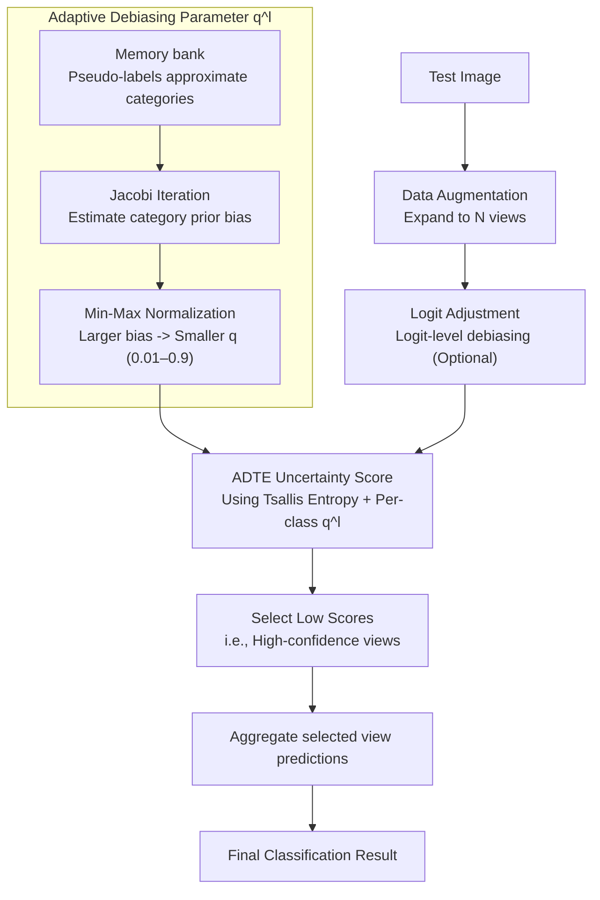

# Adaptive Debiasing Tsallis Entropy for Test-Time Adaptation

**Conference**: ICLR 2026  
**arXiv**: [2602.11743](https://arxiv.org/abs/2602.11743)  
**Code**: [https://github.com/Jinx630/ADTE](https://github.com/Jinx630/ADTE)  
**Area**: Social Computing  
**Keywords**: Test-time adaptation, Tsallis entropy, CLIP, debiasing, uncertainty estimation

## TL;DR
This paper proposes introducing Tsallis entropy (a generalized form of Shannon entropy) into Test-Time Adaptation (TTA) for VLMs, further developing it into Adaptive Debiasing Tsallis Entropy (ADTE). By customizing the debiasing parameter $q^l$ for each category, ADTE selects more reliable high-confidence views than Shannon entropy without distribution-specific hyperparameters. It outperforms SOTA on ImageNet, its five variants, and ten cross-domain benchmarks.

## Background & Motivation
**Background**: TTA methods improve the performance of VLMs like CLIP on out-of-distribution (OOD) data by selecting high-confidence augmented views. Representative methods such as TPT and Zero utilize Shannon entropy (SE) to measure uncertainty and filter low-entropy views.

**Limitations of Prior Work**: CLIP is pre-trained on unbalanced web-crawled data, leading to overconfidence in head classes and underconfidence in tail classes. SE uses a uniform formula $-\sum p\log p$ for all categories and fails to distinguish between different degrees of bias, causing the entropy estimate itself to be biased. This negatively impacts the selection quality of high-confidence views.

**Key Challenge**: SE assumes that the probability distribution is unbiased (extensivity assumption), whereas the prediction distribution of CLIP exhibits systematic bias (non-extensivity). SE cannot characterize this bias structure.

**Goal**: How to correct the influence of VLM prediction bias on entropy estimation during the TTA process?

**Key Insight**: Tsallis entropy is a generalization of SE that can characterize statistical dependence between probability distributions through a non-extensive parameter $q$. When $q < 1$, Tsallis entropy (TE) tends to select more reliable high-confidence views.

**Core Idea**: Replace Shannon entropy with Tsallis entropy for high-confidence view selection and adaptively calculate the debiasing parameter $q^l$ for each category.

## Method

### Overall Architecture
ADTE addresses the issue that "the entropy used to select high-confidence views in TTA is itself biased." It is positioned as a plug-and-play replacement for Shannon entropy in methods like Zero/TPT without changing the rest of the pipeline: a test image is first expanded into $N$ augmented views; an uncertainty score is calculated for each view using ADTE instead of SE; the views with low scores (high confidence) are selected; and their predictions are aggregated for the final result. This replacement introduces two key changes: the functional form of entropy changes from Shannon to Tsallis, and the parameter $q$ changes from a global constant to a per-category adaptive $q^l$, which is calculated via a separate parameter estimation branch using a memory bank and optional logit adjustment.

### Key Designs

**1. Replacing Shannon Entropy with Tsallis Entropy: Changing the calculation sensitive to tail classes**

SE measures uncertainty using a uniform formula $\mathbf{H}_{SE} = -\sum_l P_l \log P_l$. However, the $p\log p$ term is extremely sensitive to small probabilities near zero. Since CLIP produces small, systematically biased probabilities for tail classes, the entropy estimate is skewed by these categories. ADTE uses Tsallis entropy $\mathbf{H}_{TE} = \frac{\sum_l P_l^q - 1}{1-q}$, which replaces $p\log p$ with $p^q$, thereby altering the processing of small probabilities. Theoretically, this replacement is self-consistent: as $q \to 1$, TE reduces to SE (SE is a special case/lower bound of TE). When $q < 1$, the high-confidence views selected by TE exhibit higher Top-K cumulative reliability (TcrK). In the interval $0 < q < 1$, TE naturally mitigates the impact of VLM bias on view selection without explicit bias modeling.

**2. Adaptive Debiasing Tsallis Entropy (ADTE): Letting each category determine its debiasing strength**

Fixing a global $q$ has two issues: the optimal $q$ shifts with the test distribution (making manual tuning infeasible), and head vs. tail classes are affected differently by bias. ADTE calculates an individual $q^l$ for each category $l$. The process involves two steps: first, maintaining a memory bank to approximate class priors $\tilde{p}_l$ via pseudo-labels and Jacobi iteration; then, mapping these estimated biases to the interval $[\alpha, \beta] = [0.01, 0.9]$ using min-max normalization to serve as $q^l$. The mapping follows the principle of "larger bias, smaller $q^l$," as a smaller $q$ corresponds to stronger correction. Thus, categories heavily affected by bias are corrected more aggressively, while others remain closer to original SE. This estimation requires no distribution-specific hyperparameter tuning.

**3. Integration with Logit Adjustment: Layering debiasing at two levels**

ADTE performs debiasing at the entropy estimation level, which can seamlessly stack with strategies like logit adjustment that correct bias at the logit level. One can adjust logits first using estimated bias and then use ADTE to select high-confidence views. These two steps are aligned in goal and do not conflict. The entire process remains training-free and requires no distribution-specific hyperparameters.

### Loss & Training
Training-free. ADTE is a pure inference-time method that replaces Shannon entropy in the TTA pipeline. The memory bank size is set to 10 samples per category.

## Key Experimental Results

### Main Results (ImageNet + 5 Variants, CLIP ViT-B/16)

| Method | IN | IN-A | IN-R | IN-K | Average | OOD Avg |
|------|-----|------|------|------|---------|---------|
| CLIP | 68.7 | 50.6 | 77.7 | 48.3 | 61.5 | 59.7 |
| Zero | 70.9 | 64.0 | 80.8 | 50.3 | 66.2 | 65.0 |
| BCA | 70.2 | 61.1 | 80.7 | 50.9 | 65.6 | 64.4 |
| **ADTE** | **71.8** | **65.5** | **81.4** | **53.5** | **67.5** | **66.5** |

### Key Experimental Results (10 Cross-Domain Benchmarks)

| Metric | Description |
|------|------|
| ADTE Avg Accuracy | Highest average performance across 10 cross-domain benchmarks |
| Model Agnostic | Outperforms SOTA on both ViT-B/16 and ViT-L/14 |
| Prompt Agnostic | Effective with both manual templates and CuPL-generated text |

### Key Findings
- TE consistently outperforms SE when $q < 1$ (SE is the $q=1$ case), though the optimal $q$ varies by test distribution.
- ADTE eliminates the need for manual tuning via adaptive $q^l$ and performs robustly across all test distributions.
- The largest Gain occurs on ImageNet-K (48.3 → 53.5), which represents the variant with the most severe distribution shift.
- ADTE can directly replace entropy calculations in any SE-based TTA method without other modifications.

## Highlights & Insights
- **Systematic analysis of Shannon entropy bias**: The extensivity assumption implicitly held by SE is systematically analyzed and shown to fail in VLM TTA—a problem long overlooked.
- **Tsallis entropy as a direct replacement**: Theoretically elegant (SE as a lower bound) and practically effective; it is plug-and-play for any TTA method using SE.
- **Design of adaptive parameter estimation**: Leverages existing bias estimation methods (from Frolic) to transform priors into $q^l$, reusing existing tools effectively.

## Limitations & Future Work
- The memory bank size is fixed at 10 per category, which may be insufficient for datasets with many classes (e.g., ImageNet-1K).
- Bias estimation relies on pseudo-label quality; early samples may have inaccurate labels.
- The normalization interval $[\alpha, \beta] = [0.01, 0.9]$ remains a manually set hyperparameter.
- Only validated on classification tasks; dense prediction tasks like detection or segmentation are not covered.

## Related Work & Insights
- **vs Zero/TPT**: ADTE is a direct upgrade, yielding improvements simply by replacing the entropy calculation without changing other components.
- **vs Frolic**: Frolic uses logit adjustment for bias correction; ADTE corrects at the entropy estimation level, making them complementary.
- **vs Traditional Tsallis Entropy in DA**: Previous work optimized TE for pseudo-labeling in source domain adaptation; ADTE is the first to apply it to view selection in online TTA.

## Rating
- Novelty: ⭐⭐⭐⭐ Tsallis entropy in VLM TTA offers a novel theoretical perspective.
- Experimental Thoroughness: ⭐⭐⭐⭐⭐ Covers ImageNet+5 variants, 10 benchmarks, two models, and two prompt types.
- Writing Quality: ⭐⭐⭐⭐ Clear theoretical derivation, though formulas are dense.
- Value: ⭐⭐⭐⭐ A highly practical, plug-and-play replacement for SE.

<!-- RELATED:START -->

## Related Papers

- [\[ACL 2025\] FairSteer: Inference Time Debiasing for LLMs with Dynamic Activation Steering](../../ACL2025/social_computing/fairsteer_inference_time_debiasing_for_llms_with_dynamic_activation_steering.md)
- [\[ICLR 2026\] Scalable Multi-Task Low-Rank Model Adaptation](scalable_multi-task_low-rank_model_adaptation.md)
- [\[ICLR 2026\] Human or Machine? A Preliminary Turing Test for Speech-to-Speech Interaction](human_or_machine_a_preliminary_turing_test_for_speech-to-speech_interaction.md)
- [\[ICLR 2026\] SAGE: Spatial-visual Adaptive Graph Exploration for Efficient Visual Place Recognition](sage_spatial-visual_adaptive_graph_exploration_for_efficient_visual_place_recogn.md)
- [\[AAAI 2026\] SceneJailEval: A Scenario-Adaptive Multi-Dimensional Framework for Jailbreak Evaluation](../../AAAI2026/social_computing/scenejaileval_a_scenario-adaptive_multi-dimensional_framework_for_jailbreak_eval.md)

<!-- RELATED:END -->
