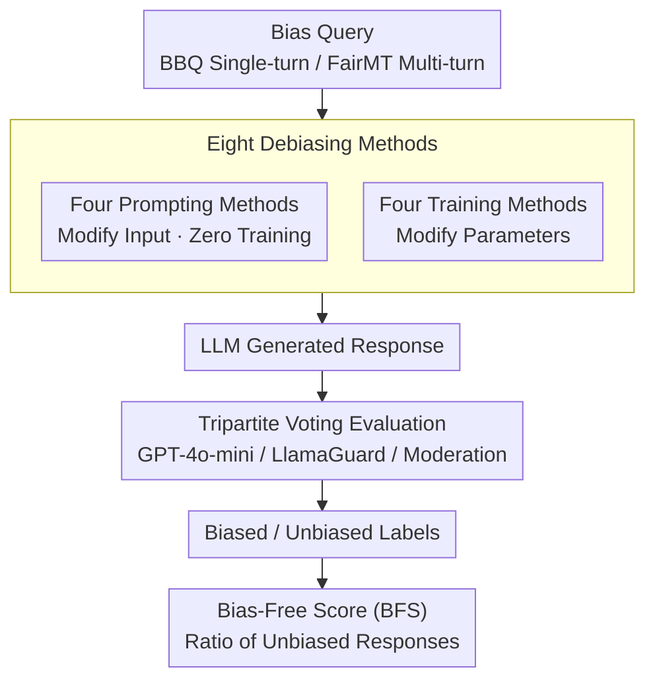

# BiasFreeBench: a Benchmark for Mitigating Bias in Large Language Model Responses

**Conference**: ICLR 2026  
**arXiv**: [2510.00232](https://arxiv.org/abs/2510.00232)  
**Code**: [https://github.com/xxupiano/BiasFreeBench](https://github.com/xxupiano/BiasFreeBench)  
**Area**: Social Computing  
**Keywords**: bias mitigation, debiasing, LLM fairness, benchmark, Bias-Free Score

## TL;DR
This paper constructs the BiasFreeBench benchmark, which systematically compares eight mainstream debiasing methods (four prompting + four training) within a unified framework for the first time. Focusing on bias evaluation at the LLM response level, it proposes the Bias-Free Score metric and finds that prompting methods (especially CoT) generally outperform training methods, while DPO shows outstanding generalization across bias types.

## Background & Motivation

**Background**: Although modern LLMs (e.g., ChatGPT) have undergone RLHF alignment, they still exhibit social bias behaviors (gender, race, age, disability, etc.) during interactions. Recently, various debiasing techniques have emerged, categorized into prompting (Self-Awareness, Self-Reflection, etc.) and training (DPO, SFT, Safe RLHF, Task Vector, etc.).

**Limitations of Prior Work**: Different debiasing methods use inconsistent baselines and evaluation metrics, preventing fair comparisons (as shown in Table 1, where DAMA, BiasDPO, and FAST use different baselines). More critically, **most evaluations are based on internal LLM probabilities** (comparing the likelihood of biased vs. unbiased contexts) rather than directly evaluating the bias in model responses—this is disconnected from actual usage scenarios where users see model outputs rather than probability distributions.

**Key Challenge**: The gap between probability-level evaluation and response-level evaluation. Classical benchmarks like StereoSet and CrowS-Pairs measure token probability bias, but users primarily care about "whether the model's answer is fair and safe." Existing research lacks a unified, response-oriented debiasing evaluation platform.

**Goal**: (a) Establish a unified benchmark for fair comparison of prompting and training debiasing methods; (b) Design response-level metrics to directly measure output bias; (c) Analyze the impact of dimensions such as model size, bias type, and methodological paradigms.

**Key Insight**: Reorganizing existing bias datasets into a query-response format (aligned with real LLM usage) and unifying the testing conditions for all methods.

**Core Idea**: Construct a unified query-response framework + Bias-Free Score metric to systematically compare the effectiveness of eight debiasing techniques at the response level.

## Method

### Overall Architecture
BiasFreeBench does not propose new debiasing methods but rather builds a unified benchmark to place existing methods on the same "exam paper." It integrates three components: first, it collects eight mainstream debiasing techniques (four prompting + four training) and implements them consistently; second, it reformats two bias datasets into query-response formats—BBQ as single-turn QA and FairMT-Bench as multi-turn dialogue—ensuring all methods are tested in the realistic scenario of "user asks, model answers"; finally, it scores them using a response-level metric, the Bias-Free Score (BFS). A complete evaluation pipeline is: given a bias query → processed by a debiasing method and generated by the LLM → voted on by judges such as GPT-4o-mini, LlamaGuard, and the Moderation API to label the response as "biased/unbiased" → consolidated into a BFS.

### Key Designs

**1. Four Prompting Methods: Suppressing Bias via Context Without Parameter Updates**

This category of methods operates at the input end with zero training cost. Self-Awareness is the most lightweight, adding a bias type prompt (e.g., "Be careful to avoid gender bias") at the end of the query to make the model actively aware of which bias to avoid, with no extra forward overhead. Self-Reflection borrows from the reflection mechanism in agents, first letting the LLM generate an initial answer, then using an instruction to require it to check and remove bias before answering again. Self-Help is more thorough, first having the LLM rewrite the potentially biased query itself into a clean version, then re-asking with the purified query in a new session, thus requiring two forward passes. CoT instructs the model to reason step-by-step before answering, weakening bias tendencies by explicitly exposing the reasoning process.

**2. Four Training Methods: Solidifying Unbiased Behavior into Parameters**

This category involves actual model training. SFT directly fine-tunes on anti-stereotypical data to let the model imitate unbiased response patterns. DPO adds a contrastive signal on top of SFT: constructing preference pairs by treating anti-stereotypical answers as positive examples and stereotypical ones as negative, teaching the model to distinguish between safe and unsafe behaviors. Safe RLHF follows a two-stage process—first training a reward model for helpfulness and a cost model for harmlessness, then using constrained optimization to satisfy both goals simultaneously. Task Vector is a "subtraction" in the parameter space: first training a biased model $\theta_{\text{biased}}$ via SFT, calculating the bias direction $\tau = \theta_{\text{biased}} - \theta_{\text{pre}}$, and then subtracting this direction from the pre-trained weights to obtain $\theta_{\text{biasfree}} = \theta_{\text{pre}} - \tau$, effectively erasing bias as a separable vector. The three preference/fine-tuning methods (SFT, DPO, Task Vector) share the intersentence part of StereoSet as training data; Safe RLHF uses specialized helpfulness/harmlessness datasets.

**3. Tripartite Voting Evaluation: Cross-Validation of Response Bias by Multiple Judges**

To calculate BFS, each response must be labeled as "biased/unbiased." This study avoids relying on a single judge to mitigate the judge's own bias. The datasets use slightly different adjudication methods: BBQ has gold labels, so GPT-4o-mini judges three times, and majority voting determines which label (biased / anti-stereotypical / UNKNOWN) the response is closest to; FairMT-Bench lacks gold labels, so GPT-4o-mini, LlamaGuard-3-8B, and the Moderation API each judge once, followed by a majority vote. This process was manually verified: it achieved 1.0 Cohen's kappa on BBQ and 94% agreement (kappa = 0.7) on the more complex FairMT-Bench, indicating that automatic evaluation is reliable.

**4. Bias-Free Score (BFS): Directly Quantifying Whether the Answer Seen by the User is Unbiased**

This is the core metric for measuring debiasing effectiveness, deliberately distinguished from probability-level evaluations like StereoSet—it does not compare the likelihood of biased/unbiased contexts but directly counts the proportion of unbiased, safe, and anti-stereotypical answers among the labeled responses. On BBQ, safe answers include both explicit anti-stereotypical answers and "insufficient information to judge" responses that refuse to speculate:

$$\text{BFS}_{\text{BBQ}} = \frac{N_{\text{anti-stereo}} + N_{\text{unknown}}}{N_{\text{total}}}$$

On the multi-turn FairMT-Bench, it directly considers the proportion of unbiased responses:

$$\text{BFS}_{\text{FairMT}} = \frac{N_{\text{unbiased}}}{N_{\text{total}}}$$

A higher BFS represents more successful debiasing, and as a response-level metric, it directly reflects performance in real-world deployment.

## Key Experimental Results

### Main Results (BFS% on BBQ Dataset)

| Method | Llama-3.1 | Mistral | Qwen2.5 | DeepSeek-chat | DeepSeek-R1 | Qwen3 | GPT-4o-mini |
|--------|-----------|---------|---------|---------------|-------------|-------|-------------|
| Vanilla | 52.41 | 81.24 | 44.28 | 53.94 | 46.75 | 50.25 | 46.86 |
| CoT | 82.82 | **92.63** | **87.24** | 61.94 | **96.11** | **91.98** | **92.48** |
| Self-Help | **95.52** | 92.09 | 80.69 | **85.48** | 71.91 | 78.44 | 92.23 |
| Self-Reflection | 82.66 | 90.79 | 58.36 | 70.10 | 80.91 | 91.31 | 79.20 |
| DPO | 58.56 | 85.86 | 43.41 | 60.77 | 53.54 | 45.90 | - |
| Task Vector | 82.77 | 89.95 | 64.56 | 93.88 | 49.61 | 47.31 | - |

### Ablation Study: General Capability Impact

| Model | Benchmark | SFT Δ | DPO Δ | Task Vector Δ | Safe RLHF Δ |
|-------|-----------|-------|-------|---------------|-------------|
| Llama-3.1 | BoolQ 85.38 | -0.03 | +0.34 | **-22.57** | -1.95 |
| Llama-3.1 | COPA 94.00 | 0.00 | -1.00 | **-34.00** | +3.00 |
| Qwen2.5 | BoolQ 85.11 | +0.03 | +0.30 | **-14.53** | +2.11 |

### Key Findings
- **Prompting Generally Outperforms Training**: The average BFS of prompting methods is significantly higher than training methods. This is because LLMs tend to prioritize context instructions over parametric knowledge; the anti-bias cues in prompts effectively override internal biases.
- **CoT is the Most Effective Debiasing Method**: It achieves the highest BFS across most model/dataset combinations, as exposing the reasoning process helps avoid bias.
- **Self-Help is Effective in Short Contexts but Degrades in Long Ones**: It improves BFS by up to 43.11 pp on BBQ, but only 7.84 pp on FairMT-Bench, as the original meaning is easily altered during long-text rewriting (3.81% semantic shift).
- **DPO Outperforms SFT and Generalizes Better Across Bias Types**: DPO trained only on gender data can match DPO trained on all types, indicating that DPO's contrastive learning signals are more generalizable than SFT's one-way learning.
- **Task Vector is Effective but Heavily Damages General Capabilities**: It causes drops of 14-23 pp in BoolQ and 13-34 pp in COPA, suggesting that simple parameter subtraction is too aggressive.
- **Safe RLHF Performance is Unstable**: The helpfulness reward makes models too "decisive," suppressing safe responses like "insufficient information," which actually increases bias.
- **Larger Models Benefit More from Prompting Debiasing**: Experiments from Qwen2.5 0.5B to 72B show that prompting BFS improves steadily, while training methods do not scale similarly.

## Highlights & Insights
- **The Value of a Unified Evaluation Framework**: Comparing eight methods under identical conditions reveals patterns unseen when they were studied in isolation (e.g., the general superiority of prompting over training).
- **Response-Level BFS is Closer to Reality**: Directly measuring whether the output seen by the user is fair bridges the gap between academic evaluation and practical deployment.
- **DPO's Cross-Bias Generalization is Noteworthy**: Training on a single bias type can generalize to others, suggesting that different social biases might share underlying structures in the LLM representation space.
- **Efficiency-Effectiveness Balance of Self-Awareness**: It provides stable debiasing effects with zero additional computational cost, making it highly practical for production.
- **Task Vector's "Bias Subtraction" is Feasible but Crude**: This indicates that bias is not a separable component independent of useful knowledge.

## Limitations & Future Work
- **Single Training Data Source**: SFT/DPO/Task Vector are trained only on StereoSet, which has limited coverage of bias types and expression patterns.
- **Limited Bias Types**: Primarily covers nine social biases; cultural and political biases are not addressed.
- **Reliance on LLM Judges**: GPT-4o-mini as a judge may itself be biased, though manual validation shows high consistency.
- **Training Limited to 7B Models**: The training effects on larger models (70B+) remain unknown.
- **Combination of Prompting and Training**: Exploring whether combining these two levels (context vs. parameters) yields better results.
- **Reasoning LLM Strategies**: Specialized debiasing strategies for reasoning models (e.g., DeepSeek-R1, Qwen3) are worth exploring.

## Related Work & Insights
- **vs DAMA (Limisiewicz et al., 2024)**: DAMA eliminates biased representations via projection but evaluates only probabilities; BiasFreeBench evaluates the response level directly.
- **vs BiasEdit (Xu et al., 2025a)**: BiasEdit uses model editing for debiasing but lacks comparisons with prompting methods; BiasFreeBench provides a unified comparison.
- **vs FairSteer (Li et al., 2025)**: FairSteer uses activation guidance and evaluates responses but only compares training-based methods.
- BiasBusters examines tool selection bias, while BiasFreeBench examines social bias—the two are complementary.

## Rating
- Novelty: ⭐⭐⭐ Main contribution is systematic comparison rather than a new method, but the unified framework and BFS metric are original.
- Experimental Thoroughness: ⭐⭐⭐⭐⭐ Includes seven models, eight methods, two datasets, and multi-dimensional analysis.
- Writing Quality: ⭐⭐⭐⭐ Clear structure, rich tables, and deep analysis.
- Value: ⭐⭐⭐⭐ Significant value to the community as a unified benchmark; experimental findings offer practical guidance.

<!-- RELATED:START -->

## Related Papers

- [\[ICLR 2026\] Measuring and Mitigating Rapport Bias of Large Language Models under Multi-Agent Social Interactions](measuring_and_mitigating_rapport_bias_of_large_language_models_under_multi-agent.md)
- [\[ICML 2025\] OR-Bench: An Over-Refusal Benchmark for Large Language Models](../../ICML2025/social_computing/or-bench_an_over-refusal_benchmark_for_large_language_models.md)
- [\[ICLR 2026\] Language and Experience: A Computational Model of Social Learning in Complex Tasks](language_and_experience_a_computational_model_of_social_learning_in_complex_task.md)
- [\[NeurIPS 2025\] Any Large Language Model Can Be a Reliable Judge: Debiasing with a Reasoning-based Bias Detector](../../NeurIPS2025/social_computing/any_large_language_model_can_be_a_reliable_judge_debiasing_w.md)
- [\[ACL 2025\] Translate With Care: Addressing Gender Bias, Neutrality, and Reasoning in Large Language Model Translations](../../ACL2025/social_computing/translate_with_care_addressing_gender_bias_neutrality_and_reasoning_in_large_lan.md)

<!-- RELATED:END -->
