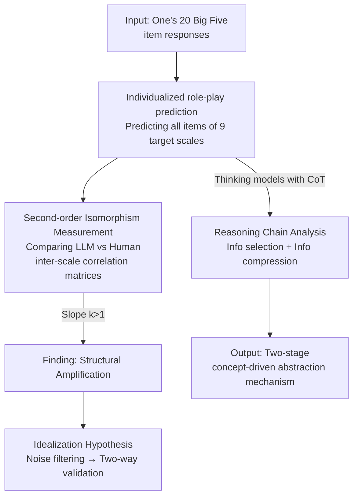

# From Five Dimensions to Many: Large Language Models as Precise and Interpretable Psychological Profilers

**Conference**: ICLR2026  
**OpenReview**: [https://openreview.net/forum?id=JXFnCpXcnY](https://openreview.net/forum?id=JXFnCpXcnY)  
**Code**: TBD  
**Area**: Social Computing / Computational Social Science / LLM Psychological Simulation  
**Keywords**: Big Five, Psychological Structure Reconstruction, Structural Amplification, Idealization Hypothesis, Reasoning Interpretability

## TL;DR
Provided with only 20 Big Five personality item responses of an individual, LLMs are tasked to role-play and predict that individual's responses to 9 other psychological scales. The results show that the "inter-scale correlation structure" reconstructed by LLMs aligns highly with real human data ($R^2>0.88$). Analysis of reasoning chains reveals a two-stage abstraction process where LLMs compress raw scores into natural language personality summaries before reasoning—indicating genuine psychological reasoning rather than mere semantic pattern matching.

## Background & Motivation
**Background**: A core goal of psychology is to characterize the "nomothetic network"—the interrelatedness between various psychological traits like personality, anxiety, stress, and emotion regulation. Recent work has leveraged LLMs to role-play human subjects, demonstrating their ability to replicate social/economic behaviors at the group level and even simulate specific individuals with high fidelity (e.g., Park et al.'s "Generative Agents").

**Limitations of Prior Work**: While demonstrating that LLMs "can mimic behavior," existing research hasn't answered a more critical question: does this ability stem from **genuine psychological reasoning** or **surface pattern matching** when input semantics overlap highly? Furthermore, mainstream evaluations typically focus on "first-order prediction accuracy" (the correlation between predicted scores and ground truth), which is naturally constrained by the strength of correlations in the ground truth itself and fails to reveal whether the model has internalized the entire network of trait relationships.

**Key Challenge**: To distinguish between reasoning and pattern matching, experiments must satisfy several strict conditions: low semantic overlap in inputs (to block pattern matching shortcuts), analysis of the entire correlation structure rather than isolated trait pairs, consistency across multiple models, and process-level interpretability (moving beyond performance metrics). No existing paradigm satisfies all these.

**Goal**: (1) Design a zero-shot prediction task that blocks semantic shortcuts; (2) Use "second-order" structural analysis to determine if LLMs reconstruct the entire psychological network; (3) Open the black box to observe how LLMs derive conclusions from sparse inputs via reasoning chains.

**Key Insight**: Utilize an individual's responses to 20 Big Five items (on a 5-point scale from "strongly disagree" to "strongly agree") as the sole input to predict responses to **9 entirely different psychological scales**. Semantic overlap between Big Five items and target scales is minimal, and the requirement for item-by-item, individual-level prediction makes pattern matching difficult. Providing only sparse numerical inputs without textual profiles isolates the model's "reasoning ability" from "memory retrieval."

**Core Idea**: Instead of comparing first-order accuracy, compare the **structure of inter-scale correlation matrices**. Regress the correlation patterns calculated from LLM-predicted data onto human ground truth; the regression slope serves as the alignment metric. Use annotator models to parse reasoning chains, identifying the importance weights of each Big Five item and the stages of information processing.

## Method

### Overall Architecture
The paper uses two experiments to decouple "performance" from "mechanism." **Experiment 1** tests whether LLMs can reconstruct the entire psychological structure from sparse personality inputs: for 816 real subjects, LLMs role-play each individual to predict all items in 9 target scales based only on 20 Big Five responses. The "inter-scale sub-factor correlation matrix" of LLM-predicted data is then compared to the human ground truth matrix. **Experiment 2** opens the black box: reasoning chains (from Thinking models) from Experiment 1 are extracted and parsed by a set of independent "annotator models" to locate information selection strategies and verify the predictive power of intermediate natural language summaries.

Data consists of psychological assessments from 816 Chinese participants collected during a longitudinal study. Big Five scales serve as input; target scales include perceived stress, coping styles, state-trait anxiety, self-compassion, resilience (CD-RISC), intolerance of uncertainty, emotion regulation, risk perception, and future time perspective. Models tested include Chat/Thinking variants of DeepSeek-V3.1, GPT-5, Claude 3.7 Sonnet, Gemini 2.5 Flash, GLM-4.5, Kimi K2, and Qwen3-235B. Baselines include traditional ML (KNN, SVM, Linear Regression) and a semantic similarity model based on bge-reranker-large.

### Key Designs

**1. Second-order Isomorphism Measurement: Replacing "First-order Accuracy" with "Correlation Structural Alignment"**

The critical methodological innovation is the evaluation metric. Directly correlating predicted scores with ground truth (first-order accuracy) has a fundamental flaw: this correlation is bottlenecked by the inherent strength of relationships between the Big Five and target scales. Strongly correlated trait pairs are naturally easy to predict, while weak ones are hard, confounding model capability with data structure. Ours instead calculates the **Pearson correlation matrix between sub-factors**. Correlation vectors from LLM data are regressed onto human ground truth vectors; the regression coefficient $k$ (slope) is the alignment metric. $k \approx 1$ indicates perfect structural reconstruction, while $k > 1$ indicates amplification. This evaluates whether the model has internalized the "shape" of the relationship network rather than just predicting specific trait pairs—key to blocking pattern matching shortcuts.

**2. Structural Amplification: LLMs "Purify" Rather Than Just Replicating Human Psychological Structure**

Using the above metric, a counter-intuitive phenomenon is discovered: the signs of the LLM-reconstructed correlation matrix match humans perfectly, but the **magnitudes are systematically larger** (more saturated, further from zero). For Gemini 2.5, the regression $R^2 = 0.92$ and the slope $k = 1.42$ is significantly greater than 1. Ours terms this **structural amplification** and emphasizes it differs from known "bias amplification"—bias amplification is a first-order effect (exaggerating specific social biases), whereas structural amplification is a second-order effect (the entire trait relationship network is strengthened globally). Crucially, this holds even when looking only at correlations *between* target scales (excluding Big Five inputs) ($k = 1.41$, $R^2 = 0.91$), suggesting the model constructs an **internally consistent, globally amplified psychological network** rather than a simple input-output mapping. Furthermore, all tested LLMs show $k > 1$, outperforming KNN and semantic similarity baselines; higher $k$ correlates with better prediction performance ($R^2 = 0.95$), indicating amplification is a core functional mechanism, not an artifact.

**3. Idealization Hypothesis: Amplification Stems from "Filtering Random Noise in Human Self-Reports"**

Why the amplification? Ours proposes that LLMs act as "idealized subjects," automatically filtering out random measurement errors inherent in human self-reports. According to classical test theory, random noise **attenuates** observed correlations; thus, denoising naturally strengthens them. Evidence is two-way and quasi-causal: theoretically—the internal consistency of LLM data (Cronbach's $\alpha = 0.87$) is significantly higher than humans ($0.75$), and different LLMs converge highly among themselves (inter-model MSE $0.0060$ is much smaller than model-human MSE $0.0357$), suggesting LLMs converge toward a common "idealized response model"; empirically—filtering for "attentive" human respondents ($N = 309$, excluding fast responders) yields a stronger correlation structure closer to LLMs ($k$ decreases to $1.08$). Conversely, **injecting increasing Gaussian noise** into baseline model predictions monotonically weakens the amplification effect ($k$ drops from $1.55$ to $1.12$). This symmetry provides strong support for the noise-filtering explanation.

**4. Reasoning Chain Deconstruction: Two-stage Mechanism of Concept-driven Info Selection + Info Compression**

Experiment 2 opens the black box using a "Thinking model → Annotator model" framework: a model generates reasoning chains (e.g., Claude 3.7-Thinking), and multiple annotator models (DeepSeek-V3.1, Qwen3-235B, etc.) parse the same chains to provide 20-dimensional attribution distributions (importance of each Big Five item). Averaged annotator results are benchmarked against feature importance from Bayesian Ridge Regression trained on ground truth. Two conclusions emerge: regarding **information selection**, LLM attribution at the **factor level** (e.g., the high-order factor Neuroticism) aligns almost perfectly with human ground truth ($r = 0.981$), far exceeding semantic similarity baselines ($r = 0.790$). However, at the **item level**, alignment for all methods is weak (LLM vs. ground truth $r = 0.207$)—meaning LLMs accurately identify "which high-order factor to look at" but cannot distinguish the importance of specific items within that factor. This is a hallmark of top-down, concept-driven reasoning rather than surface word associations. Regarding **information compression**, reasoning chains generate a natural language summary (e.g., "a sensitive, worried, imaginative, pessimistic individual..."). Using only this summary as input (SummaryOnly) maintains structural amplification ($R^2 = 0.91$), proving the summary is a **sufficient compression** of the input. Most strikingly, "Summary + Score" yields the highest amplification and performance, suggesting the summary is not redundant but captures **emergent second-order information** (a conceptual gestalt). Across 15 conditions, $k$ is strongly correlated with performance ($R^2 = 0.93$).

## Key Experimental Results

### Main Results

| Metric / Setting | Gemini 2.5 | Meaning |
|--------|------|------|
| Predicted vs. Human Correlation Regression $R^2$ | 0.92 | Highly linear structural alignment |
| Amplification Slope $k$ (including Big Five) | 1.42 | Systematic amplification (>1) |
| Amplification Slope $k$ (Target scales only) | 1.41 ($R^2=0.91$) | Consistent internal network amplification |
| $k$ across all LLMs | All $>1.0$, exceeding KNN/Semantic | Amplification is a general trait of LLMs |
| $k$ vs. Prediction Performance | $R^2=0.95$ | Stronger amplification leads to better accuracy |

Overall zero-shot alignment $R^2 > 0.88$, significantly surpassing semantic similarity and approaching "ML algorithms trained directly on the dataset."

### Ablation Study

| Analysis | Key Indicator | Description |
|------|---------|------|
| 1000x Permutation Test | $p<.001$ | $R^2$ and Kendall's $\tau$ are extreme outliers, not accidental |
| Robustness (Standard/Random/Item Order) | $k=1.42/1.41/1.42$ | Amplification is independent of prompt/order |
| High-Attention Subgroup ($N=309$) | $k \to 1.08$ | Denoised human data is closer to LLMs |
| Gaussian Noise Injection | $k: 1.55 \to 1.12$ | Noise weakens amplification (dose-response) |
| Info Selection (Factor level) | $r=0.981$ vs Human | Far exceeds semantic baseline $r=0.790$ |
| Info Selection (Item level) | $r=0.207$ | Indistinguishable importance within factors |
| Info Compression SummaryOnly | $R^2=0.91$ | Summaries alone enable sufficient reconstruction |

### Key Findings
- **Structural amplification is a functional mechanism, not a bug**: Larger $k$ corresponds to better prediction ($R^2=0.95$), suggesting "purification/idealization" is exactly where LLM accuracy comes from.
- **Denoising hypothesis supported by two-way evidence**: Denoising humans and noising models produce opposite, predictable effects, forming quasi-causal evidence.
- **Abstraction level discrepancy is telling**: LLMs resemble humans at the high-order factor level but fail at the item level—they grasp "concepts" not "details," consistent with the Information Bottleneck principle.
- **Natural language summaries are emergent second-order information**: Summary+Score > Score > Summary. Adding a summary derived from scores improves performance, indicating the summary contains conceptual gestalts not present in raw numbers.

## Highlights & Insights
- **Second-order isomorphism measurement is a transferable methodological tool**: Shifting from "evaluating accuracy" to "evaluating structural alignment" avoids confounding from ground-truth correlation strength. Any study on "LLM simulating humans/systems" can use this to separate "true reasoning" from "surface matching."
- **"Structural amplification = idealized abstraction" is an elegant, falsifiable explanation**: It reframes a seemingly strange phenomenon as purification via denoising, pinned down by symmetrical noise experiments.
- **Concept-driven two-stage mechanism echoes cognitive science**: Compressing inputs into low-dimensional summaries before reasoning mimics information-bottleneck style lossy compression, providing mechanical evidence in the "Does LLM truly reason?" debate.
- **De-biasing reasoning chain analysis with multiple annotator models**: Single annotators have biases; averaging multiple models provides robust attribution vectors, mitigating controversies over CoT faithfulness.

## Limitations & Future Work
- **Single-culture sample**: Data is entirely from Chinese participants. The idealized structure might be influenced by cultural biases in training data; cross-cultural generalization is unverified.
- **Lack of explanation for inter-model differences**: While amplification is shown to be a general trait, why some architectures amplify more than others remains unexamined (e.g., scale, fine-tuning).
- **Semantic depth of summaries**: What exactly is encoded in the "second-order information" of the summaries deserves deeper investigation.
- **Reliance on CoT chains**: Info compression analysis applies only to models with visible Thinking chains; mechanisms for models without explicit reasoning remain a black box. CoT faithfulness remains a concern, though mitigated by multi-model averaging.

## Related Work & Insights
- **vs. Park et al. (Generative Agents)**: They focus on first-order individual behavior simulation in data-rich open worlds (including memory). This work isolates "reasoning" from "memory" via sparse inputs and shifts to second-order structural reconstruction.
- **vs. Zhu et al. (2025)**: They found poor alignment when inferring personality from qualitative interviews. Ours shows that was a first-order prediction limited by ground truth; second-order analysis reveals high alignment—the difference is in the measurement perspective.
- **vs. CoT faithfulness debate (Turpin/Lanham et al.)**: Rather than debating if chains are post-hoc rationalizations, Ours uses parsing and back-filling experiments to prove intermediate summaries **do have predictive power**, providing functional evidence for reasoning chains.
- **vs. Information Bottleneck (Tishby et al.)**: Interpreting the LLM behavior of "discarding item-level details while retaining high-order factors" as information-bottleneck compression provides a computational footnote to the cognitive hierarchy hypothesis.

## Rating
- Novelty: ⭐⭐⭐⭐⭐ Second-order isomorphism + Structural amplification + Idealization hypothesis form a cohesive, falsifiable experimental framework.
- Experimental Thoroughness: ⭐⭐⭐⭐⭐ 7+ models, permutation tests, two-way causal noise experiments, multi-annotator de-biasing.
- Writing Quality: ⭐⭐⭐⭐⭐ Progressive narrative: motivation → metric design → mechanism deconstruction.
- Value: ⭐⭐⭐⭐⭐ Provides strong tools for psychological simulation and a methodological paradigm for LLM interpretability with high interdisciplinary value.

<!-- RELATED:START -->

## Related Papers

- [\[NeurIPS 2025\] Redefining Experts: Interpretable Decomposition of Language Models for Toxicity Mitigation](../../NeurIPS2025/social_computing/redefining_experts_interpretable_decomposition_of_language_models_for_toxicity_m.md)
- [\[ICLR 2026\] Propaganda AI: An Analysis of Semantic Divergence in Large Language Models](propaganda_ai_an_analysis_of_semantic_divergence_in_large_language_models.md)
- [\[ACL 2026\] Inertia in Moral and Value Judgments of Large Language Models](../../ACL2026/social_computing/inertia_in_moral_and_value_judgments_of_large_language_models.md)
- [\[ACL 2026\] Understanding the Sociocultural Dimensions of Mental Health Discourse in Arabic-Language X Communities](../../ACL2026/social_computing/understanding_the_sociocultural_dimensions_of_mental_health_discourse_in_arabic-.md)
- [\[ICLR 2026\] Measuring and Mitigating Rapport Bias of Large Language Models under Multi-Agent Social Interactions](measuring_and_mitigating_rapport_bias_of_large_language_models_under_multi-agent.md)

<!-- RELATED:END -->
