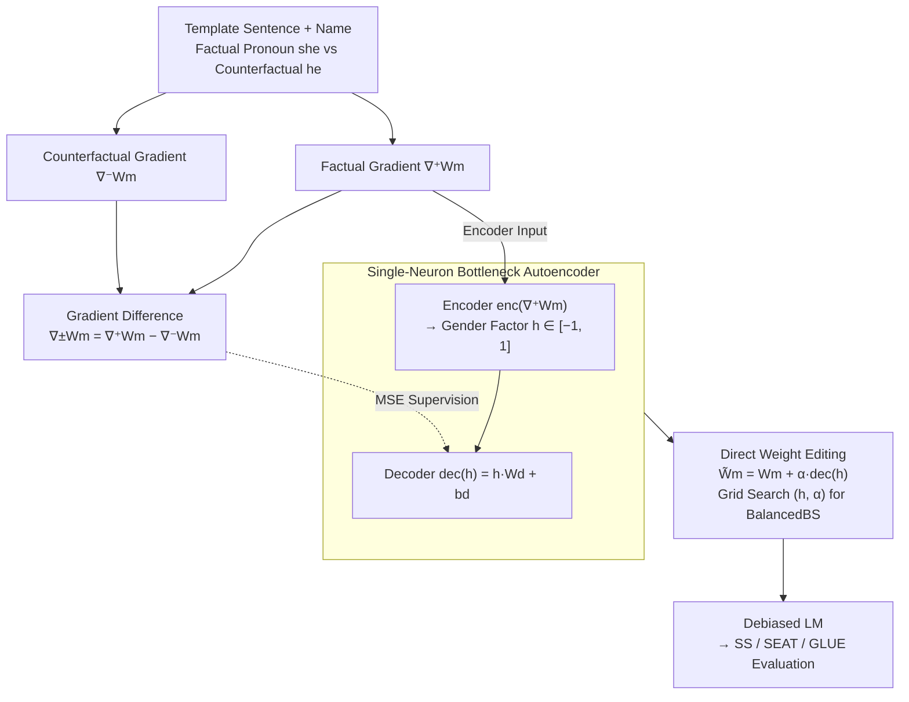

# GRADIEND: Feature Learning within Neural Networks Exemplified through Biases

**Conference**: ICLR 2026  
**arXiv**: [2502.01406](https://arxiv.org/abs/2502.01406)  
**Code**: [https://github.com/aieng-lab/gradiend](https://github.com/aieng-lab/gradiend)  
**Area**: Social Computing  
**Keywords**: Monosemantic feature learning, gender bias mitigation, gradient encoder-decoder, Transformer debiasing, interpretability

## TL;DR
The authors propose GRADIEND—a gradient-based encoder-decoder architecture that learns interpretable monosemantic features (exemplified by gender) from model gradients through a single bottleneck neuron. It can identify which weights encode specific features and directly modify model weights via the decoder to eliminate bias, achieving SOTA debiasing performance on all baseline models when combined with INLP.

## Background & Motivation
AI systems often exhibit and amplify social biases (e.g., gender bias), resulting in harmful impacts in critical fields such as law, medicine, and recruitment. Amazon's AI recruitment tool favoring male candidates is a representative case.

Existing Transformer debiasing methods include:
- **Counterfactual Data Augmentation (CDA)**: Retraining after swapping gender-related words; high cost.
- **Dropout Augmentation**: Increasing Dropout rates during pre-training.
- **INLP**: Iterative Null-space Projection, which repeatedly trains linear classifiers and projects into the null space.
- **SentDebias/SelfDebias**: Post-processing methods that adjust embeddings or output distributions.

**Key Challenge**: While existing unsupervised sparse autoencoder (SAE) methods (e.g., Bricken et al., 2023) can extract interpretable features, they require learning a massive number of latent features before searching for meaningful interpretations, providing no guarantee that expected features (e.g., "gender") will emerge. Furthermore, most debiasing methods are post-processing and cannot truly modify the internal representations of trained models.

**Key Insight**: Utilizing feature information contained within model gradients—gradients naturally indicate "which parameters need updating to change a certain feature." By designing a minimalist encoder-decoder structure, a monosemantic feature neuron with **desired semantics** can be learned from factual/counterfactual gradient differences.

## Method

### Overall Architecture
GRADIEND aims to solve the problem of isolating the single "gender" semantic into a readable and controllable neuron from within a pre-trained Transformer to enable direct weight modification. Its raw material consists of gradients rather than activations. For the same template sentence containing names and pronouns, two sets of gradients are calculated using the factual pronoun and the counterfactual pronoun as MLM targets. Their difference yields a gradient that isolates the "gender direction." Subsequently, an encoder-decoder with only $3n+1$ parameters is used: the encoder compresses the factual gradient into a scalar "gender factor" $h$, and the decoder reconstructs the gradient difference from $h$, optimized via MSE. Once trained, $h$ identifies "which weights encode gender," and the decoder output serves as a weight editing vector to be added back to the model backbone—adjusting strength for same signs, reversing for opposite signs, or setting to 0 for debiasing.

### Key Designs

**1. Factual/Counterfactual Gradient Difference: "Subtracting" the Gender Direction from Gradients**

The raw material for feature learning is gradients rather than activations—gradients naturally answer "which parameters should move in which direction to change a prediction." Given a template sentence with a name and a pronoun (e.g., "Alice explained the vision as best [MASK] could"), two gradients are calculated using the correct pronoun "she" and the counterfactual pronoun "he" as MLM targets: the factual gradient $\nabla^+ W_m$ and the counterfactual gradient $\nabla^- W_m$. Both contain numerous linguistic updates unrelated to gender, but by calculating the gradient difference $\nabla^{\pm}W_m := \nabla^+ W_m - \nabla^- W_m$, these common components cancel out, leaving a pure "gender-relevant direction." This step ensures a clean foundation, guaranteeing the bottleneck neuron carries gender semantics rather than others. Here, $\nabla^+ W_m$ serves as the encoder input, while $\nabla^{\pm}W_m$ is the supervisory target for the decoder.

**2. Single-Neuron Bottleneck Encoder-Decoder: Forcing Desired Semantics with $3n+1$ Parameters**

Unlike SAEs that learn thousands of features before manual searching, GRADIEND pre-specifies "gender" as the sole bottleneck. The encoder maps the factual gradient to a scalar $\text{enc}(\nabla^+ W_m) = \tanh(W_e^T \cdot \nabla^+ W_m + b_e) =: h \in \mathbb{R}$, and the decoder reconstructs the gradient difference $\text{dec}(h) = h \cdot W_d + b_d \approx \nabla^{\pm} W_m$ via MSE. With $W_e, W_d, b_d \in \mathbb{R}^n$ and $b_e \in \mathbb{R}$, the total parameter count for an $n$-dimensional weight is only $3n+1$. The $\tanh$ function squashes $h$ into $[-1, 1]$, causing "male-leaning/female-leaning" inputs to fall at the extremes and neutral inputs to fall near 0, resulting in a readable and controllable semantic factor.

**3. Direct Weight Modification for Debiasing: Decoder Output as an Editing Vector**

The trained decoder translates the gender factor into weight updates, turning debiasing into a targeted edit of the LM backbone: $\tilde{W}_m := W_m + \alpha \cdot \text{dec}(h)$. When $h$ and the learning rate $\alpha$ share the same sign, the model leans male; when signs are opposite, it leans female. Setting $h$ near 0 yields the debiasing direction. In practice, a grid search over $(h, \alpha)$ is performed using the **Balanced Bias Score** (BalancedBS)—which rewards high language modeling stability $\text{LMS}_{\text{Dec}}$, low $|P(F)-P(M)|$ (balanced predictions), and high $P(F)+P(M)$ (reasonable predictions)—to select the optimal configuration, denoted as GRADIEND-BPI. Interestingly, since $\text{dec}(h)=h\cdot W_d + b_d$, the configurations $(h,\alpha)$ and $(-h,-\alpha)$ differ only by $2\alpha b_d$; thus, even without gender information ($h=0$), the decoder bias $b_d$ itself learns an effective neutral direction.

### Loss & Training
Training fits the gradient difference using MSE loss and Adam optimizer (LR 1e-5, weight decay 1e-2, batch size 32) for 23,653 steps—matching the number of templates in the Genter dataset. The model is evaluated every 250 steps using the validation correlation coefficient $\text{Cor}_{\text{Genter}}^{\text{val}}$. For each step, a gender is randomly selected and a name is sampled from the NAMExact database. Decoder weights are initialized with an $n$-custom initialization of the same magnitude as the encoder. Crucially, the prediction layer is excluded from training to ensure internal backbone edits.

## Key Experimental Results

### Main Results

**Encoder Evaluation (H1: Learning Gender Features)**

| Model | $\text{Acc}_{\text{Genter}}$ | $\text{Cor}_{\text{Genter}}$ | $\text{Acc}_{\text{Enc}}$ | $\text{Cor}_{\text{Enc}}$ |
| :--- | :--- | :--- | :--- | :--- |
| BERT-base | 1.000 | 0.957 | 0.612 | 0.669 |
| BERT-large | 1.000 | 0.908 | 0.578 | 0.616 |
| DistilBERT | 1.000 | 1.000 | 0.758 | 0.838 |
| RoBERTa | 1.000 | 1.000 | 0.909 | 0.935 |

All models almost perfectly distinguish $\pm 1$ on gender-related data and map neutral inputs to values near 0.

**Debiasing Comparison (H2: Modifying Gender Bias)**

| Method | SS(%) | SEAT | CrowS(%) | LMS(%) | GLUE(%) |
| :--- | :--- | :--- | :--- | :--- | :--- |
| BERT-base | Base | Base | Base | Base | Base |
| + GRADIEND-BPI | Gain | - | - | Maintain | Maintain |
| + GRADIEND-BPI + INLP | **Significant Gain** | Gain | - | Maintain | Maintain |
| CDA / Dropout / INLP | Partial Gain | Inconsistent| Inconsistent| Partial Loss| Partial Loss|

### Ablation Study

| Configuration | Key Metric | Description |
| :--- | :--- | :--- |
| Various Baseline Models | All 4 successful | BERT/DistilBERT/RoBERTa all learn gender features. |
| Gender factor $h=0$ | BalancedBS optima | Decoder bias $b_d$ automatically learns debiasing. |
| Overfitting Analysis | No significant diff | Generalizes to unseen names. |
| woman/man Generalization| he/she -> woman/man | Cross-lexical generalization of gender concepts. |

### Key Findings
- **GRADIEND-BPI + INLP is the only combination** that achieves significant improvements across the SS index for all baseline models, demonstrating strong robustness.
- Introducing confidence intervals reveals that the effectiveness of existing debiasing methods is far less certain than previously implied.
- RoBERTa surprisingly exhibits a female bias ($\mathbb{P}(F) > \mathbb{P}(M)$), contrary to the common assumption of male bias.
- Inducing bias toward a specific gender (FPI/MPI) is easier than removing it (BPI).
- The influence of weight adjustments is distributed almost point-symmetrically (relative to the signs of $h$ and $\alpha$).

## Highlights & Insights
- **Learning features with desired semantics directly from gradients**: Unlike unsupervised SAEs (learning thousands of features followed by manual interpretation), GRADIEND learns "expected" interpretable features, representing a significant paradigm shift.
- **Minimalist yet elegant design**: A single scalar bottleneck neuron with $3n+1$ parameters effectively encodes the complex concept of gender. Architecture simplicity facilitates easier analysis.
- **Introduction of Bootstrap confidence intervals**: Revealing a neglected issue in the field—the lack of statistical rigor in prior debiasing comparisons.
- **Interesting discovery of decoder bias**: Even when $h=0$ (no gender information), the decoder bias $b_d$ itself learns an effective debiasing direction.

## Limitations & Future Work
- Only binary gender features were validated; generalization to continuous features (e.g., sentiment), multi-valued features (e.g., German articles), or other biases (race, religion) requires exploration.
- Tested only on encoder-only models; performance on generative Transformers (GPT-like) is not yet verified.
- The construction of factual/counterfactual gradients depends on the MLM task; adaptation for CLM tasks needs development.
- Debiasing trade-off: Strong debiasing may reduce language modeling capability, requiring careful selection within the $(h, \alpha)$ grid.

## Related Work & Insights
- **Monosemantic Features/Sparse Autoencoders** (Bricken et al., 2023): Unsupervised methods decomposing interpretable features from high-dimensional spaces; gender bias features were found in Claude 3.
- **INLP** (Ravfogel et al., 2020): Iterative null-space projection debiasing; best results achieved when complementary to GRADIEND.
- **Movement Pruning** (Joniak & Aizawa, 2022): Reducing gender bias via pruning.
- Insight: Gradients can be used not only for attribution but also to encode and manipulate internal semantic features. This "gradient as feature representation" approach holds high value for model editing and unlearning.

## Rating
- Novelty: ⭐⭐⭐⭐⭐ (Learning desired semantic features from gradients is a highly novel paradigm)
- Experimental Thoroughness: ⭐⭐⭐⭐ (4 base models, various metrics, though only gender was tested)
- Writing Quality: ⭐⭐⭐⭐ (Clear structure, rigorous formulas, detailed appendix)
- Value: ⭐⭐⭐⭐ (High proof-of-concept value, though application scope remains to be expanded)

<!-- RELATED:START -->

## Related Papers

- [\[ICLR 2026\] Mitigating Mismatch within Reference-based Preference Optimization](mitigating_mismatch_within_reference-based_preference_optimization.md)
- [\[ICML 2026\] Alignment Tampering: How Reinforcement Learning from Human Feedback Is Exploited to Optimize Misaligned Biases](../../ICML2026/social_computing/alignment_tampering_how_reinforcement_learning_from_human_feedback_is_exploited_.md)
- [\[ICLR 2026\] Steering the Herd: A Framework for LLM-Based Control of Social Learning](steering_the_herd_a_framework_for_llm-based_control_of_social_learning.md)
- [\[ACL 2026\] Investigating Counterfactual Unfairness in LLMs towards Identities through Humor](../../ACL2026/social_computing/investigating_counterfactual_unfairness_in_llms_towards_identities_through_humor.md)
- [\[ICLR 2026\] Language and Experience: A Computational Model of Social Learning in Complex Tasks](language_and_experience_a_computational_model_of_social_learning_in_complex_task.md)

<!-- RELATED:END -->
