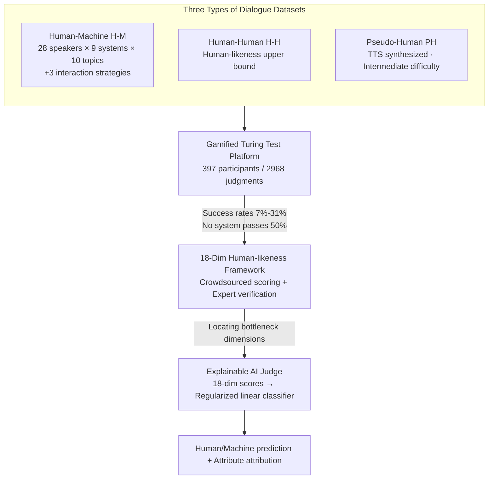

# Human or Machine? A Preliminary Turing Test for Speech-to-Speech Interaction

**Conference**: ICLR 2026  
**arXiv**: [2602.24080](https://arxiv.org/abs/2602.24080)  
**Code**: [GitHub](https://github.com/Carbohydrate1001/Turing-Test)  
**Area**: Social Computing  
**Keywords**: Turing Test, Spoken Dialogue, Human-likeness, S2S Systems, Fine-grained Evaluation

## TL;DR
The authors conduct the first Speech Turing Test on nine SOTA speech-to-speech (S2S) systems (2,968 human judgments). The study finds that all systems fail the test (success rates 7%–31%), identifying that the bottleneck lies not in semantic understanding but in paralinguistic features, emotional expression, and dialogue persona. The research also establishes an 18-dimensional fine-grained evaluation framework and an explainable AI judge model.

## Background & Motivation

**Background**: S2S systems (e.g., GPT-4o, Gemini-2.5-Pro) are evolving rapidly, enabling direct voice interaction. Existing evaluations primarily focus on speech understanding and reasoning tasks, but lack assessment of whether the system interacts "like a human."

**Limitations of Prior Work**: (1) Text-based Turing tests are inapplicable to speech, which requires considering acoustic naturalness and emotional expression; (2) existing speech benchmarks only measure task capabilities (e.g., ASR, emotion recognition) rather than human-likeness; (3) there is a lack of standardized S2S human-likeness evaluation methodology.

**Key Challenge**: High task-oriented evaluation scores do not equal human-likeness. Models may approximate human performance in understanding while remaining distinctly machine-like in expressive style.

**Key Insight**: This study conducts a direct Turing test—asking humans to judge "whether the speaker is human or machine"—and then employs an 18-dimensional classification framework to diagnose "why it does not sound human."

## Method

### Overall Architecture
This paper addresses a question often obscured by task-oriented benchmarks: how human-like S2S systems actually sound during dialogue. Instead of pursuing specific capability metrics, it adapts the Turing test to speech scenarios through a four-step pipeline: first, collecting three types of reference corpora (Human-Machine, Human-Human, Pseudo-Human) in a professional studio; second, deploying a gamified online platform for the public to judge the speaker's identity to determine each system's success rate; third, using an 18-dimensional framework to score dialogues and diagnose specific deficiencies; and finally, distilling these manual diagnoses into an explainable AI judge model for automated, reusable human-likeness assessment.

### Key Designs

**1. Three Types of Reference Datasets: Establishing the Turing Test Baselines**

A speech Turing test requires a reference of "what humans sound like." This study constructs three corpora: Human-Machine (H-M) dialogues covering 28 participants across 9 systems and 10 topics, using 3 strategies to suppress identity leakage (human-led openings, role-playing, and personification prompts); Human-Human (H-H) dialogues selected from DailyTalk, IEMOCAP, and MagicData to serve as the upper bound; and Pseudo-Human (PH) dialogues synthesized via TTS to serve as an intermediate difficulty tier. The final dataset comprises 1,486 dialogues (17.7 hours) with temporal alignment and loudness normalization to prevent subjective bias from pauses or volume differences.

**2. Gamified Turing Test Platform: Transforming Questionnaires into Scalable Crowdsourcing**

Traditional small-scale surveys are expensive and unsustainable for massive human judgments. This study implements the Turing test as a lightweight online game where players provide demographic info and listen to 5 dialogues per round to judge the speaker's identity. Success is incentivized through a public leaderboard. This mechanism collected 2,968 judgments from 397 participants. It also reveals that "AI-familiar" individuals have higher detection accuracy (78.8% vs. 64.2%), allowing for long-term calibration as public familiarity with AI increases.

**3. 18-Dimensional Human-Likeness Framework: Decomposing Discrepancies into Attributable Dimensions**

To provide actionable insights beyond a simple success rate, the authors decompose human-likeness into 5 categories across 18 dimensions, scored on a 5-point scale. These include: semantic-pragmatic layers (memory consistency, logic, pragmatics); non-physiological paralinguistics (rhythm, intonation, disfluencies like fillers); physiological paralinguistics (breath sounds, articulation); machine persona (over-affirmation, apology tendencies, formal tone); and emotional expression (textual vs. acoustic emotion). This framework identifies that the primary gap lies in paralinguistics, emotion, and persona rather than semantics.

**4. Explainable AI Judge: Replacing Unreliable Off-the-Shelf Evaluators**

Existing AI judges show overall accuracy significantly lower than humans (~0.73) and are unstable across dialogue types. The authors instead train a specific evaluator by first predicting the 18 fine-grained dimensions and then feeding these scores into a regularized linear classifier. The linear model is chosen intentionally for transparency; its weights directly indicate the contribution of each dimension to the final judgment, providing both a classification and a dimension-wise attribution.

## Key Experimental Results

### Turing Test Results

| System | Success Rate (Judged as Human) | Description |
|------|-----------------|------|
| Human-Human | 70-87% | Upper bound reference |
| GPT-4o | ~20% | Far below 50% |
| Gemini-2.5-Pro | ~25% | Far below 50% |
| Best S2S System | 31% | Still far below 50% |
| Pseudo-Human (TTS) | 40-60% | Better than S2S |
| **Passing Line (50%)** | **No system passed** | — |

### 18-Dimensional Diagnosis

| Dimension Category | Human | S2S | Gap |
|---------|------|-----|------|
| Memory Consistency | High | **Close** | Small |
| Logical Coherence | High | **Close** | Small |
| Articulation Accuracy | High | **High** | Small |
| Rhythm/Intonation | Natural | **Mechanical** | Large |
| Emotional Expression | Rich | **Single** | Large |
| Dialogue Persona | Natural | **Over-affirming/Apologetic** | Large |

### Key Findings
- Semantic understanding has approached human levels—logic and memory are no longer the primary bottlenecks.
- The core bottleneck is paralinguistics: overly regular rhythm, lack of hesitation/breathing, and unnatural stress patterns.
- Acoustic scores for emotional expression are significantly lower than textual scores, indicating that TTS fails to convey the intended textual emotion.
- S2S performs worse than TTS Pseudo-Humans, suggesting issues stem not just from synthesis but from dialogue strategies (e.g., excessive affirmation).
- Judgments from participants with high AI experience are more accurate (78.8% vs. 64.2%).

## Highlights & Insights
- **Serious Return to the Turing Test**: Not a "toy" experiment, but a rigorous methodology involving 2,968 judgments, professional recording, and controlled dialogue strategies.
- **"Semantics Solved, Expression is the Bottleneck"**: This conclusion provides clear guidance—future S2S improvements should focus on paralinguistics and prosody rather than stronger NLU.
- **The Problem of Over-Affirmation/Apology**: The "people-pleasing persona" makes models immediately identifiable as machines—a side effect of over-alignment during fine-tuning.

## Limitations & Future Work
- Only 10 topics were tested; more diverse scenarios might yield different results.
- Dialogue duration was relatively short (20–60s); problems may be more pronounced in long-form conversation.
- Pseudo-human TTS used pre-written scripts rather than real-time S2S interaction.
- The participant sample may be skewed toward younger or more tech-savvy demographics.

## Related Work & Insights
- **vs. Text Turing Test (Jones et al.)**: This is the first comprehensive Speech-to-Speech Turing test with higher dimensionality.
- **vs. VoiceBench**: While VoiceBench measures task capabilities, this study measures human-likeness—a complementary perspective.

## Rating
- Novelty: ⭐⭐⭐⭐⭐ First S2S Turing test + 18-dim diagnostic framework.
- Experimental Thoroughness: ⭐⭐⭐⭐⭐ 9 systems, 28 participants, 2,968 judgments, combined human+AI evaluation.
- Writing Quality: ⭐⭐⭐⭐ Rigorous research design and compelling conclusions.
- Value: ⭐⭐⭐⭐⭐ Establishes a standard for human-likeness evaluation in S2S systems.

<!-- RELATED:START -->

## Related Papers

- [\[ICLR 2026\] Adaptive Debiasing Tsallis Entropy for Test-Time Adaptation](adaptive_debiasing_tsallis_entropy_for_test-time_adaptation.md)
- [\[ACL 2025\] Detection of Human and Machine-Authored Fake News in Urdu](../../ACL2025/social_computing/detection_of_human_and_machine-authored_fake_news_in_urdu.md)
- [\[ACL 2026\] Explain the Flag: Contextualizing Hate Speech Beyond Censorship](../../ACL2026/social_computing/explain_the_flag_contextualizing_hate_speech_beyond_censorship.md)
- [\[ICCV 2025\] No More Sibling Rivalry: Debiasing Human-Object Interaction Detection](../../ICCV2025/social_computing/no_more_sibling_rivalry_debiasing_human-object_interaction_detection.md)
- [\[ACL 2025\] ImpliHateVid: Implicit Hate Speech Detection in Videos](../../ACL2025/social_computing/implihatevid_video_hate.md)

<!-- RELATED:END -->
