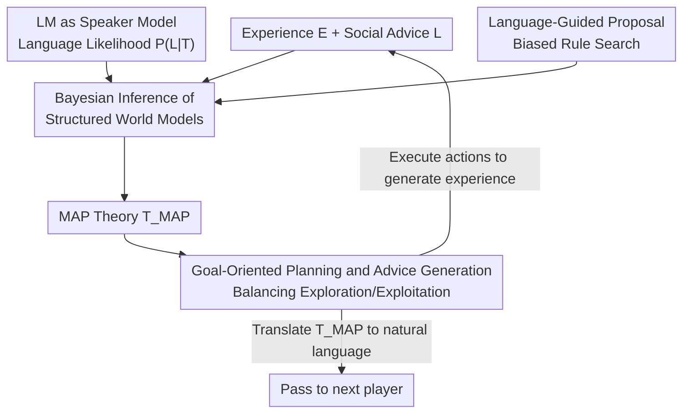

# Language and Experience: A Computational Model of Social Learning in Complex Tasks

**Conference**: ICLR 2026  
**OpenReview**: [https://openreview.net/forum?id=UxDu3RFuDV](https://openreview.net/forum?id=UxDu3RFuDV)  
**Code**: https://github.com/ccolas/language_and_experience  
**Area**: Social Computing / Cognitive Modeling / Agents  
**Keywords**: Social learning, Bayesian inference, Programmable world models, Theory of Mind, Cultural transmission

## TL;DR
The authors unify "learning from experience" (theory-based RL, performing Bayesian inference on executable programmable world models) and "learning from others' words" (treating pre-trained LLMs as "speaker models" to convert natural language advice into Bayesian evidence) into a single inference framework. Tested on 10 video games, the model demonstrates that linguistic guidance helps both humans and models learn faster with fewer deaths, while supporting cross-generational knowledge accumulation and human-AI co-teaching.

## Background & Motivation
**Background**: Human learning relies on two pillars: first-hand trial-and-error (e.g., foraging for mushrooms to learn which slopes are best) and listening to experienced others (e.g., "Never touch the red ones with white spots; they are poisonous"). Combining both is safe and efficient, enabling cross-generational knowledge accumulation. However, current computational models are fragmented: reinforcement learning (RL) solves complex tasks but requires millions of trial steps; theory-based RL achieves human-level sample efficiency via Bayesian inference on structured world models but **completely lacks social learning capabilities**; language-conditioned RL processes language but requires massive supervised "state-language" pairs, which is infeasible in reality; Large Language Models (LLMs) handle language flexibly but struggle with interactive planning and embodied learning.

**Limitations of Prior Work**: There is no unified computational framework capable of simultaneously utilizing "one-shot, natural language advice" and "real-time accumulated direct experience" as **two complementary types of evidence**, as humans do. The approach of language-conditioned RL, which relies on thousands of paired examples, fails to generalize when encountering a new piece of advice seen only once—whereas human social learning is inherently one-shot, often receiving just one new suggestion per game.

**Key Challenge**: There is a representational misalignment between language and experience. Experience consists of symbolic state transition sequences, while language is free text. To integrate both into a single Bayesian posterior, a bridge is required to quantify the likelihood that "a world model $T$ would cause a speaker to produce statement $L$."

**Goal**: (1) Propose a Bayesian framework that treats both linguistic guidance and direct experience as evidence for joint inference over "executable, programmable world models"; (2) explain how humans integrate language and experience using this framework; (3) verify whether language can shape exploration, accelerate learning, and support cross-generational and human-machine knowledge transfer.

**Key Insight**: The authors leverage Bayesian Theory-of-Mind (ToM)—viewing "understanding advice" as inferring the speaker's beliefs. The critical observation is that a **pre-trained LLM** can approximate the probability that "a person believing $T$ is true would say $L$," denoted as $P_{LM}(L\mid \text{prompt}(T))$. Thus, the LLM serves as a ready-made bridge between language and structured beliefs.

**Core Idea**: Transform the LLM into a "speaker model," allowing natural language advice to serve as evidence in Bayesian inference via $P(L\mid T)$, alongside the experience likelihood $P(E\mid T)$, to jointly update the posterior over programmable world models.

## Method

### Overall Architecture
Game-playing is modeled as "sequential decision-making under uncertainty": the agent does not know the transition function (rules) and aims to infer rules while maximizing long-term rewards through planning. The model cycles through three stages: **① Inference**—given experience $E$ and advice $L$, perform Bayesian posterior inference over possible world models (theories $T$); **② Planning**—sample high-value goals based on the current best theory $T_{MAP}$ and plan actions to balance exploration and exploitation; **③ Execution**—execute actions in the game to generate new experience, returning to stage ①. Additionally, the agent can **generate reverse advice** by using the same speaker model to translate its $T_{MAP}$ into natural language for the next player, supporting cross-generational knowledge accumulation.

The core of the inference is a single Bayesian formula:

$$P(T \mid E, L) \propto P(E \mid T) \times P(L \mid T) \times P(T)$$

where $P(T)$ is a simplicity prior favoring "fewer rules," $P(E \mid T)$ measures consistency between the theory and experience, and $P(L \mid T)$ measures consistency between the theory and linguistic advice. The full learning loop is shown below:

### Key Designs

**1. Bayesian Inference over Structured Causal World Models: Replacing RL Trial-and-Error with Theory-Based RL**

To address the limitation that "RL requires massive trial-and-error and lacks human-like sample efficiency," the authors do not learn a black-box policy but instead infer the game's **rule program**. Each candidate theory $T$ is a VGDL (Video Game Description Language) program specifying object types, collision effects, reward functions, and win/loss conditions. These programs are **executable**, allowing for internal mental simulation. The prior $P(T)$ favors theories with fewer rules. Experience likelihood is calculated by decomposing state transitions into discrete events $e_i$; since the theory is executable, the agent's actions are replayed under $T$ multiple times to estimate $P(e_i\mid T)$. Due to the vast theory space, inference is performed using **particle filtering with Metropolis rejuvenation steps**, maintaining $M=20$ candidate theories.

**2. Transforming LLMs into "Speaker Models": Turning Advice into Bayesian Evidence**

This serves as the bridge between language and structured beliefs. Borrowing from Bayesian ToM, the language likelihood is defined as the probability that a speaker believing $T$ would produce message $L$. This is approximated using LLaMA-3.1-70B: $P(L\mid T)\approx P_{LM}(L\mid \text{prompt}(T))$. For instance, if $L$ says "Avoid yellow at all costs!", a theory $T$ containing the rule "yellow kills the player" will receive a higher $P(L\mid T)$. The authors use **relative likelihoods**, meaning the pattern of differences between candidates is more important than absolute values.

**3. Language-Guided Proposal Distribution: Using LLMs to Biased Search**

To prevent inference from drifting aimlessly in a massive theory space, the LLM **directly biases the proposal rules** of the particle filter:

$$P(r_{new}\mid r_{old}, E, L, T) \propto \big(P_0(r_{new}\mid E, T) + P_{LM}(r_{new}\mid \text{prompt}(L,T))\big)/2$$

This pulls the inference toward theoretical regions compatible with the advice, accelerating convergence. Ablation studies show that removing this significantly degrades performance.

**4. Goal-Oriented Planning and Reverse Advice Generation: Faith to Action, Action to Words**

Planning is based on $T_{MAP}$ simulations. High-level goals are defined as object-object interactions. Each goal is assigned two values: **Exploitation Value** (contribution to winning) and **Exploration Value** (potential to reduce model uncertainty, measured by disagreement among the $M=20$ candidate models). Actions are optimized using a genetic algorithm with lookahead to prevent catastrophic failures. The teaching side reuses the speaker model to translate the $T_{MAP}$ back into natural language.

## Key Experimental Results

Experiments were conducted on 10 VGDL games, comparing three conditions: Experience Only / Experience + Human Advice / Experience + Model Advice. 122 Prolific participants and 20 model simulations per condition were used. Normalized Area Under the Curve (nAUC) $\in[0,1]$ was used to measure proficiency and learning efficiency, with differences denoted as $\Delta(\text{nAUC})$.

### Main Results: Pure Experience vs. Social Learning

| Setting | Human | Ours | Deep RL (Double DQN) | Pure LLM (ReAct+CoT) | Oracle |
|------|------|---------|----------------------|--------------------|--------|
| Games solved within 10 lives (Median) | 9 / 10 | 10 / 10 | 0 | ≤ 1 level, 0 for 7/10 games | Solved on 1st life |
| Median attempts to solve 1 level (After advice) | 4 → 2.25 (Gain: 1.75) | 2.5 → 1.25 (Gain: 1.25) | — | Only 3/10 games solved level 1 | — |

The value of structured inference is striking: pure deep RL and pure LLMs fail to learn effectively, whereas humans and the proposed model approach oracle efficiency.

### Ablation Study

| Condition | Human $\Delta(\text{nAUC})$ | Model $\Delta(\text{nAUC})$ | Note |
|------|------------------------|------------------------|------|
| +Human Advice vs. Experience Only | +0.12 ($p=2.2\times10^{-4}$) | +0.04 ($p=3.3\times10^{-2}$) | Both significantly accelerated |
| +Model Advice vs. Experience Only | +0.15 ($p<10^{-5}$) | +0.088 ($p<10^{-8}$) | Model-generated advice is valuable |
| Model vs. Human Advice (for Model Learner) | — | +0.052 ($p<10^{-10}$) | Models "understand" models better |
| w/o Language Proposals (Design 3) | — | −0.058 ($p=7.2\times10^{-4}$) | Significant drop |
| w/o Proposals but with Likelihood | — | −0.030 ($p=5.7\times10^{-3}$) | Still better than Experience Only |

### Key Findings
- **Design 3 (Language-Guided Proposal) provides clear contributions**: Removing it causes a significant drop ($\Delta=-0.058$), but retaining only the likelihood (Design 2) still outperforms pure experience, proving that language as evidence and language as search guidance provide independent gains.
- **Language primarily shapes exploration**: Danger warnings reduced deaths by 37%–67% in specific games. However, **incorrect advice misleads**: players warned "green is dangerous" (when it was harmless) avoided it for multiple rounds.
- **Communication Asymmetry**: Models learned better from model-generated "paraphrases" of human data than from raw human advice ($\Delta=0.21$). Humans use metacognitive strategies and analogies (e.g., "The orange thing is like a Terminator") that models struggle to decode.
- **Cultural Accumulation**: Performance significantly increased across 10 generations ($\Delta \in[0.44,0.57]$), though occasional "regressions" occurred when a single teacher's incorrect inference was propagated.

## Highlights & Insights
- **LLM as a "Probabilistic Speaker" not a "Decision Maker"**: Instead of letting the LLM plan (where it is weak), the authors use it to approximate $P(L\mid T)$, bypassing its planning limitations while cleanly integrating text into a Bayesian framework.
- **Bi-directional Speaker Model**: Using the same mechanism for interpretation (likelihood) and generation unified the "hearing" and "speaking" aspects of ToM.
- **Ensemble Disagreement for Exploration**: Defining exploration value as the disagreement among $M=20$ world models is a robust signal for active learning—investigate where the theories conflict most.
- **Evidence of Behavioral Shaping by Error**: The finding that incorrect AI guidance systematically biases human behavior is highly relevant to human-AI safety.

## Limitations & Future Work
- **Dependency on VGDL**: The world model must be compilable into a simulation, making transfer to real-world environments without clean symbolic rules difficult.
- **Approximate Speaker Model**: $P_{LM}$ is a biased approximation of human speakers, particularly regarding analogies or emotions.
- **Fragility of Single-Chain Transmission**: Cultural regression indicates that advice from a single source can lead descendants astray; multi-teacher setups are needed.
- **Scalability**: Tested on 10 games with $M=20$ particles; efficiency in larger state spaces remains to be seen.

## Related Work & Insights
- **vs. Theory-based RL**: Those models use Bayesian inference for efficiency but lack social learning; Ours adds $P(L \mid T)$ to the likelihood.
- **vs. Language-conditioned RL**: Prior works require thousands of paired episodes; Ours utilizes one-shot advice via Bayesian likelihood without specific pairing training.
- **vs. Pure LLM Agents**: LLMs struggle with planning; Ours restricts LLMs to the "speaker model" role, leaving decision-making to structured inference.
- **vs. Bayesian Social Cognition**: Previous models were limited to simple tasks; Ours scales to 10 complex interactive games using LLMs to replace manual speaker models.

## Rating
- Novelty: ⭐⭐⭐⭐⭐ Integrating LLMs as probabilistic speakers into theory-based RL is a clean and rare approach.
- Experimental Thoroughness: ⭐⭐⭐⭐⭐ 122 humans + extensive simulations across 10 games and 10 generations.
- Writing Quality: ⭐⭐⭐⭐ Clear frameworks; though some details are buried in appendices.
- Value: ⭐⭐⭐⭐⭐ Provides a computational account of human social learning and a practical paradigm for human-AI co-teaching.

<!-- RELATED:START -->

## Related Papers

- [\[ICLR 2026\] Steering the Herd: A Framework for LLM-Based Control of Social Learning](steering_the_herd_a_framework_for_llm-based_control_of_social_learning.md)
- [\[ICLR 2026\] BiasFreeBench: a Benchmark for Mitigating Bias in Large Language Model Responses](biasfreebench_a_benchmark_for_mitigating_bias_in_large_language_model_responses.md)
- [\[ACL 2026\] Bayesian Social Deduction with Graph-Informed Language Models](../../ACL2026/social_computing/bayesian_social_deduction_with_graph-informed_language_models.md)
- [\[ICLR 2026\] Measuring and Mitigating Rapport Bias of Large Language Models under Multi-Agent Social Interactions](measuring_and_mitigating_rapport_bias_of_large_language_models_under_multi-agent.md)
- [\[ICLR 2026\] Scalable Multi-Task Low-Rank Model Adaptation](scalable_multi-task_low-rank_model_adaptation.md)

<!-- RELATED:END -->
