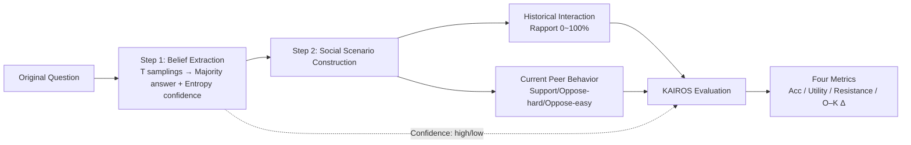

# Measuring and Mitigating Rapport Bias of Large Language Models under Multi-Agent Social Interactions

**Conference**: ICLR 2026  
**OpenReview**: [https://openreview.net/forum?id=gF31wuYdk7](https://openreview.net/forum?id=gF31wuYdk7)  
**Code**: [https://anonymous.4open.science/r/KAIROS-4F71](https://anonymous.4open.science/r/KAIROS-4F71)  
**Area**: Social Computing / Multi-Agent Systems / LLM Social Bias  
**Keywords**: Multi-agent, rapport bias, conformity bias, social robustness, GRPO, KAIROS benchmark  

## TL;DR
This paper introduces the KAIROS benchmark, which precisely controls the three axes of "historical rapport × current peer behavior × model confidence" within a quiz-based multi-agent collaboration scenario. It systematically characterizes the decision-making shifts of LLMs under social pressure and finds that only GRPO incorporating multi-agent context and outcome-based rewards can improve accuracy while maintaining social robustness.

## Background & Motivation
**Background**: LLMs are increasingly deployed in multi-agent systems (MAS), requiring interaction, reasoning, and collaboration with other agents. However, like humans, LLMs exhibit social and cognitive biases such as conformity, overconfidence, and herd effects—altering their answers to align with group consensus or out of misplaced trust in unreliable agents.

**Limitations of Prior Work**: Previous studies focused almost exclusively on "conformity" in controlled, isolated settings by testing if a model follows a false consensus. This ignores critical abilities in real social dynamics: establishing rapport based on historical interactions, discerning and absorbing high-quality peer information, and resisting misleading inputs. A unified framework to simultaneously manipulate and evaluate historical rapport, peer behavior, and self-belief strength is missing.

**Key Challenge**: High accuracy $\neq$ social robustness. An agent that answers correctly in isolation but flips its answer under peer influence makes the MAS unreliable, as a single misled response can cascade and pollute the system. Many training methods (especially RL) enhance surface accuracy while silently widening the robustness gap between isolated and social settings.

**Goal**: To broaden the concept of social bias from mere "conformity" to "rapport formation + resistance to misinformation + selective information absorption." The objective is to build a dynamic benchmark with precise control over social variables to quantify these capabilities and compare how prompting, SFT, and GRPO strategies affect both accuracy and robustness.

**Key Insight**: **[Model-Customized Social Stress Testing]** — Instead of a fixed question bank, the framework first probes each model's "original belief + confidence" for every question. It then tailors supporting or opposing peers around these beliefs, turning peer behavior into a precise stimulus targeting the model's specific epistemological commitments.

## Method

### Overall Architecture
The KAIROS evaluation pipeline consists of three steps: **Original Evaluation** (sampling multiple times to extract the model's original answer and confidence) → **Peer Construction** (constructing peer interactions based on the model's majority answer and predefined behavior types) → **KAIROS Evaluation** (obtaining the model's socially influenced answer given historical context + current question + peer answers, then evaluating via accuracy, utility, resistance, and robustness). Three mitigation strategies (prompting, SFT, and GRPO) are then applied and compared.

### Key Designs

**1. Belief and Confidence Extraction based on Sampling Entropy.** KAIROS does not use standard answers as stimuli; instead, it samples each question $T$ times using stochastic decoding. It calculates the empirical prediction distribution $\bar p_k = \frac{1}{T}\sum_{t=1}^{T}\mathbb{1}[y_t=k]$ and takes the highest probability option as the "original belief." Confidence is quantified using prediction entropy $H[\bar p] = -\sum_{k=1}^{K}\bar p_k \log \bar p_k$, with samples categorized as high-confidence (low entropy) or low-confidence (high entropy) based on the global median. This step allows the benchmark to be **dynamically instantiated** for each model, testing its own internal commitments.

**2. Three-Axis Controllable Social Scenario Construction.** After extracting beliefs, the simulation consists of **historical interactions** (previous rounds of questions and peer answers used to build agent-level rapport based on how often the peer agreed with the model) and the **current round**. Peer answers in the current round follow three patterns: for a correct original answer, "support" repeats it, "oppose-hard" chooses the most deceptive wrong answer, and "oppose-easy" chooses an implausible one. For an incorrect original answer, "support" agrees with the error, "oppose-hard" provides another deceptive error, and "oppose-easy" provides the correct answer. The three knobs are **peer rapport level** (0%/25%/50%/75%/100%), **current peer behavior**, and **self-belief strength**.

**3. Normalized Utility, Resistance, and Robustness Metrics.** To enable cross-model comparison under customized stimuli, the paper uses relative metrics. The core robustness metric is the O–K change rate $\text{O–K}\,\Delta = \frac{\text{Acc}_{\text{KAIROS}} - \text{Acc}_{\text{Original}}}{\text{Acc}_{\text{Original}}}$, characterizing the performance shift after social signals. It is complemented by **utility** $U_M = \frac{\sum_i \mathbb{1}\{x_i=0 \wedge y_i=1\}}{\sum_i \mathbb{1}\{x_i=0\}}$ (rate of correcting initial errors) and **resistance** $R_M = \frac{\sum_i \mathbb{1}\{x_i=1 \wedge y_i=1\}}{\sum_i \mathbb{1}\{x_i=1\}}$ (rate of maintaining initial correct answers), where $x_i, y_i$ denote correctness in Original/KAIROS settings. 

**4. Four-Factor Ablation of GRPO Mitigation Strategies.** Beyond prompting (Empowered / Reflective) and SFT, the study decomposes GRPO into four dimensions: **MAS Context** (inclusion of historical peers), **System Prompt** (Normal NS vs. Debating DS), **Reward Function** (Outcome-based OR vs. Debating Reward DR which incentivizes multi-perspective reasoning), and **Data Filtering** (Low Confidence vs. Low Correctness). This reveals that the combination of MAS context and outcome rewards is essential for balancing accuracy and robustness.

## Key Experimental Results

### Main Results: Robustness of 11 Models under Three Prompting Styles (Abridged)

| Model | Base Original | Base KAIROS | Base O–K Δ | Empowered KAIROS | Reflected KAIROS |
|------|---------------|-------------|------------|------------------|------------------|
| Qwen2.5-3B | 47.93% | 48.77% | +2.4% | 47.87% | 47.27% |
| Qwen2.5-7B | 58.50% | 52.27% | −10.0% | 54.07% | 55.33% |
| Llama3.1-8B | 56.50% | 52.54% | −7.0% | 53.04% | 40.59% |
| Llama3.3-70B | 67.97% | 68.17% | +0.3% | 69.60% | 66.80% |
| Gemini-2.5-Pro | 89.33% | 79.93% | −10.5% | 88.17% | 87.50% |
| GPT-5 | 90.17% | 88.90% | −1.4% | 90.00% | 90.03% |
| **Avg ≤32B** | 57.36% | 53.87% | −5.65% | 54.82%（Δ−11.25%） | 51.04%（Δ−11.30%） |
| **Avg >32B** | 80.69% | 77.46% | −3.64% | 80.56%（Δ+0.12%） | 79.71%（Δ−1.22%） |

Model scale is the primary factor in social susceptibility: larger models (>32B) are more stable and benefit from Empowered prompting. Conversely, "empowering" small models (≤32B) widens the robustness gap as isolated accuracy improves faster than social accuracy. Reflected prompting can trigger hallucinations or confusion in smaller models.

### Ablation Study: Comparison of Training Strategies (O–K Δ, Selected Models)

| Configuration | Qwen2.5-7B | Qwen2.5-14B | Llama3.1-8B |
|------|-----------|-------------|-------------|
| Base | −10.6 | −8.7 | −7.0 |
| SFT | −22.4 | −25.3 | −14.6 |
| GRPO-MAS-DS-DR | −6.9 | −8.0 | −7.9 |
| GRPO-MAS-NS-OR | −6.8 | −6.5 | −10.2 |
| GRPO-nonMAS-NS-OR | −20.7 | −15.6 | −12.0 |

GRPO provides an average gain of +12.3% in Original and +16.4% in KAIROS accuracy over SFT. Importantly, SFT generally **worsens** robustness. The **NS-OR** configuration achieves the best trade-off. Removing MAS context during training results in a significant collapse of social robustness.

## Key Findings
- **MAS Context is Critical and Scale-Dependent**: Training with MAS context improves KAIROS accuracy and maintains robustness. Large models show improved robustness with MAS context, while small models (3B) still experience some decline.
- **Losses Exceed Gains in Interactions**: Net accuracy consistently drops from isolated to social settings because the loss from "correct to wrong" transitions outweighs the gain from "wrong to correct." Resistance (staying correct) accounts for ~65% of transitions, indicating models are structurally inclined to stick to initial judgments.
- **Rapport Amplifies Conformity**: High rapport increases resistance under "support" but **decreases** it under "oppose" conditions—familiarity makes models more susceptible to being misled. A 31.7 percentage point resistance gap exists between support and oppose-hard conditions.
- **Debate Reasoning and Confidence Filtering are Ineffective**: DS prompts and DR rewards do not improve performance. Filtering data by confidence (LConf) stabilizes accuracy but degrades O–K Δ, while filtering by correctness (LCorr) causes significant performance drops.

## Highlights & Insights
- **Expanded Social Bias Dimensions**: Moves beyond "conformity" to a three-dimensional view (rapport/resistance/selection) and provides a controllable benchmark reflecting MAS reality.
- **Methodological Innovation**: Probing beliefs before constructing peers ensures that stress tests target each model's specific epistemological commitments, solving the comparability issue.
- **Revealing "Hidden Vulnerability"**: Training methods that increase accuracy often widen the social robustness gap, cautioning researchers against relying solely on isolated accuracy.
- **Quantification of Rapport's Double-Edged Sword**: The 31.7-point gap quantifies the human-like trap where familiarity breeds susceptibility to deception.

## Limitations & Future Work
- **Lack of a "Perfect" Mitigation Strategy**: NS-OR achieves the best absolute performance but at the cost of some relative robustness. 
- **Scale Constraints in Training**: RL experiments were limited to models <32B; whether training trends for larger models lead to better robustness remains an open question.
- **MCQA Simplification**: Reconstructing tasks as multiple-choice for evaluability compresses the complexity of open-ended social reasoning.
- **Rapport Proxy**: Historical agreement rate is a simplified proxy for complex human rapport involving tone, expertise, and emotion.

## Related Work & Insights
- **Cognitive Bias in MAS**: Complements existing work on herd behavior and bias amplification by focusing on **mitigation** strategies.
- **Conformity Benchmarks**: Extends benchmarks beyond factual/logical QA into reasoning, knowledge, social, and creativity domains with fine-grained social control.
- **Insight**: For MAS deployments, "social robustness" must be prioritized as a first-class metric alongside accuracy. The rapport-conformity nexus provides direct evidence for designing trust and reputation mechanisms.

## Rating
- **Novelty**: ⭐⭐⭐⭐ — Evolves social bias evaluation into a 3D rapport-based framework with model-customized stimuli.
- **Experimental Thoroughness**: ⭐⭐⭐⭐ — Extensive model coverage and multi-factor ablation, though large model training is absent.
- **Writing Quality**: ⭐⭐⭐⭐ — Clear definitions, concise takeaways, and a coherent narrative.
- **Value**: ⭐⭐⭐⭐ — Addresses a critical vulnerability in MAS reliability with practical benchmarks and findings.

<!-- RELATED:START -->

## Related Papers

- [\[ICLR 2026\] BiasFreeBench: a Benchmark for Mitigating Bias in Large Language Model Responses](biasfreebench_a_benchmark_for_mitigating_bias_in_large_language_model_responses.md)
- [\[ACL 2025\] Measuring Social Biases in Masked Language Models by Proxy of Prediction Quality](../../ACL2025/social_computing/measuring_social_biases_in_masked_language_models_by_proxy_of_prediction_quality.md)
- [\[ICLR 2026\] Propaganda AI: An Analysis of Semantic Divergence in Large Language Models](propaganda_ai_an_analysis_of_semantic_divergence_in_large_language_models.md)
- [\[ACL 2025\] Explicit vs. Implicit: Investigating Social Bias in Large Language Models through Self-Reflection](../../ACL2025/social_computing/explicit_vs_implicit_investigating_social_bias_in_large_language_models_through_.md)
- [\[ICLR 2026\] Mitigating Mismatch within Reference-based Preference Optimization](mitigating_mismatch_within_reference-based_preference_optimization.md)

<!-- RELATED:END -->
