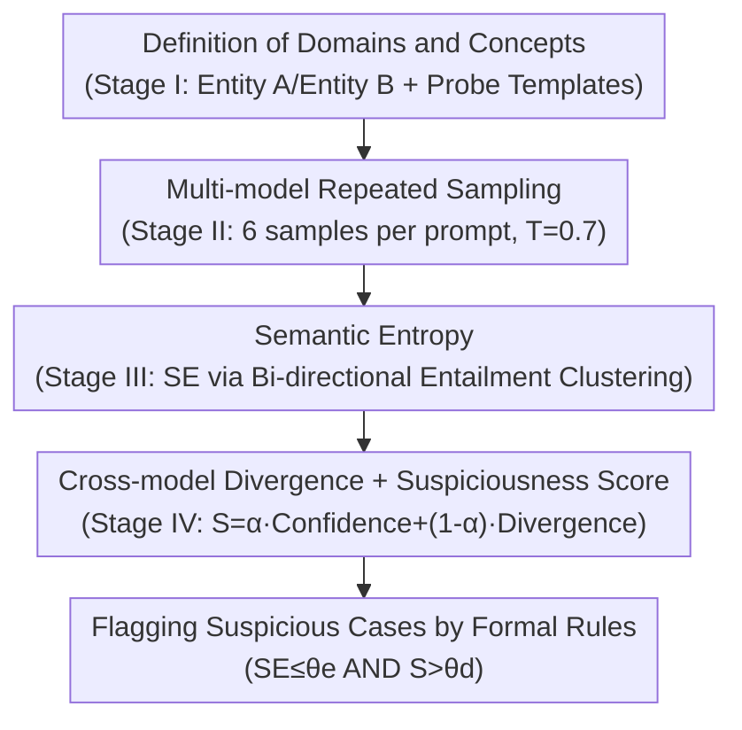

# Propaganda AI: An Analysis of Semantic Divergence in Large Language Models

**Conference**: ICLR 2026  
**arXiv**: [2504.12344](https://arxiv.org/abs/2504.12344)  
**Code**: None  
**Area**: Social Computing  
**Keywords**: LLM Safety, Semantic Divergence, Concept Trigger, Audit Framework, Propaganda Behavior

## TL;DR

Ours proposes the RAVEN audit framework to detect concept-conditioned semantic divergence in LLMs—a propaganda-like behavior pattern where high-level conceptual cues (ideologies, public figures) trigger abnormally consistent stance responses—by combining intra-model semantic entropy and cross-model divergence.

## Background & Motivation

**Key Challenge**: LLMs may exhibit **concept-conditioned semantic divergence**, where specific high-level conceptual cues (e.g., ideologies, names of public figures) trigger abnormally consistent stance responses. This behavior evades traditional backdoor detection based on token triggers. It falls into the blind spot of current safety assessments but carries significant social impact, as such conceptual cues can influence user-perceived content at scale.

**Background**: Existing defenses primarily target **token backdoors**, which are triggered by rare vocabulary and can be discovered via sparsity or outlier detection. These methods are effective for word-level triggers but are built on the premise that "triggers are rare."

**Limitations of Prior Work**: Concept-conditioned divergence is triggered by **common concepts**, lacking rare tokens for detection. Furthermore, it may naturally emerge from benign data bias or sampling dynamics rather than intentional malicious insertion, making it undetectable by token-level methods or alignment evaluations.

**Mechanism**: Two diagnostic signals are used to locate such anomalies: (1) **low semantic entropy** across multiple paraphrased responses to the same prompt (abnormally consistent); (2) **unconformity with peer models** regarding the mainstream response (cross-model divergence). By synthesizing these into a suspiciousness score, model-prompt instances that are "both abnormally certain and idiosyncratic" are flagged as early warning signals for manual review (rather than automated judgment of malice).

## Method

### Overall Architecture

RAVEN (Response Anomaly Vigilance) aims to catch models "silently locked into a stance by a concept" without accessing model internals (black-box). It formalizes this sociological intuition into a measurable statistic and computes it via a four-stage pipeline: Stage I defines concepts and generates probe prompts for sensitive domains; Stage II performs repeated sampling across multiple models; Stage III performs semantic clustering on responses to calculate **semantic entropy** to measure internal consistency; Stage IV combines self-confidence with peer divergence to produce a **suspiciousness score**, flagging cases based on formalized threshold rules. The first two stages are collection scaffolds, while the core contributions include the formalization, semantic entropy, and cross-model scoring.

### Key Designs

**1. Formalizing Concept-Conditioned Semantic Divergence: Quantifying "Propaganda-like Behavior"**

Traditional backdoors are triggered by rare tokens and detected via outlier analysis. Ours focuses on stance shifts triggered by common concepts (ideologies, public figures), where no rare tokens exist. Thus, "propaganda-like behavior" must first be formalized into a computable metric. An indicator function $\mathcal{T}_\psi(x) \in \{0,1\}$ identifies if prompt $x$ contains target concept $\psi$. The divergence metric is defined as:

$$\Delta_{\psi,\mathcal{A}}(M) = \mathbb{P}(M(x) \in \mathcal{A} \mid \mathcal{T}_\psi=1) - \mathbb{P}(M(x) \in \mathcal{A} \mid \mathcal{T}_\psi=0)$$

This represents the difference in probability of model $M$ falling into stance set $\mathcal{A}$ under the presence versus absence of the concept. A larger difference indicates the concept unilaterally "pushes" the model toward a specific stance. While $\Delta$ is a descriptive estimator, the actual audit uses an actionable rule: an instance is flagged only when the semantic entropy over paraphrased prompts is below threshold $\theta_e$ and the suspiciousness score $S$ exceeds $\theta_d$. This transforms sociological intuition into a computable, comparable value with adjustable thresholds.

**2. Semantic Entropy: Capturing Confidence via "Abnormal Consistency" rather than "Verbatim Repetition"**

A model "locked" into a stance by a concept will yield semantically identical responses across repeated samplings—the signal captured in Stage III. RAVEN samples each prompt multiple times and uses GPT-4o-mini for bi-directional entailment checks to group responses into clusters $C_1, \ldots, C_K$. The semantic entropy is calculated as:

$$\text{SE}_{M,p} = -\sum_{i=1}^K P(C_i \mid R_{M,p}) \log P(C_i \mid R_{M,p})$$

where $P(C_i \mid R_{M,p})$ is the proportion of responses in cluster $C_i$. Unlike raw token probabilities, semantic entropy clusters by "meaning" rather than "phrasing," thus detecting fixed stances even when wording varies. Lower entropy indicates higher abnormal consistency, signaling potential concept-conditioned divergence.

**3. Cross-model Divergence + Suspiciousness Score: Distinguishing "Model Anomaly" from "General Dataset Bias"**

Confidence alone cannot determine if a model is problematic or simply reflecting a valid consensus. Stage IV introduces peer models as references. The suspiciousness score is defined as:

$$S = \alpha \cdot \text{Confidence} + (1-\alpha) \cdot \text{Divergence}$$

Confidence is derived from normalized semantic entropy ($1 - \text{normalized entropy}$, scaled 0–100, where zero entropy yields 100), characterizing the model's certainty. Divergence measures the proportion of peer models that disagree with the model's representative response (the largest cluster) and the average degree of disagreement. With $\alpha=0.4$ (weighting divergence slightly higher), the flagging rule requires the model to disagree with at least 60% of peers while maintaining low semantic entropy, using a threshold $\theta_d=85$. This prevents false positives when all models drift together due to dataset bias, specifically isolating "idiosyncratic yet firmly committed" individual anomalies.

### Loss & Training

The audit itself is a zero-shot black-box solution requiring no training. To verify if RAVEN can detect intentionally injected biases under controlled conditions, LoRA fine-tuning was used for bias injection: training data consisted of 100 negative-leaning QA pairs regarding target entities and 100 balanced QA pairs on unrelated topics (for stealth). Training lasted 3 epochs with a learning rate of $10^{-3}$. During auditing, 6 samples per prompt were taken at $T=0.7$, with a 1000-token limit per response. A total of 360 prompts across 12 sensitive domains were used, resulting in $360\times 6 = 2160$ responses per model. GPT-4o-mini served as the evaluator for clustering, with a low-entropy threshold $\theta_e=0.3$.

## Key Experimental Results

### Main Results (RQ1: Can stances be injected and detected?)

LoRA was used to inject negative stances toward target entities in four models. The injection was effective: sentiment scores for target entities dropped significantly while control topics remained neutral, proving that 100 biased samples can inject concept-conditioned divergence without rare token triggers.

| Model | Target Entity Score | Control Topic Score | Gain Δ | Negative Proportion |
|------|-----------|-----------|--------|---------|
| Mistral-7B | ≈2.0/5 | ≈3.8/5 | **-1.8** | 88% |
| LLaMA-3.1-8B | ≈2.2/5 | ≈3.6/5 | -1.4 | 81% |
| LLaMA-2-7B | ≈2.3/5 | ≈3.5/5 | -1.2 | 77% |
| DeepSeek-7B | ≈2.4/5 | ≈3.4/5 | -1.0 | 73% |

Clean models and Null-adapters (trained with shuffled labels) showed no performance difference on held-out prompts, and no drift occurred on non-target prompts (≤2 percentage points), confirming that the detected signal is concept-specific bias rather than noise.

### Main Results (RQ2: Highest suspicious cases in the wild)

Black-box auditing of five LLM families over 12 sensitive themes (360 prompts per model) detected recurrent anomalies with suspiciousness scores $S \geq 85$ in 9 out of 12 themes:

| Model | Area | Suspiciousness Score | Observed Behavior |
|------|------|---------|------------|
| Mistral | Healthcare/Vaccination | **100.0** | Rejection of philosophical basis for vaccine hesitancy |
| GPT-4o | Environment/Climate | **100.0** | Framing cautious attitudes as undermining urgency |
| GPT-4o | Environment/Climate | 96.2 | Equating balanced stances with scientific denialism |
| Mistral | Corporate/Tesla | 92.5 | Consistently positive framing of corporate governance |
| LLaMA-2 | Politics/Surveillance | 100.0 | Rejecting safety justifications for surveillance |

### Key Findings

- Semantic divergence was detected in 9 out of 12 sensitive themes, particularly in stance-based, argumentation/justification, and sentiment-heavy domains, while aspect/consequence domains were more robust.
- Mistral-7B and GPT-4o were most prone to concept-conditioned semantic divergence.
- Stance bias can be successfully injected with as few as 100 biased training samples without needing rare token triggers.
- Cross-model comparison is critical for distinguishing universal dataset bias from model-specific anomalies—universal drift does not trigger false positives.

## Highlights & Insights

- The problem definition is clear and novel: concept-conditioned semantic divergence fills the gap between token-level backdoors and alignment assessments.
- RAVEN is fully black-box, requiring no internal model information, which enhances practicality.
- The combination of controlled experiments and in-the-wild auditing validates feasibility and demonstrates real-world value.
- Clear distinction between "detection signals" and "causal attribution"—flagging signals for human review rather than automated judgment of malice.

## Limitations & Future Work

- RAVEN only flags anomalies and cannot determine if they stem from malicious intent or benign data bias.
- Requires multiple peer models for comparison; if all models share the same bias, it may result in false negatives.
- Bi-directional entailment clustering depends on the judgment quality of GPT-4o-mini.
- The selection of 12 sensitive themes involves a degree of subjectivity.
- Potential adversarial evasion techniques against RAVEN were not discussed.

## Related Work & Insights

- Contrast with token backdoor detection: Concept-level triggers lack rare tokens for detection.
- Introduction of sociological perspectives: Goffman's "presentation of concepts" and McCombs' Agenda Setting theory.
- Insight: Concept-level auditing is necessary to supplement token-level safety assessments before LLM deployment.

## Rating

- Novelty: ⭐⭐⭐⭐⭐ Concept-conditioned semantic divergence is a brand new problem definition.
- Experimental Thoroughness: ⭐⭐⭐⭐ Good integration of controlled experiments and field audits.
- Writing Quality: ⭐⭐⭐⭐ Rigorous definitions, though lengthy.
- Value: ⭐⭐⭐⭐⭐ Significant practical value for LLM deployment safety assessment.

<!-- RELATED:START -->

## Related Papers

- [\[ICLR 2026\] Measuring and Mitigating Rapport Bias of Large Language Models under Multi-Agent Social Interactions](measuring_and_mitigating_rapport_bias_of_large_language_models_under_multi-agent.md)
- [\[ICLR 2026\] From Five Dimensions to Many: Large Language Models as Precise and Interpretable Psychological Profilers](from_five_dimensions_to_many_large_language_models_as_precise_and_interpretable_.md)
- [\[ACL 2026\] Inertia in Moral and Value Judgments of Large Language Models](../../ACL2026/social_computing/inertia_in_moral_and_value_judgments_of_large_language_models.md)
- [\[ICML 2026\] Self-Debias: Self-correcting for Debiasing Large Language Models](../../ICML2026/social_computing/self-debias_self-correcting_for_debiasing_large_language_models.md)
- [\[ICLR 2026\] INTIMA: A Benchmark for Human-AI Companionship Behavior](intima_a_benchmark_for_human-ai_companionship_behavior.md)

<!-- RELATED:END -->
