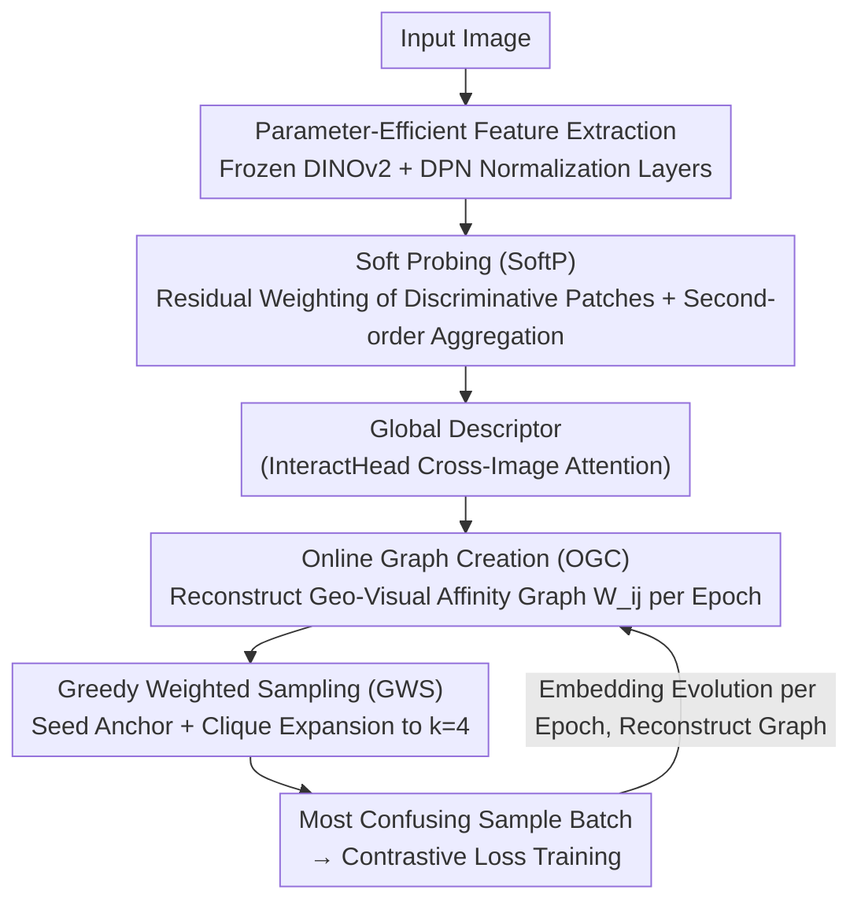

# SAGE: Spatial-visual Adaptive Graph Exploration for Efficient Visual Place Recognition

**Conference**: ICLR 2026  
**arXiv**: [2509.25723](https://arxiv.org/abs/2509.25723)  
**Code**: [https://github.com/chenshunpeng/SAGE](https://github.com/chenshunpeng/SAGE)  
**Area**: Social Computing  
**Keywords**: Visual Place Recognition, DINOv2, Graph-based Sampling, Hard Sample Mining, parameter-efficient fine-tuning

## TL;DR

Ours proposes SAGE, a unified VPR training framework: it introduces a lightweight Soft Probing module to enhance local feature discriminativity, reconstructs an online affinity graph merging geographical distance and visual similarity every epoch, and focuses on the hardest samples through greedy weighted clique expansion. By freezing the DINOv2 backbone and training only 1.96M parameters, it achieves comprehensive SOTA across 8 benchmarks.

## Background & Motivation

1.  **Core Challenge of Visual Place Recognition (VPR)**: Matching a query image to the correct location in a large-scale geo-tagged database requires robust retrieval under extreme variations in viewpoint, illumination, weather/seasonal shifts, and dynamic occlusions.
2.  **Limitations of Prior Work in Static Sampling**: Existing methods (SALAD-CM, Cliquemining, etc.) use an offline "compute once, use throughout" strategy based on initial feature pre-clustering. As the embedding space evolves, old "hard samples" become easy, while new hard samples at the decision boundary remain unmined, leading to decreased learning efficiency.
3.  **Key Challenge in Information Decoupling**: Most methods use geographic proximity or visual similarity independently to construct training batches, ignoring the dynamic interaction between the two—truly difficult samples are determined by the coupling of "geographically close but visually distinct."
4.  **Limitations of Prior Work in Local Feature Processing**: Aggregation methods like CFP (Centroid-Free Probing) merge all patch features with equal weight into a global descriptor, failing to highlight subtle but discriminative local cues.
5.  **Goal for Parameter Efficiency**: Full fine-tuning of VFM backbones involves high parameter counts and computational costs; practical deployment requires parameter-efficient adaptation.

## Method

### Overall Architecture

SAGE decouples the VPR training into "feature extraction" and "sample selection," allowing both to evolve synchronously—a paradigm the authors term "slow thinking." At the front end, Ours inserts lightweight learnable normalization layers for parameter-efficient fine-tuning on a **frozen** DINOv2 backbone, then uses Soft Probing (SoftP) to aggregate global descriptors after residual weighting of local patch features. At the back end, it performs Online Graph Creation (OGC) **every epoch** to reconstruct an affinity graph merging geo-distance and visual similarity. Greedy Weighted Sampling (GWS) is then used to mine the "most confusing" sample clusters from the graph for contrastive loss training. Since the graph is reconstructed as embeddings evolve, the definition of "hard samples" remains aligned with the current decision boundary.

### Key Designs

**1. Parameter-Efficient Feature Extraction: Adapting VFMs via Normalization Layers**

Full fine-tuning of DINOv2 is expensive. SAGE freezes the entire backbone and only inserts learnable Dynamic Power Normalization (DPN) layers into the final $N$ encoder blocks. The backbone outputs a class token and $L$ patch tokens, forming $\mathbf{f} \in \mathbb{R}^{(L+1) \times M}$. This reduces trainable parameters to 1.96M while retaining pre-trained discriminative power.

**2. Soft Probing (SoftP): Amplifying Discriminative Cues via Residual Weighting**

CFP (Centroid-Free Probing) averages all patch descriptors equally, which washes out subtle local cues. SoftP introduces data-driven weighting for salient patches: for each patch descriptor $X_i$, the $\ell_2$ response $s_i = \|X_i\|_2 + \varepsilon$ serves as a "saliency" signal. A two-layer MLP $\phi$ predicts a scalar squashed by a sigmoid to $[0, \alpha]$, yielding $\beta_i = \alpha \cdot \sigma(\phi(s_i))$. Residual modulation is then applied: $\widetilde{X}_i = (1 + \beta_i) X_i$. The residual form ($1+\beta_i$) preserves original channel structures while amplifying high-response variance. Modulated $\{\widetilde{X}_i\}$ are processed via Feature Compression and Feature Probing branches into a global descriptor. Additionally, an InteractHead (two-layer Transformer) performs cross-image attention during training to capture view consistency.

**3. Online Graph Creation (OGC): Evolving "Hard Samples" via Multiplicative Coupling**

To address the static sampling drift, SAGE reconstructs the graph every epoch. For each city, cluster-level descriptors are generated. Places are sampled based on cosine distance to form a candidate set of $P=15$. Euclidean geographic distance $d_{\text{geo}}(i,j)$ is used to build a geographic adjacency graph. The affinity is defined by multiplicative distance: $W_{ij} = -(d_{\text{geo}}(i,j) \cdot d_{\text{vis}}(i,j))$, where $d_{\text{vis}} = \|\mathbf{F}_i - \mathbf{F}_j\|_2$. Only pairs that are "geographically close and visually similar" yield high $W_{ij}$. This ensures the graph remains aligned with the current decision boundary.

**4. Greedy Weighted Sampling (GWS): Targeting Dense Confusion Clusters**

To select compact batches, SAGE calculates a seed score $S(i) = \frac{1}{N-1}\sum_{j \neq i} W_{ij}$. The node with the highest score $v_0^* = \arg\max_i S(i)$ is chosen as the anchor. Nodes with the highest average affinity to the current clique members are added greedily until the clique size $k=4$. This focuses the contrastive loss gradients on the most valuable samples for fine-grained discrimination.

## Key Experimental Results

### Main Results: Comparison Across 8 Benchmarks (Table 2 & 3)

| Method | Dim | SPED R@1 | Pitts30k R@1 | MSLS-val R@1 | Nordland R@1 | AmsterTime R@1 | Tokyo24/7 R@1 |
|------|------|----------|-------------|-------------|-------------|---------------|-------------|
| CosPlace | 512 | 75.5 | 88.4 | 82.8 | 58.5 | - | - |
| MixVPR | 4096 | 84.7 | 91.5 | 88.0 | 76.2 | - | - |
| BoQ | 12288 | 92.5 | 93.7 | 93.8 | 90.6 | - | - |
| EMVP | 8448 | 94.6 | 94.0 | 93.9 | 88.7 | 65.6 | 96.8 |
| FoL | 8448 | 92.1 | 93.9 | 93.1 | 87.8 | 64.6 | 96.2 |
| **SAGE** | **8448** | **98.9** | **95.8** | **94.5** | **96.0** | **83.5** | **97.5** |

SAGE (8448-d) reaches 98.9% R@1 on SPED (+4.3pt over EMVP) and 96.0% on Nordland (+7.3pt over EMVP). On AmsterTime, it achieves 83.5% R@1 (+17.9pt gain), showing massive advantages in cross-era historical retrieval.

### Performance of Compact Descriptors

With PCA reduction to 4096 dimensions, SAGE still achieves 97.7% R@1 on SPED and 98.2% R@1 on Pitts250k, outperforming most 8448-d methods.

### Parameter Efficiency (Table 4)

| Method | Total Param | Trainable Param | Adapter Req. |
|------|--------|-----------|-------------|
| SALAD | 88.0M | 29.8M | No |
| SelaVPR | 102.8M | 16.2M | Yes (14.2M) |
| CricaVPR | 95.7M | 9.15M | Yes (9.2M) |
| EMVP | 88.5M | **1.96M** | No |
| **SAGE** | 88.5M(+7.88M) | **1.96M**(+7.88M) | No |

SAGE maintains the same 1.96M backbone trainable parameters as EMVP, adding only 7.88M for the InteractHead (training-only).

### Ablation Study (Table 5)

| Configuration | SPED R@1 | Pitts30k R@1 | MSLS-val R@1 | Nordland R@1 |
|------|----------|-------------|-------------|-------------|
| EMVP-B (CFP, Baseline) | 91.8 | 93.1 | 93.2 | 80.8 |
| +SoftP+OGC | 96.8 | 94.6 | 93.6 | 95.2 |
| +SoftP+GWS (No OGC) | 96.5 | 93.8 | 92.5 | 94.2 |
| +CFP+OGC+GWS | 97.5 | 94.9 | 93.9 | 95.4 |
| **+SoftP+OGC+GWS (Full SAGE)** | **98.0** | **95.4** | **94.3** | **95.8** |

- SoftP vs CFP: SoftP gains ~0.5pt on SPED/Pitts30k under similar sampling.
- OGC Contribution: Jumps from 80.8% to 95.2% (+14.4pt) on Nordland, proving importance for seasonal variations.
- Synergistic Effect: GWS requires OGC for stability; the combination yields the best performance.

### Online vs Offline Graph Creation (Table 6)

| Strategy | Mining Time/Epoch | SPED R@1 | MSLS-val R@1 |
|------|-----------------|----------|-------------|
| Offline SAGE | 30.9 min (One-time) | 98.5 | 94.2 |
| **Online SAGE** | **6.2 min** | **98.9** | **94.5** |

Online reconstruction adds 17.7% training time but improves SPED R@1 by 0.4pt, validating dynamic adaptation.

## Highlights & Insights

- **"Slow Thinking" Paradigm**: Transcends static "mine once" frameworks by reconstructing the graph per epoch to align hard sample definitions with embedding evolution.
- **Multiplicative Coupling**: $W_{ij} = -(d_{\text{geo}} \cdot d_{\text{vis}})$ precisely targets samples that are "physically near but visually confusing."
- **SoftP Residual Weighting**: Lightweight residual scaling driven by $\ell_2$ response significantly outperforms equal-weight aggregation.
- **Extreme Parameter Efficiency**: Achieves SOTA with only 1.96M backbone parameters by freezing DINOv2.
- **AmsterTime Gain**: A +17.9pt R@1 improvement highlights the effectiveness of dynamic sampling for challenging historical vs. contemporary cross-domain retrieval.

## Limitations & Future Work

- InteractHead adds 7.88M parameters and cross-image attention overhead during training, which may bottleneck large-scale training.
- Online graph reconstruction depends on geographic labels, making it unsuitable for datasets without GPS.
- The clique size $k=4$ is a manually set hyperparameter; its sensitivity across different datasets is not fully explored.
- Training was limited to GSV-Cities + MSLS; the gain from larger datasets remains unexplored.
- The cost-benefit ratio of the InteractHead is debatable as it is pruned during inference.

## Related Work & Insights

- **Global Descriptor Aggregation**: NetVLAD (Learnable VLAD) → MixVPR (Feature Mixing) → CFP/EMVP (Centroid-Free + Second-order) → SoftP (Residual Weighted Probing).
- **Training Sampling Strategies**: Static Hard Mining → Cliquemining (Offline Graph) → SALAD-CM (Offline Cluster) → SAGE (Online Dynamic Graph + Greedy Clique).
- **Parameter-Efficient Fine-Tuning**: Adapter (SelaVPR) → Partial Encoder Tuning (SALAD) → DPN (EMVP/SAGE, Frozen Backbone + Normalization layers).
- **Cross-Image Correlation**: CricaVPR / EMVP Attention → SAGE InteractHead (Deterministic Segmenting + Transformer).

## Rating

- ⭐⭐⭐⭐ Novelty: Dynamic geo-visual graphs and greedy clique expansion provide a fresh sampling paradigm.
- ⭐⭐⭐⭐⭐ Experimental Thoroughness: Comprehensive SOTA across 8 benchmarks with detailed ablation and convergence analysis.
- ⭐⭐⭐⭐ Value: High efficiency with frozen backbones and minimal trainable parameters; code is open-source.
- ⭐⭐⭐⭐ Writing Quality: Intuitive illustrations, clear motivation, and concise mathematical formulations.

<!-- RELATED:START -->

## Related Papers

- [\[ECCV 2024\] GRACE: Graph-Based Contextual Debiasing for Fair Visual Question Answering](../../ECCV2024/social_computing/grace_graph-based_contextual_debiasing_for_fair_visual_question_answering.md)
- [\[ICLR 2026\] Adaptive Debiasing Tsallis Entropy for Test-Time Adaptation](adaptive_debiasing_tsallis_entropy_for_test-time_adaptation.md)
- [\[CVPR 2026\] Instance-level Visual Active Tracking with Occlusion-Aware Planning](../../CVPR2026/social_computing/instance-level_visual_active_tracking_with_occlusion-aware_planning.md)
- [\[ICCV 2025\] Learning Visual Proxy for Compositional Zero-Shot Learning](../../ICCV2025/social_computing/learning_visual_proxy_for_compositional_zero-shot_learning.md)
- [\[CVPR 2025\] Classifier-to-Bias: Toward Unsupervised Automatic Bias Detection for Visual Classifiers](../../CVPR2025/social_computing/classifier-to-bias_toward_unsupervised_automatic_bias_detection_for_visual_class.md)

<!-- RELATED:END -->
