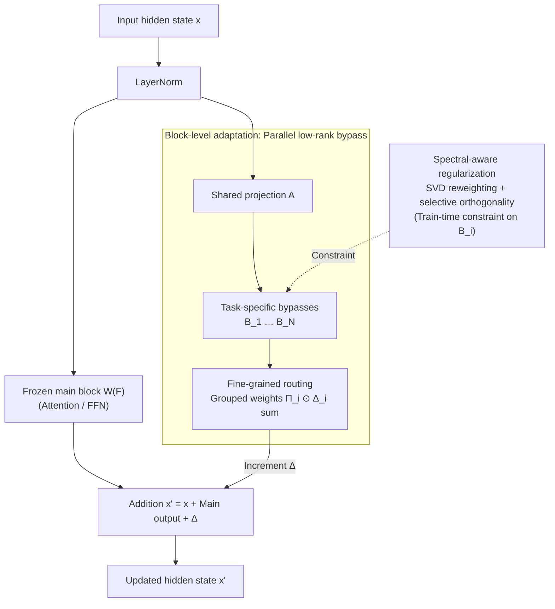

# Scalable Multi-Task Low-Rank Model Adaptation

**Conference**: ICLR 2026  
**arXiv**: [2603.01526](https://arxiv.org/abs/2603.01526)  
**Code**: [GitHub](https://github.com/doem97/ICLR26_mtLoRA)  
**Area**: Social Computing  
**Keywords**: LoRA, multi-task learning, spectral-aware regularization, block-level adaptation, fine-grained routing

## TL;DR

Ours systematically analyzes the root causes of multi-task LoRA collapse as the number of tasks increases (uniform regularization destroying shared knowledge + component-level LoRA amplifying gradient conflicts) and proposes mtLoRA. By combining spectral-aware regularization, block-level adaptation, and fine-grained routing, mtLoRA outperforms SOTA by an average of 2.3% across 15-25 tasks while reducing parameters by 47% and training time by 24%.

## Background & Motivation

1. While LoRA performs excellently in single-task adaptation, real-world deployments often require a single model to handle numerous tasks (15-25+). In such scenarios, multi-task LoRA suffers from catastrophic collapse—for instance, DOTA performance drops sharply from 88.2% with 5 tasks to 2.0% with 15 tasks.
2. Collapse manifests as two types of misalignment: **parameter misalignment** (conflicting weight update directions between different LoRA modules, i.e., gradient interference) and **representation misalignment** (divergent output features across LoRA modules).
3. Existing approaches fail: regularization methods (Task Arithmetic, TIES-Merging) force task orthogonality, while routing methods (MoLE, HydraLoRA) dynamically select experts. Neither maintains performance as task counts scale.
4. A Key Insight is the **fundamental trade-off** between regularization and routing—enhancing regularization reduces conflict but harms routing effectiveness (routing entropy increases from 2.6 to 2.7); performance reaches a Pareto frontier and stagnates.
5. Root cause analysis reveals two points: (1) knowledge shared across tasks is concentrated in high-singular-value components (top-20% components contribute 89% of cross-task alignment), which uniform regularization destroys; (2) component-level ($W_q, W_v$) LoRA allows gradients to pass through Attention mechanisms, amplifying conflicts. Shifting adaptation to the block level reduces conflicts by 76%.

## Method

### Overall Architecture

mtLoRA adopts the asymmetric backbone of HydraLoRA (a shared projection $A$ with multiple task-specific $B_i$) but mitigates multi-task collapse at three levels. It uses spectral-aware regularization to protect shared knowledge, shifts adaptation to the block level to sever gradient interference, and employs fine-grained routing to allow different feature dimensions to select optimal LoRA combinations. These address the three pain points: "regularization destroys sharing," "component-level amplifies conflicts," and "scalar routing lacks expressiveness." During the forward pass, the input splits after LayerNorm: the frozen backbone computes normally, while the side path applies a shared $A$ projection, task-specific $B_i$ transformations, and a fine-grained router that produces low-rank increments $\Delta$ via weighted combinations. Spectral-aware regularization acts as a loss constraint on $B_i$ during training.

### Key Designs

**1. Spectral-aware regularization: Denoising low singular values while preserving high-singular-value shared knowledge**

Uniform regularization hurts multi-task performance because it pushes all directions toward orthogonality equally. Analysis shows cross-task shared knowledge is concentrated in high-singular-value components. mtLoRA performs SVD on each $B_i$ to obtain the singular value spectrum $\{\sigma_k\}$, then constructs a reweighted matrix $B'_i$ using a weighting function $w(\sigma) = \exp(-\sigma/\bar{\sigma})$. The orthogonal constraint is defined as $\mathcal{L}_{spectral} = \lambda \sum_{i<j} \|(B'_i)^T B'_j\|_F^2$. This exponential weight is continuous and adaptive: when $\sigma \ll \bar{\sigma}$, the weight approaches 1, forcing low-singular-value directions to orthogonalize for denoising; when $\sigma \gg \bar{\sigma}$, the weight approaches 0, leaving high-singular-value directions unpunished. This preserves main shared directions without manual thresholds.

**2. Block-level adaptation: Moving LoRA from attention components to whole-block bypasses to sever Softmax-induced cross-token competition**

Traditional LoRA inserted into $W_q, W_v$ components causes gradients to propagate through the Softmax within Attention, creating cross-token coupling—increasing attention for "bank"→"money" automatically suppresses "bank"→"river." This competition is amplified in multi-task settings. mtLoRA instead parallels an update path $x' = x + W^{(F)}(\text{LN}(x)) + \Delta(\text{LN}(x))$ outside the entire Attention/FFN block. By decoupling the LoRA increment $\Delta$ from the backbone's internal non-linearities, cross-token trade-offs are eliminated. Quantitative analysis shows a 76% reduction in gradient conflicts, while parameter counts are reduced by ~50%.

**3. Fine-grained routing: Per-dimension routing vectors instead of a single scalar gate**

Scalar routing assumes a LoRA is either "used or not" for a given input. However, different feature subspaces often prefer different experts—"creativity" dimensions might need a brainstorming LoRA, while "factuality" dimensions need a QA LoRA. mtLoRA generates a grouped weight vector $\Pi_i \in \mathbb{R}^g$ (splitting the hidden dimension into $g$ groups) for each LoRA, resulting in $\sum_{i=1}^N \Pi_i(x) \odot \Delta_i(x)$. The router is a 2-layer MLP. As $g$ increases from 1 to 32, the average score improves from 38.5 to 39.9.

### Loss & Training

The total objective weights the task loss, spectral-aware orthogonal loss, and load-balancing loss:

$$\mathcal{L} = \mathcal{L}_{task} + \lambda_1 \mathcal{L}_{spectral} + \lambda_2 \mathcal{L}_{balance}$$

To reduce overhead, $\mathcal{L}_{spectral}$ (which requires SVD) is calculated only once per epoch. $\mathcal{L}_{balance}$ prevents routing collapse where all samples converge to a few experts.

## Key Experimental Results

### Main Results

Large-scale multi-task evaluation (15-25 tasks):

| Method | Params | DOTA(15) | iNat2018(25) | Dolly-15k(16) | BBH(27) | Average |
|------|--------|----------|-------------|--------------|---------|------|
| HydraLoRA | 75.5M (1.11%) | 89.0 | 78.3 | 41.6 | 35.5 | 61.1 |
| **mtLoRA** | **39.8M (0.59%)** | **91.0** | **81.5** | **44.5** | **38.5** | **63.9** |

### Ablation Study

Component contributions (relative to HydraLoRA baseline):

| Components | Params | Training Time | DOTA | BBH | Average |
|----------|--------|---------|------|-----|------|
| Baseline HydraLoRA | 75.5M | 1.00x | 89.0 | 35.5 | 61.1 |
| +Block-Level | 37.7M | 0.67x | 91.2 | 37.9 | 63.2 |
| +Block+Spectral | 37.7M | 0.70x | 91.7 | 38.4 | 63.8 |
| +Block+Fine-grained | 39.8M | 0.69x | 89.9 | 38.2 | 63.1 |
| All (mtLoRA) | 39.8M | 0.76x | 91.0 | 38.5 | 63.9 |

Routing granularity ablation:

| Strategy | Group $g$ | Dolly-15k | BBH | Average |
|------|---------|-----------|-----|------|
| Scalar | 1 | 41.6 | 35.5 | 38.5 |
| Fine-grained | 2 | 41.6 | 37.0 | 39.3 |
| Fine-grained | 32 | **42.0** | **37.7** | **39.9** |

### Key Findings

1. Multi-task LoRA collapse is severe: DOTA performance drops from 88.2% to 2.0% as tasks increase from 5 to 15.
2. Block-level adaptation provides the largest gain (+2.1%) while halving parameters—a win-win for efficiency and effectiveness.
3. Spectral-aware regularization and fine-grained routing contribute an additional +0.7%, particularly significant in NLP tasks (+2.9%).
4. mtLoRA consistently improves performance across all task difficulties: Easy +1.6%, Medium +3.5%, Hard +0.4%.
5. mtLoRA breaks the Pareto trade-off between uniform regularization and dynamic routing.

## Highlights & Insights

1. **First systematic analysis of multi-task LoRA scalability failure**: Reveals how shared knowledge is concentrated in high-SV components and how uniform regularization destroys it.
2. **Advantages of block-level adaptation**: By simply elevating the LoRA placement (from component to block), it simultaneously reduces gradient conflict by 76% and parameters by 50%.
3. **Efficiency-Effectiveness Pareto improvement**: A +2.8% performance gain accompanied by a 47% parameter reduction and 24% training time saving.
4. **Ingenious spectral-aware weight function**: $w(\sigma) = \exp(-\sigma/\bar{\sigma})$ is continuously adaptive, eliminating the need for manual SV thresholds.
5. Dual-domain validation (CV + NLP) proves the generalizability of the method.

## Limitations & Future Work

1. Block-level LoRA bypasses internal non-linearities of the attention layer, which may limit performance on tasks requiring fine-grained attention adjustments.
2. Experiments are based on a fixed rank=16; behavior under different ranks requires further exploration.
3. Extra parameters from fine-grained routing (+1.93% at $g=32$) need evaluation on larger-scale models.
4. The SVD required for spectral-aware regularization might become a bottleneck as task counts and model scales grow.
5. Evaluation relies primarily on accuracy; a comprehensive assessment of generation quality (e.g., BLEU, ROUGE) is needed.

## Related Work & Insights

- **HydraLoRA** (Tian et al., 2024): Pioneer of asymmetric structures (shared A, multi-task B); mtLoRA extends this.
- **MoLE** (Wu et al., 2024): Top-K routing + balancing loss, but fails to resolve the regularization-routing trade-off.
- **AlphaEdit / SPHERE** (Fang et al., 2025): Uses similar "protect principal direction" concepts in knowledge editing.
- Insight: Spectral-aware regularization can be extended to LoRA model merging and continual learning scenarios.

## Rating

- **Novelty**: ⭐⭐⭐⭐ Innovations in three designs; spectral-aware regularization insight is excellent, though block-level adaptation is a natural progression.
- **Experimental Thoroughness**: ⭐⭐⭐⭐⭐ Four large-scale benchmarks (15-25 tasks), thorough ablation, CV+NLP domains, and efficiency analysis.
- **Writing Quality**: ⭐⭐⭐⭐ Motivating observations in Figure 1 are clear and persuasive; structured well.
- **Value**: ⭐⭐⭐⭐⭐ Makes multi-task LoRA viable for 15+ tasks for the first time; high practical deployment value with open-source code.

<!-- RELATED:START -->

## Related Papers

- [\[ICLR 2026\] Adaptive Debiasing Tsallis Entropy for Test-Time Adaptation](adaptive_debiasing_tsallis_entropy_for_test-time_adaptation.md)
- [\[ICLR 2026\] BiasFreeBench: a Benchmark for Mitigating Bias in Large Language Model Responses](biasfreebench_a_benchmark_for_mitigating_bias_in_large_language_model_responses.md)
- [\[ACL 2026\] Synthia: Scalable Grounded Persona Generation from Social Media Data](../../ACL2026/social_computing/synthia_scalable_grounded_persona_generation_from_social_media_data.md)
- [\[CVPR 2025\] As Language Models Scale, Low-order Linear Depth Dynamics Emerge](../../CVPR2025/social_computing/as_language_models_scale_low-order_linear_depth_dynamics_emerge.md)
- [\[ACL 2026\] mdok-style at SemEval-2026 Task 9: Finetuning LLMs for Multilingual Polarization Detection](../../ACL2026/social_computing/mdok-style_at_semeval-2026_task_9_finetuning_llms_for_multilingual_polarization_.md)

<!-- RELATED:END -->
