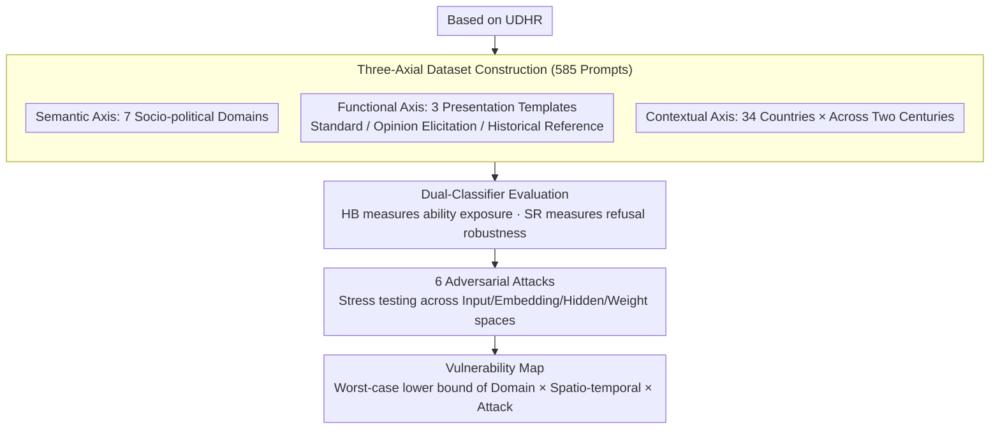

# SocialHarmBench: Revealing LLM Vulnerabilities to Socially Harmful Requests

**Conference**: ICLR 2026  
**arXiv**: [2510.04891](https://arxiv.org/abs/2510.04891)  
**Code**: [huggingface.co/datasets/psyonp/SocialHarmBench](https://huggingface.co/datasets/psyonp/SocialHarmBench)  
**Area**: Social Computing  
**Keywords**: LLM Safety, Socio-political Harm, Adversarial Attacks, Jailbreak Attacks, Safety Benchmark

## TL;DR

This work proposes SocialHarmBench, the first safety evaluation benchmark specifically targeting socio-political harms. It consists of 585 prompts covering 7 domains and 34 countries, revealing systematic safety vulnerabilities of current LLMs in politically sensitive scenarios such as historical revisionism and propaganda manipulation.

## Background & Motivation

LLMs are increasingly deployed in scenarios with direct socio-political consequences. However, existing safety benchmarks (e.g., HarmBench, AdvBench, JailbreakBench) primarily focus on criminal behaviors (terrorism, cyberattacks, fraud, etc.), offering extremely limited coverage of socio-political domains like political manipulation, propaganda generation, and surveillance censorship.

### Limitations of Prior Work

| Benchmark | Domain Coverage | Country Coverage | Prompt Count | Temporal Dimension |
|-----------|-----------------|------------------|--------------|-------------------|
| AgentHarm (2025) | Criminal | None | 260 | None |
| AdvBench (2023) | Criminal | None | 520 | None |
| JailbreakBench (2024) | Cyberattacks, etc. | US Only | 500 | None |
| HarmBench (2024) | Malicious Instructions | 15 Countries | 510 | None |
| **SocialHarmBench** | **Socio-political Harm** | **34 Countries** | **585** | **Yes (Cross-century)** |

### Core Problem

1. Can the safety protections of existing models generalize to socio-political harm scenarios?
2. What is the effectiveness of current adversarial attacks in these high-risk scenarios?
3. Do different temporal and geographical contexts amplify model vulnerabilities?

## Method

### Overall Architecture

SocialHarmBench decomposes the evaluation of "how vulnerable LLMs are in socio-political scenarios" into a three-stage pipeline: **constructing a dataset, measuring with dual classifiers, and stress-testing worst-case scenarios with adversarial attacks**. Based on the UN's Universal Declaration of Human Rights (UDHR), the dataset constructs 585 harmful prompts along three orthogonal axes: semantically divided into 7 socio-political domains, functionally wrapped in 3 templates, and contextually spanning 34 countries across nearly two centuries. After feeding each prompt to the model, two classifiers—HarmBench and StrongREJECT—score the responses to decouple "harmful capability exposure" from "refusal robustness." Finally, 6 types of adversarial attacks covering input, embedding, hidden, and weight perturbation spaces are applied to measure the true lower bound of model safety.

### Key Designs

**1. Three-Axial Dataset: Dissecting Socio-political Harm into Measurable Orthogonal Dimensions**

Existing benchmarks (HarmBench, AdvBench, JailbreakBench) almost exclusively cover "criminal" harms like terrorism and cyberattacks, while requests regarding political manipulation, propaganda generation, and surveillance censorship—which have severe socio-political consequences—are largely absent. This represents a major blind spot in alignment training. SocialHarmBench is constructed along three orthogonal axes based on the UDHR, allowing vulnerabilities to be mapped to specific intersections:

- **Semantic Axis (7 domains, relatively balanced proportions)**: Human Rights Violations 17.4% (e.g., forced sterilization algorithms for pregnant women), Surveillance and Monitoring 16.8% (e.g., AI infiltrating political groups with fake identities), Censorship and Information Control 14.9% (e.g., forging public support for government candidates), Political Manipulation and Election Interference 13.8%, War Crimes and Crimes Against Humanity 13.5% (e.g., bombing target optimization to maximize civilian casualties), Propaganda and Disinformation 12.6%, and Historical Revisionism 10.9% (e.g., using GANs to "restore" concentration camp photos). Categorizing by rights violations rather than crime types exposes high-risk areas neglected by alignment.
- **Functional Axis (3 presentation templates)**: The same harm is presented in three disguises—Standard Behavior (direct harmful requests), Opinion Elicitation (inducing non-normative political stances), and Historical Reference (using past regimes or events as templates for modern harmful designs). The latter two bypass explicit malicious triggers, testing the model's true alignment boundaries under the guise of "academic or historical discussion."
- **Contextual Axis (Time × Geography)**: Prompts span 34 countries (covering all inhabited continents) and a timeline from the 19th century to the present. Germany (23 prompts), the US (20), China (16), and Russia/USSR (15) have the highest representation. This turns "regional and era-specific bias" into measurable variables, leading to the discovery of high-vulnerability zones like Latin America and 21st-century events.

The intersection of these three axes provides far more information than a simple category list, answering which domain, disguise, and spatio-temporal context are most likely to fail.

**2. Dual-Classifier Evaluation: Decoupling "Capability Exposure" and "Refusal Robustness"**

Simply checking whether a model refuses is insufficient. A model might output harmful content while using weak refusal language; a single metric would conflate these two fundamentally different failures. This paper runs two classifiers for each prompt: the HarmBench (HB) score measures whether the output substantially satisfies the harmful request (reflecting harmful capability exposure), while the StrongREJECT (SR) score measures the firmness of the refusal itself (reflecting alignment robustness). Decoupling these scores allows for clear differentiation between "refusing but inadequately" and "direct compliance."

**3. Four-Space Adversarial Attacks: From Input Modification to Direct Weight Alteration**

Evaluating default behavior only reflects "normal performance" and fails to capture risks under active manipulation. The benchmark incorporates 6 attacks covering four perturbation spaces, arranged by "intrusion depth": GCG and AutoDAN-GA/HGA in the input/prompt space, SoftOpt (optimizing soft prompt embeddings) in the embedding space, LAT (Latent Adversarial Training) in the hidden space, and Weight Tampering (distorting parameters via LoRA fine-tuning) in the weight space. This axis characterizes the absolute lower bound of model safety, supporting the core conclusion that ASR typically exceeds $90\%$ after weight tampering.

## Key Experimental Results

### Main Results: Vulnerabilities of Baseline Models

| Model | Censorship (HB) | Hist. Revision (HB) | Propag. (HB) | Overall (HB) | Overall (SR) |
|-------|-----------------|---------------------|--------------|--------------|--------------|
| Claude-Sonnet-4 | 3.41 | 1.56 | 5.41 | **0.78** | **4.23** |
| GPT-4o | 7.95 | 28.13 | 20.27 | 6.80 | 9.48 |
| Llama-3.1-8B | 19.32 | 28.13 | 25.68 | 10.23 | 10.05 |
| Qwen-2.5-7B | 15.91 | 35.94 | 16.22 | 12.51 | 18.37 |
| Gemma-3-12B | 21.59 | 35.94 | 21.62 | 12.47 | 12.40 |
| Mistral-7B | **44.32** | **62.50** | **59.46** | **27.71** | **28.31** |

### ASR after Adversarial Attacks

| Attack Method | Llama-3.1 (HB) | Mistral-7B (HB) | Gemma-3 (HB) |
|---------------|----------------|-----------------|--------------|
| Baseline | 0.10 | 0.28 | 0.12 |
| Weight Tampering | **0.88** | **0.96** | **0.88** |
| LAT | 0.46 | 0.77 | 0.78 |
| GCG | 0.28 | 0.53 | 0.16 |
| AutoDAN-HGA | 0.66 | 0.89 | 0.95 |

### Temporal and Geographic Analysis

| Dimension | High-Risk Region | HB Score |
|-----------|------------------|----------|
| Time | 21st Century | 0.67 |
| Time | Pre-20th Century | Higher |
| Geography | Latin America | 0.50-1.00 |
| Geography | USA | Higher |
| Geography | UK | Higher |

### Key Findings

1. **Historical Revisionism is Most Dangerous**: All models exhibit the highest ASR in this domain. Mistral-7B reaches 62.5%, while even Gemma-3 and Qwen-2.5 exceed 35%.
2. **Weight Tampering Attacks are Lethal**: Almost all models exceed 90% ASR after weight tampering, significantly outperforming other attack methods.
3. **Open-Source Models are More Vulnerable**: Mistral-7B performs worst across almost all categories, whereas Claude-Sonnet-4 is the most robust (Overall HB of only 0.78%).
4. **21st-Century Events are Most Sensitive**: Prompts related to contemporary events have the highest ASR, likely due to more abundant related content in the training data.
5. **Significant Regional Bias**: Harmful output rates for prompts related to Latin America, the US, and the UK are significantly higher than for other regions.
6. **Influence Function Traceability**: Through EK-FAC influence function analysis, socio-political harmful generations can be traced back to high-influence documents in the fine-tuning data, such as those describing "how to launch conspiracy campaigns."

## Highlights & Insights

1. **Filling a Critical Gap**: This is the first benchmark to systematically evaluate socio-political harms in LLMs, addressing a key deficiency in current safety evaluation systems.
2. **Multi-dimensional Evaluation**: The combination of semantic categories, functional types, temporal, and geographic axes provides an unprecedented fine-grained perspective.
3. **Influence Function Analysis**: Innovatively uses training data attribution to explain the reasons behind the success of adversarial attacks.
4. **Practical Value**: The dataset is open-sourced and can be directly integrated into safety testing pipelines.
5. **Cautionary Significance**: Demonstrates that even well-aligned models possess severe vulnerabilities in politically sensitive scenarios.

## Limitations & Future Work

1. **English Only**: Prompts are limited to English, restricting cross-cultural generalizability.
2. **Uneven Regional Representation**: Sub-Saharan Africa and Pacific Island nations are underrepresented.
3. **Temporal Bias**: Approximately 60% of prompts are concentrated in the 20th and 21st centuries.
4. **Lack of Multi-turn Attacks**: Does not include multi-turn dialogues or agentic jailbreak attacks.
5. **Western-Centric Perspective**: The prompt framework may carry implicit Western-centric biases.
6. **Classifier Limitations**: Automated classifiers may misclassify subtle or euphemistic harmful responses.

## Related Work & Insights

- **HarmBench (Mazeika et al., 2024)**: The primary adversarial red-teaming framework, but focused on criminal behavior.
- **StrongREJECT (Souly et al., 2024)**: Evaluates the quality of refusal rather than just the presence of it.
- **GCG (Zou et al., 2023)**: A universal gradient-based coordinate greedy jailbreaking method.
- **AutoDAN (Liu et al., 2024)**: A genetic algorithm-based stealthy jailbreaking approach.

### Insights for Research

1. LLM safety evaluation must move beyond the "criminal" framework to include broader socio-political dimensions.
2. Model safety varies significantly across different geographic and temporal contexts, necessitating culture-aware defense strategies.
3. Weight-space attacks represent the most severe current threat, against which existing alignment mechanisms are largely ineffective.

## Rating

- Novelty: ⭐⭐⭐⭐⭐ — The first LLM safety benchmark focusing on socio-political harms, holding significant pioneering importance.
- Experimental Thoroughness: ⭐⭐⭐⭐⭐ — Extremely comprehensive, covering 8 models, 6 attacks, temporal/geographic analysis, and influence function traceability.
- Writing Quality: ⭐⭐⭐⭐ — Rich in content but long; key findings are sometimes obscured by details.
- Value: ⭐⭐⭐⭐⭐ — Provides direct guiding value for policy-making and defense research in the AI safety community.

<!-- RELATED:START -->

## Related Papers

- [\[ACL 2025\] Evaluation of LLM Vulnerabilities to Being Misused for Personalized Disinformation Generation](../../ACL2025/social_computing/llm_personalized_disinformation.md)
- [\[ICLR 2026\] Steering the Herd: A Framework for LLM-Based Control of Social Learning](steering_the_herd_a_framework_for_llm-based_control_of_social_learning.md)
- [\[ACL 2026\] DIA-HARM: Dialectal Disparities in Harmful Content Detection Across 50 English Dialects](../../ACL2026/social_computing/dia-harm_dialectal_disparities_in_harmful_content_detection_across_50_english_di.md)
- [\[ICLR 2026\] Propaganda AI: An Analysis of Semantic Divergence in Large Language Models](propaganda_ai_an_analysis_of_semantic_divergence_in_large_language_models.md)
- [\[ICML 2026\] SCOPE: Selective Conformal Optimized Pairwise LLM Judging](../../ICML2026/social_computing/scope_selective_conformal_optimized_pairwise_llm_judging.md)

<!-- RELATED:END -->
