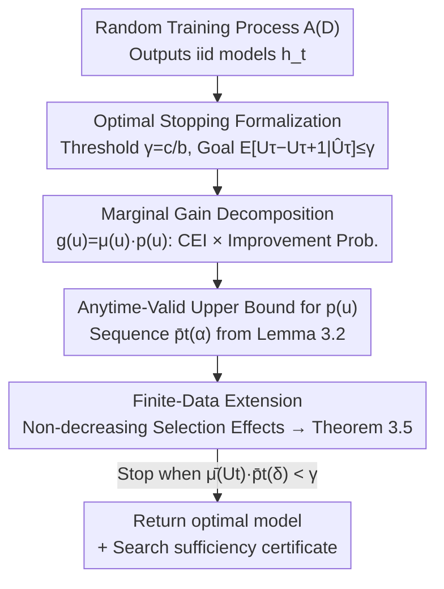

# Statistical Guarantees in the Search for Less Discriminatory Algorithms

**Conference**: ICLR 2026  
**OpenReview**: [https://openreview.net/forum?id=n8FKO0DIl8](https://openreview.net/forum?id=n8FKO0DIl8)  
**Code**: https://github.com/johnchrishays/lda  
**Area**: Algorithmic Fairness / Learning Theory  
**Keywords**: Fairness, Less Discriminatory Alternative, Optimal Stopping, Anytime-valid Inference, Disparate Impact

## TL;DR
This paper formalizes the corporate process of searching for a "Less Discriminatory Alternative" (LDA) to comply with anti-discrimination laws as an **optimal stopping problem**. It provides an adaptive stopping algorithm that, under realistic conditions of unknown model distributions and finite evaluation data, provides a high-confidence upper bound on the marginal reduction in disparate impact from further retraining. This allows companies to stop when gains no longer justify the costs and issue a **statistical certificate of "sufficient search"** to regulators or legal teams.

## Background & Motivation

**Background**: The "disparate impact" principle in U.S. anti-discrimination law dictates that if a decision-making scheme can achieve business goals while causing less discrimination to protected groups (an LDA), the failure to adopt it may lead to legal liability. Recently, regulators (e.g., CFPB) have advocated that firms using data-driven models in high-risk areas like hiring, credit, and housing should **proactively search for LDAs**.

**Limitations of Prior Work**: This search is feasible due to **model multiplicity**—the training process is inherently stochastic (random seeds, batch ordering, feature subsets, etc.). Retraining with the same procedure can yield different models with **similar predictive performance but significantly different disparate impact**. Theoretically, firms can sample multiple high-performing models and select the one with the least disparate impact. However, **firms cannot search indefinitely**. Critics argue that no boundaries have been proposed for such searches, making it unclear how much resource or effort constitutes a "good faith" search.

**Key Challenge**: The search could potentially "never end"—there is always a possibility that one more training run will yield a better LDA. Since modern ML involves non-convex function classes, finding a global optimum is often infeasible. The core problem is: **When is a search "sufficient" to demonstrate good faith?** This is both a legal question and a statistical problem lacking quantitative tools.

**Goal**: To provide an operational formalization of "sufficient search for an LDA" and a procedure that allows companies to certify they have completed a sufficient search.

**Key Insight**: The authors observe that firms do not know the characteristics of models yet to be trained; they must train models sequentially and evaluate whether the marginal benefit still justifies the cost. This naturally follows an **optimal stopping / sequential search** structure (similar to Pandora's Box in economics, but without assuming a known distribution).

**Core Idea**: Model the LDA search as an optimal stopping problem and use **anytime-valid inference** to maintain a **high-probability upper bound** on the marginal reduction in disparate impact that holds at any time point. When the bound falls below a "cost-benefit ratio" threshold $\gamma$, the search can stop, and the bound itself serves as a certificate of limited further gains.

## Method

### Overall Architecture

The scenario is abstracted as follows: a firm has a fixed dataset $D$ and a random training process $\mathcal{A}(D)$, which produces iid deployable models $h_t$ upon each call. The "utility" of each model is its disparate impact loss $Q_t = Q(h_t)$ (typically the difference in selection rates between groups $Q_{DI}(h)=\mathbb{E}[h(X)\mid g(X)=0]-\mathbb{E}[h(X)\mid g(X)=1]$, normalized to $[0,1]$). The firm deploys the model with the lowest empirical disparate impact found so far, denoted as $\hat U_t \triangleq \hat Q_{i_t}$, where $i_t=\arg\min_{i\le t}\hat Q_i$.

The theory constructs a stopping time $\tau$ such that at that moment, the expected marginal reduction from training one more model does not exceed threshold $\gamma$ with high probability. The approach progresses through three settings: first assuming full information (known distribution, infinite data), then unknown distribution (infinite data), and finally the realistic setting with finite data and noisy observations $\hat Q_t$. This results in a simple adaptive algorithm: update a marginal gain upper bound $\bar\mu(U_t)\cdot\bar p_t(\delta)$ with each new model, and stop when it falls below $\gamma$.

### Key Designs

**1. Formalizing LDA search as optimal stopping: Defining "sufficiency" via cost-benefit ratio $\gamma$**
Legal and regulatory standards lack quantifiable stopping criteria. The authors introduce two pre-specified values: the cost of training a single model $c$, and the value $b$ per unit improvement in disparate impact. The decision to continue is reduced to a threshold comparison. After $\tau$ models, if the expected marginal benefit is less than the cost, $b\cdot\mathbb{E}_{P_0}[U_\tau-U_{\tau+1}\mid \hat U_\tau]\le c$, stopping is justified. Let $\gamma \triangleq c/b$, making the stopping condition:
$$\mathbb{E}_{P}[U_\tau-U_{\tau+1}\mid \hat U_\tau]\le \gamma.$$
Since marginal gains $U_t-U_{t+1}$ are non-increasing as more models are trained while costs are linear, satisfying this single-step condition implies that further search is no longer efficient.

**2. Decomposing marginal gain into "Probability of Improvement × Conditional Expected Improvement"**
Directly bounding marginal gain $g(u)$ is difficult. The authors decompose it into two semantic factors:
$$g(u)=\underbrace{\mathbb{E}_{P_0}[u-Q\mid u>Q]}_{\mu(u)\ \text{CEI}}\cdot\underbrace{P_0(u>Q)}_{p(u)\ \text{Prob. of Improvement}}.$$
$\mu(u)$ (Conditional Expected Improvement) characterizes how much better a new model is on average *given* it is better than the current one. $p(u)$ is the probability of finding a better model. Bounding these separately yields an upper bound for $g(u)$. For $\mu$, a universal conservative bound is $\bar\mu_{\text{universal}}(u)=u$. Tighter bounds can be derived if the firm assumes more about distribution $P_0$.

**3. Anytime-valid high-probability upper bound for the probability of a new minimum**
Providing an upper bound for $p(U_t)$ that holds for *all* $t$ simultaneously is critical because stopping depends on the minimum observed so far. The authors prove a lemma for any iid sequence $\{X_t\}$ with $Y_t=\min_{s\le t}X_s$: for any $\alpha\in(0,1)$, define the sequence
$$\bar p_t(\alpha)=\begin{cases}1-e^{-1/\alpha}, & t=1\\[4pt] 1-\left(\frac{t-1}{\alpha}+1\right)^{-1/(t-1)}, & t>1\end{cases}$$
The event that the conditional probability $P_0(X_{t+1}<Y_t\mid Y_t)$ exceeds $\bar p_t(\alpha)$ at *any* time $t$ occurs with probability at most $\alpha$. This ensures the "look-and-stop" approach remains statistically valid without a pre-fixed $t$.

**4. Extending to finite data via the "non-decreasing selection effect" assumption**
In practice, firms observe noisy $\hat Q_t$ on a finite test set. Selecting the empirical minimum $\hat U_t$ introduces selection bias (regression to the mean). The authors introduce an assumption that the selection effect (the difference between true and empirical values) is **non-decreasing** over $t$:
$$\mathbb{E}_{P}[U_t-\hat U_t\mid\hat U_t]\ \ge\ \mathbb{E}_{P}[U_{t+1}-\hat U_{t+1}\mid\hat U_t].$$
Under this assumption, Theorem 3.5 proves that applying Algorithm 1 to the empirical sequence $\{\hat U_t\}$ provides high-probability guarantees for the **true** marginal gains.

### Loss & Training
The core is Algorithm 1: Iteratively sample $X_t \sim P$, maintain the minimum $Y_t$ and bound $\bar p_t$, then stop when $\bar\mu(Y_t)\cdot\bar p_t(\delta) < \gamma$. Since the sequence $\bar p_t(\delta)$ converges to 0, termination is guaranteed. The maximum number of models to train can be pre-calculated from $\delta$ and $\gamma$. Because it is anytime-valid, the cost $c$ does not need to be fixed in advance.

## Key Experimental Results

Experiments were conducted on three credit/housing datasets: Adult, Folktables, and HMDA, using Logistic Regression, Random Forests, and Gradient Boosting.

### Main Results

| Dimension | Observation |
|:---|:---|
| Variability of DI | ~20% span between highest and lowest DI values across several datasets/methods. |
| Algorithm Stopping vs. Full-Info | The algorithm's bound (upper bound) typically overshoots the true marginal gain by dozens of models. |
| Actual Models Required | After ~60 models, marginal gains typically drop to hundredths of a percent. |
| Fastest Convergence | In some scenarios, marginal gains become negligible in fewer than 10 models. |

### Ablation Study

| Configuration | Performance |
|:---|:---|
| No distribution assumptions | $\bar\mu(\hat U_t)=\hat U_t$; valid but conservative bounds. |
| With distribution assumptions (A1/A2/A3) | Tighter bounds that track the true gains more closely. |
| Logistic Regression / HMDA data | More conservative behavior compared to other models. |

### Key Findings
- **Few models are often sufficient**: Significant marginal gains usually vanish after ~60 models, and sometimes fewer than 10.
- **Heterogeneous gains**: Convergence speeds vary significantly across datasets and methods, highlighting the need for adaptive stopping rather than a fixed budget.
- **Conservative but operational**: The anytime-validity gap is the price for statistical rigor, though stronger assumptions can tighten the bound.

## Highlights & Insights
- **Translating legal "good faith" into computable guarantees**: Using $\gamma = c/b$ to bridge costs, benefits, and legal liability provides a rare quantifiable "certificate" for compliance.
- **Clean decomposition of $g(u)$**: Splitting marginal gain into CEI and improvement probability provides clear semantic factors that can be bounded independently.
- **Anytime-validity**: Consistency across the entire timeline allows firms to stop at any time without compromising statistical validity.
- **Portability**: The framework applies to any bounded loss in $[0,1]$, not just disparate impact.

## Limitations & Future Work
- **Reliance on iid retraining**: Assumes models are sampled iid, which may not hold for adaptive search strategies where previous results influence future training.
- **Exogenous parameters**: Determining the training cost $c$ and the value of parity $b$ remains a task for legal and economic experts.
- **Reliance on Assumption 3.4**: The non-decreasing selection effect might be violated in pathological distributions.
- **Conservative bounds**: Universal bounds may lead to over-searching by dozens of models.

## Related Work & Insights
- **vs. Model Multiplicity Literature**: Moves beyond proving that LDAs exist to answering *how much* search is sufficient.
- **vs. Optimal Stopping (Pandora's Box)**: Unlike classical problems assuming known distributions, this work provides guarantees for unknown distributions.
- **vs. Selective Inference**: Adapts regression-to-the-mean corrections to provide guarantees on noisy empirical sequences.

## Rating
- Novelty: ⭐⭐⭐⭐⭐ 
- Experimental Thoroughness: ⭐⭐⭐⭐ 
- Writing Quality: ⭐⭐⭐⭐⭐ 
- Value: ⭐⭐⭐⭐⭐ 

<!-- RELATED:START -->

## Related Papers

- [\[ACL 2026\] Decide less, communicate more: On the construct validity of end-to-end fact-checking in medicine](../../ACL2026/social_computing/decide_less_communicate_more_on_the_construct_validity_of_end-to-end_fact-checki.md)
- [\[AAAI 2026\] T2Agent: A Tool-augmented Multimodal Misinformation Detection Agent with Monte Carlo Tree Search](../../AAAI2026/social_computing/t2agent_a_tool-augmented_multimodal_misinformation_detection_agent_with_monte_ca.md)
- [\[NeurIPS 2025\] Auto-Search and Refinement: An Automated Framework for Gender Bias Mitigation in LLMs](../../NeurIPS2025/social_computing/auto-search_and_refinement_an_automated_framework_for_gender_bias_mitigation_in_.md)
- [\[NeurIPS 2025\] DeepTraverse: A Depth-First Search Inspired Network for Algorithmic Visual Understanding](../../NeurIPS2025/social_computing/deeptraverse_a_depth-first_search_inspired_network_for_algorithmic_visual_unders.md)
- [\[ICLR 2026\] Propaganda AI: An Analysis of Semantic Divergence in Large Language Models](propaganda_ai_an_analysis_of_semantic_divergence_in_large_language_models.md)

<!-- RELATED:END -->
## Related Papers

- [\[ACL 2026\] Decide less, communicate more: On the construct validity of end-to-end fact-checking in medicine](../../ACL2026/social_computing/decide_less_communicate_more_on_the_construct_validity_of_end-to-end_fact-checki.md)
- [\[AAAI 2026\] T2Agent: A Tool-augmented Multimodal Misinformation Detection Agent with Monte Carlo Tree Search](../../AAAI2026/social_computing/t2agent_a_tool-augmented_multimodal_misinformation_detection_agent_with_monte_ca.md)
- [\[NeurIPS 2025\] Auto-Search and Refinement: An Automated Framework for Gender Bias Mitigation in LLMs](../../NeurIPS2025/social_computing/auto-search_and_refinement_an_automated_framework_for_gender_bias_mitigation_in_.md)
- [\[NeurIPS 2025\] DeepTraverse: A Depth-First Search Inspired Network for Algorithmic Visual Understanding](../../NeurIPS2025/social_computing/deeptraverse_a_depth-first_search_inspired_network_for_algorithmic_visual_unders.md)
- [\[ICLR 2026\] Propaganda AI: An Analysis of Semantic Divergence in Large Language Models](propaganda_ai_an_analysis_of_semantic_divergence_in_large_language_models.md)

<!-- RELATED:END -->
